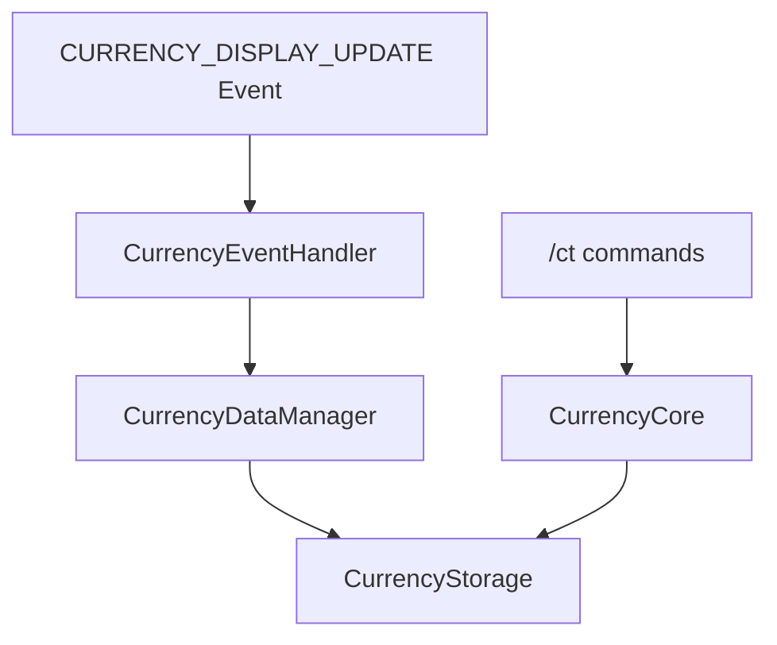

# Currency Tracker Optimization Design

## 1. Overview

This design document outlines the optimization of the Currency Tracker functionality in Accountant Classic to focus purely on currency tracking without UI components. The optimization will:

1. Remove all UI functionality while preserving core tracking logic
2. Focus on listening to the `CURRENCY_DISPLAY_UPDATE` event for currency tracking
3. Implement in-game commands to display tracked currency data

## 2. Architecture

### 2.1 Current Architecture

The current Currency Tracker module consists of several components:
- **CurrencyCore**: Main orchestration module
- **CurrencyEventHandler**: Monitors WoW events for currency changes
- **CurrencyDataManager**: Handles currency data operations
- **CurrencyStorage**: Manages persistent storage of currency data
- **CurrencyUIController**: Manages UI components (to be removed)
- **CurrencyDisplayIntegration**: Integrates with display systems (to be removed)

### 2.2 Optimized Architecture

The optimized architecture will streamline the module to focus only on tracking:
- **CurrencyCore**: Main orchestration (modified to exclude UI)
- **CurrencyEventHandler**: Monitors `CURRENCY_DISPLAY_UPDATE` events
- **CurrencyDataManager**: Handles currency data operations
- **CurrencyStorage**: Manages persistent storage



## 3. Core Functionality Changes

### 3.1 UI Removal

All UI-related components will be disabled but not removed from the codebase:
- `CurrencyUIController` module loading will be disabled
- `CurrencyDisplayIntegration` module loading will be disabled
- XML UI definitions will not be loaded in game

### 3.2 Event Handling Focus

The system will maintain support for both modern and legacy WoW clients:
- Register for `CURRENCY_DISPLAY_UPDATE` event on modern clients
- Use `BAG_UPDATE` as fallback for legacy clients
- Process currency changes when events fire
- Store data in the existing storage system

### 3.3 Data Storage

Data will continue to be stored in the existing SavedVariables structure:
- `Accountant_ClassicSaveData[server][character].currencyData`
- Data organized by currency ID and time periods (Session, Day, Week, Month, Year, Total)

## 4. Implementation Plan

Important safety constraint:

- **Do not modify or break any existing Gold Tracker logic/code.** Currency Tracker work may reference Gold Tracker behavior and data shapes for parity, but implementation must be isolated to the Currency modules. All changes must avoid touching Gold Tracker code paths and must preserve existing Gold functionality.

### 4.1 Module Loading Changes

Modify `CurrencyCore.lua` to exclude UI modules and Task verification modules:

```lua
-- In CurrencyCore:Initialize()
-- Comment out UI initialization
-- if self.UIController and self.UIController.Initialize then
--     success = success and self.UIController:Initialize()
-- end

-- if self.DisplayIntegration and self.DisplayIntegration.Initialize then
--     success = success and self.DisplayIntegration:Initialize()
-- end

-- In CurrencyCore:Enable()
-- Comment out UI enabling
-- if self.UIController and self.UIController.Enable then
--     success = success and self.UIController:Enable()
-- end

-- if self.DisplayIntegration and self.DisplayIntegration.Enable then
--     success = success and self.DisplayIntegration:Enable()
-- end

```

### 4.2 XML File Updates

Disable UI-related Lua files from being loaded via XML, while keeping the files in the repository for future UI work. Do not delete files; only comment out XML entries so they are not loaded in-game.

- File: `CurrencyTracker/CurrencyTracker.xml`

Current relevant section (for reference):

```xml
<Ui xmlns="http://www.blizzard.com/wow/ui/">
    <!-- Currency Tracker Module Files -->
    <!-- Load order is important: Constants -> Storage -> DataManager -> EventHandler -> UIController -> DisplayIntegration -> Core -->
    
    <Script file="CurrencyConstants.lua"/>
    <Script file="CurrencyStorage.lua"/>
    <Script file="CurrencyDataManager.lua"/>
    <Script file="CurrencyEventHandler.lua"/>
    <Script file="CurrencyUIController.lua"/>
    <Script file="CurrencyDisplayIntegration.lua"/>
    <Script file="CurrencyCore.lua"/>
</Ui>
```

Update it to comment out UI scripts (keep core tracking scripts):

```xml
<Ui xmlns="http://www.blizzard.com/wow/ui/">
    <!-- Currency Tracker Module Files (UI scripts are intentionally disabled for headless mode) -->

    <!-- Core tracking components (keep loaded) -->
    <Script file="CurrencyConstants.lua"/>
    <Script file="CurrencyStorage.lua"/>
    <Script file="CurrencyDataManager.lua"/>
    <Script file="CurrencyEventHandler.lua"/>

    <!-- UI components (disabled) -->
    <!-- <Script file="CurrencyUIController.lua"/> -->
    <!-- <Script file="CurrencyDisplayIntegration.lua"/> -->

    <!-- Orchestration core (keep loaded) -->
    <Script file="CurrencyCore.lua"/>
</Ui>
```

Notes:
- We keep `CurrencyTracker.xml` referenced from the addon `.toc` so that core tracking scripts continue to load, but UI scripts remain commented and therefore not executed. This fulfills the goal in 3.1 that UI XML definitions are not loaded while retaining files for future UI work.
- If there are separate XML files dedicated purely to UI frame definitions in the future, ensure they are not included in the `.toc`, or comment out their `<Include/>`/`<Script/>` lines similarly.

### 4.3 Event Handler Optimization

In `CurrencyEventHandler.lua`, keep the existing event registration logic that supports both modern and legacy WoW versions:

```lua
-- In EventHandler:RegisterEvents()
-- Keep existing logic for backward compatibility
local events = {
    "ADDON_LOADED",
    "PLAYER_LOGIN",
    "PLAYER_LOGOUT",
}

-- Register modern currency events if available
if C_CurrencyInfo then
    table.insert(events, "CURRENCY_DISPLAY_UPDATE")
end

-- Always register bag update as fallback
table.insert(events, "BAG_UPDATE")
```

### 4.4 Event Handling Implementation

Modern clients will consume the full CURRENCY_DISPLAY_UPDATE payload while preserving legacy fallbacks:

```lua
-- In EventHandler:OnCurrencyDisplayUpdate(currencyType, quantity, quantityChange, quantityGainSource, quantityLostSource)
function EventHandler:OnCurrencyDisplayUpdate(currencyType, quantity, quantityChange, quantityGainSource, quantityLostSource)
    -- Process immediately without deferring
    self:ProcessCurrencyChange(currencyType, quantity, quantityChange, quantityGainSource, quantityLostSource)
end

-- In EventHandler:OnBagUpdate(bagID)
function EventHandler:OnBagUpdate(bagID)
    -- Check for currency changes in bags (fallback for older clients)
    self:CheckBagCurrencies()
end

-- In EventHandler:ProcessCurrencyChange(currencyID, newQuantity, quantityChange, quantityGainSource, quantityLostSource)
function EventHandler:ProcessCurrencyChange(currencyID, newQuantity, quantityChange, quantityGainSource, quantityLostSource)
    if not currencyID then return end

    local old = lastCurrencyAmounts[currencyID] or 0
    local change = quantityChange
    if change == nil then
        change = (newQuantity or 0) - old
    end

    if change ~= 0 then
        -- Signed numeric source key strategy
        -- Gains use positive codes; losses use negative codes
        local sourceKey
        if change > 0 and quantityGainSource then
            sourceKey = tonumber(quantityGainSource)
        elseif change < 0 and quantityLostSource then
            sourceKey = -tonumber(quantityLostSource)
        else
            sourceKey = 0 -- Unknown
        end

        -- Track the change (sourceKey is numeric)
        if CurrencyTracker.DataManager then
            CurrencyTracker.DataManager:TrackCurrencyChange(currencyID, change, sourceKey)
        end

        -- Update stored amount
        if newQuantity ~= nil then
            lastCurrencyAmounts[currencyID] = newQuantity
        else
            lastCurrencyAmounts[currencyID] = old + change
        end

        CurrencyTracker:LogDebug("CURRENCY_DISPLAY_UPDATE id=%d new=%s chg=%s gainSrc=%s lostSrc=%s srcKey=%s",
            currencyID, tostring(newQuantity), tostring(change), tostring(quantityGainSource), tostring(quantityLostSource), tostring(sourceKey))
    end
end
```

### 5.6 In-Game Debug Mode (/ct debug)

Add a developer-facing debug mode that can be toggled in-game to emit detailed, structured logs in the chat window for every currency change processed. Defaults to OFF.

Commands:

- `/ct debug on` — Enables debug mode. Subsequent currency events will be printed to chat.
- `/ct debug off` — Disables debug mode. No debug output will be printed.

Scope and responsibilities:

- When ON, the system prints a single, multi-line block per processed change (both modern `CURRENCY_DISPLAY_UPDATE` and legacy `BAG_UPDATE` fallback paths).
- The block includes:
  - Raw event payload (what we received from the game)
  - Derived values (what we calculated for storage)
  - Persistence action (what we wrote to SavedVariables)
- When OFF, normal user outputs (e.g., `/ct show ...`) are unaffected; only debug blocks are suppressed.

Ownership and integration points:

- Command routing lives in `CurrencyTracker/CurrencyCore.lua` and flips `CurrencyTracker.DEBUG_MODE` (boolean) without requiring reload.
- Event-time emission lives in `CurrencyTracker/CurrencyEventHandler.lua` at the end of `ProcessCurrencyChange(...)` after computing `change` and `sourceKey`, and before returning.
- Use a helper `CurrencyTracker:LogDebug(fmt, ...)` to format output consistently; it should check `DEBUG_MODE` and print to chat via `print(...)` or `DEFAULT_CHAT_FRAME:AddMessage(...)` if available.

Printed fields and format:

```
[AC CT][Event]
  Raw: id=<currencyID> new=<quantity> chg=<quantityChange> gainSrc=<quantityGainSource> lostSrc=<quantityLostSource>
  Calc: old=<lastQuantity> delta=<computedChange> srcKey=<signedSourceKey>
  Save: path=currencyData[<id>][Session|Day|Week|Month|Year|Total][<srcKey>] In+=<income> Out+=<outgoing>
```

- Raw: Mirrors the event args; for legacy path, `quantityChange`, `gainSrc`, `lostSrc` may be `nil`.
- Calc: Shows our internal `old` and computed `delta` (positive for income, negative for outgoing) and final `srcKey` (+code for gains, −code for losses, `0` if unknown).
- Save: Describes the write behavior applied to all periods (Session, Day, Week, Month, Year, Total). Income increments `In+=delta`; Outgoing increments `Out+=abs(delta)`.

Sample outputs:

1) Modern client, gain with explicit gain source

```
[AC CT][Event]
  Raw: id=3008 new=1520 chg=+20 gainSrc=9 lostSrc=nil
  Calc: old=1500 delta=+20 srcKey=9
  Save: path=currencyData[3008][Session|Day|Week|Month|Year|Total][9] In+=20 Out+=0
```

2) Modern client, spend with explicit lost source

```
[AC CT][Event]
  Raw: id=3008 new=1400 chg=-120 gainSrc=nil lostSrc=52
  Calc: old=1520 delta=-120 srcKey=-52
  Save: path=currencyData[3008][Session|Day|Week|Month|Year|Total][-52] In+=0 Out+=120
```

3) Legacy fallback path (no explicit change or sources; delta derived from new-old)

```
[AC CT][Event]
  Raw: id=3089 new=25 chg=nil gainSrc=nil lostSrc=nil
  Calc: old=0 delta=+25 srcKey=0
  Save: path=currencyData[3089][Session|Day|Week|Month|Year|Total][0] In+=25 Out+=0
```

Edge cases and notes:

- If `quantityChange` is unavailable, `delta = newQuantity - old`.
- If both `gainSrc` and `lostSrc` are nil or ambiguous, use `srcKey=0`. Human-readable labeling at display time will fall back to `S:0`.
- Debug mode must never modify storage behavior; it only reports what is already being done.
- To reduce spam, we only emit when `delta ~= 0` (no-op changes are ignored by processing pipeline).

Implementation notes:
- Consume all five event parameters on modern clients; for older clients where extra params are not available, we compute delta from stored last amounts and use a fallback `sourceKey = 0`.
- Persist `sourceKey` numerically (positive for gains, negative for losses) under each period: `currencyData[currencyId][period][sourceKey] = { In, Out }`.
- Defer human-readable labeling to display-time using `SourceCodeTokens` (constants) + Locale translations; unknown shows as `S:<code>`.
- This change does not modify any Gold tracker logic.

Client compatibility (brief):
- Pre-3.0.2 (before WotLK): `CURRENCY_DISPLAY_UPDATE` does not exist. We rely on `BAG_UPDATE` polling fallback.
- 3.0.2 to 8.1.5: Event exists with `(currencyType, quantity)` only. We compute `change = quantity - last` and use `sourceKey = 0`.
- 8.1.5+: Event includes full `(currencyType, quantity, quantityChange, quantityGainSource, quantityLostSource)`. We use `quantityChange` and encode a signed `sourceKey` (+gain/-loss).

### 4.5 Slash Command Implementation

Add new slash commands to `CurrencyCore.lua`:

```lua
-- Register new slash commands
SLASH_CURRENCYTRACKER1 = "/ct"
SlashCmdList["CURRENCYTRACKER"] = function(msg)
    local command = string.lower(msg or "")
    
    if string.find(command, "show") == 1 then
        CurrencyTracker:ShowCurrencyData(command)
    elseif command == "status" then
        CurrencyTracker:ShowStatus()
    else
        CurrencyTracker:ShowHelp()
    end
end
```

## 5. New Features

### 5.1 In-Game Commands

Implement the following slash commands to match the specified requirements:
- `/ct show this-session [currencyid]` - Display detailed currency data for current session (specified currency)
- `/ct show today [currencyid]` - Display detailed currency data for today (specified currency)
- `/ct show prv-day [currencyid]` - Display detailed currency data for previous day (specified currency)
- `/ct show this-week [currencyid]` - Display detailed currency data for this week (specified currency)
- `/ct show prv-week [currencyid]` - Display detailed currency data for previous week (specified currency)
- `/ct show this-month [currencyid]` - Display detailed currency data for this month (specified currency)
- `/ct show prv-month [currencyid]` - Display detailed currency data for previous month (specified currency)
- `/ct show this-year [currencyid]` - Display detailed currency data for this year (specified currency)
- `/ct show prv-year [currencyid]` - Display detailed currency data for previous year (specified currency)
- `/ct show total [currencyid]` - Display detailed currency data for total period (specified currency)
- `/ct show-all-currencies this-session` - Display summary of all tracked currencies for current session
- `/ct show-all-currencies today` - Display summary of all tracked currencies for today
- `/ct show-all-currencies prv-day` - Display summary of all tracked currencies for previous day
- `/ct show-all-currencies this-week` - Display summary of all tracked currencies for this week
- `/ct show-all-currencies prv-week` - Display summary of all tracked currencies for previous week
- `/ct show-all-currencies this-month` - Display summary of all tracked currencies for this month
- `/ct show-all-currencies prv-month` - Display summary of all tracked currencies for previous month
- `/ct show-all-currencies this-year` - Display summary of all tracked currencies for this year
- `/ct show-all-currencies prv-year` - Display summary of all tracked currencies for previous year
- `/ct show-all-currencies total` - Display summary of all tracked currencies for total period

### 5.1.1 Sample Command Output

Sample output when running `/ct show this-session 3008` in game with specified currency (English localization):

```
=== Valorstones - Session ===
Total Income: 450
Total Outgoing: 120
Net Change: 330
Transactions by Source:
  Quest: +300 | -0 (net: +300)
  Vendor: +0 | -120 (net: -120)
  Mail: +150 | -0 (net: +150)
=========================
```

Sample output when running `/ct show this-session 3089` in game with specified currency (English localization):

```
=== Residual Memories - Session ===
Total Income: 25
Total Outgoing: 0
Net Change: 25
Transactions by Source:
  Quest: +25 | -0 (net: +25)
=========================
```

Sample output when running `/ct show today 3008` in game with specified currency (Chinese localization):

```
=== 神勇石 - Today ===
Total Income: 1250
Total Outgoing: 450
Net Change: 800
Transactions by Source:
  Quest: +500 | -100 (net: +400)
  Vendor: +0 | -200 (net: -200)
  Mail: +750 | -150 (net: +600)
=========================
```

Sample output when running `/ct show this-session 3008` in game with no transactions:

```
=== Valorstones - Session ===
Total Income: 0
Total Outgoing: 0
Net Change: 0
No transactions recorded.
=========================
```

Sample output when running `/ct show-all-currencies this-session` in game with multiple currencies (English localization):

```
=== All Currencies - Session ===
Valorstones: Income 450 | Outgoing 120 | Net +330
Residual Memories: Income 25 | Outgoing 0 | Net +25
Kej: Income 150 | Outgoing 30 | Net +120
=========================
```

Sample output when running `/ct show-all-currencies today` in game with multiple currencies (Chinese localization):

```
=== All Currencies - Today ===
神勇石: Income 1250 | Outgoing 450 | Net +800
残留回忆: Income 25 | Outgoing 0 | Net +25
刻基: Income 1500 | Outgoing 300 | Net +1200
=========================
```

Sample output when running `/ct show-all-currencies total` in game with multiple currencies (English localization):

```
=== All Currencies - Total ===
Valorstones: Income 15000 | Outgoing 5200 | Net +9800
Residual Memories: Income 350 | Outgoing 50 | Net +300
Kej: Income 22500 | Outgoing 4100 | Net +18400
=========================
```

### 5.3 Data Display Functions

Implement functions to retrieve and display stored currency data:

```lua
function CurrencyTracker:ShowCurrencyData(command)
    -- Parse command to extract timeframe and optional currency ID
    local timeframe, currencyID = self:ParseShowCommand(command)
    
    if string.find(command, "show-all-currencies") then
        -- Show all currencies for the specified timeframe
        self:PrintMultipleCurrencies(timeframe)
    else
        -- Show specific currency data
        if not currencyID then
            -- Use selected currency if none specified
            currencyID = self.DataManager:LoadCurrencySelection()
        end
        
        local data = self.Storage:GetCurrencyData(currencyID, timeframe)
        self:PrintCurrencyData(currencyID, timeframe, data)
    end
end
```

### 5.4 Command Parsing Implementation

Add a function to parse both timeframe and optional currency ID from commands:

```lua
function CurrencyTracker:ParseShowCommand(command)
    -- Extract currency ID if provided (should be the last part of the command)
    local currencyID = nil
    local parts = {}
    for part in string.gmatch(command, "%S+") do
        table.insert(parts, part)
    end
    
    -- Check if the last part is a number (currency ID)
    if #parts > 0 then
        local lastPart = parts[#parts]
        local num = tonumber(lastPart)
        if num and num > 0 then
            currencyID = num
            -- Remove the currency ID from parts for timeframe parsing
            parts[#parts] = nil
        end
    end
    
    -- Reconstruct command without currency ID for timeframe parsing
    local timeframeCommand = table.concat(parts, " ")
    
    -- Parse timeframe
    local timeframe = "Session" -- default
    if string.find(timeframeCommand, "this-session") then
        timeframe = "Session"
    elseif string.find(timeframeCommand, "today") then
        timeframe = "Day"
    elseif string.find(timeframeCommand, "prv-day") then
        timeframe = "PrvDay"
    elseif string.find(timeframeCommand, "this-week") then
        timeframe = "Week"
    elseif string.find(timeframeCommand, "prv-week") then
        timeframe = "PrvWeek"
    elseif string.find(timeframeCommand, "this-month") then
        timeframe = "Month"
    elseif string.find(timeframeCommand, "prv-month") then
        timeframe = "PrvMonth"
    elseif string.find(timeframeCommand, "this-year") then
        timeframe = "Year"
    elseif string.find(timeframeCommand, "prv-year") then
        timeframe = "PrvYear"
    elseif string.find(timeframeCommand, "total") then
        timeframe = "Total"
    end
    
    return timeframe, currencyID
end
```

### 5.5 Data Display Implementation

Add a function to format and display currency data with localization support:

```lua
function CurrencyTracker:PrintCurrencyData(currencyID, timeframe, data)
    local currencyInfo = self.DataManager:GetCurrencyInfo(currencyID)
    local currencyName = currencyInfo and currencyInfo.name or ("Currency " .. currencyID)
    
    -- Use localization if available
    if L and L[currencyName] then
        currencyName = L[currencyName]
    end
    
    print(format("=== %s - %s ===", currencyName, timeframe))
    print(format("Total Income: %d", data.income))
    print(format("Total Outgoing: %d", data.outgoing))
    print(format("Net Change: %d", data.net))
    
    if data.sources and next(data.sources) then
        print("Transactions by Source:")
        for source, amounts in pairs(data.sources) do
            local income = amounts.income or 0
            local outgoing = amounts.outgoing or 0
            local net = income - outgoing

            -- Resolve source label: numeric code -> token -> localized string
            local sourceLabel = tostring(source)
            if type(source) == "number" then
                local code = source
                local token = CurrencyTracker.SourceCodeTokens and CurrencyTracker.SourceCodeTokens[math.abs(code)]
                if token then
                    sourceLabel = (L and L[token]) or token
                else
                    sourceLabel = "S:" .. tostring(code)
                end
            end

            print(format("  %s: +%d | -%d (net: %s%d)", 
                sourceLabel,
                income,
                outgoing,
                (net >= 0 and "+" or ""),
                net))
        end
    else
        print("No transactions recorded.")
    end
    print("=========================")
end
```

Add a function to display multiple currencies if needed:

```lua
function CurrencyTracker:PrintMultipleCurrencies(timeframe)
    local currencies = self.Storage:GetAvailableCurrencies()
    
    if #currencies == 0 then
        print("No currency data available.")
        return
    end
    
    print(format("=== All Currencies - %s ===", timeframe))
    
    for _, currencyID in ipairs(currencies) do
        local data = self.Storage:GetCurrencyData(currencyID, timeframe)
        local currencyInfo = self.DataManager:GetCurrencyInfo(currencyID)
        local currencyName = currencyInfo and currencyInfo.name or ("Currency " .. currencyID)
        
        -- Use localization if available
        if L and L[currencyName] then
            currencyName = L[currencyName]
        end
        
        print(format("%s: Income %d | Outgoing %d | Net %s%d", 
            currencyName,
            data.income,
            data.outgoing,
            (data.net >= 0 and "+" or ""),
            data.net))

        -- Optional per-currency source breakdown (kept disabled to preserve summary output by default)
        local showSources = false
        if showSources and data.sources and next(data.sources) then
            print("  Transactions by Source:")
            for source, amounts in pairs(data.sources) do
                local income = amounts.income or 0
                local outgoing = amounts.outgoing or 0
                local net = income - outgoing

                -- Resolve source label: numeric code -> token -> localized string (fallback S:<code>)
                local sourceLabel = tostring(source)
                if type(source) == "number" then
                    local code = source
                    local token = CurrencyTracker.SourceCodeTokens and CurrencyTracker.SourceCodeTokens[math.abs(code)]
                    if token then
                        sourceLabel = (L and L[token]) or token
                    else
                        sourceLabel = "S:" .. tostring(code)
                    end
                end

                print(format("    %s: +%d | -%d (net: %s%d)",
                    sourceLabel,
                    income,
                    outgoing,
                    (net >= 0 and "+" or ""),
                    net))
            end
        end
    end
    print("=========================")
end
```

Add a help function to show available commands:

```lua
function CurrencyTracker:ShowHelp()
    print("CurrencyTracker Commands:")
    print("  /ct show this-session [currencyid] - Show currency data for current session")
    print("  /ct show today [currencyid] - Show currency data for today")
    print("  /ct show prv-day [currencyid] - Show currency data for previous day")
    print("  /ct show this-week [currencyid] - Show currency data for this week")
    print("  /ct show prv-week [currencyid] - Show currency data for previous week")
    print("  /ct show this-month [currencyid] - Show currency data for this month")
    print("  /ct show prv-month [currencyid] - Show currency data for previous month")
    print("  /ct show this-year [currencyid] - Show currency data for this year")
    print("  /ct show prv-year [currencyid] - Show currency data for previous year")
    print("  /ct show total [currencyid] - Show currency data for total period")
    print("  /ct show-all-currencies this-session - Show all tracked currencies summary for current session")
    print("  /ct show-all-currencies today - Show all tracked currencies summary for today")
    print("  /ct show-all-currencies prv-day - Show all tracked currencies summary for previous day")
    print("  /ct show-all-currencies this-week - Show all tracked currencies summary for this week")
    print("  /ct show-all-currencies prv-week - Show all tracked currencies summary for previous week")
    print("  /ct show-all-currencies this-month - Show all tracked currencies summary for this month")
    print("  /ct show-all-currencies prv-month - Show all tracked currencies summary for previous month")
    print("  /ct show-all-currencies this-year - Show all tracked currencies summary for this year")
    print("  /ct show-all-currencies prv-year - Show all tracked currencies summary for previous year")
    print("  /ct show-all-currencies total - Show all tracked currencies summary for total period")
    print("  /ct status - Show system status")
end
```

## 6. Data Model

    The data model remains unchanged from the existing implementation:

### 6.1 Storage Structure

```lua
Accountant_ClassicSaveData[server][character] = {
    currencyData = {
        [3008] = {  -- Valorstones
            -- Each period directly maps sources to { In, Out }, no persisted aggregates
            Session = {
                [9]   = { In = 450, Out = 0 },   -- CONTAINER_REWARD (gain)
                [-52] = { In = 0,   Out = 120 }, -- VENDOR_PURCHASE (loss)
                [17]  = { In = 150, Out = 0 }    -- MAIL_REWARD (gain)
            },
            Day = {
                [9]   = { In = 500, Out = 100 }, -- CONTAINER_REWARD (gain)
                [-52] = { In = 0,   Out = 200 }, -- VENDOR_PURCHASE (loss)
                [17]  = { In = 750, Out = 150 }  -- MAIL_REWARD (gain)
            },
            PrvDay = {
                [9]   = { In = 300, Out = 50 },  -- CONTAINER_REWARD (gain)
                [-52] = { In = 0,   Out = 100 }, -- VENDOR_PURCHASE (loss)
                [17]  = { In = 400, Out = 50 }   -- MAIL_REWARD (gain)
            },
            Week     = {},
            PrvWeek  = {},
            Month    = {},
            PrvMonth = {},
            Year     = {},
            PrvYear  = {},
            Total    = {}
        },
        [3089] = {  -- Residual Memories
            Session = {
                [9] = { In = 25, Out = 0 } -- CONTAINER_REWARD (gain)
            },
            Day      = {},
            PrvDay   = {},
            Week     = {},
            PrvWeek  = {},
            Month    = {},
            PrvMonth = {},
            Year     = {},
            PrvYear  = {},
            Total    = {}
        }
    },
    currencyOptions = {
        selectedCurrency = 3008,
        trackingEnabled = true,
        lastUpdate = timestamp,
        version = "3.00.00"
    }
}
```

Notes:
- Aggregates (income, outgoing, net) are NOT persisted. They are computed at read-time by `Storage:GetCurrencyData()`.
- Sources are persisted as numeric codes from `CURRENCY_DISPLAY_UPDATE`. To retain direction without ambiguity during the discovery phase, we store:
  - Positive changes under the positive numeric code (e.g., `9`).
  - Negative changes under the negative numeric code (e.g., `-52`).
  This yields a single `period -> sourceKey -> { In, Out }` map while preserving both the code and the side.
- Because the exact semantics of `quantityGainSource` vs. `quantityLostSource` can vary by context, we do not assume meanings beyond recording the codes. At runtime we prefer the event's `quantityChange` sign to decide which code to encode (+gain/-loss). We also log both raw codes for analysis.
- Human-readable labels are resolved at display-time. Implementation plan:
  - Maintain a numeric-code → stable token map in `CurrencyTracker/CurrencyConstants.lua`, keyed by the absolute code (use `math.abs(code)` when looking up). For example: `SourceCodeTokens[9] = "CONTAINER_REWARD"`, `SourceCodeTokens[52] = "VENDOR_PURCHASE"`.
  - Maintain token → localized string in `Locale/localization.*.lua` (e.g., `L["CONTAINER_REWARD"] = "容器奖励"`).
  - Fallbacks: if no token or translation is available, show `S:<code>`.
- The signed delta for a change is taken primarily from the event's `quantityChange`. If unavailable, we fall back to `newQuantity - lastQuantity`.

Note:
Right now `RecordEventMetadata()` writes to `Session` and `Total`. If you run `/ct meta show today 3008`, it will still say “No metadata” until we extend metadata writing/rolling for `Day/Week/Month/Year`.

TODO:
- Add rollover for currency data to achieve exact parity with gold:
  - Day -> PrvDay, Week -> PrvWeek, optionally Month -> PrvMonth, Year -> PrvYear.
  - Implement similarly to `AccountantClassic_LogsShifting()` in `Core/Core.lua`, but operating on `currencyData`.
-- New: Extend metadata periods
- Extend metadata recording to all main periods in `Storage:RecordEventMetadata()` (`Session, Day, Week, Month, Year, Total`), and implement synchronized rollover for `currencyMeta` inside `Storage:ShiftCurrencyLogs()` mirroring `currencyData` (including `PrvDay`, `PrvWeek`, `PrvMonth`, `PrvYear`).

### TODO: Runtime de-dup guard for duplicate currency events

Goal: Prevent accidental double counting when the same `CURRENCY_DISPLAY_UPDATE` is delivered twice (e.g., due to regressions or third-party re-dispatch), by ignoring identical event signatures per-currency within a short time window.

Scope
- Module: `CurrencyTracker/CurrencyEventHandler.lua`
- Function: `EventHandler:ProcessCurrencyChange(currencyID, newQuantity, quantityChange, quantityGainSource, quantityLostSource)`
- Applies to both Retail (native event) and Legacy fallback (derived deltas), but primarily protects Retail.

Algorithm (high level)
1. Compute a lightweight signature per event before recording:
   - `sig = concat(currencyID, newQuantity or '', quantityChange or '', quantityGainSource or '', quantityLostSource or '')`
2. Maintain a per-currency ring/cache: `recentEvents[currencyID] = { sig = lastSig, t = lastTime }`.
3. On each event:
   - If `recentEvents[currencyID].sig == sig` AND `(now - recentEvents[currencyID].t) <= windowMs`, then IGNORE this event (return early).
   - Else, update cache and proceed to record.

Data structures
- `local recentEvents = { [currencyID] = { sig = string, t = number } }`
- Window: 0.25s default (configurable via constant)

Edge cases
- `quantityChange` is nil (legacy): signature still uses newQuantity; this is acceptable because we also do per-currency baseline priming.
- If two distinct events occur within the window but lead to identical `sig` by coincidence (rare), we might drop a valid one. Keep the window small (<=250ms).

Configuration
- Add local constant: `local DUP_GUARD_WINDOW_SEC = 0.25`
- Optional `/ct debug` log: when a duplicate is dropped, log once per currency per second to avoid spam.

Insertion point
- At the start of `ProcessCurrencyChange` after rollover and before delta computation is persisted; do not place before baseline priming.

Pseudo-code
```
local recentEvents = {}
local DUP_GUARD_WINDOW_SEC = 0.25

function EventHandler:ProcessCurrencyChange(id, newQty, qtyChg, gain, lost)
  ... -- rollover and discovery
  local sig = table.concat({id, newQty or '', qtyChg or '', gain or '', lost or ''}, ':')
  local now = GetTime()
  local r = recentEvents[id]
  if r and r.sig == sig and (now - r.t) <= DUP_GUARD_WINDOW_SEC then
    CurrencyTracker:LogDebug("Dedup: dropped duplicate event for %s within %.2fs", tostring(id), DUP_GUARD_WINDOW_SEC)
    return
  end
  recentEvents[id] = { sig = sig, t = now }
  ... -- existing delta + storage
end
```

### TODO: Per-event transaction log with timestamps (backend only)

Scope
- Module: `CurrencyTracker/CurrencyStorage.lua`
- Helper: `Storage:AppendEventLog(currencyID, delta, gainSource, lostSource, meta)`
- Read API: `Storage:GetEventLog(currencyID, timeframe, limit)`

Design
- Purpose: Persist lightweight event-level entries so AC1 acceptance criterion (amount, currency type, timestamp, source) is met without bloating SV.
- Structure:
  - `char.currencyLog[currencyID][period] = { { t, d, g, l, z, a }, ... }`
  - Fields: `t=time()` timestamp, `d=delta` signed change, `g=gainSource|nil`, `l=lostSource|nil`
  - Optional: `z=zoneToken|nil`, `a=activityToken|nil`
  - Append-only ring buffer per period (bounded; see retention policy below).
- Limits (defaults): per-period cap N=100 items per currency; oldest dropped when exceeding.

Insertion points
- Call `AppendEventLog` inside `EventHandler:ProcessCurrencyChange()` when `change ~= 0` and after computing `gain/lost` and `delta`.
- Do NOT read logs for aggregates; logs are for inspection/debug/tools.

Test plan
- Gain and spend produce 1 entry each with correct sign and sources.
- Cap respected: after >N appends, oldest entries evicted, size==N.
- SavedVariables size bounded with many currencies.

### TODO: Zone/Activity attribution (backend capture only)

Scope
- Module: `CurrencyTracker/CurrencyEventHandler.lua` + `Storage`
- Helper: `EventHandler:IdentifyContext()` -> `{ zoneToken, activityToken }`

Design
- Best-effort enrichment at event time:
  - Zone token from `C_Map.GetBestMapForUnit("player")` and `GetSubZoneText()` -> normalized token e.g. `ZONE:ID:SUB`.
  - Activity token heuristic: check common frames (QuestFrame, MerchantFrame, GroupFinder, EncounterJournal), and simple combat/boss flags; map to stable tokens: `QUEST`, `VENDOR`, `CONTAINER`, `DUNGEON`, `RAID`, `WORLD`, `UNKNOWN`.
- Persistence
  - Write tokens into `currencyMeta[currencyID][period].last` and into per-event log fields `z`/`a` when enabled.
  - Keep impact zero on aggregates.

Insertion points
- In `ProcessCurrencyChange` prior to storage calls, compute `ctx = IdentifyContext()` and pass to `AppendEventLog(..., { zone=ctx.zoneToken, activity=ctx.activityToken })`.

Test plan
- Toggle test in different contexts (quest turn-in, vendor buy, container open) and verify tokens appear in meta `last` and new event log entries.

### TODO: Retention policy and cleanup (SV bounding)

Scope
- Module: `CurrencyTracker/CurrencyStorage.lua`
- Helpers:
  - `Storage:SetRetention(config)`
  - `Storage:CleanupOldData()` implements retention for logs and meta

Design
- Retention config stored under `char.currencyOptions.retention`:
  - `logCapPerPeriod` (default 100)
  - `pruneOnLogin` (default true)
  - `maxMetaEntries` per period (default unbounded; meta is counts)
- Enforcement
  - `AppendEventLog` enforces `logCapPerPeriod`.
  - `CleanupOldData` trims any overflow (defensive) and can remove old zero-only source buckets from `currencyData` if needed.
- Telemetry
  - `Storage:GetStorageStats()` includes estimated log sizes per currency/period.

Test plan
- Configure tiny caps (e.g., 3) and verify trimming on append and on cleanup.
- Ensure aggregates remain unchanged after cleanup.

### TODO: Legacy path source attribution (best-effort)

Scope
- Module: `CurrencyTracker/CurrencyEventHandler.lua`

Design
- When using `BAG_UPDATE` fallback (no explicit sources):
  - Infer source token at event-time via `IdentifyContext()`; persist as:
    - Aggregates: keep `sourceKey=0` to avoid misattribution in totals.
    - Metadata/logs: record `activityToken`/`zoneToken` so analysis can distinguish likely causes.
- Optional advanced mapping later: maintain a rolling window of UI state changes (e.g., Merchant open/close timestamps) to tag changes within X seconds as VENDOR.

Insertion points
- In legacy `CheckBagCurrencies()` when a delta is detected, call `RecordEventMetadata` with `g=nil, l=nil` and include context tokens in the event log.

Test plan
- Trigger legacy-only deltas (no full currency event) and verify metadata/log entries include activity/zone while aggregates continue to use `sourceKey=0`.

### TODO: Locale tokens and translations (sources and currency names)

Scope
- Modules: `CurrencyTracker/CurrencyConstants.lua`, `Locale/localization.*.lua`, `CurrencyTracker/CurrencyCore.lua`, `CurrencyTracker/CurrencyDataManager.lua`

Enum.CurrencySource
[https://warcraft.wiki.gg/wiki/CURRENCY_DISPLAY_UPDATE](https://warcraft.wiki.gg/wiki/CURRENCY_DISPLAY_UPDATE)
0	ConvertOldItem	
1	ConvertOldPvPCurrency	
2	ItemRefund	
3	QuestReward	
4	Cheat	
5	Vendor	
6	PvPKillCredit	
7	PvPMetaCredit	
8	PvPScriptedAward	
9	Loot	
10	UpdatingVersion	
11	LFGReward	
12	Trade	
13	Spell	
14	ItemDeletion	
15	RatedBattleground	
16	RandomBattleground	
17	Arena	
18	ExceededMaxQty	
19	PvPCompletionBonus	
20	Script	
21	GuildBankWithdrawal	
22	Pushloot	
23	GarrisonBuilding	
24	PvPDrop	
25	GarrisonFollowerActivation	
26	GarrisonBuildingRefund	
27	GarrisonMissionReward	
28	GarrisonResourceOverTime	
29	QuestRewardIgnoreCapsDeprecated	
30	GarrisonTalent	
31	GarrisonWorldQuestBonus	
32	PvPHonorReward	
33	BonusRoll	
34	AzeriteRespec	
35	WorldQuestReward	
36	WorldQuestRewardIgnoreCapsDeprecated	
37	FactionConversion	
38	DailyQuestReward	
39	DailyQuestWarModeReward	
40	WeeklyQuestReward	
41	WeeklyQuestWarModeReward	
42	AccountCopy	
43	WeeklyRewardChest	
44	GarrisonTalentTreeReset	
45	DailyReset	
46	AddConduitToCollection	
47	Barbershop	
48	ConvertItemsToCurrencyValue	
49	PvPTeamContribution	
50	Transmogrify	
51	AuctionDeposit	
52	PlayerTrait	
53	PhBuffer_53	
54	PhBuffer_54	
55	RenownRepGain	
56	CraftingOrder	
57	CatalystBalancing	
58	CatalystCraft	
59	ProfessionInitialAward	
60	PlayerTraitRefund	
61	AccountHwmUpdate	
62	ConvertItemsToCurrencyAndReputation	
63	PhBuffer_63	
64	SpellSkipLinkedCurrency	
65	AccountTransfer

Design
- Source tokens
  - Maintain a numeric-code → token map in `CurrencyConstants.lua`:
    - `SourceCodeTokens[9] = "Loot"`
    - `SourceCodeTokens[17] = "Arena"`
    - `SourceCodeTokens[52] = "PlayerTrait"`
  - At display time, resolve code via `CurrencyTracker.SourceCodeTokens[math.abs(code)]`.
  - Translate token via `L[token]` with fallbacks to the raw token and finally `S:<code>`.
- Currency names
  - Prefer localized names from `C_CurrencyInfo.GetCurrencyInfo(currencyID).name` when available.
  - Fallback tokens for known IDs can be defined in `CurrencyConstants.lua` (e.g., `CurrencyNameTokens[id] = "VALORSTONES"`) and translated via Locale if the API is unavailable.

Localization files
- Add to each `Locale/localization.*.lua`:
  - `L["Loot"] = "Loot"`
  - `L["Arena"] = "Arena"`
  - `L["PlayerTrait"] = "PlayerTrait"`
  - Optional currency name tokens if needed.

Insertion points
- `CurrencyCore:PrintCurrencyData()` and `PrintMultipleCurrencies()` should resolve source labels using numeric code → token → `L[token]` and currency names via API or tokens.

Test plan
- Switch client locale and verify:
  - Source names show translations for CONTAINER_REWARD/MAIL_REWARD/VENDOR_PURCHASE.
  - Currency names display localized names (API) or localized tokens (fallback) without breaking unknown cases.

Test plan
- Retail
  - Trigger a single currency gain and confirm one record.
  - Simulate double-dispatch (temporarily re-enable Core forwarding) and verify only one record persists (second dropped, debug notes the drop).
  - Validate that two legitimate events >250ms apart are both recorded.
- Legacy
  - With only BAG_UPDATE, generate bursts (loot many items); ensure no duplicates recorded when newQty and qtyChg lead to same signature in quick succession.
- Regression
  - Run `/ct show` for affected currencies to confirm totals match expected after dedup behavior.

Rollout & safety
- Default ON with 0.25s window; gated only in EventHandler (no user-facing toggle initially).
- This guard does not modify storage formats; it only prevents extra writes.

### 6.2 Time Periods

Supported time periods:
- Session
- Day
- PrvDay
- Week
- PrvWeek
- Month
- PrvMonth
- Year
- PrvYear
- Total

## 7. Testing Strategy

### 7.1 Unit Tests

- Verify `CURRENCY_DISPLAY_UPDATE` event handling
- Test data storage and retrieval
- Validate slash command parsing
- Confirm data display formatting

### 7.2 Integration Tests

- Test event registration and unregistration
- Verify data persistence across sessions
- Confirm command responses are properly formatted

## 8. Backward Compatibility

The optimization maintains backward compatibility:
- Existing stored data remains accessible
- Core tracking functionality unchanged
- No breaking changes to data structures

## 9. Data Storage Verification

The existing data storage implementation in `CurrencyStorage.lua` is already well-suited for this optimization. The key functions that will be used:

- `Storage:RecordCurrencyTransaction()` - Records currency changes
- `Storage:GetCurrencyData()` - Retrieves data for display
- `Storage:GetAvailableCurrencies()` - Lists tracked currencies

These functions already handle:
- Storing data by time period (Session, Day, Week, etc.)
- Organizing data by source
- Maintaining backward compatibility with existing data structures

No changes are needed to the storage implementation.

## 10. Conclusion

This optimization focuses the Currency Tracker module on its core functionality: tracking currency changes through the `CURRENCY_DISPLAY_UPDATE` event and providing access to that data through slash commands. By removing UI components while preserving the tracking and storage functionality, we create a more lightweight and focused module that can be used independently or as part of the full Accountant Classic addon.
