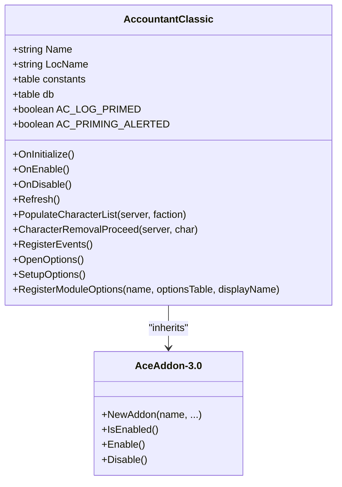
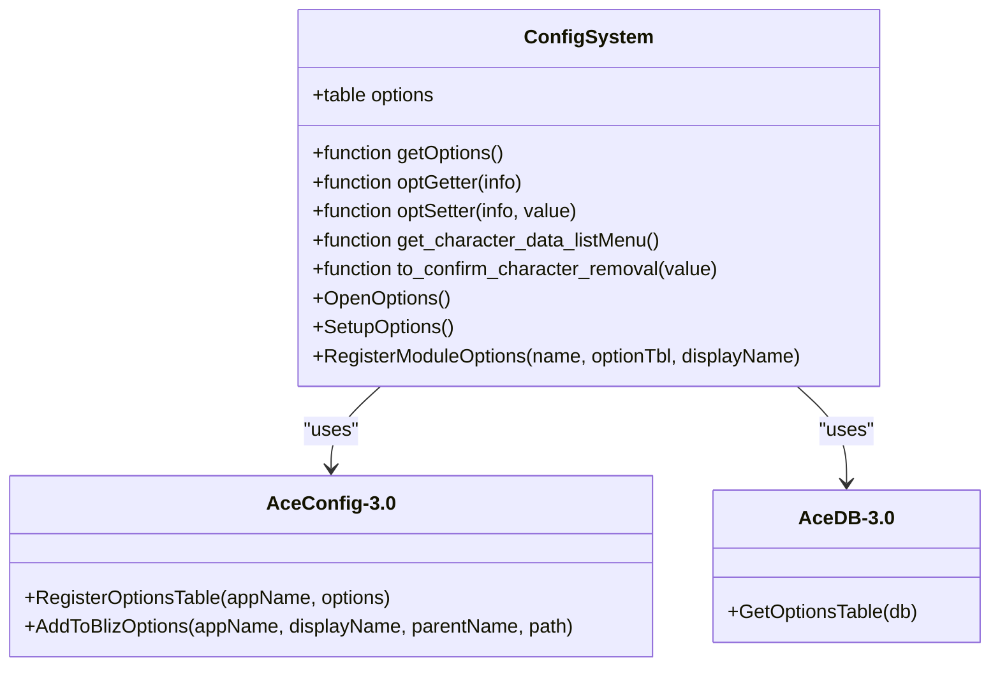
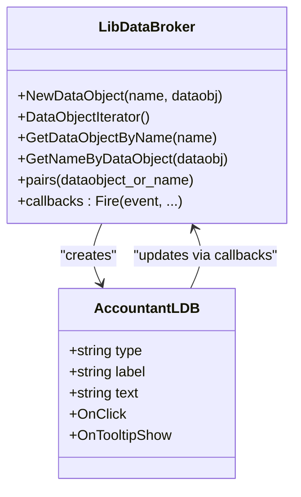
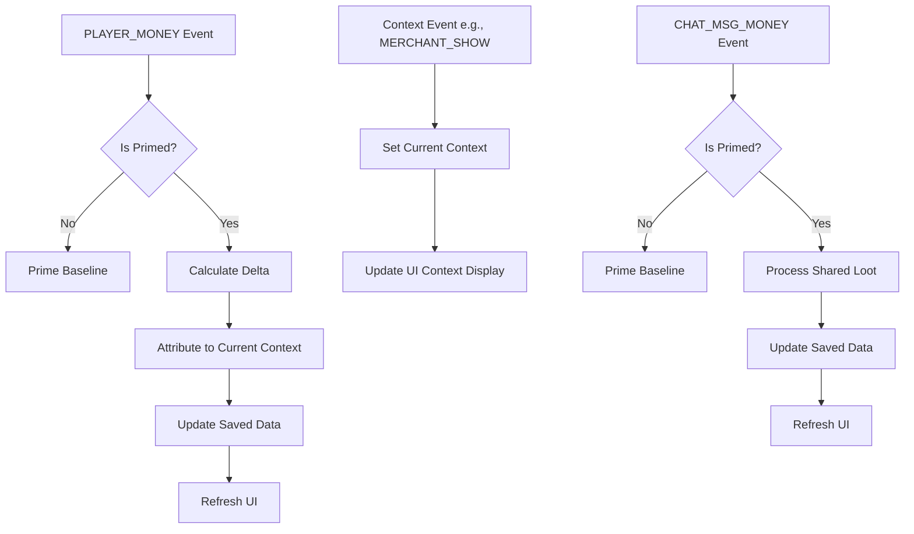
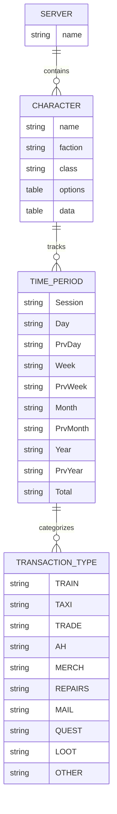
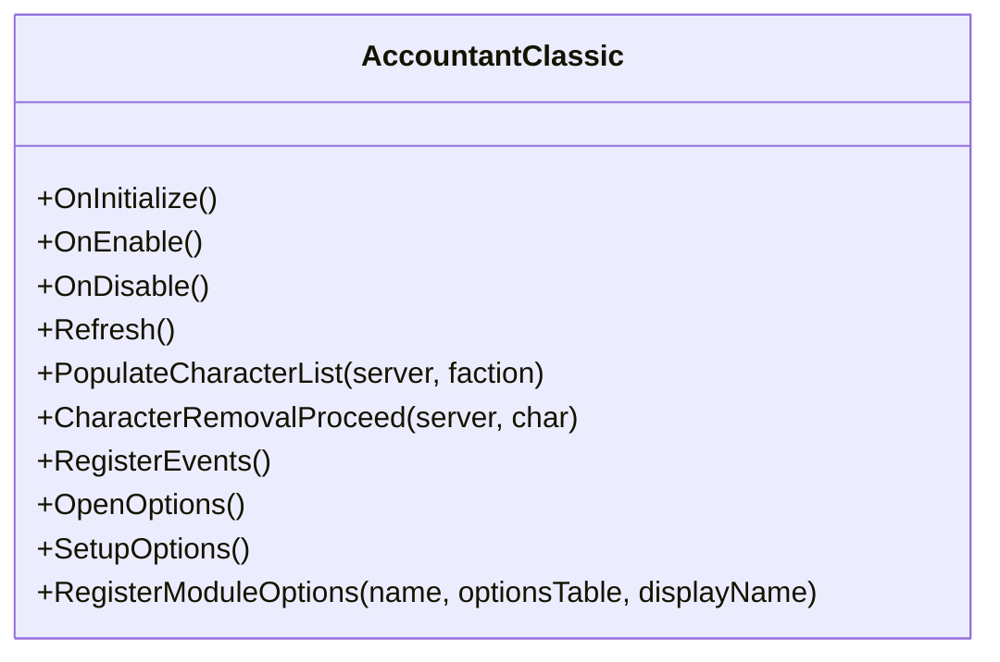

# API Reference

<cite>
**Referenced Files in This Document**   
- [Core.lua](file://Core/Core.lua)
- [Config.lua](file://Core/Config.lua)
- [Constants.lua](file://Core/Constants.lua)
- [LibDataBroker-1.1.lua](file://Libs/LibDataBroker-1.1/LibDataBroker-1.1.lua)
</cite>

## Table of Contents
1. [Introduction](#introduction)
2. [Core Components](#core-components)
3. [Configuration System](#configuration-system)
4. [LibDataBroker Integration](#libdatabroker-integration)
5. [Event Handling](#event-handling)
6. [Data Structures](#data-structures)
7. [Public API Methods](#public-api-methods)
8. [Versioning and Compatibility](#versioning-and-compatibility)

## Introduction
Accountant_Classic is a World of Warcraft addon that tracks gold income and expenditure across multiple time periods (Session, Day, Week, Month, Year, Total). Built on the ACE3 framework, it provides comprehensive financial tracking with a user-friendly interface, minimap integration, and cross-character data visualization. This document details the public API exposed by the addon for integration with other addons and custom configurations.

The addon uses ACE3 libraries including AceAddon-3.0, AceEvent-3.0, AceDB-3.0, and AceConfig-3.0 to provide a robust, extensible architecture. It tracks money changes through WoW UI events and categorizes transactions based on context (merchant, taxi, quest, etc.). The API allows other addons to access configuration data, register for financial updates, and interact with the UI components.

**Section sources**
- [Core.lua](file://Core/Core.lua#L1-L100)
- [README.md](file://README.md#L1-L50)

## Core Components

The Accountant_Classic addon is structured around three main components: the core functionality in Core.lua, the configuration system in Config.lua, and the constants and event mappings in Constants.lua. The addon is initialized as an AceAddon-3.0 object, providing access to ACE3's modular system.

The core functionality revolves around tracking money changes through the PLAYER_MONEY and CHAT_MSG_MONEY events, attributing these changes to specific categories based on the current UI context (e.g., MERCHANT_SHOW sets the context to MERCH). A priming system ensures that the initial gold balance is not counted as income, with a one-time baseline initialization when the addon first observes money.



**Diagram sources**
- [Core.lua](file://Core/Core.lua#L30-L50)
- [Constants.lua](file://Core/Constants.lua#L1-L20)

**Section sources**
- [Core.lua](file://Core/Core.lua#L1-L100)
- [Constants.lua](file://Core/Constants.lua#L1-L50)

## Configuration System

The configuration system in Accountant_Classic is built on AceConfig-3.0 and AceDB-3.0, providing a comprehensive options interface accessible through the game's Interface Options panel. The system allows users to customize display settings, tracking options, and UI appearance.

The configuration is organized into several groups:
- General and Data Display Format Settings
- Minimap Button Settings
- LDB Display Settings
- Scale and Transparency
- Character Data Removal

Configuration values are stored in the addon's database profile and can be accessed programmatically by other addons. The system includes a modular options registration system that allows for extending the configuration interface.



**Diagram sources**
- [Config.lua](file://Core/Config.lua#L1-L50)
- [Core.lua](file://Core/Core.lua#L30-L50)

**Section sources**
- [Config.lua](file://Core/Config.lua#L1-L100)

### Configuration Accessors

External addons can access configuration values through the addon's database profile. The configuration is stored in `addon.db.profile` and contains various settings that control the addon's behavior.

```lua
-- Example: Accessing configuration values
local accountant = LibStub("AceAddon-3.0"):GetAddon("Accountant_Classic")
local showButton = accountant.db.profile.minimap.hide
local trackZone = accountant.db.profile.trackzone
local scale = accountant.db.profile.scale
```

The configuration includes the following key settings:

**Configuration Settings**
- **minimap.hide**: Whether the minimap button is hidden
- **showmoneyinfo**: Whether to show the floating money frame
- **showintrotip**: Whether to display instruction tips
- **breakupnumbers**: Whether to group digits in number formatting
- **cross_server**: Whether to show characters from all realms
- **trackzone**: Whether to track location of money transactions
- **tracksubzone**: Whether to track subzone information
- **weekstart**: Day of week that starts the week (1=Sunday)
- **ldbDisplayType**: Type of data displayed on LDB (1=Total, 2=Session, etc.)
- **dateformat**: Date format (1=mm/dd/yy, 2=dd/mm/yy, 3=yy/mm/dd)
- **scale**: Main frame scale (0.5-1.75)
- **alpha**: Main frame transparency (0.1-1)
- **infoscale**: Floating info scale (0.5-3)
- **infoalpha**: Floating info transparency (0.1-1)
- **rememberSelectedCharacter**: Whether to remember dropdown selection

## LibDataBroker Integration

Accountant_Classic integrates with LibDataBroker-1.1 to provide data feeds that can be displayed by LDB-compatible display addons (like Titan Panel or ChocolateBar). This allows users to view financial information in their preferred data display interface.

The addon creates a data object that exposes financial information through LDB's attribute system. Other addons can also register for updates when financial data changes.



**Diagram sources**
- [Core.lua](file://Core/Core.lua#L50-L70)
- [LibDataBroker-1.1.lua](file://Libs/LibDataBroker-1.1/LibDataBroker-1.1.lua#L1-L20)

**Section sources**
- [Core.lua](file://Core/Core.lua#L50-L100)

### LDB Data Object

The LDB data object provides the following attributes:

**LDB Attributes**
- **type**: "data source"
- **label**: "Accountant Classic"
- **text**: Current financial information based on ldbDisplayType setting
- **OnClick**: Function to open the main window
- **OnTooltipShow**: Function to display detailed tooltip information

Other addons can access the LDB data object and register for updates:

```lua
-- Example: Accessing LDB data
local ldb = LibStub("LibDataBroker-1.0")
local dataobj = ldb:GetDataObjectByName("Accountant_Classic")
if dataobj then
    print("Current text: " .. dataobj.text)
end
```

## Event Handling

Accountant_Classic uses AceEvent-3.0 to register for and handle various WoW UI events that indicate changes in financial context or actual money changes. The addon listens to a comprehensive set of events to accurately categorize transactions.

The event system is initialized in the OnEnable method, where the addon registers for all events defined in the constants table.



**Diagram sources**
- [Core.lua](file://Core/Core.lua#L200-L300)
- [Constants.lua](file://Core/Constants.lua#L50-L100)

**Section sources**
- [Core.lua](file://Core/Core.lua#L200-L300)
- [Constants.lua](file://Core/Constants.lua#L50-L150)

### Event Registration

The addon registers for the following events, which vary slightly between different WoW versions:

**Classic Era/TBC/WotLK Events**
- CONFIRM_TALENT_WIPE
- MERCHANT_SHOW, MERCHANT_CLOSED, MERCHANT_UPDATE
- QUEST_COMPLETE, QUEST_FINISHED, QUEST_TURNED_IN
- LOOT_OPENED, LOOT_CLOSED
- TAXIMAP_OPENED, TAXIMAP_CLOSED
- TRADE_SHOW, TRADE_CLOSED
- MAIL_INBOX_UPDATE, MAIL_SHOW, MAIL_CLOSED
- TRAINER_SHOW, TRAINER_CLOSED
- AUCTION_HOUSE_SHOW, AUCTION_HOUSE_CLOSED
- CHAT_MSG_MONEY
- PLAYER_MONEY
- CURRENCY_DISPLAY_UPDATE
- BAG_UPDATE

**Retail/Wrath/Cata Events** (includes additional events)
- GARRISON_MISSION_FINISHED
- GARRISON_ARCHITECT_OPENED, GARRISON_ARCHITECT_CLOSED
- BARBER_SHOP_OPEN, BARBER_SHOP_CLOSE
- LFG_COMPLETION_REWARD
- TRANSMOGRIFY_OPEN, TRANSMOGRIFY_CLOSE
- GUILDBANKFRAME_OPENED, GUILDBANKFRAME_CLOSED
- Plus all Classic events

## Data Structures

Accountant_Classic uses a hierarchical data structure to store financial information, organized by server, character, time period, and transaction type.



**Diagram sources**
- [Core.lua](file://Core/Core.lua#L100-L150)
- [Constants.lua](file://Core/Constants.lua#L100-L150)

**Section sources**
- [Core.lua](file://Core/Core.lua#L100-L200)
- [Constants.lua](file://Core/Constants.lua#L100-L200)

### Saved Variables

The addon uses two main saved variable tables:

**Accountant_ClassicSaveData**
- Structure: [Server][Character]
- Contains:
  - options: Configuration options for the character
  - data: Financial data organized by time period and transaction type

**Accountant_ClassicZoneDB** (optional)
- Structure: [Server][Character]
- Contains location-based breakdown of financial transactions
- Enabled when trackzone configuration option is true

### Data Access Methods

Other addons can access financial data through direct table access or provided methods:

```lua
-- Example: Accessing financial data
local accountant = LibStub("AceAddon-3.0"):GetAddon("Accountant_Classic")
local server = GetRealmName()
local player = UnitName("player")

-- Get total gold for current character
local totalCash = Accountant_ClassicSaveData[server][player].options.totalcash

-- Get session income for repairs
local sessionRepairs = Accountant_ClassicSaveData[server][player].data.Session.REPAIRS.In or 0

-- Get all characters' data
for serverName, serverData in pairs(Accountant_ClassicSaveData) do
    for charName, charData in pairs(serverData) do
        local cash = charData.options.totalcash
        print(serverName .. "-" .. charName .. ": " .. cash)
    end
end
```

## Public API Methods

Accountant_Classic exposes several public methods that can be used by other addons for integration and customization.

### Core Methods



**OnInitialize()**
- **Description**: Called when the addon is first loaded
- **Parameters**: None
- **Returns**: None
- **Functionality**: Initializes the addon's database, sets up default options, and creates UI frames
- **Error Conditions**: None

**OnEnable()**
- **Description**: Called when the addon is enabled
- **Parameters**: None
- **Returns**: None
- **Functionality**: Registers for WoW events, initializes the UI, and sets up the minimap button
- **Error Conditions**: None

**OnDisable()**
- **Description**: Called when the addon is disabled
- **Parameters**: None
- **Returns**: None
- **Functionality**: Unregisters from WoW events and hides UI elements
- **Error Conditions**: None

**Refresh()**
- **Description**: Refreshes the UI display
- **Parameters**: None
- **Returns**: None
- **Functionality**: Updates the main window display with current data
- **Error Conditions**: None

**PopulateCharacterList(server, faction)**
- **Description**: Populates the character list for the All Characters tab
- **Parameters**: 
  - server (string, optional): Filter by server ("All" for all servers)
  - faction (string, optional): Filter by faction ("All" for all factions)
- **Returns**: None
- **Functionality**: Builds the list of characters to display in the All Characters tab based on filters
- **Error Conditions**: None

**CharacterRemovalProceed(server, char)**
- **Description**: Removes a character's data from the addon
- **Parameters**:
  - server (string): Server name
  - char (string): Character name
- **Returns**: None
- **Functionality**: Deletes the specified character's data from the saved variables
- **Error Conditions**: None

**RegisterEvents()**
- **Description**: Registers the addon for WoW events
- **Parameters**: None
- **Returns**: None
- **Functionality**: Registers for all events in the constants.events table
- **Error Conditions**: None

**OpenOptions()**
- **Description**: Opens the addon's options window
- **Parameters**: None
- **Returns**: None
- **Functionality**: Opens the Interface Options panel to the Accountant Classic configuration
- **Error Conditions**: None

**SetupOptions()**
- **Description**: Sets up the configuration options
- **Parameters**: None
- **Returns**: None
- **Functionality**: Registers the options table with AceConfigRegistry and adds to Blizzard options
- **Error Conditions**: None

**RegisterModuleOptions(name, optionsTable, displayName)**
- **Description**: Registers a module's options with the configuration system
- **Parameters**:
  - name (string): Name of the module
  - optionsTable (table or function): Options table or function that returns options table
  - displayName (string): Display name for the options
- **Returns**: None
- **Functionality**: Adds a new options category to the addon's configuration interface
- **Error Conditions**: None

### Configuration Methods

**optGetter(info)**
- **Description**: Getter function for configuration options
- **Parameters**:
  - info (table): AceConfig info table
- **Returns**: Value of the configuration option
- **Functionality**: Retrieves the value of a configuration option from the database profile
- **Error Conditions**: None

**optSetter(info, value)**
- **Description**: Setter function for configuration options
- **Parameters**:
  - info (table): AceConfig info table
  - value (any): Value to set
- **Returns**: None
- **Functionality**: Sets a configuration option and refreshes the UI
- **Error Conditions**: None

**get_character_data_listMenu()**
- **Description**: Gets the list of characters for the removal dropdown
- **Parameters**: None
- **Returns**: Table of formatted character names
- **Functionality**: Creates a formatted list of characters for display in the character removal dropdown
- **Error Conditions**: None

### UI Methods

**createACFrames()**
- **Description**: Creates the addon's UI frames
- **Parameters**: None
- **Returns**: None
- **Functionality**: Creates dropdown menus and header click areas for the main frame
- **Error Conditions**: None

**setLabels()**
- **Description**: Sets the text labels in the UI
- **Parameters**: None
- **Returns**: None
- **Functionality**: Updates UI labels based on the current tab and localization
- **Error Conditions**: None

**settleTabText()**
- **Description**: Sets the text for the tab buttons
- **Parameters**: None
- **Returns**: None
- **Functionality**: Configures the tab buttons with appropriate text and positioning
- **Error Conditions**: None

## Versioning and Compatibility

Accountant_Classic maintains backward compatibility through several mechanisms:

### Version Detection
The addon detects the WoW version at startup and adjusts its behavior accordingly:

```lua
-- Version detection in Constants.lua
local wowversion = select(4, GetBuildInfo())
if wowversion < 20000 then
    WoWClassicEra = true
elseif wowversion < 30000 then 
    WoWClassicTBC = true
-- etc.
```

This allows the addon to use different event sets and UI layouts for different WoW versions.

### Configuration Versioning
The addon includes version tracking in its default options:

```lua
local AccountantClassicDefaultOptions = {
    version = AccountantClassic_Version,
    -- other options
}
```

When the addon loads, it checks for missing options and adds defaults:

```lua
local function AccountantClassic_UpdateOptions(player_options)
    for k, v in pairs(AccountantClassicDefaultOptions) do
        if (player_options[k] == nil) then
            player_options[k] = v;
        end
    end
end
```

This ensures that new options are added when the addon is updated, without breaking existing configurations.

### API Stability
The addon's public API has remained stable across versions, with new functionality added through optional methods rather than changing existing ones. The core methods (OnInitialize, OnEnable, etc.) maintain the same signatures.

Third-party addons should:
1. Use `LibStub("AceAddon-3.0"):GetAddon("Accountant_Classic")` to safely access the addon object
2. Check for the existence of methods before calling them
3. Handle cases where data might be nil (e.g., new characters with no data yet)
4. Use the configuration accessors rather than directly modifying the database

The addon follows semantic versioning principles, with major version changes indicating potential breaking changes, minor versions for new features, and patch versions for bug fixes.

**Section sources**
- [Core.lua](file://Core/Core.lua#L1000-L1200)
- [Constants.lua](file://Core/Constants.lua#L1-L50)