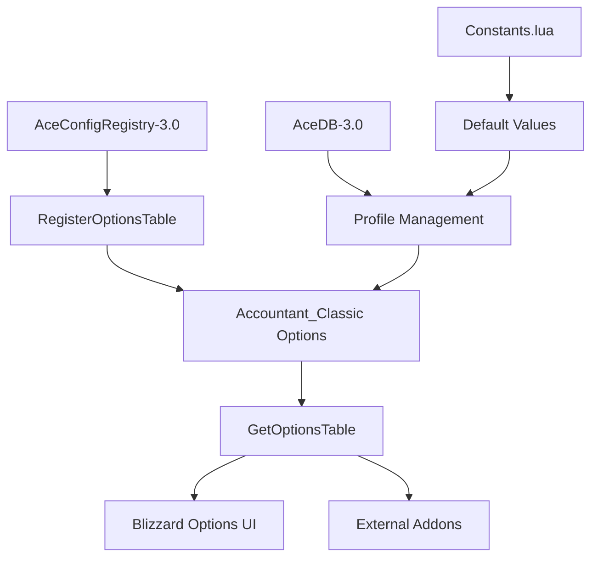
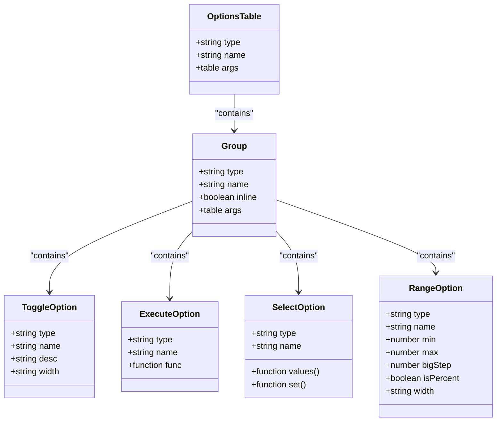
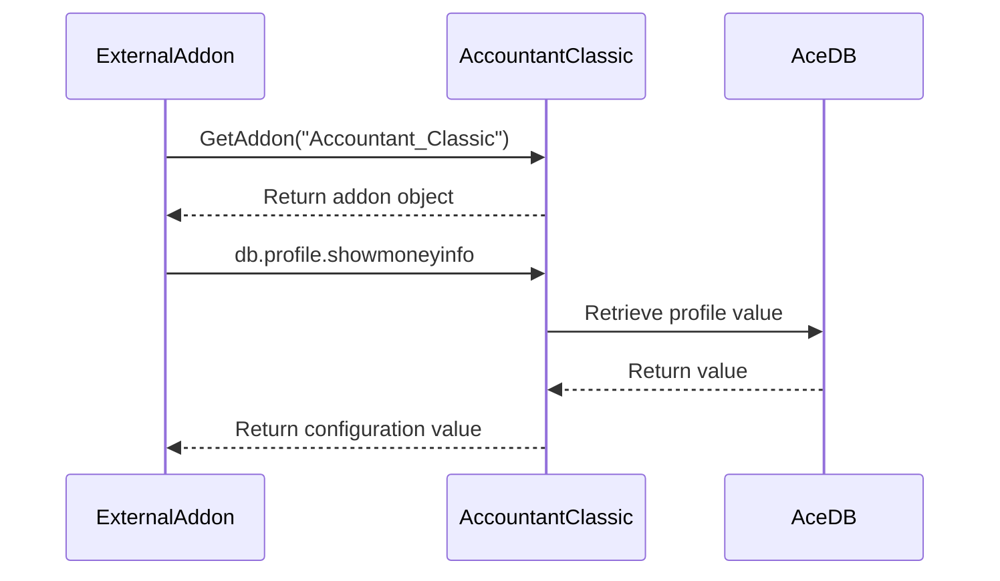
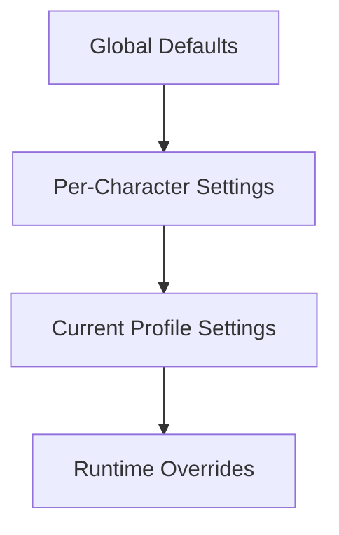
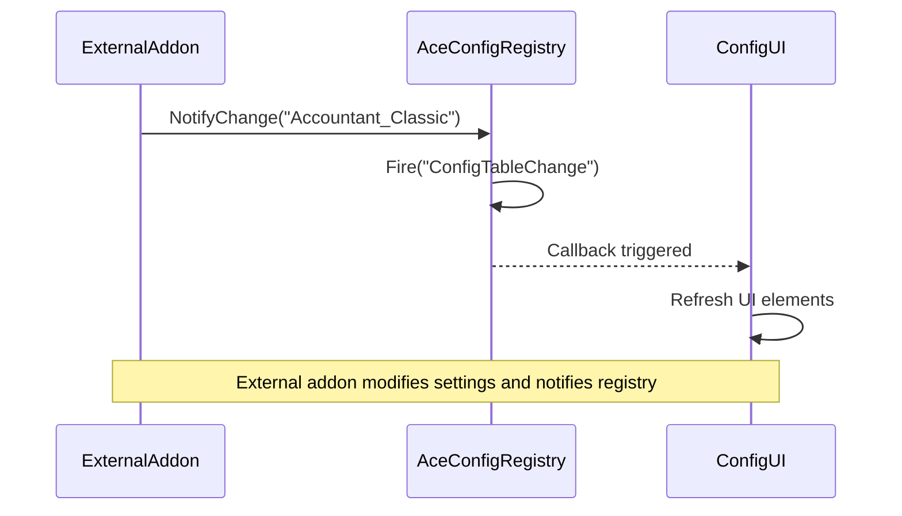

# Configuration Access and Options Registry

<cite>
**Referenced Files in This Document**   
- [Core/Config.lua](file://Core/Config.lua)
- [Core/Constants.lua](file://Core/Constants.lua)
- [Libs/AceConfig-3.0/AceConfigRegistry-3.0/AceConfigRegistry-3.0.lua](file://Libs/AceConfig-3.0/AceConfigRegistry-3.0/AceConfigRegistry-3.0.lua)
</cite>

## Table of Contents
1. [Configuration System Overview](#configuration-system-overview)
2. [Options Table Structure](#options-table-structure)
3. [Accessing Configuration Values](#accessing-configuration-values)
4. [Writing Configuration Settings](#writing-configuration-settings)
5. [Configuration Inheritance Model](#configuration-inheritance-model)
6. [Event Handling for Configuration Changes](#event-handling-for-configuration-changes)
7. [Validation Rules and Default Values](#validation-rules-and-default-values)
8. [External Addon Integration Examples](#external-addon-integration-examples)
9. [Common Pitfalls and Best Practices](#common-pitfalls-and-best-practices)

## Configuration System Overview

The Accountant_Classic addon utilizes the AceConfigRegistry-3.0 framework to expose its configuration system. This system provides a standardized interface for both user-facing options and programmatic access by external addons. The configuration is built on top of AceDB-3.0, enabling profile-based settings persistence across sessions.

The configuration system is initialized in `Config.lua` where the main options table is constructed and registered with AceConfigRegistry. This allows the options to be displayed in the Blizzard interface options panel and accessed by other AceConfig-compatible UIs.



**Diagram sources**
- [Core/Config.lua](file://Core/Config.lua#L1-L430)
- [Libs/AceConfig-3.0/AceConfigRegistry-3.0/AceConfigRegistry-3.0.lua](file://Libs/AceConfig-3.0/AceConfigRegistry-3.0/AceConfigRegistry-3.0.lua#L1-L372)

**Section sources**
- [Core/Config.lua](file://Core/Config.lua#L1-L430)
- [Libs/AceConfig-3.0/AceConfigRegistry-3.0/AceConfigRegistry-3.0.lua](file://Libs/AceConfig-3.0/AceConfigRegistry-3.0/AceConfigRegistry-3.0.lua#L1-L372)

## Options Table Structure

The options table returned by `GetOptionsTable()` follows the AceConfig specification and is organized into logical groups. The root table has a type of "group" and contains a hierarchical structure of configuration options.

### Root Structure
```lua
{
    type = "group",
    name = addon.LocName,
    args = { 
        -- configuration groups 
    }
}
```

### Configuration Groups
The main configuration is divided into several groups:

**General Settings Group**
- **showmoneyinfo**: Toggle for displaying money on screen
- **resetButtonPos**: Execute button to reset money frame position
- **showintrotip**: Toggle for displaying instruction tips
- **breakupnumbers**: Toggle for number formatting with digit grouping
- **rememberSelectedCharacter**: Toggle for remembering character selection
- **cross_server**: Toggle for showing all realms' characters
- **show_allFactions**: Toggle for showing all factions' characters

**Enhanced Tracking Options Subgroup**
- **trackzone**: Toggle for tracking location of money transactions
- **tracksubzone**: Toggle for tracking subzone information

**Minimap Button Settings Group**
- **minimapButton**: Toggle for showing minimap button
- **showmoneyonbutton**: Toggle for showing money in tooltip
- **showsessiononbutton**: Toggle for showing session info in tooltip

**LDB Display Settings Group**
- **ldbDisplayType**: Select for LDB display type (Total, Session, Today, Week, Month)

**Scale and Transparency Group**
- **scale**: Range for main frame scale (0.5-1.75)
- **alpha**: Range for main frame transparency (0.1-1)
- **infoscale**: Range for floating info scale (0.5-3)
- **infoalpha**: Range for floating info transparency (0.1-1)

**Character Data Removal Group**
- **deleteData**: Select for choosing character to remove



**Diagram sources**
- [Core/Config.lua](file://Core/Config.lua#L1-L430)

**Section sources**
- [Core/Config.lua](file://Core/Config.lua#L1-L430)

## Accessing Configuration Values

External addons can programmatically read configuration values through the `Accountant_Classic.db.profile` object. This object provides direct access to the current profile's settings.

### Direct Access Pattern
```lua
-- Get reference to Accountant_Classic addon
local accountant = LibStub("AceAddon-3.0"):GetAddon("Accountant_Classic")

-- Access configuration values
local showMoneyInfo = accountant.db.profile.showmoneyinfo
local trackZone = accountant.db.profile.trackzone
local ldbDisplayType = accountant.db.profile.ldbDisplayType
local scale = accountant.db.profile.scale
```

### Safe Access with Nil Checking
```lua
local accountant = LibStub("AceAddon-3.0"):GetAddon("Accountant_Classic", true)
if accountant and accountant.db and accountant.db.profile then
    local crossServer = accountant.db.profile.cross_server
    -- Use the configuration value
end
```

The configuration values are stored in the profile database and persist across game sessions. The `db.profile` object is an AceDB-3.0 profile object that automatically handles data persistence.



**Diagram sources**
- [Core/Config.lua](file://Core/Config.lua#L1-L430)

**Section sources**
- [Core/Config.lua](file://Core/Config.lua#L1-L430)

## Writing Configuration Settings

When modifying configuration settings, addons should use proper AceDB access patterns rather than direct assignment to ensure proper event propagation and data consistency.

### Proper Setting Update Pattern
```lua
-- Get the Accountant_Classic addon instance
local accountant = LibStub("AceAddon-3.0"):GetAddon("Accountant_Classic")

-- Use the setter function pattern for proper event handling
accountant.db.profile.showmoneyinfo = true
accountant:Refresh() -- Trigger UI refresh

-- Or use the optSetter function pattern
local optSetter = function(info, value)
    local key = info[#info]
    accountant.db.profile[key] = value
    accountant:Refresh()
end
```

### Batch Updates
For multiple setting changes, it's more efficient to batch updates and trigger refresh once:

```lua
-- Batch update pattern
local db = accountant.db.profile
db.showmoneyinfo = true
db.showintrotip = false
db.cross_server = true
accountant:Refresh() -- Single refresh for multiple changes
```

### Using AceDB Profile Management
```lua
-- Switch to a different profile
accountant.db:SetProfile("MyProfile")

-- Copy settings from another profile
accountant.db:CopyProfile("SourceProfile")

-- Reset to defaults
accountant.db:ResetProfile()
```

**Section sources**
- [Core/Config.lua](file://Core/Config.lua#L1-L430)
- [Core/Constants.lua](file://Core/Constants.lua#L1-L260)

## Configuration Inheritance Model

The configuration system follows AceDB-3.0's profile inheritance model, where settings are stored at multiple levels with specific precedence rules.

### Inheritance Hierarchy


### Profile Structure
The configuration uses the standard AceDB-3.0 profile structure with the following levels:

**Default Values (Constants.lua)**
Defined in `constants.defaults.profile` and serve as the base for all profiles:
```lua
constants.defaults = {
    profile = {
        minimap = {
            hide = false,
            show = true,
            minimapPos = 153,
        },
        showmoneyinfo = true, 
        showintrotip = true,
        cross_server = true,
        trackzone = true,
        weekstart = 1,
        ldbDisplayType = 2,
        scale = 1,
        alpha = 1,
        -- ... other defaults
    }
}
```

**Per-Profile Storage**
Each profile stores only the settings that differ from defaults, minimizing storage overhead.

**Character-Specific Overrides**
The system supports character-specific settings that can override profile settings when needed.

### Profile Management Functions
```lua
-- Get current profile name
local currentProfile = accountant.db:GetCurrentProfile()

-- Check if profile is default
local isDefault = accountant.db:IsCurrentProfileDefault()

-- Enumerate available profiles
local profiles = {}
accountant.db:IterateProfiles(function(profile) 
    tinsert(profiles, profile) 
end)
```

**Section sources**
- [Core/Constants.lua](file://Core/Constants.lua#L1-L260)
- [Core/Config.lua](file://Core/Config.lua#L1-L430)

## Event Handling for Configuration Changes

The configuration system provides event notification for external addons to respond to setting changes.

### Configuration Change Event
```lua
-- Register for configuration change notifications
AceConfigRegistry.callbacks:RegisterCallback("ConfigTableChange", function(callback, appName)
    if appName == "Accountant_Classic" then
        -- Configuration has changed, update accordingly
        self:OnConfigChanged()
    end
end)
```

### Manual Notification
Addons that modify settings programmatically should trigger notifications:

```lua
-- After modifying settings
AceConfigRegistry:NotifyChange("Accountant_Classic")
```

### Event Flow


**Section sources**
- [Libs/AceConfig-3.0/AceConfigRegistry-3.0/AceConfigRegistry-3.0.lua](file://Libs/AceConfig-3.0/AceConfigRegistry-3.0/AceConfigRegistry-3.0.lua#L1-L372)

## Validation Rules and Default Values

The configuration system enforces validation rules and provides default values for all settings.

### Default Values (from Constants.lua)
```lua
constants.defaults = {
    profile = {
        minimap = {
            hide = false,
            show = true,
            minimapPos = 153,
        },
        showmoneyinfo = true, 
        showintrotip = true,
        breakupnumbers = true,
        cross_server = true,
        show_allFactions = true,
        trackzone = true,
        tracksubzone = true,
        weekstart = 1,
        ldbDisplayType = 2,
        dateformat = 1,
        scale = 1,
        alpha = 1,
        infoscale = 1,
        infoalpha = 1,
        faction = playerFaction,
        class = playerClass,
        AcFramePoint = { "TOPLEFT", "UIParent", "TOPLEFT", 0, -104 },
        MnyFramePoint = { "TOPLEFT", "UIParent", "TOPLEFT", 10, -80 },
        rememberSelectedCharacter = true,
    }
}
```

### Validation Rules
The AceConfigRegistry-3.0 system enforces the following validation rules:

**Type Validation**
- All options must have a valid `type` field
- Supported types: "group", "toggle", "execute", "select", "range", "description"

**Required Fields**
- `name`: Display name for the option
- `type`: Option type

**Field-Specific Rules**
- **toggle**: No additional required fields
- **execute**: Requires `func` field
- **select**: Requires `values` function or table
- **range**: Requires `min`, `max`, and optionally `step`, `bigStep`
- **group**: Requires `args` table containing child options

**Value Constraints**
- `scale`: 0.5 to 1.75
- `alpha`: 0.1 to 1
- `infoscale`: 0.5 to 3
- `infoalpha`: 0.1 to 1
- `weekstart`: 1 to 7 (days of week)
- `dateformat`: 1 to 3 (format options)

**Section sources**
- [Core/Constants.lua](file://Core/Constants.lua#L1-L260)
- [Libs/AceConfig-3.0/AceConfigRegistry-3.0/AceConfigRegistry-3.0.lua](file://Libs/AceConfig-3.0/AceConfigRegistry-3.0/AceConfigRegistry-3.0.lua#L1-L372)

## External Addon Integration Examples

### Toggling Display Options
```lua
-- Example: Toggle money display on screen
local function toggleMoneyDisplay(enable)
    local accountant = LibStub("AceAddon-3.0"):GetAddon("Accountant_Classic", true)
    if not accountant then return end
    
    -- Update the setting
    accountant.db.profile.showmoneyinfo = enable or not accountant.db.profile.showmoneyinfo
    
    -- Trigger refresh to update UI
    accountant:Refresh()
    
    -- Notify the registry of changes
    AceConfigRegistry:NotifyChange("Accountant_Classic")
end

-- Usage
toggleMoneyDisplay(true)  -- Enable money display
toggleMoneyDisplay(false) -- Disable money display
```

### Changing Tracking Behavior
```lua
-- Example: Modify tracking settings
local function configureTracking(zoneTracking, subzoneTracking)
    local accountant = LibStub("AceAddon-3.0"):GetAddon("Accountant_Classic", true)
    if not accountant then return end
    
    local db = accountant.db.profile
    db.trackzone = zoneTracking
    db.tracksubzone = subzoneTracking and zoneTracking  -- subzone requires zone tracking
    
    -- Refresh UI and notify
    accountant:Refresh()
    AceConfigRegistry:NotifyChange("Accountant_Classic")
end

-- Usage
configureTracking(true, true)   -- Enable both zone and subzone tracking
configureTracking(true, false)  -- Enable zone tracking only
configureTracking(false, false) -- Disable all location tracking
```

### Reading Configuration State
```lua
-- Example: Check current configuration
local function getAccountantStatus()
    local accountant = LibStub("AceAddon-3.0"):GetAddon("Accountant_Classic", true)
    if not accountant then 
        return { available = false }
    end
    
    return {
        available = true,
        showingMoney = accountant.db.profile.showmoneyinfo,
        trackingLocation = accountant.db.profile.trackzone,
        crossServer = accountant.db.profile.cross_server,
        displayType = accountant.constants.ldbDisplayTypes[accountant.db.profile.ldbDisplayType],
        scale = accountant.db.profile.scale,
    }
end
```

**Section sources**
- [Core/Config.lua](file://Core/Config.lua#L1-L430)
- [Core/Constants.lua](file://Core/Constants.lua#L1-L260)

## Common Pitfalls and Best Practices

### Common Pitfalls

**Direct Assignment Without Refresh**
```lua
-- ❌ Wrong: Direct assignment without refresh
accountant.db.profile.showmoneyinfo = true
-- UI may not update immediately

-- ✅ Correct: Assignment with refresh
accountant.db.profile.showmoneyinfo = true
accountant:Refresh()
```

**Modifying Settings During Events**
```lua
-- ❌ Risky: Modifying settings during PLAYER_LOGIN
-- May cause race conditions

-- ✅ Better: Use delayed execution
C_Timer.After(1, function()
    accountant.db.profile.showmoneyinfo = true
    accountant:Refresh()
end)
```

**Not Handling Missing Addon**
```lua
-- ❌ Risky: Assuming addon exists
local accountant = LibStub("AceAddon-3.0"):GetAddon("Accountant_Classic")
-- Will error if addon not loaded

-- ✅ Safe: Check for addon existence
local accountant = LibStub("AceAddon-3.0"):GetAddon("Accountant_Classic", true)
if not accountant then return end
```

### Best Practices

**Use the AceConfigRegistry Pattern**
```lua
-- Always use NotifyChange after programmatic changes
accountant.db.profile.value = newValue
accountant:Refresh()
AceConfigRegistry:NotifyChange("Accountant_Classic")
```

**Batch Configuration Changes**
```lua
-- For multiple changes, batch them
local db = accountant.db.profile
db.option1 = value1
db.option2 = value2
db.option3 = value3
accountant:Refresh() -- Single refresh
AceConfigRegistry:NotifyChange("Accountant_Classic")
```

**Respect User Preferences**
```lua
-- Check if feature is enabled before acting
if accountant.db.profile.showmoneyinfo then
    -- Safe to interact with money display
end
```

**Handle Profile Changes**
```lua
-- Register for profile changes
accountant.db.RegisterCallback(self, "OnProfileChanged", "OnProfileChanged")
accountant.db.RegisterCallback(self, "OnProfileCopied", "OnProfileChanged")
accountant.db.RegisterCallback(self, "OnProfileReset", "OnProfileChanged")
```

**Section sources**
- [Core/Config.lua](file://Core/Config.lua#L1-L430)
- [Core/Constants.lua](file://Core/Constants.lua#L1-L260)
- [Libs/AceConfig-3.0/AceConfigRegistry-3.0/AceConfigRegistry-3.0.lua](file://Libs/AceConfig-3.0/AceConfigRegistry-3.0/AceConfigRegistry-3.0.lua#L1-L372)