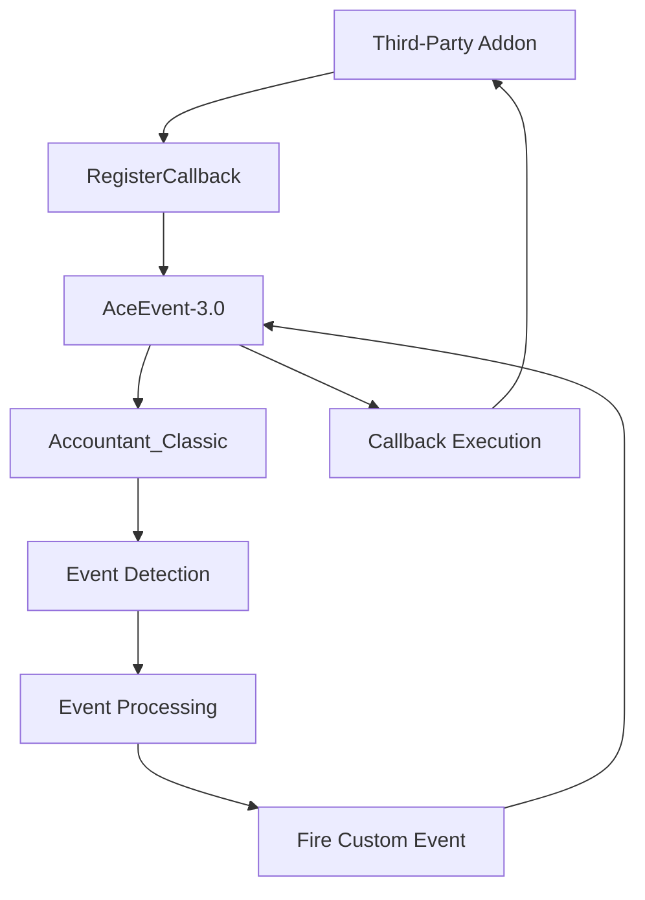
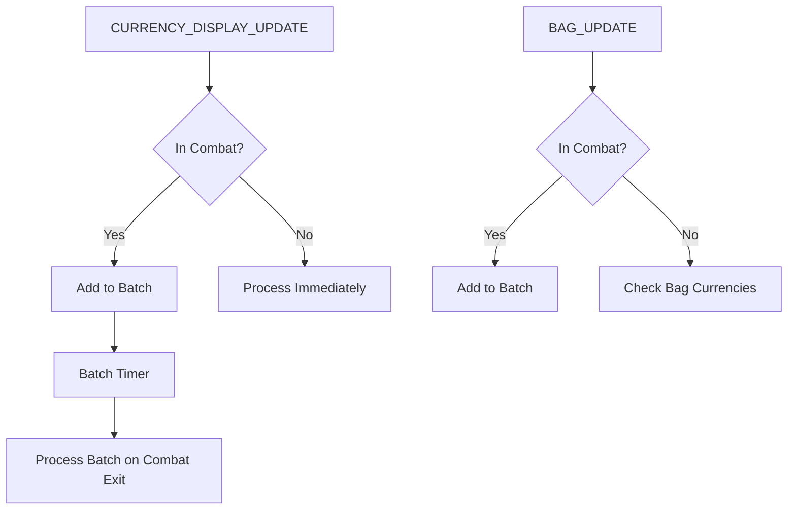
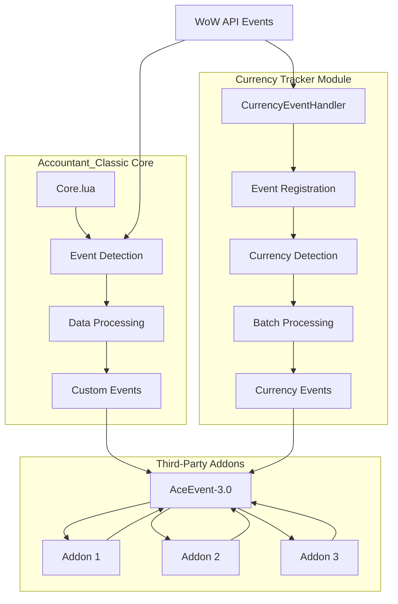

# Event Hooks and Data Change Notifications

<cite>
**Referenced Files in This Document**   
- [Core/Core.lua](file://Core/Core.lua)
- [CurrencyTracker/CurrencyEventHandler.lua](file://CurrencyTracker/CurrencyEventHandler.lua)
- [CurrencyTracker/CurrencyCore.lua](file://CurrencyTracker/CurrencyCore.lua)
- [CurrencyTracker/CurrencyDataManager.lua](file://CurrencyTracker/CurrencyDataManager.lua)
- [CurrencyTracker/CurrencyConstants.lua](file://CurrencyTracker/CurrencyConstants.lua)
- [CurrencyTracker/CurrencyUIController.lua](file://CurrencyTracker/CurrencyUIController.lua)
- [Libs/AceEvent-3.0/AceEvent-3.0.lua](file://Libs/AceEvent-3.0/AceEvent-3.0.lua)
</cite>

## Table of Contents
1. [Introduction](#introduction)
2. [Event System Overview](#event-system-overview)
3. [Custom Event Types](#custom-event-types)
4. [Event Registration and Management](#event-registration-and-management)
5. [Data Change Payloads](#data-change-payloads)
6. [Character-Specific vs Global Data Events](#character-specific-vs-global-data-events)
7. [Timing Considerations and Performance](#timing-considerations-and-performance)
8. [Rate Limiting and Throttling Mechanisms](#rate-limiting-and-throttling-mechanisms)
9. [Example Use Cases](#example-use-cases)
10. [Architecture Diagram](#architecture-diagram)

## Introduction
Accountant_Classic provides a comprehensive event notification system that allows third-party addons to register for financial and currency data change notifications. This document details the custom events exposed by the addon, their payload structures, firing conditions, and best practices for integration. The system is built on AceEvent-3.0, providing a robust callback mechanism for event-driven architecture.

**Section sources**
- [Core/Core.lua](file://Core/Core.lua#L1520-L1551)
- [CurrencyTracker/CurrencyEventHandler.lua](file://CurrencyTracker/CurrencyEventHandler.lua#L0-L349)

## Event System Overview
The event system in Accountant_Classic is designed to notify registered addons of significant financial and currency changes. The system uses AceEvent-3.0 as its foundation, providing reliable event registration, dispatch, and cleanup mechanisms. Events are fired when money or currency balances change, when the UI state changes, or when data is updated.

The event system distinguishes between direct WoW API events (like PLAYER_MONEY) and custom Accountant_Classic events that provide higher-level abstractions of financial changes. This allows addons to respond to either low-level changes or high-level business logic events.



**Diagram sources**
- [Libs/AceEvent-3.0/AceEvent-3.0.lua](file://Libs/AceEvent-3.0/AceEvent-3.0.lua)
- [Core/Core.lua](file://Core/Core.lua#L1520-L1551)

**Section sources**
- [Core/Core.lua](file://Core/Core.lua#L1520-L1551)
- [Libs/AceEvent-3.0/AceEvent-3.0.lua](file://Libs/AceEvent-3.0/AceEvent-3.0.lua)

## Custom Event Types
Accountant_Classic exposes several custom events that third-party addons can register to receive notifications. These events provide detailed information about financial and currency changes.

### ACCOUNTANT_DATA_UPDATED
This event is fired when financial data has been updated and processed. It indicates that the internal data structures have been modified and are ready for consumption.

**Firing Conditions:**
- After processing a money change from PLAYER_MONEY event
- Following currency change detection
- When baseline priming is complete
- After data import or migration operations

**Payload Structure:**
```
{
    dataType: "money" | "currency",
    timestamp: number,
    source: string
}
```

### ACCOUNTANT_UI_SHOW
This event is triggered when the Accountant_Classic UI frame is displayed to the user.

**Firing Conditions:**
- User opens the Accountant_Classic interface
- UI is shown programmatically via API
- Tab changes within the Accountant_Classic interface

**Payload Structure:**
```
{
    tab: number,
    timestamp: number
}
```

### ACCOUNTANT_MONEY_CHANGED
This event is fired when a money transaction is detected and recorded.

**Firing Conditions:**
- Player gains or loses money from any source
- Auction house transactions
- Vendor sales or purchases
- Quest rewards or costs
- Mail attachments

**Payload Structure:**
```
{
    amount: number,
    isIncome: boolean,
    source: string,
    zone: string,
    timestamp: number
}
```

**Section sources**
- [Core/Core.lua](file://Core/Core.lua#L1520-L1551)
- [CurrencyTracker/CurrencyEventHandler.lua](file://CurrencyTracker/CurrencyEventHandler.lua#L0-L349)

## Event Registration and Management
Third-party addons can register for Accountant_Classic events using the AceEvent-3.0 framework's RegisterCallback and UnregisterCallback methods.

### Registration Process
To register for events, addons should use the RegisterCallback method provided by AceEvent-3.0:

```lua
-- Example: Registering for ACCOUNTANT_DATA_UPDATED
local addon = LibStub("AceAddon-3.0"):NewAddon("MyAddon", "AceEvent-3.0")

function addon:OnEnable()
    self:RegisterEvent("ACCOUNTANT_DATA_UPDATED", "OnAccountantDataUpdated")
end

function addon:OnAccountantDataUpdated(event, eventData)
    -- Handle the event
    print("Accountant data updated:", eventData.dataType)
end
```

### Unregistration Process
When an addon is disabled or no longer needs to receive events, it should unregister its callbacks:

```lua
function addon:OnDisable()
    self:UnregisterEvent("ACCOUNTANT_DATA_UPDATED")
end
```

### Best Practices for Event Registration
1. Register events in the addon's OnEnable method
2. Unregister events in the OnDisable method
3. Use descriptive method names for event handlers
4. Check if the addon is still active before processing events
5. Avoid registering the same callback multiple times

The AceEvent-3.0 system automatically handles memory management and prevents memory leaks by properly cleaning up references when addons are unloaded.

**Section sources**
- [Libs/AceEvent-3.0/AceEvent-3.0.lua](file://Libs/AceEvent-3.0/AceEvent-3.0.lua)
- [Core/Core.lua](file://Core/Core.lua#L1520-L1551)

## Data Change Payloads
The payload structure for data change events provides detailed information about the nature of the change, allowing addons to respond appropriately.

### ACCOUNTANT_DATA_UPDATED Payload
This payload provides context about what type of data was updated and when.

**Fields:**
- **dataType**: The type of data that was updated ("money" or "currency")
- **timestamp**: Unix timestamp of when the update occurred
- **source**: The source of the update (e.g., "PLAYER_MONEY", "CURRENCY_DISPLAY_UPDATE")

### ACCOUNTANT_MONEY_CHANGED Payload
This payload contains detailed information about a specific money transaction.

**Fields:**
- **amount**: The absolute amount of money involved in the transaction
- **isIncome**: Boolean indicating whether this was income (true) or outgoing (false)
- **source**: The source of the transaction (e.g., "Quest", "Vendor", "Mail")
- **zone**: The current zone where the transaction occurred
- **timestamp**: Unix timestamp of when the transaction was recorded

### Currency Change Detection
For currency tracking, the system detects changes through both modern and legacy APIs:



**Diagram sources**
- [CurrencyTracker/CurrencyEventHandler.lua](file://CurrencyTracker/CurrencyEventHandler.lua#L0-L349)
- [CurrencyTracker/CurrencyDataManager.lua](file://CurrencyTracker/CurrencyDataManager.lua#L0-L373)

**Section sources**
- [CurrencyTracker/CurrencyEventHandler.lua](file://CurrencyTracker/CurrencyEventHandler.lua#L0-L349)
- [CurrencyTracker/CurrencyDataManager.lua](file://CurrencyTracker/CurrencyDataManager.lua#L0-L373)

## Character-Specific vs Global Data Events
Accountant_Classic distinguishes between events that affect character-specific data and those that affect global data.

### Character-Specific Events
These events are tied to the current character's financial data and are stored in character-specific SavedVariables.

**Examples:**
- ACCOUNTANT_MONEY_CHANGED: Fired when the current character's money changes
- Character-specific currency tracking events
- Session-based financial tracking

**Storage Location:**
```
Accountant_ClassicSaveData[server][character]
```

### Global Data Events
These events affect data that is shared across characters or is UI-related.

**Examples:**
- ACCOUNTANT_UI_SHOW: UI state is typically global
- Cross-character financial summaries
- Addon configuration changes

**Storage Location:**
```
Accountant_ClassicSaveData (global structure)
```

The distinction is important for addons that need to understand whether a change affects only the current character or has broader implications. Addons should consider this when deciding how to respond to events.

**Section sources**
- [Core/Core.lua](file://Core/Core.lua#L1520-L1551)
- [CurrencyTracker/CurrencyDataManager.lua](file://CurrencyTracker/CurrencyDataManager.lua#L0-L373)

## Timing Considerations and Performance
Proper timing and performance considerations are critical when handling Accountant_Classic events.

### Event Handler Performance
Event handlers should be lightweight and avoid expensive operations:

1. **Avoid blocking operations**: Don't perform long-running calculations in event handlers
2. **Defer heavy processing**: Use C_Timer.NewTimer to defer non-critical processing
3. **Minimize API calls**: Cache frequently accessed data when possible
4. **Batch updates**: When making multiple UI updates, batch them together

### Optimal Event Handling Patterns
```lua
function addon:OnAccountantDataUpdated(event, eventData)
    -- Lightweight check
    if eventData.dataType ~= "money" then
        return
    end
    
    -- Defer heavy processing
    C_Timer.NewTimer(0.1, function()
        self:UpdateAnalytics()
    end)
end
```

### Combat Considerations
The system is designed to minimize performance impact during combat:

- Currency operations are deferred during combat
- Batch processing is used for high-frequency events
- Event handlers should avoid UI creation during combat

Addons should follow similar patterns to ensure smooth gameplay experience.

**Section sources**
- [CurrencyTracker/CurrencyEventHandler.lua](file://CurrencyTracker/CurrencyEventHandler.lua#L0-L349)
- [CurrencyTracker/CurrencyDataManager.lua](file://CurrencyTracker/CurrencyDataManager.lua#L0-L373)

## Rate Limiting and Throttling Mechanisms
Accountant_Classic implements several mechanisms to prevent performance issues from high-frequency events.

### Currency Update Throttling
For high-frequency currency changes (such as during auction house usage), the system implements batch processing:

```lua
-- Batch processing mechanism
function EventHandler:AddToBatch(updateType, ...)
    table.insert(updateBatch, {
        type = updateType,
        args = {...},
        timestamp = time()
    })

    -- Schedule batch processing if not already scheduled
    if not batchTimer then
        batchTimer = C_Timer.NewTimer(1.0, function()
            EventHandler:ProcessBatchUpdates()
        end)
    end
end
```

This ensures that rapid successive updates are processed as a batch rather than individually, reducing CPU load.

### Combat Mode Deferral
When the player enters combat, currency updates are deferred:

```lua
function EventHandler:OnCurrencyDisplayUpdate(currencyType, quantity)
    if inCombat then
        -- Defer update during combat
        self:AddToBatch("CURRENCY_UPDATE", currencyType, quantity)
        return
    end

    self:ProcessCurrencyChange(currencyType, quantity)
end
```

This prevents UI updates and data processing from interfering with combat performance.

### Update Coalescing
Multiple rapid updates to the same currency are coalesced into a single update, reducing the number of events fired and improving performance.

**Section sources**
- [CurrencyTracker/CurrencyEventHandler.lua](file://CurrencyTracker/CurrencyEventHandler.lua#L0-L349)
- [CurrencyTracker/CurrencyDataManager.lua](file://CurrencyTracker/CurrencyDataManager.lua#L0-L373)

## Example Use Cases
Several practical examples demonstrate how third-party addons can utilize Accountant_Classic events.

### Financial Analytics Addon
An addon that provides advanced financial analytics could register for data updates:

```lua
local AnalyticsAddon = LibStub("AceAddon-3.0"):NewAddon("FinancialAnalytics", "AceEvent-3.0")

function AnalyticsAddon:OnEnable()
    self:RegisterEvent("ACCOUNTANT_DATA_UPDATED", "OnDataUpdated")
    self:RegisterEvent("ACCOUNTANT_MONEY_CHANGED", "OnMoneyChanged")
end

function AnalyticsAddon:OnDataUpdated(event, eventData)
    if eventData.dataType == "money" then
        self:UpdateTrendAnalysis()
    end
end

function AnalyticsAddon:OnMoneyChanged(event, eventData)
    self:RecordTransactionPattern(eventData.source, eventData.amount)
end
```

### UI Enhancement Addon
An addon that enhances the Accountant_Classic UI could respond to UI show events:

```lua
local UIEnhancer = LibStub("AceAddon-3.0"):NewAddon("AccountantEnhancer", "AceEvent-3.0")

function UIEnhancer:OnEnable()
    self:RegisterEvent("ACCOUNTANT_UI_SHOW", "OnUIShow")
end

function UIEnhancer:OnUIShow(event, eventData)
    -- Add custom buttons or information to the UI
    self:AddEnhancements(eventData.tab)
end
```

### Cross-Character Dashboard
An addon that provides a cross-character financial overview:

```lua
local Dashboard = LibStub("AceAddon-3.0"):NewAddon("FinanceDashboard", "AceEvent-3.0")

function Dashboard:OnEnable()
    self:RegisterEvent("ACCOUNTANT_DATA_UPDATED", "OnDataUpdated")
end

function Dashboard:OnDataUpdated(event, eventData)
    if eventData.dataType == "money" then
        -- Update dashboard with latest data
        self:RefreshDashboard()
    end
end
```

These examples show how addons can leverage the event system to provide additional functionality without modifying the core Accountant_Classic addon.

**Section sources**
- [Core/Core.lua](file://Core/Core.lua#L1520-L1551)
- [CurrencyTracker/CurrencyEventHandler.lua](file://CurrencyTracker/CurrencyEventHandler.lua#L0-L349)

## Architecture Diagram
The following diagram illustrates the overall architecture of the event system and its components:



**Diagram sources**
- [Core/Core.lua](file://Core/Core.lua#L1520-L1551)
- [CurrencyTracker/CurrencyEventHandler.lua](file://CurrencyTracker/CurrencyEventHandler.lua#L0-L349)
- [Libs/AceEvent-3.0/AceEvent-3.0.lua](file://Libs/AceEvent-3.0/AceEvent-3.0.lua)

**Section sources**
- [Core/Core.lua](file://Core/Core.lua#L1520-L1551)
- [CurrencyTracker/CurrencyEventHandler.lua](file://CurrencyTracker/CurrencyEventHandler.lua#L0-L349)
- [Libs/AceEvent-3.0/AceEvent-3.0.lua](file://Libs/AceEvent-3.0/AceEvent-3.0.lua)