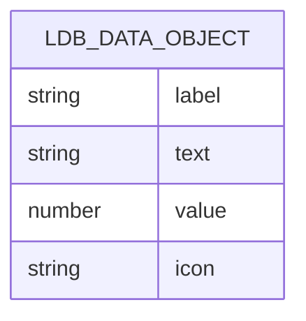
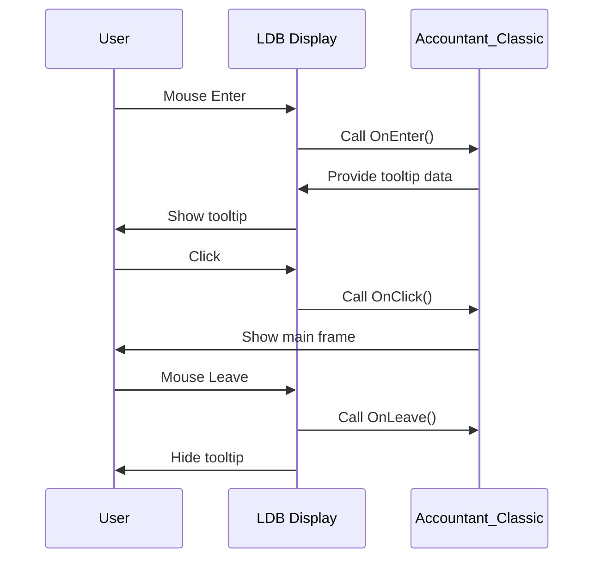
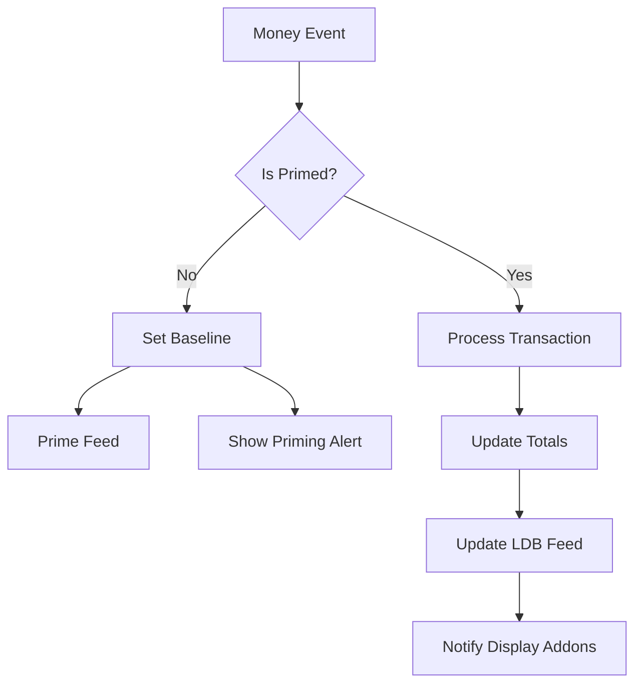

# LibDataBroker (LDB) Feed API

<cite>
**Referenced Files in This Document**   
- [Core.lua](file://Core/Core.lua)
- [LibDataBroker-1.1.lua](file://Libs/LibDataBroker-1.1/LibDataBroker-1.1.lua)
</cite>

## Table of Contents
1. [Introduction](#introduction)
2. [Data Object Structure](#data-object-structure)
3. [Handler Contracts](#handler-contracts)
4. [Integration Example](#integration-example)
5. [Update Frequency and Triggers](#update-frequency-and-triggers)
6. [Programmatic Data Access](#programmatic-data-access)
7. [Compatibility and Version Requirements](#compatibility-and-version-requirements)

## Introduction
Accountant_Classic exposes a LibDataBroker (LDB) feed to allow external display addons to integrate gold tracking information into toolbars, minimap buttons, or other UI elements. This API documentation details the structure of the LDB data object, the required handler contracts for consuming addons, integration methods, update behavior, and compatibility requirements.

**Section sources**
- [Core.lua](file://Core/Core.lua#L44-L50)

## Data Object Structure
The LDB data object created by Accountant_Classic contains the following fields that reflect current gold totals and tracking mode:

- **label**: A string representing the display name of the addon, typically "Accountant Classic"
- **text**: A formatted string showing the current gold amount, which updates based on user configuration (e.g., whether to show total or session gold)
- **value**: A numeric representation of the current gold amount in copper (1 gold = 10000 copper)
- **icon**: The texture path for the minimap icon (e.g., "Interface\\AddOns\\Accountant_Classic\\icon.blp")

The data object is created using LibDataBroker's `NewDataObject` method with the addon's name as the identifier. The object's attributes are stored in LibDataBroker's internal storage system and accessed through metatable proxies, ensuring that changes trigger appropriate callbacks.



**Diagram sources**
- [Core.lua](file://Core/Core.lua#L44-L50)
- [LibDataBroker-1.1.lua](file://Libs/LibDataBroker-1.1/LibDataBroker-1.1.lua#L0-L29)

**Section sources**
- [Core.lua](file://Core/Core.lua#L44-L50)
- [LibDataBroker-1.1.lua](file://Libs/LibDataBroker-1.1/LibDataBroker-1.1.lua#L0-L29)

## Handler Contracts
Consuming addons or display brokers must respect the following handler contracts when interacting with the Accountant_Classic LDB feed:

### OnClick Handler
The `OnClick` handler is triggered when the user clicks on the LDB display element. Accountant_Classic expects this to open its main interface frame, allowing users to view detailed financial information. The handler should accept the usual parameters: `self` (the frame), `button` (the mouse button pressed), and optional `down` (whether the click is down or up).

### OnTooltipShow Handler
The `OnTooltipShow` handler is called when the tooltip for the LDB element should be displayed. This handler receives a GameTooltip object as a parameter and should populate it with relevant information such as current gold, session gains/losses, and breakdown by income source.

### OnEnter and OnLeave Handlers
The `OnEnter` and `OnLeave` handlers manage mouseover behavior:
- `OnEnter`: Called when the mouse enters the LDB display area, typically used to show the tooltip
- `OnLeave`: Called when the mouse leaves the display area, typically used to hide the tooltip

These handlers ensure a consistent user experience across different LDB display implementations.



**Diagram sources**
- [Core.lua](file://Core/Core.lua#L44-L50)

**Section sources**
- [Core.lua](file://Core/Core.lua#L44-L50)

## Integration Example
A broker display addon would integrate with Accountant_Classic's feed as follows:

```lua
-- Retrieve the Accountant_Classic data object
local ldb = LibStub("LibDataBroker-1.1")
local accountantData = ldb:GetDataObjectByName("Accountant_Classic")

-- Create a button to display the data
local button = CreateFrame("Button", "AccountantDisplayButton", UIParent)
button:SetSize(16, 16)

-- Set up the icon
button.icon = button:CreateTexture(nil, "ARTWORK")
button.icon:SetAllPoints(button)
button.icon:SetTexture(accountantData.icon)

-- Update text display
local text = button:CreateFontString(nil, "OVERLAY", "GameFontNormal")
text:SetPoint("LEFT", button, "RIGHT", 2, 0)

-- Update function
local function updateDisplay()
    text:SetText(accountantData.text)
end

-- Set up handlers
button:SetScript("OnClick", function(self, button)
    if accountantData.OnClick then
        accountantData.OnClick(self, button)
    end
end)

button:SetScript("OnEnter", function(self)
    if accountantData.OnEnter then
        accountantData.OnEnter(self)
    end
end)

button:SetScript("OnLeave", function(self)
    if accountantData.OnLeave then
        accountantData.OnLeave(self)
    end
end)

-- Register for updates
ldb.RegisterCallback("AccountantDisplay", "LibDataBroker_AttributeChanged_Accountant_Classic_text", function(_, _, key, value)
    if key == "text" then
        text:SetText(value)
    end
end)

-- Initial display update
updateDisplay()
```

**Section sources**
- [Core.lua](file://Core/Core.lua#L44-L50)
- [LibDataBroker-1.1.lua](file://Libs/LibDataBroker-1.1/LibDataBroker-1.1.lua#L29-L72)

## Update Frequency and Triggers
The LDB feed is updated under the following conditions:

1. **After each transaction**: Any money change (gains from quests, sales, looting, or losses from repairs, purchases, etc.) triggers an update
2. **On player login**: The feed is initialized with current gold values
3. **On zone changes**: When moving between zones, the display may update to reflect tracking mode changes
4. **On configuration changes**: When users modify display settings (e.g., switching between total gold and session gold)

The update process follows Accountant_Classic's "Priming Approach" for baseline initialization. During the first session for a character, the addon sets a baseline gold amount to avoid counting the starting balance as income. After this one-time priming, all subsequent money changes are tracked and reflected in the LDB feed.

Updates are triggered by WoW's `PLAYER_MONEY` and `CHAT_MSG_MONEY` events, which are monitored by the addon's event registration system.



**Diagram sources**
- [Core.lua](file://Core/Core.lua#L44-L50)

**Section sources**
- [Core.lua](file://Core/Core.lua#L44-L50)

## Programmatic Data Access
External code can programmatically retrieve the LDB data object using LibDataBroker's API:

```lua
local ldb = LibStub("LibDataBroker-1.1")
local accountantData = ldb:GetDataObjectByName("Accountant_Classic")
```

Once obtained, the data object can be queried for current values:

```lua
-- Get current gold display text
local goldText = accountantData.text

-- Get numeric gold value (in copper)
local goldValue = accountantData.value

-- Check if object exists and is available
if accountantData then
    -- Safe to access properties
    print("Current gold: " .. goldText)
end
```

The `GetDataObjectByName` method is guaranteed to return the same object reference each time it's called with the same name, allowing for reliable event registration and property monitoring.

**Section sources**
- [LibDataBroker-1.1.lua](file://Libs/LibDataBroker-1.1/LibDataBroker-1.1.lua#L29-L72)

## Compatibility and Version Requirements
Accountant_Classic's LDB feed has the following compatibility requirements:

- **LibDataBroker-1.1**: The addon requires version 1.1 of LibDataBroker, which provides the `NewDataObject`, `GetDataObjectByName`, and callback registration functionality
- **LibStub**: Version 2.0 or higher is required for proper library management
- **CallbackHandler-1.0**: Required by LibDataBroker for event dispatching

The feed is compatible with all standard LDB display implementations, including:
- Titan Panel
- ChocolateBar
- NinjaPanel
- Bazooka
- Fortress

The LDB object follows the standard specification, ensuring compatibility with any conforming display addon. The addon also integrates with LibDBIcon-1.0 for minimap button functionality, allowing users to toggle the minimap icon through standard interfaces.

**Section sources**
- [LibDataBroker-1.1.lua](file://Libs/LibDataBroker-1.1/LibDataBroker-1.1.lua#L0-L29)
- [LibDBIcon-1.0.lua](file://Libs/LibDBIcon-1.0/LibDBIcon-1.0.lua#L0-L31)