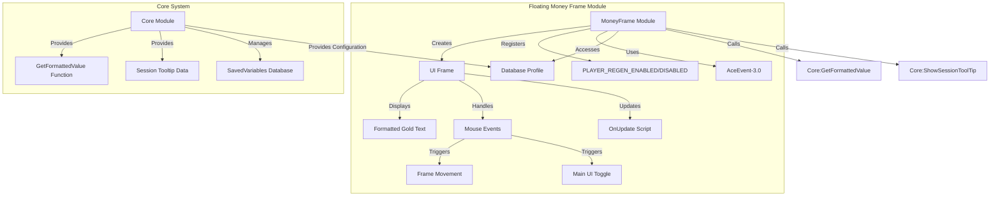
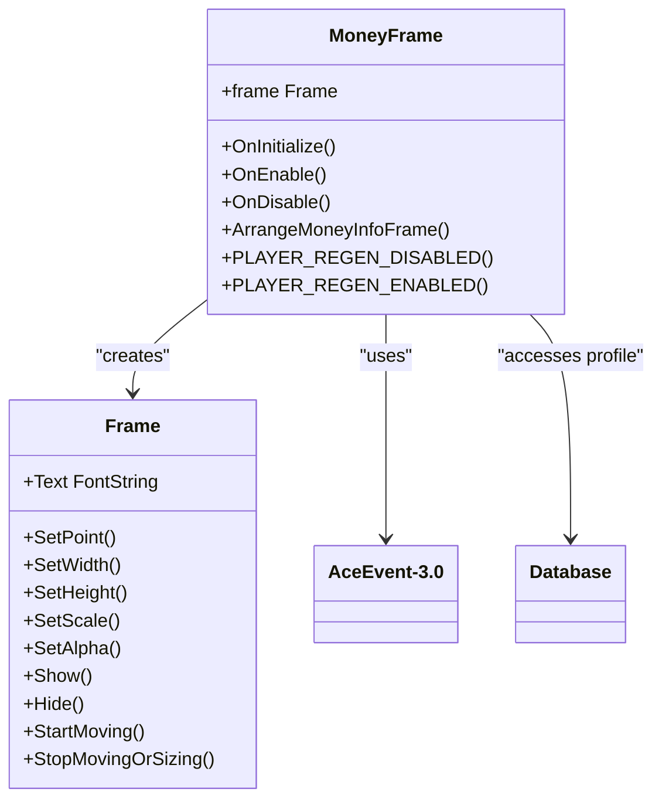

# Floating Money Frame

<cite>
**Referenced Files in This Document**   
- [MoneyFrame.lua](file://Core/MoneyFrame.lua)
- [Core.lua](file://Core/Core.lua)
</cite>

## Table of Contents
1. [Introduction](#introduction)
2. [Core Components](#core-components)
3. [Architecture Overview](#architecture-overview)
4. [Detailed Component Analysis](#detailed-component-analysis)
5. [Integration with Core Functionality](#integration-with-core-functionality)
6. [Configuration and User Settings](#configuration-and-user-settings)
7. [Performance Considerations](#performance-considerations)
8. [Troubleshooting Guide](#troubleshooting-guide)

## Introduction
The Floating Money Frame is a UI component within the Accountant_Classic addon that provides real-time visual feedback of the player's gold balance changes. Implemented as an Ace3 module in MoneyFrame.lua, this feature dynamically displays a movable, interactive frame near the chat area that updates in response to in-game currency events. The module leverages AceEvent-3.0 to monitor PLAYER_MONEY and combat state changes, ensuring accurate tracking while preventing interference during combat. This document details its implementation, integration, configuration, and operational behavior to provide a comprehensive understanding of its functionality within the broader addon ecosystem.

## Core Components

The Floating Money Frame is implemented as a standalone Ace3 module named "MoneyFrame" that extends AceEvent-3.0 for event-driven functionality. The core components include the frame creation logic, event handlers for combat lockdown, and UI interaction callbacks. The module maintains references to configuration profiles and manages its own lifecycle through OnInitialize, OnEnable, and OnDisable methods. It creates a persistent UI frame that displays formatted gold values and responds to mouse interactions for movement and activation of the main addon interface. The implementation is tightly integrated with the core addon's database for persistent storage of positioning and appearance settings.

**Section sources**
- [MoneyFrame.lua](file://Core/MoneyFrame.lua#L1-L168)

## Architecture Overview



**Diagram sources**
- [MoneyFrame.lua](file://Core/MoneyFrame.lua#L1-L168)
- [Core.lua](file://Core/Core.lua#L1-L2306)

## Detailed Component Analysis

### Money Frame Module Implementation

The MoneyFrame module is implemented as an Ace3 module that handles the creation, positioning, and behavior of a floating UI element that displays the player's current gold balance. The module uses AceEvent-3.0 to register for PLAYER_REGEN_ENABLED and PLAYER_REGEN_DISABLED events, which are used to determine combat state and prevent frame movement during combat.



**Diagram sources**
- [MoneyFrame.lua](file://Core/MoneyFrame.lua#L1-L168)

#### Frame Creation and Initialization
The `createMoneyFrame()` function is responsible for creating the actual UI frame that displays the gold information. This function creates a Frame object named "AccountantClassicMoneyInfoFrame" as a child of UIParent with specific dimensions (160x21 pixels). The frame is configured to be movable, clamped to screen, and responsive to mouse drag events. It contains a FontString child named "AccountantClassicMoneyInfoText" that displays the formatted gold value. The frame's position is restored from the database profile using the MnyFramePoint setting, defaulting to TOPLEFT with offset (10, -80) if not set.

**Section sources**
- [MoneyFrame.lua](file://Core/MoneyFrame.lua#L95-L134)

#### Event Handling and Combat Lockdown
The module implements combat lockdown functionality through the PLAYER_REGEN_DISABLED and PLAYER_REGEN_ENABLED event handlers. When the player enters combat, `PLAYER_REGEN_DISABLED()` sets the `isInLockdown` flag to true, preventing frame movement. When combat ends, `PLAYER_REGEN_ENABLED()` clears this flag, allowing movement. The frame's OnMouseDown script checks this flag before permitting movement, ensuring the UI cannot be accidentally repositioned during combat.

**Section sources**
- [MoneyFrame.lua](file://Core/MoneyFrame.lua#L70-L78)
- [MoneyFrame.lua](file://Core/MoneyFrame.lua#L155-L168)

#### Dynamic Gold Display
The frame's OnUpdate script handler (`frame_OnUpdate`) continuously monitors the player's gold balance through the GetMoney() API. When a change is detected, it updates the frame's text with the newly formatted value using the core addon's GetFormattedValue function. The frame automatically adjusts its width to fit the content, preventing text overflow. This dynamic updating ensures the displayed value remains current without requiring full frame recreation.

**Section sources**
- [MoneyFrame.lua](file://Core/MoneyFrame.lua#L20-L35)

#### User Interaction
The frame supports several user interactions through mouse event handlers:
- Left-click and drag to move the frame (disabled in combat)
- Right-click to toggle the main Accountant Classic interface
- Mouseover to display a tooltip with session statistics
- Mouseout to hide the tooltip

The tooltip displays current session income and expenses, providing quick access to financial data without opening the full interface. The interaction model prioritizes usability while preventing accidental actions during gameplay.

**Section sources**
- [MoneyFrame.lua](file://Core/MoneyFrame.lua#L37-L78)

## Integration with Core Functionality

### Data Formatting and Display
The Floating Money Frame integrates with the core addon through the GetFormattedValue function, which provides consistent gold formatting across the entire addon. This function converts raw copper values into the standard WoW gold/silver/copper format with appropriate icons. The integration ensures visual consistency between the floating frame and other UI elements within Accountant_Classic.

```lua
-- Code example: Integration with core formatting function
local function frame_OnUpdate(self)
    local frametxt = "|cFFFFFFFF"..addon:GetFormattedValue(GetMoney())
    if (frametxt ~= AC_MNYSTR) then
        self.Text:SetText(frametxt)
        AC_MNYSTR = frametxt
        local width = self.Text:GetStringWidth()
        self:SetWidth(width)
    end
end
```

**Section sources**
- [MoneyFrame.lua](file://Core/MoneyFrame.lua#L20-L35)
- [Core.lua](file://Core/Core.lua#L1600-L1630)

### Tooltip Data Integration
The frame's tooltip functionality integrates with the core addon's session tracking through the ShowSessionToolTip function. When the user hovers over the frame, this function is called to retrieve formatted session statistics including total income, expenses, and net profit/loss. This integration provides immediate access to detailed financial information without requiring navigation to the main interface.

**Section sources**
- [MoneyFrame.lua](file://Core/MoneyFrame.lua#L40-L75)
- [Core.lua](file://Core/Core.lua#L2200-L2230)

### Configuration Management
The Floating Money Frame module accesses configuration settings through the core addon's database profile. Key settings include:
- `showmoneyinfo`: Controls visibility of the frame
- `infoscale`: Sets the frame's scale factor
- `infoalpha`: Sets the frame's transparency
- `MnyFramePoint`: Stores the frame's position and anchoring

These settings are managed through the ArrangeMoneyInfoFrame method, which applies the current profile values to the frame's appearance and position.

```lua
-- Code example: Configuration application
function MoneyFrame:ArrangeMoneyInfoFrame()
    self.frame:SetScale(profile.infoscale or 1)
    self.frame:SetAlpha(profile.infoalpha or 1)
    local point, relativeTo, relativePoint, ofsx, ofsy = unpack(profile.MnyFramePoint)
    self.frame:ClearAllPoints()
    self.frame:SetParent(UIParent)
    self.frame:SetPoint(point or "TOPLEFT", nil, relativePoint or "TOPLEFT", ofsx or 10, ofsy or -80)
end
```

**Section sources**
- [MoneyFrame.lua](file://Core/MoneyFrame.lua#L136-L153)
- [Core.lua](file://Core/Core.lua#L1-L2306)

## Configuration and User Settings

The Floating Money Frame provides several user-configurable options that control its visibility, appearance, and behavior. These settings are accessible through the main addon configuration interface and stored in the SavedVariables database. The primary configuration options include:

**showmoneyinfo**: Boolean flag that determines whether the floating money frame is visible. When enabled, the frame appears near the chat area; when disabled, it is completely hidden.

**infoscale**: Numeric value that controls the scale of the frame, allowing users to resize it according to their UI preferences. The default value is 1.0 (100% scale).

**infoalpha**: Numeric value between 0 and 1 that controls the transparency of the frame. A value of 1 is fully opaque, while 0 is completely transparent.

**MnyFramePoint**: Table containing the frame's anchoring information, including point, relativeTo, relativePoint, and offset coordinates. This setting is automatically updated when the user moves the frame.

The module also respects the global combat lockdown state, automatically disabling movement functionality when the player is in combat to prevent accidental repositioning during gameplay.

**Section sources**
- [MoneyFrame.lua](file://Core/MoneyFrame.lua#L1-L168)
- [Core.lua](file://Core/Core.lua#L1-L2306)

## Performance Considerations

The Floating Money Frame implementation includes several performance optimizations to minimize impact on game performance:

**Event Registration**: The module only registers for two essential events (PLAYER_REGEN_ENABLED and PLAYER_REGEN_DISABLED) rather than listening to all money-related events. This reduces the event processing overhead while still providing the necessary combat state information.

**Update Throttling**: The OnUpdate handler includes a change detection mechanism that only updates the frame's text when the gold value has actually changed. This prevents unnecessary string operations and UI updates when the balance remains static.

**Memory Management**: The module uses a simple string comparison (AC_MNYSTR) to detect changes in the formatted gold value, avoiding more expensive numerical comparisons or complex change detection algorithms.

**Frame Reuse**: The implementation creates the frame only once during initialization rather than recreating it on each update. This approach reduces memory allocation and garbage collection overhead.

**Conditional Rendering**: The frame's visibility is controlled by the showmoneyinfo profile setting, allowing users to completely disable the feature and eliminate its performance impact when not needed.

These optimizations ensure that the Floating Money Frame provides real-time feedback with minimal impact on overall game performance, even during intense gameplay scenarios.

**Section sources**
- [MoneyFrame.lua](file://Core/MoneyFrame.lua#L20-L35)
- [MoneyFrame.lua](file://Core/MoneyFrame.lua#L140-L153)

## Troubleshooting Guide

### Frame Not Displaying
If the Floating Money Frame does not appear, check the following:
1. Verify that the "Show Money Info" option is enabled in the addon settings
2. Ensure the frame is not positioned off-screen (try resetting position in settings)
3. Check that the addon is properly loaded (no Lua errors during startup)
4. Confirm that the database profile is not corrupted

The frame visibility is controlled by the `showmoneyinfo` profile setting, which must be true for the frame to appear.

### Frame Not Updating
If the gold value is not updating correctly:
1. Verify that the OnUpdate script is properly set on the frame
2. Check that the AC_MNYSTR variable is being updated correctly
3. Ensure the GetFormattedValue function is accessible from the core module
4. Confirm that GetMoney() is returning valid values

The update mechanism relies on detecting changes in the formatted string rather than raw gold values.

### Positioning Issues
If the frame appears in the wrong location:
1. Check the MnyFramePoint profile setting for valid anchoring data
2. Verify that the frame's SetPoint parameters are being applied correctly
3. Ensure the frame is properly anchored to UIParent
4. Test with default position values (TOPLEFT, 10, -80)

The position is restored from the database profile during frame creation.

### Combat Movement Issues
If the frame can be moved during combat:
1. Verify that PLAYER_REGEN_DISABLED and PLAYER_REGEN_ENABLED events are properly registered
2. Check that the isInLockdown flag is being set correctly
3. Ensure the OnMouseDown handler is checking the lockdown state
4. Confirm that event registration is occurring in OnEnable

The combat lockdown feature prevents frame movement during combat to avoid accidental repositioning.

**Section sources**
- [MoneyFrame.lua](file://Core/MoneyFrame.lua#L1-L168)
- [Core.lua](file://Core/Core.lua#L1-L2306)