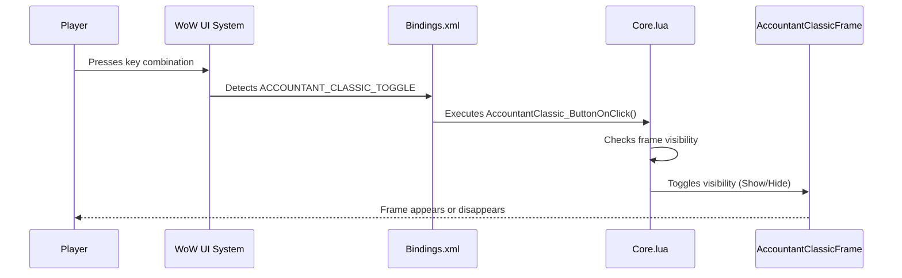

# Key Bindings

<cite>
**Referenced Files in This Document**   
- [Bindings.xml](file://Bindings.xml)
- [Core.lua](file://Core/Core.lua)
- [Core.xml](file://Core/Core.xml)
</cite>

## Table of Contents
1. [Key Bindings Overview](#key-bindings-overview)
2. [Bindings.xml Structure](#bindingsxml-structure)
3. [Lua Function Integration](#lua-function-integration)
4. [User Configuration Process](#user-configuration-process)
5. [Best Practices and Conflict Avoidance](#best-practices-and-conflict-avoidance)
6. [Troubleshooting Unresponsive Keybinds](#troubleshooting-unresponsive-keybinds)

## Key Bindings Overview

The Accountant Classic addon implements a key binding system that allows players to quickly access the main interface through customizable keyboard shortcuts. This functionality is integrated with World of Warcraft's UI system using a combination of XML-defined bindings and Lua command handlers. The key binding system provides a seamless way to toggle the visibility of the Accountant Classic frame, giving players instant access to their financial tracking data during gameplay.

The primary purpose of the key binding system is to enhance user accessibility by providing a quick toggle mechanism for the addon's main window. This allows players to check their financial statistics without navigating through menus or using chat commands. The binding system follows World of Warcraft's standard addon key binding conventions, making it familiar to experienced players while remaining accessible to newcomers.

**Section sources**
- [Bindings.xml](file://Bindings.xml#L0-L7)
- [Core.lua](file://Core/Core.lua#L2250-L2255)

## Bindings.xml Structure

The Bindings.xml file defines the custom input commands that can be assigned to keyboard shortcuts within the World of Warcraft interface. This XML file contains the binding definitions that link human-readable command names to their corresponding Lua function calls.

```xml
<Bindings>
	<Binding name="ACCOUNTANT_CLASSIC_TOGGLE" header="ACCOUNTANT_CLASSIC_TITLE" category="ADDONS">
		AccountantClassic_ButtonOnClick();
	</Binding>
</Bindings>
```

The structure of the Bindings.xml file follows World of Warcraft's standard binding format. Each `<Binding>` element contains several important attributes:

- **name**: The unique identifier for the binding command (ACCOUNTANT_CLASSIC_TOGGLE)
- **header**: The display name shown in the key bindings interface (ACCOUNTANT_CLASSIC_TITLE)
- **category**: The category under which the binding appears in the key bindings menu (ADDONS)

The content of the `<Binding>` tag contains the Lua code that executes when the bound key combination is pressed. In this case, the binding calls the `AccountantClassic_ButtonOnClick()` function, which handles the toggle logic for the main frame.

When World of Warcraft loads the addon, it parses this XML file and registers the defined bindings with the game's input system. The bindings become available in the in-game "Key Bindings" interface under the AddOns tab, where players can assign their preferred key combinations to the ACCOUNTANT_CLASSIC_TOGGLE command.

**Section sources**
- [Bindings.xml](file://Bindings.xml#L0-L7)

## Lua Function Integration

The key binding system connects XML-defined commands to Lua function handlers that implement the actual functionality. The relationship between the XML binding and its Lua handler is direct and explicit, with the binding's code execution calling the corresponding Lua function.

The `AccountantClassic_ButtonOnClick()` function, defined in Core.lua, serves as the command handler for the ACCOUNTANT_CLASSIC_TOGGLE binding:

```lua
function AccountantClassic_ButtonOnClick()
	if AccountantClassicFrame:IsVisible() then
		AccountantClassicFrame:Hide();
	else
		AccountantClassicFrame:Show();
	end
end
```

This function implements a simple toggle mechanism that checks the current visibility state of the AccountantClassicFrame and either hides or shows it accordingly. When a player presses their assigned key combination, the game executes the binding's code, which calls this function and triggers the frame visibility toggle.

The integration between the XML binding and Lua function works as follows:
1. Player presses their assigned key combination for ACCOUNTANT_CLASSIC_TOGGLE
2. World of Warcraft's UI system executes the binding's code: `AccountantClassic_ButtonOnClick();`
3. The Lua interpreter calls the `AccountantClassic_ButtonOnClick()` function
4. The function evaluates the current state of AccountantClassicFrame
5. The frame is either hidden or shown based on its current visibility

This integration pattern follows World of Warcraft addon development best practices, keeping the input handling (XML) separate from the business logic (Lua) while maintaining a clear and direct connection between them.



**Diagram sources**
- [Bindings.xml](file://Bindings.xml#L0-L7)
- [Core.lua](file://Core/Core.lua#L2250-L2255)

**Section sources**
- [Bindings.xml](file://Bindings.xml#L0-L7)
- [Core.lua](file://Core/Core.lua#L2250-L2255)

## User Configuration Process

Players can configure the key bindings for Accountant Classic through the standard World of Warcraft interface options. The configuration process is integrated into the game's existing key binding system, providing a familiar and consistent experience.

To configure the key binding:
1. Open the World of Warcraft Escape menu
2. Select "Key Bindings" from the options
3. Navigate to the "AddOns" tab
4. Find the "Accountant Classic" section
5. Locate the "Toggle Accountant Classic" command (labeled by ACCOUNTANT_CLASSIC_TITLE)
6. Click on the input field and press the desired key combination
7. The new binding is automatically saved

The binding appears in the AddOns category because the Bindings.xml file specifies `category="ADDONS"`. This categorization ensures that Accountant Classic's bindings are grouped with other addon-specific commands, making them easy to locate and manage.

Once configured, the key binding remains active until changed or removed by the player. The binding persists across gaming sessions and does not need to be reconfigured after logging out or restarting the game. Multiple key combinations can be assigned to the same command, providing flexibility for players with different keyboard layouts or play styles.

The user configuration process leverages World of Warcraft's built-in key binding validation, which prevents conflicts with default game controls when possible and alerts players to potential conflicts with other addons.

**Section sources**
- [Bindings.xml](file://Bindings.xml#L0-L7)

## Best Practices and Conflict Avoidance

When configuring key bindings for Accountant Classic, players should follow several best practices to ensure optimal gameplay experience and avoid conflicts with other game functions.

**Recommended Practices:**
- Choose key combinations that are easily accessible during gameplay, such as Ctrl+Shift+A or Alt+Z
- Avoid single-letter bindings that might interfere with chat input
- Consider using modifier keys (Ctrl, Alt, Shift) in combination with other keys
- Select keys that are not commonly used for essential gameplay functions
- Test the binding in various gameplay situations to ensure it doesn't interfere with character controls

**Conflict Avoidance Guidelines:**
- Avoid bindings that conflict with default World of Warcraft interface controls
- Be mindful of potential conflicts with other installed addons
- Steer clear of keys used for spell casting or ability activation
- Avoid bindings that require complex finger movements that could slow reaction time
- Consider using less frequently accessed keys on the keyboard

The addon itself follows development best practices by:
- Using a descriptive and unique binding name (ACCOUNTANT_CLASSIC_TOGGLE)
- Properly categorizing the binding under ADDONS
- Implementing a single, focused function for the binding action
- Following World of Warcraft's standard binding conventions

Players who experience conflicts with other addons can temporarily disable Accountant Classic's binding or choose alternative key combinations. The modular nature of World of Warcraft's binding system allows players to customize their controls without affecting the core functionality of any addon.

**Section sources**
- [Bindings.xml](file://Bindings.xml#L0-L7)
- [Core.lua](file://Core/Core.lua#L2250-L2255)

## Troubleshooting Unresponsive Keybinds

When key bindings for Accountant Classic fail to work as expected, players can follow several troubleshooting steps to resolve the issue.

**Common Issues and Solutions:**

1. **Binding Not Responding**
   - **Solution**: Reload the UI by typing `/reload` in chat
   - This refreshes all addon scripts and often resolves binding issues

2. **Binding Conflicts**
   - **Solution**: Check for conflicts with other addons or game functions
   - Navigate to Key Bindings interface and verify the binding is correctly assigned
   - Try a different key combination if conflicts are detected

3. **Binding Not Appearing in Interface**
   - **Solution**: Verify the Bindings.xml file is properly loaded
   - Check that the file is in the correct directory and not corrupted
   - Reinstall the addon if necessary

4. **Frame Not Toggling**
   - **Solution**: Test the functionality through alternative methods
   - Use the chat command `/accountant` to verify the addon is working
   - Check if the minimap button functionality works correctly

**Advanced Troubleshooting Steps:**

1. **Verify Binding Registration**
   - Ensure the Bindings.xml file is being read by the game
   - Check for any error messages during login that might indicate XML parsing issues

2. **Check Lua Function Availability**
   - Confirm that `AccountantClassic_ButtonOnClick()` function exists in memory
   - This can be tested by typing the function name in chat (if not protected)

3. **Conflict Detection**
   - Disable other addons temporarily to identify potential conflicts
   - Use the process of elimination to determine if another addon is intercepting the key combination

4. **UI Reset**
   - As a last resort, reset the entire UI configuration
   - This can resolve deep-seated binding issues but will reset all custom key bindings

Most binding issues can be resolved with a simple UI reload. Persistent problems may indicate file corruption or conflicts with other addons, which can typically be addressed through reinstallation or configuration adjustments.

**Section sources**
- [Bindings.xml](file://Bindings.xml#L0-L7)
- [Core.lua](file://Core/Core.lua#L2250-L2255)