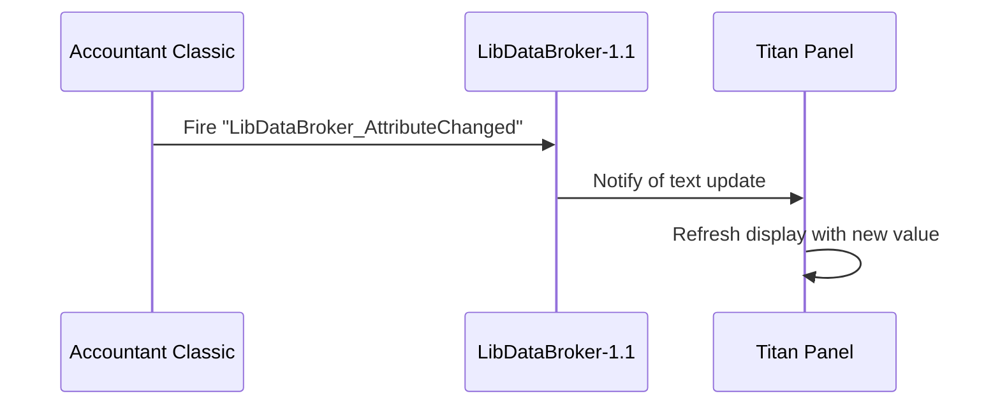
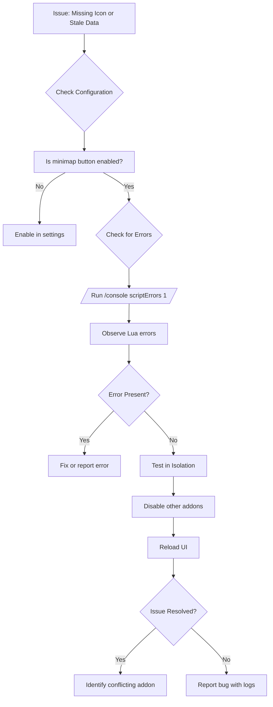

# LibDataBroker Integration

<cite>
**Referenced Files in This Document**   
- [Core.lua](file://Core\Core.lua)
- [LibDataBroker-1.1.lua](file://Libs\LibDataBroker-1.1\LibDataBroker-1.1.lua)
- [LibDBIcon-1.0.lua](file://Libs\LibDBIcon-1.0\LibDBIcon-1.0.lua)
</cite>

## Table of Contents
1. [Introduction](#introduction)
2. [LDB Data Object Registration](#ldb-data-object-registration)
3. [Data Structure and Metrics](#data-structure-and-metrics)
4. [LDB Consumer Integration](#ldb-consumer-integration)
5. [Minimap Button with LibDBIcon-1.0](#minimap-button-with-libdbicon-10)
6. [Configuration Options](#configuration-options)
7. [Common Integration Issues and Debugging](#common-integration-issues-and-debugging)
8. [Conclusion](#conclusion)

## Introduction
Accountant Classic is a World of Warcraft addon designed to track financial transactions, including income and expenditures, across various gameplay activities. A key feature of this addon is its integration with LibDataBroker (LDB), which enables real-time exposure of financial data to third-party display systems such as Titan Panel or ChocolateBar. This document details how Accountant Classic registers an LDB data object, structures its financial metrics, manages the minimap button via LibDBIcon-1.0, and handles configuration and troubleshooting.

**Section sources**
- [Core.lua](file://Core\Core.lua)

## LDB Data Object Registration
Accountant Classic registers a LibDataBroker data object during initialization to expose financial metrics to external consumers. This registration occurs in the `OnInitialize` method of the addon, where `LibStub("LibDataBroker-1.1")` is used to create a new data object named after the addon.

```lua
local LDB = LibStub("LibDataBroker-1.1"):NewDataObject(private.addon_name);
```

The `private.addon_name` serves as the unique identifier for the data object, ensuring compatibility with LDB-compliant display addons. The data object is stored in the global `LDB` variable and later configured with metadata such as type, label, icon, and interaction callbacks.

This registration allows third-party addons to discover and subscribe to Accountant Classic's data feed, enabling dynamic updates based on in-game financial changes.

**Section sources**
- [Core.lua](file://Core\Core.lua#L79-L80)

## Data Structure and Metrics
The LDB data object returns a structured set of financial metrics that reflect real-time economic activity. These metrics include:
- **Current Session Earnings**: Net profit or loss since login.
- **Daily Totals**: Income and expenses for the current day.
- **Character Net Worth**: Total gold held by the character.

The core data structure is maintained in the `AC_DATA` table, which categorizes transactions by type (e.g., "LOOT", "MERCH", "REPAIRS") and time period (e.g., "Day", "Week", "Month"). Each entry contains `In` and `Out` fields representing incoming and outgoing gold.

The `ShowNetMoney` function computes and formats the display text for the LDB feed based on the user's selected display type (`ldbDisplayType`). For example, when configured to show session net income, it calculates the difference between total incoming and outgoing gold during the current session.

```lua
function addon:ShowNetMoney(logmode)
    local TotalIn = 0;
    local TotalOut = 0;
    for key,value in pairs(AC_DATA) do
        TotalIn = TotalIn + AC_DATA[key][logmode].In;
        TotalOut = TotalOut + AC_DATA[key][logmode].Out;
    end
    -- ... formatting logic
end
```

This function ensures that the LDB text is always up-to-date and reflects the most relevant financial metric.

**Section sources**
- [Core.lua](file://Core\Core.lua#L79-L80)
- [Core.lua](file://Core\Core.lua#L1025-L1060)

## LDB Consumer Integration
Third-party addons like Titan Panel or ChocolateBar consume the LDB data object by querying its attributes and responding to change events. The LDB specification allows consumers to access properties such as `text`, `label`, and `icon`, which are updated dynamically by Accountant Classic.

When financial data changes (e.g., after a transaction), the addon triggers an update by re-evaluating the `ShowNetMoney` function and assigning the result to `LDB.text`. This value is then displayed by the consumer interface.

Consumers can also respond to attribute change events via CallbackHandler-1.0, which LibDataBroker uses internally to notify subscribers when data changes. This ensures real-time synchronization between Accountant Classic and display addons.



**Diagram sources**
- [LibDataBroker-1.1.lua](file://Libs\LibDataBroker-1.1\LibDataBroker-1.1.lua#L30-L35)
- [Core.lua](file://Core\Core.lua#L1025-L1060)

**Section sources**
- [Core.lua](file://Core\Core.lua#L1025-L1060)
- [LibDataBroker-1.1.lua](file://Libs\LibDataBroker-1.1\LibDataBroker-1.1.lua#L30-L35)

## Minimap Button with LibDBIcon-1.0
Accountant Classic uses LibDBIcon-1.0 to create and manage a minimap button that provides quick access to its interface. The button is registered using the `Register` method, which takes the addon name, LDB object, and profile database as parameters.

```lua
ACbutton:Register(private.addon_name, LDB, profile.minimap);
```

The minimap button supports the following interactions:
- **Left-click**: Opens the Accountant Classic frame.
- **Right-click**: Opens the configuration options.
- **Drag**: Moves the button around the minimap (if unlocked).

Tooltip display is handled through the `OnTooltipShow` callback, which populates the tooltip with the current gold amount and session summary when enabled in settings.

```lua
LDB.OnTooltipShow = (function(tooltip)
    tooltip:AddLine("|cffffffff"..L["Accountant Classic"].." - "..addon:GetFormattedValue(GetMoney()));
    if (profile.showsessiononbutton == true) then
        tooltip:AddLine(addon:ShowSessionToolTip());
    end
    if (profile.showintrotip == true) then
        tooltip:AddLine(L["Left-Click to open Accountant Classic.\nRight-Click for Accountant Classic options.\nLeft-click and drag to move this button."]);
    end
end);
```

The visibility of the button is controlled by the `minimap.hide` profile setting, which can be toggled via the `/accountantbutton` slash command.

**Section sources**
- [Core.lua](file://Core\Core.lua#L220-L230)
- [Core.lua](file://Core\Core.lua#L1025-L1060)

## Configuration Options
Accountant Classic provides several configuration options related to LDB and minimap integration:

- **Show minimap button**: Toggles visibility of the minimap icon.
- **Show money on minimap button's tooltip**: Displays current gold in the tooltip.
- **Show session info on minimap button's tooltip**: Shows session net income/loss.
- **LDB Display Type**: Determines what financial metric is shown in LDB displays (e.g., total money, session net).

These settings are stored in the addon's AceDB profile and can be modified through the options interface. Changes are applied immediately using the `Refresh` method, which updates both the LDB text and minimap button state.

```lua
function addon:Refresh()
    profile = self.db.profile
    LDB.text = addon:ShowNetMoney(private.constants.ldbDisplayTypes[profile.ldbDisplayType]) or ""
    -- ... other UI updates
end
```

**Section sources**
- [Core.lua](file://Core\Core.lua#L1025-L1060)
- [Core.lua](file://Core\Core.lua#L1025-L1060)

## Common Integration Issues and Debugging
### Missing Minimap Icon
If the minimap button does not appear:
- Ensure `profile.minimap.hide` is set to `false`.
- Verify that LibDBIcon-1.0 is properly embedded and loaded.
- Check for conflicts with other addons using minimap icons.

### Stale or Incorrect LDB Data
If the LDB display shows outdated or incorrect values:
- Confirm that `LDB.text` is being updated in `OnEnable` and after transactions.
- Use `/console scriptErrors 1` to detect Lua errors that may prevent updates.
- Test in isolation by disabling other LDB consumers.

### Debugging Strategies
- Enable verbose mode with `/accountant verbose` to log financial events.
- Use `/reload` to reset the addon state.
- Isolate conflicts by disabling other addons one by one.



**Diagram sources**
- [Core.lua](file://Core\Core.lua#L1025-L1060)

**Section sources**
- [Core.lua](file://Core\Core.lua#L1025-L1060)

## Conclusion
Accountant Classic's integration with LibDataBroker provides a robust mechanism for exposing financial data to third-party display systems. By registering a data object, structuring metrics effectively, and leveraging LibDBIcon-1.0 for minimap interaction, the addon ensures seamless interoperability with popular UI enhancements. Proper configuration and debugging practices help maintain reliability and user satisfaction.