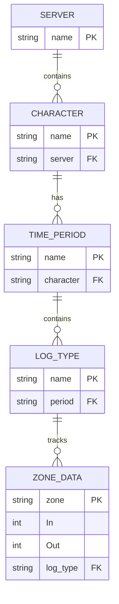
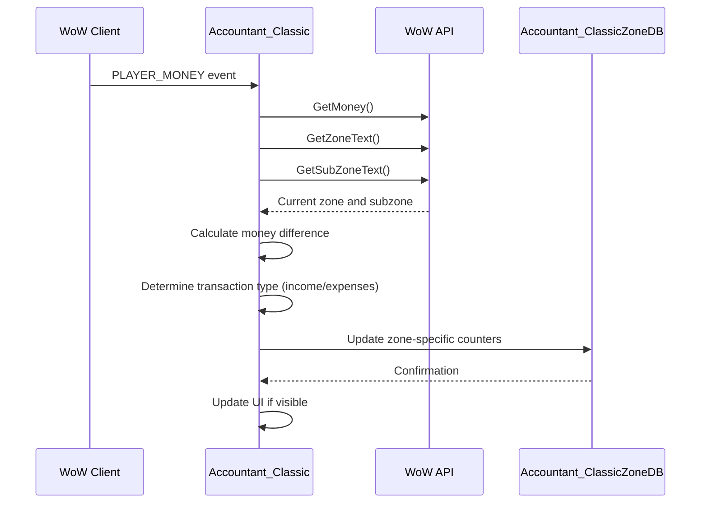

# Zone-Level Breakdown

<cite>
**Referenced Files in This Document**   
- [Core.lua](file://Core/Core.lua)
- [Config.lua](file://Core/Config.lua)
</cite>

## Table of Contents
1. [Introduction](#introduction)
2. [Zone Tracking Initialization](#zone-tracking-initialization)
3. [Data Structure: Accountant_ClassicZoneDB](#data-structure-accountant_classiczonedb)
4. [Transaction Event Processing](#transaction-event-processing)
5. [User Interface for Zone Reports](#user-interface-for-zone-reports)
6. [Use Cases and Applications](#use-cases-and-applications)
7. [Data Accuracy and Edge Cases](#data-accuracy-and-edge-cases)
8. [Performance Considerations](#performance-considerations)

## Introduction
The Zone-Level Breakdown feature in Accountant_Classic provides players with detailed financial tracking capabilities based on geographical location within the game world of Azeroth. This functionality enables users to analyze income and expenses by specific zones, offering insights into economic patterns across different regions. The system leverages World of Warcraft's API to capture the player's current location and associates each financial transaction with its corresponding zone. By integrating zone-specific data into the addon's financial tracking framework, players can identify profitable farming locations, understand regional spending habits, and optimize their in-game economic strategies. This document details the implementation of this feature, covering initialization, data structures, event handling, user interface components, practical applications, accuracy considerations, and performance optimization techniques.

## Zone Tracking Initialization
The zone-level financial tracking system initializes through a structured process that ensures proper database setup and configuration validation. The initialization begins with the `AccountantClassic_InitZoneDB` function, which is responsible for creating and preparing the `Accountant_ClassicZoneDB` global table. This function first checks for the existence of the main database table and creates it if necessary. It then verifies the presence of server-specific and character-specific entries, establishing a hierarchical structure that organizes financial data by realm and player character. During initialization, the function sets the `AC_FIRSTLOADED` flag to true when creating a new character entry, indicating that this is the first session for the character. The database structure is organized to support multiple time periods (Session, Day, Week, Month, Year) and transaction types (logmodes), with each combination containing entries for both income and expenditure tracking. The initialization process also respects user preferences stored in the addon's profile settings, particularly the `trackzone` and `tracksubzone` configuration options that determine whether zone tracking is enabled and whether subzone information should be included in the tracking data.

**Section sources**
- [Core.lua](file://Core/Core.lua#L239-L265)
- [Core.lua](file://Core/Core.lua#L262-L304)

## Data Structure: Accountant_ClassicZoneDB
The Accountant_ClassicZoneDB data structure is designed as a hierarchical database that organizes financial transactions by geographical location and time period. At its root level, the database is structured by server name, with each server containing entries for individual characters. For each character, the database maintains a "data" table that contains separate entries for different time periods including Session, Day, Week, Month, and Year. Each time period entry contains a collection of log types (such as LOOT, REPAIRS, QUEST, etc.) that categorize financial transactions. Under each log type, the database stores zone-specific financial data using the zone name as a key. Each zone entry contains two values: "In" for income and "Out" for expenditures, both stored as numerical values representing copper pieces. When subzone tracking is enabled through the `tracksubzone` configuration option, the zone name is formatted as "Zone - Subzone" (e.g., "Elwynn Forest - Goldshire") to provide more granular location data. The data structure is initialized with empty tables for all possible combinations of time periods and log types, ensuring that the database is ready to receive transaction data immediately upon initialization. This hierarchical organization allows for efficient data retrieval and aggregation when generating zone-based financial reports.

**Diagram sources**
- [Core.lua](file://Core/Core.lua#L239-L265)
- [Core.lua](file://Core/Core.lua#L1122-L1148)

## Transaction Event Processing
Transaction event processing in the zone-level financial tracking system is triggered by various in-game events that affect the player's monetary status. The primary function responsible for processing these events is `updateLog`, which is called in response to the PLAYER_MONEY event and other financial transactions. When a money change occurs, the system first determines the current zone using the `GetZoneText()` and `GetSubZoneText()` API functions. If the `tracksubzone` configuration option is enabled and a subzone is available, the zone name is formatted as "Zone - Subzone" to provide more specific location data. The system then calculates the difference between the current and previous money amounts to determine the transaction amount. Based on whether this difference is positive or negative, the system updates either the income or expenditure counter for the current zone. The update process involves checking if a database entry exists for the specific combination of time period, log type, and zone, creating it if necessary, and then incrementing the appropriate counter (In for income, Out for expenditure) by the transaction amount. This process occurs for all active time periods except for the "Prv" (previous) periods, which are preserved for historical reporting. The transaction processing system also handles special cases, such as resetting the session database when loading character data and managing the transition between different time periods (daily, weekly, monthly rollovers).

**Diagram sources**
- [Core.lua](file://Core/Core.lua#L1106-L1109)
- [Core.lua](file://Core/Core.lua#L1122-L1148)
- [Core.lua](file://Core/Core.lua#L1042-L1078)

## User Interface for Zone Reports
The user interface for viewing zone-based financial reports is integrated into the main Accountant_Classic frame through tooltip-based data presentation. When zone tracking is enabled, hovering over any financial category in the addon's interface displays a tooltip showing the breakdown of transactions by geographical location. The tooltip generation is handled by the `AccountantClassic_LogTypeOnShow` function, which is triggered when the mouse hovers over a financial category entry. This function retrieves the relevant zone data from the Accountant_ClassicZoneDB based on the current time period selection, character selection, and transaction type. For the current session, the function displays all zone data without filtering. For other time periods, it respects the character selection made through the dropdown menus, showing data only for the selected character. The tooltip presents each zone name followed by the corresponding financial amount, formatted with gold, silver, and copper denominations. To prevent excessively long tooltips, the system limits the number of displayed entries to 50, adding an ellipsis if more zones exist. The interface also supports sorting of characters by name, money amount, or last updated date, allowing users to organize their multi-character financial data according to their preferences. Configuration options for zone tracking are accessible through the addon's settings menu, where users can enable or disable zone tracking and choose whether to include subzone information.

**Section sources**
- [Core.lua](file://Core/Core.lua#L2050-L2135)
- [Config.lua](file://Core/Config.lua#L187-L222)

## Use Cases and Applications
The zone-level financial tracking feature enables several practical applications that enhance the player's ability to manage in-game finances effectively. One primary use case is identifying profitable farming zones, where players can compare income generated from looting and quest rewards across different regions to determine the most economically efficient locations for resource gathering. Players can analyze repair cost patterns by region, identifying zones where repair expenses are consistently higher, potentially indicating more difficult content or higher monster density. The system also supports analyzing vendor pricing strategies across different towns and cities, helping players identify optimal locations for buying and selling goods. Another application is tracking quest reward efficiency by zone, allowing players to evaluate which quest hubs provide the best gold-per-time investment. The feature also enables players to monitor their spending habits in different social hubs, such as auction houses or capital cities, compared to remote or wilderness areas. For players engaged in profession-based income generation, the system can help identify optimal crafting and selling locations by tracking both material acquisition costs and final sale profits by zone. These insights allow players to develop more sophisticated economic strategies, optimizing their gameplay for maximum financial return.

## Data Accuracy and Edge Cases
The zone-level financial tracking system addresses several data accuracy considerations and edge cases to ensure reliable reporting. One significant edge case occurs when players travel between zones during a financial transaction, such as mailing gold while moving from one region to another. The system captures the zone at the moment the transaction event is processed, which may not always reflect the exact location where the transaction was initiated. Another edge case involves dungeon and raid zoning, where the system specifically checks for instance membership using `IsInInstance()` to determine whether to track zone or subzone information, recognizing that subzone tracking may be less meaningful in instanced content. The system handles the transition between time periods (daily, weekly, monthly) by preserving previous period data while resetting current period counters, ensuring historical accuracy while maintaining current tracking. When players switch characters or servers, the system properly manages the zone database context to prevent data contamination between different characters. The initialization process includes a priming mechanism that sets the baseline money amount at the start of a session to prevent counting the character's existing gold as income. The system also accounts for transactions that may occur without explicit zone changes, such as receiving mail or guild bank withdrawals, by associating these transactions with the player's current zone at the time of processing.

**Section sources**
- [Core.lua](file://Core/Core.lua#L1106-L1109)
- [Core.lua](file://Core/Core.lua#L849-L882)

## Performance Considerations
Managing the zone-level financial database efficiently is crucial for maintaining addon performance, especially for players with multiple characters across different servers. The system employs several optimization strategies to handle large datasets effectively. The hierarchical structure of Accountant_ClassicZoneDB minimizes data redundancy by organizing information in a logical tree format, reducing memory overhead. The system limits tooltip output to 50 entries per category to prevent excessive UI rendering that could impact game performance. Database initialization is optimized to create only necessary structures, avoiding the allocation of memory for unused time periods or log types. The addon processes time period rollovers (daily, weekly, monthly) during startup and frame updates rather than continuously monitoring system time, reducing CPU usage. For players with extensive character collections, the system provides configuration options to limit data display to specific servers or factions, reducing the amount of data processed for UI updates. The database structure is designed to support efficient data retrieval through direct key access rather than iterative searching, ensuring quick access to zone-specific financial information. Additionally, the system includes a character data removal feature that allows players to clean up old or unused character entries, helping to maintain optimal database size and performance over extended periods of use.

**Section sources**
- [Core.lua](file://Core/Core.lua#L2076-L2105)
- [Config.lua](file://Core/Config.lua#L221-L264)