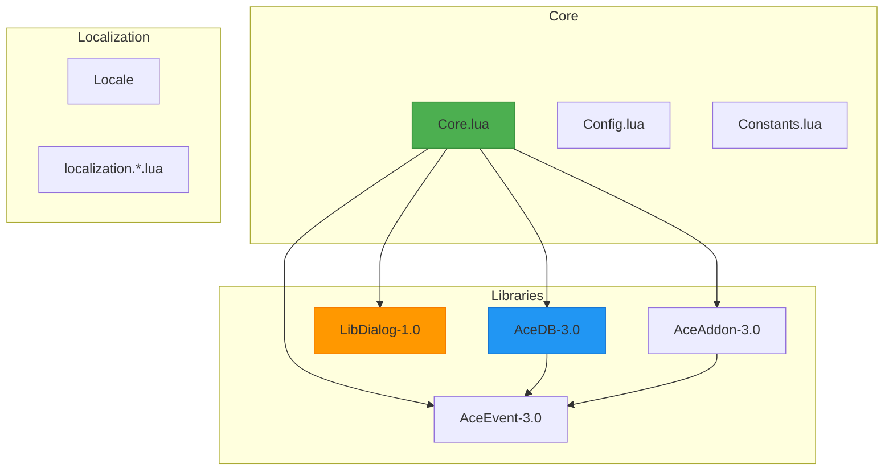
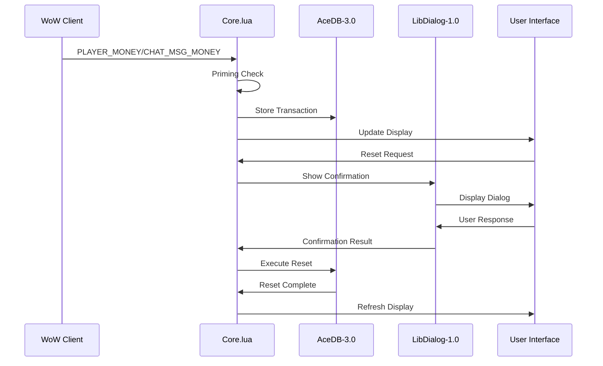
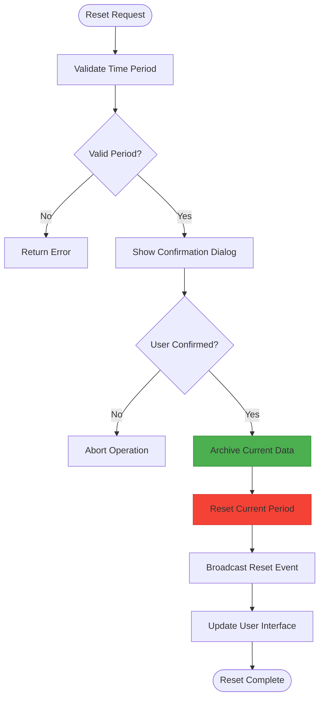
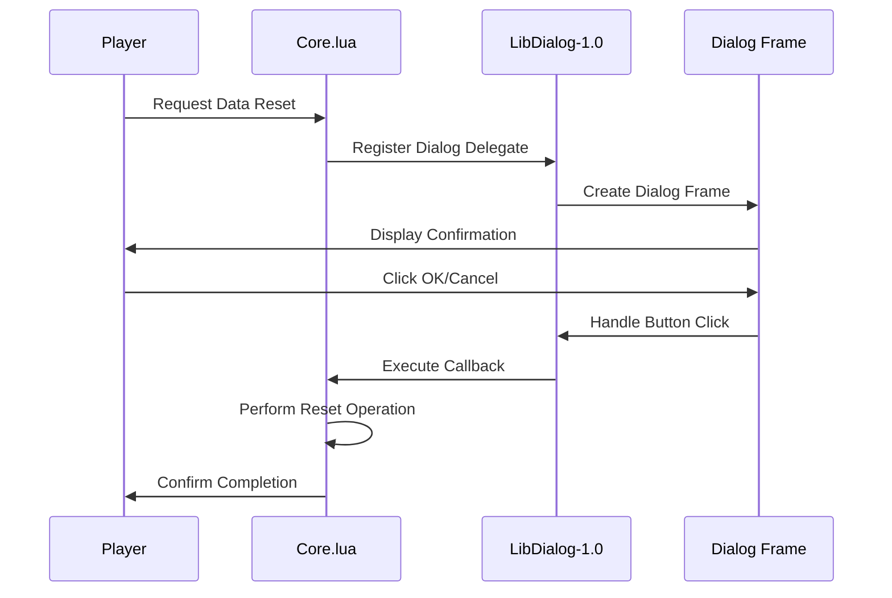
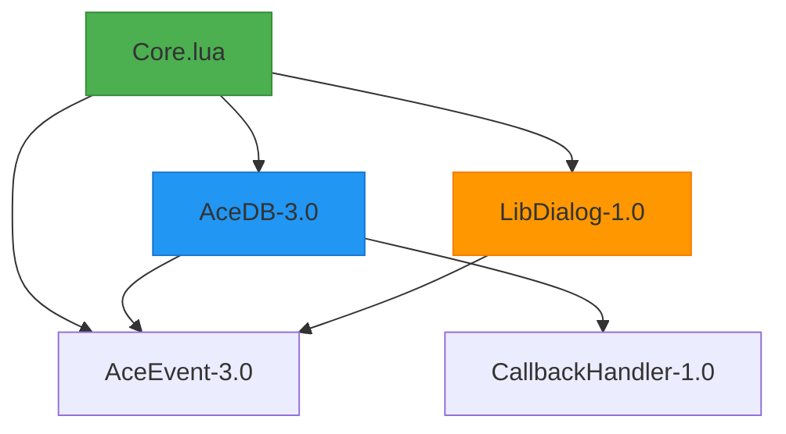

# Character Data Management

<cite>
**Referenced Files in This Document**   
- [Core.lua](file://Core/Core.lua)
- [AceDB-3.0.lua](file://Libs/AceDB-3.0/AceDB-3.0.lua)
- [LibDialog-1.0.lua](file://Libs/LibDialog-1.0/LibDialog-1.0.lua)
</cite>

## Table of Contents
1. [Introduction](#introduction)
2. [Project Structure](#project-structure)
3. [Core Components](#core-components)
4. [Architecture Overview](#architecture-overview)
5. [Detailed Component Analysis](#detailed-component-analysis)
6. [Dependency Analysis](#dependency-analysis)
7. [Performance Considerations](#performance-considerations)
8. [Troubleshooting Guide](#troubleshooting-guide)
9. [Conclusion](#conclusion)

## Introduction
This document provides a comprehensive overview of character data management in the Accountant_Classic addon, focusing on financial data reset operations, stale character cleanup, zone-specific transaction handling, and user data protection mechanisms. The system leverages AceDB-3.0 for structured data storage and LibDialog-1.0 for safe user interactions, ensuring reliable financial tracking across multiple characters and time periods.

## Project Structure
The Accountant_Classic project follows a modular structure with clear separation between core functionality, libraries, and localization resources. The Core directory contains the primary logic, while Libs houses third-party dependencies including AceDB-3.0 for data management and LibDialog-1.0 for user interface interactions.



**Diagram sources**
- [Core.lua](file://Core/Core.lua)
- [AceDB-3.0.lua](file://Libs/AceDB-3.0/AceDB-3.0.lua)
- [LibDialog-1.0.lua](file://Libs/LibDialog-1.0/LibDialog-1.0.lua)

**Section sources**
- [Core.lua](file://Core/Core.lua)
- [AceDB-3.0.lua](file://Libs/AceDB-3.0/AceDB-3.0.lua)

## Core Components
The character data management system centers around three key components: AceDB-3.0 for structured data storage, LibDialog-1.0 for confirmation dialogs, and the Core.lua implementation that orchestrates financial tracking and reset operations. These components work together to provide reliable financial data management with safeguards against accidental data loss.

**Section sources**
- [Core.lua](file://Core/Core.lua#L0-L2306)
- [AceDB-3.0.lua](file://Libs/AceDB-3.0/AceDB-3.0.lua#L0-L741)
- [LibDialog-1.0.lua](file://Libs/LibDialog-1.0/LibDialog-1.0.lua#L0-L992)

## Architecture Overview
The architecture follows a layered approach with the Core module handling business logic, AceDB-3.0 managing data persistence, and LibDialog-1.0 providing user interaction capabilities. Data flows from WoW's money events through the Core module's tracking system into AceDB-3.0 storage, with reset operations mediated by LibDialog-1.0 confirmation dialogs.



**Diagram sources**
- [Core.lua](file://Core/Core.lua#L0-L2306)
- [AceDB-3.0.lua](file://Libs/AceDB-3.0/AceDB-3.0.lua#L0-L741)
- [LibDialog-1.0.lua](file://Libs/LibDialog-1.0/LibDialog-1.0.lua#L0-L992)

## Detailed Component Analysis

### Data Storage Architecture
The system uses AceDB-3.0 to manage character financial data with support for multiple data types including per-character, per-realm, and profile-specific storage. This allows users to track financial data across different contexts while maintaining data isolation where needed.

```mermaid
classDiagram
class DBObject {
+string keys["char"]
+string keys["realm"]
+string keys["profile"]
+table sv
+table defaults
+callbackHandler callbacks
+SetProfile(name)
+GetProfiles(tbl)
+DeleteProfile(name)
+CopyProfile(name)
+ResetProfile(noChildren)
+ResetDB(defaultProfile)
+RegisterNamespace(name)
+GetNamespace(name)
}
class AceDB {
+table db_registry
+frame
+New(tbl, defaults, defaultProfile)
+initdb(sv, defaults, defaultProfile, olddb, parent)
}
AceDB --> DBObject : "creates"
DBObject --> AceDB : "callbacks"
note right of DBObject
Manages per-character financial data
Supports profile switching and defaults
Handles data type separation (char, realm, etc.)
end note
```

**Diagram sources**
- [AceDB-3.0.lua](file://Libs/AceDB-3.0/AceDB-3.0.lua#L0-L741)

**Section sources**
- [AceDB-3.0.lua](file://Libs/AceDB-3.0/AceDB-3.0.lua#L0-L741)

### Financial Data Reset System
The financial data reset system provides granular control over time-based financial records, allowing users to reset data for specific periods (session, day, week, month, year) while preserving historical data through proper archival.



**Diagram sources**
- [Core.lua](file://Core/Core.lua#L849-L1002)

**Section sources**
- [Core.lua](file://Core/Core.lua#L849-L1002)

### Confirmation Dialog System
The confirmation dialog system prevents accidental data loss by requiring explicit user confirmation before executing destructive operations like data resets or character removal.



**Diagram sources**
- [Core.lua](file://Core/Core.lua#L1878-L1913)
- [LibDialog-1.0.lua](file://Libs/LibDialog-1.0/LibDialog-1.0.lua#L0-L992)

**Section sources**
- [Core.lua](file://Core/Core.lua#L1878-L1913)
- [LibDialog-1.0.lua](file://Libs/LibDialog-1.0/LibDialog-1.0.lua#L0-L992)

## Dependency Analysis
The character data management system relies on a well-defined dependency chain where Core.lua depends on AceDB-3.0 for data storage and LibDialog-1.0 for user interactions. AceDB-3.0 itself depends on AceEvent-3.0 for event handling, creating a stable foundation for data management operations.



**Diagram sources**
- [Core.lua](file://Core/Core.lua)
- [AceDB-3.0.lua](file://Libs/AceDB-3.0/AceDB-3.0.lua)
- [LibDialog-1.0.lua](file://Libs/LibDialog-1.0/LibDialog-1.0.lua)

**Section sources**
- [Core.lua](file://Core/Core.lua)
- [AceDB-3.0.lua](file://Libs/AceDB-3.0/AceDB-3.0.lua)
- [LibDialog-1.0.lua](file://Libs/LibDialog-1.0/LibDialog-1.0.lua)

## Performance Considerations
The system is optimized for performance with efficient data structures and minimal memory overhead. The priming mechanism avoids unnecessary data collection during the first session, while the use of AceDB-3.0 ensures efficient data storage and retrieval. The dialog system recycles frames to minimize memory allocation during frequent operations.

## Troubleshooting Guide
When encountering issues with character data management, consider the following common scenarios:

- **Missing financial data**: Verify that the priming process completed successfully. Check for the baseline priming message in chat.
- **Reset operations not working**: Ensure the confirmation dialog is not being blocked by UI addons. Check LibDialog-1.0 functionality.
- **Cross-character data inconsistencies**: Verify profile settings in AceDB-3.0 and ensure proper data type selection (char vs profile vs global).
- **Performance issues**: Monitor memory usage and consider clearing stale character entries that are no longer active.

**Section sources**
- [Core.lua](file://Core/Core.lua)
- [AceDB-3.0.lua](file://Libs/AceDB-3.0/AceDB-3.0.lua)
- [LibDialog-1.0.lua](file://Libs/LibDialog-1.0/LibDialog-1.0.lua)

## Conclusion
The character data management system in Accountant_Classic provides a robust framework for tracking and managing financial data across multiple characters and time periods. By leveraging AceDB-3.0 for structured data storage and LibDialog-1.0 for safe user interactions, the system ensures reliable operation while protecting against accidental data loss. The implementation demonstrates best practices in addon development with proper error handling, user confirmation, and data integrity preservation.