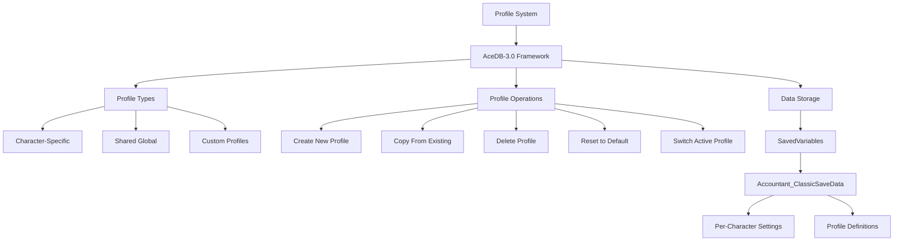
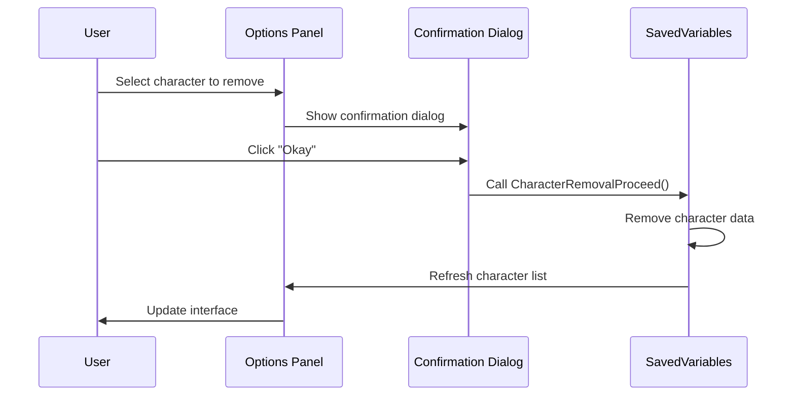
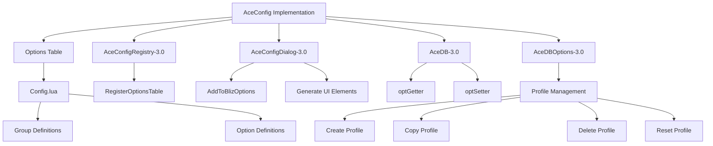

# Configuration and Options

<cite>
**Referenced Files in This Document**   
- [Config.lua](file://Core/Config.lua) - *Updated in recent commit*
- [Core.lua](file://Core/Core.lua) - *Updated in recent commit*
- [CurrencyCore.lua](file://CurrencyTracker/CurrencyCore.lua) - *Added in commit 18*
- [CurrencyEventHandler.lua](file://CurrencyTracker/CurrencyEventHandler.lua) - *Updated in commit 18*
- [README.md](file://README.md)
- [AceConfigDialog-3.0.lua](file://Libs/AceConfig-3.0/AceConfigDialog-3.0/AceConfigDialog-3.0.lua)
- [AceDBOptions-3.0.lua](file://Libs/AceDBOptions-3.0/AceDBOptions-3.0.lua)
- [LibDBIcon-1.0.lua](file://Libs/LibDBIcon-1.0/LibDBIcon-1.0.lua)
</cite>

## Update Summary
**Changes Made**   
- Added new section for Currency Tracker Configuration Options
- Updated Data Tracking Preferences section to include currency tracking features
- Added new section for Currency Tracker Command Options
- Enhanced Troubleshooting Guide with currency tracking issues
- Updated Underlying AceConfig Implementation to reflect new configuration options
- Added new diagram for currency tracking event flow

## Table of Contents
1. [Introduction](#introduction)
2. [Configuration Interface Overview](#configuration-interface-overview)
3. [Display Options](#display-options)
4. [Data Tracking Preferences](#data-tracking-preferences)
5. [UI Appearance Settings](#ui-appearance-settings)
6. [Profile System with AceDB-3.0](#profile-system-with-acedb-30)
7. [Minimap and LDB Button Configuration](#minimap-and-ldb-button-configuration)
8. [Character Data Management](#character-data-management)
9. [Common Configuration Workflows](#common-configuration-workflows)
10. [Currency Tracker Configuration Options](#currency-tracker-configuration-options)
11. [Currency Tracker Command Options](#currency-tracker-command-options)
12. [Troubleshooting Guide](#troubleshooting-guide)
13. [Underlying AceConfig Implementation](#underlying-aceconfig-implementation)

## Introduction

Accountant_Classic is a lightweight World of Warcraft addon that tracks incoming and outgoing gold by source across multiple time ranges including Session, Day, Week, Month, Year, and Total. The addon provides a clear breakdown table, character summaries, and quality-of-life features through a comprehensive options panel driven by the AceConfig framework. This document details the complete configuration system, explaining all available settings, the profile management system powered by AceDB-3.0, and how to customize the user interface to suit individual preferences. The configuration system allows users to control display options, data tracking preferences, UI appearance, minimap/LDB button behavior, and character data management. With recent updates, the addon now includes enhanced currency tracking capabilities with configurable near-cap warnings and improved display options for currency data.

**Section sources**
- [README.md](file://README.md#L1-L120)

## Configuration Interface Overview

The Accountant_Classic configuration system is built on the AceConfig-3.0 framework, providing a standardized interface accessible through both the Blizzard Interface Options panel and a dedicated slash command. Users can open the options panel by typing `/accountant` or `/acc` in chat, or by right-clicking the minimap button. The configuration interface is organized into logical sections that correspond to different aspects of the addon's functionality, including general settings, display formatting, minimap button configuration, scale and transparency controls, and character data management. The options panel uses AceConfigDialog-3.0 to generate the user interface from a structured options table defined in the addon's code, ensuring consistency with other Ace3-based addons and providing a familiar experience for users accustomed to the AceConfig ecosystem.

```mermaid
flowchart TD
A[Configuration Entry Points] --> B[Slash Commands]
A --> C[Minimap Button]
A --> D[Blizzard Interface Options]
B --> E[/accountant or /acc]
C --> F[Right-click Minimap Icon]
D --> G[Interface > AddOns > Accountant_Classic]
E --> H[Options Panel]
F --> H
G --> H
H --> I[General Settings]
H --> J[Display Options]
H --> K[Minimap Configuration]
H --> L[Scale & Transparency]
H --> M[Data Management]
```

**Diagram sources**
- [Config.lua](file://Core/Config.lua#L1-L430)
- [README.md](file://README.md#L1-L120)

## Display Options

The display options in Accountant_Classic allow users to customize how monetary information is presented both in the main window and on supplementary displays. These settings control the visibility of the floating money frame, tooltip formatting, number formatting, and date display preferences. The "Show money on screen" toggle enables or disables the floating actionbar that displays current gold information. When enabled, users can reset its position using the "Reset position" button. The "Display Instruction Tips" option controls whether helpful tooltips appear when interacting with the minimap button or floating money frame. For number formatting, the "Converts a number into a localized string, grouping digits as required" setting determines whether large numbers are formatted with digit grouping according to locale conventions. The date format can be selected from multiple options (mm/dd/yy, dd/mm/yy, yy/mm/dd) for display in the "All Chars" and "Week" tabs, allowing users to choose their preferred format based on regional conventions.

**Section sources**
- [Config.lua](file://Core/Config.lua#L1-L430)

## Data Tracking Preferences

Accountant_Classic provides granular control over what financial transactions are tracked and how they are categorized. The core tracking system monitors various transaction types including Merchant, Repairs, Taxi, Trainer, Auction House, Mail, Quest, Loot, and others by listening to specific WoW UI events that indicate the current context. The "Track location of incoming / outgoing money" option enables zone-level breakdown tracking, recording where each transaction occurs. When this is enabled, users can also activate "Also track subzone info" to capture more specific location data such as "Suramar - Sanctum of Order" rather than just the zone name. The "Start of Week" setting allows users to define which day should be considered the beginning of the weekly tracking period, with options for Sunday through Saturday. These tracking preferences ensure that users can customize the level of detail captured by the addon according to their analytical needs, from basic income/expense tracking to detailed geographical analysis of gold flow.

```mermaid
classDiagram
class DataTracking {
+string AC_LOGTYPE
+number AC_CURRMONEY
+number AC_LASTMONEY
+table AC_DATA
+function updateLog()
+function AccountantClassic_OnShareMoney()
+function initOptions()
}
class Constants {
+table logmodes
+table logtypes
+table events
+table onlineData
+table tabText
}
DataTracking --> Constants : "uses"
DataTracking ..> "PLAYER_MONEY" : "listens to"
DataTracking ..> "MERCHANT_SHOW" : "listens to"
DataTracking ..> "TAXIMAP_OPENED" : "listens to"
DataTracking ..> "QUEST_TURNED_IN" : "listens to"
DataTracking ..> "LOOT_OPENED" : "listens to"
DataTracking ..> "MAIL_INBOX_UPDATE" : "listens to"
DataTracking ..> "TRAINER_SHOW" : "listens to"
DataTracking ..> "AUCTION_HOUSE_SHOW" : "listens to"
```

**Diagram sources**
- [Core.lua](file://Core/Core.lua#L1-L799)
- [Constants.lua](file://Core/Constants.lua#L1-L260)

## UI Appearance Settings

The UI appearance settings in Accountant_Classic allow users to customize the visual presentation of both the main frame and the floating money information display. These settings are organized under the "Scale and Transparency" section of the options panel and include controls for both elements. For the main Accountant Classic frame, users can adjust the "Accountant Classic Frame's Scale" using a range slider from 0.5 to 1.75, allowing the window to be made smaller or larger as needed. The "Accountant Classic Frame's Transparency" setting controls the alpha value from 0.1 to 1.0, enabling users to make the frame more or less transparent to better integrate with their UI layout. Similarly, for the floating money information display (when enabled), users can control the "Accountant Classic Floating Info's Scale" from 0.5 to 3.0 and adjust its "Accountant Classic Floating Info's Transparency" from 0.1 to 1.0. These appearance settings give users complete control over how prominently the addon's interface elements appear on screen, allowing for both highly visible displays and subtle, unobtrusive presentations.

**Section sources**
- [Config.lua](file://Core/Config.lua#L1-L430)

## Profile System with AceDB-3.0

Accountant_Classic implements a robust profile system powered by AceDB-3.0, allowing users to manage settings across multiple characters and create custom configurations. The profile system supports both per-character settings and global profiles that can be shared across all characters. By default, the addon creates character-specific profiles, but users can switch to a shared "Default" profile or create custom profiles that apply to multiple characters. The profile management interface, provided by AceDBOptions-3.0, includes options to create new profiles, copy settings from existing profiles, delete unused profiles, and reset the current profile to default values. This system allows for flexible configuration strategies, such as maintaining a minimalist tracking profile for alts while using a detailed tracking profile for main characters. The profile data is stored in the SavedVariables system under `Accountant_ClassicSaveData`, with each profile containing settings for display options, tracking preferences, and UI appearance. The AceDB-3.0 framework handles all the underlying complexity of profile switching, ensuring that settings are properly loaded and saved according to the active profile.



**Diagram sources**
- [AceDB-3.0.lua](file://Libs/AceDB-3.0/AceDB-3.0.lua#L1-L740)
- [AceDBOptions-3.0.lua](file://Libs/AceDBOptions-3.0/AceDBOptions-3.0.lua#L1-L456)

## Minimap and LDB Button Configuration

The minimap and LDB (LibDataBroker) button configuration options provide control over the addon's supplementary display elements that offer quick access to financial information. The "Show minimap button" toggle enables or disables the circular icon that appears around the minimap, which can be dragged to reposition. When the minimap button is visible, additional options become available to customize its tooltip display. The "Show money" option controls whether current gold amounts are displayed in the button's tooltip, while "Show session info" determines if session-specific financial data is included. For users who prefer LDB-compatible displays (such as Titan Panel or ChocolateBar), the "LDB Display Type" setting allows selection of what data should be shown on the LDB feed, with options including Total, This Session, Today, This Week, and This Month. These configuration options ensure that users can tailor the addon's supplementary displays to their preferred information density and UI integration style, whether they want minimal indicators or detailed financial summaries readily accessible from their minimap or data broker bars.

**Section sources**
- [Config.lua](file://Core/Config.lua#L1-L430)
- [LibDBIcon-1.0.lua](file://Libs/LibDBIcon-1.0/LibDBIcon-1.0.lua#L1-L571)

## Character Data Management

Accountant_Classic includes comprehensive character data management features that allow users to view, sort, and remove financial tracking data for their characters. The "All Chars" tab provides a cross-realm, cross-faction overview of all tracked characters, with sortable columns for Character name, Money, and Last Updated date. Users can sort this data by clicking on the column headers, with subsequent clicks toggling between ascending and descending order. The character data management section in the options panel includes a dropdown menu that lists all characters with recorded financial data, allowing users to select and remove specific character data. When a character is selected for removal, a confirmation dialog appears to prevent accidental deletion. This feature is particularly useful for cleaning up data from alts or characters that are no longer played. Additionally, users can control the scope of character data displayed through the "Show all realms' characters info" and "Show all factions' characters info" toggles, allowing filtering by realm or faction as needed. The character data is stored in the `Accountant_ClassicSaveData` SavedVariable, organized by server and character name.



**Diagram sources**
- [Config.lua](file://Core/Config.lua#L1-L430)
- [Core.lua](file://Core/Core.lua#L1-L799)

## Common Configuration Workflows

Several common configuration workflows demonstrate how users can customize Accountant_Classic to suit different play styles and information needs. For users seeking a minimalist display, the recommended workflow is to disable the floating money frame, hide the minimap button, and reduce the main frame's scale and transparency to create a subtle interface element that only appears when needed. To enable detailed zone tracking for players interested in analyzing where they earn and spend gold, users should enable both "Track location of incoming / outgoing money" and "Also track subzone info" in the Enhanced Tracking Options section, which will provide granular geographical data in the transaction breakdowns. For players with multiple characters who want consistent settings across alts, the profile system can be used to create a shared profile that is then applied to all secondary characters, ensuring uniform tracking behavior. Another common workflow involves configuring the LDB display to show "This Session" data for players who want to monitor their current session's gold flow on their data broker bar, while keeping the main window focused on longer-term financial trends.

**Section sources**
- [Config.lua](file://Core/Config.lua#L1-L430)
- [README.md](file://README.md#L1-L120)

## Currency Tracker Configuration Options

With the recent addition of currency tracking functionality, Accountant_Classic now provides comprehensive options for monitoring in-game currencies. These settings are accessible through the main options panel and allow users to configure near-cap warnings with customizable thresholds and durations. The near-cap warning system alerts players when their currency holdings approach maximum limits, helping prevent missed rewards or collection opportunities.

The configuration options for currency tracking include:
- **Enable near-cap warnings**: Toggle to activate or deactivate the warning system
- **Cap percentage threshold**: Set the percentage of the maximum cap that triggers a warning (default: 90%)
- **Warning display duration**: Configure how long the warning message remains visible (default: 3 seconds)
- **Fade duration**: Set the time for the warning to fade out after display (default: 0.8 seconds)

These settings are configured per-character and persist across sessions, allowing players to customize their experience based on their play style and preferences. The warning system uses the game's UI error frame to display prominent notifications when a currency approaches its cap, ensuring players don't miss important collection opportunities.

**Section sources**
- [CurrencyCore.lua](file://CurrencyTracker/CurrencyCore.lua#L1-L1414)
- [CurrencyEventHandler.lua](file://CurrencyTracker/CurrencyEventHandler.lua#L1-L932)

## Currency Tracker Command Options

Accountant_Classic includes enhanced command options for currency tracking through the `/ct` slash command. These commands provide detailed information about currency holdings and allow users to customize display behavior. The `verbose` flag has been added to the `/ct show-all` command, enabling users to display additional details about tracked currencies.

Available currency tracking commands include:
- `/ct show-all`: Displays all tracked currencies for the current timeframe
- `/ct show-all verbose`: Displays all tracked currencies with additional details such as gain/loss sources
- `/ct set-paras near-cap-warning`: Configures near-cap warning parameters with key-value pairs (e.g., `enable=true cap_percent=0.9 time_visible_sec=3 fade_duration_sec=0.8`)
- `/ct debug on/off`: Enables or disables debug mode for currency tracking
- `/ct status`: Shows the current status of the currency tracking system

The `verbose` flag provides detailed breakdowns of currency transactions, showing not only the amounts but also the sources of gains and losses. This information is valuable for players who want to analyze their currency acquisition patterns and optimize their gameplay strategies.

```mermaid
flowchart TD
A[Currency Commands] --> B[/ct show-all]
A --> C[/ct show-all verbose]
A --> D[/ct set-paras near-cap-warning]
A --> E[/ct debug]
A --> F[/ct status]
B --> G[Display all currencies]
C --> H[Display currencies with details]
D --> I[Configure warning parameters]
E --> J[Toggle debug mode]
F --> K[Show system status]
```

**Diagram sources**
- [CurrencyCore.lua](file://CurrencyTracker/CurrencyCore.lua#L1-L1414)
- [CurrencyEventHandler.lua](file://CurrencyTracker/CurrencyEventHandler.lua#L1-L932)

## Troubleshooting Guide

When configuring Accountant_Classic, users may encounter issues where changes don't persist or options don't appear as expected. One common issue occurs when profile settings fail to save, which is typically caused by the SavedVariables file becoming corrupted or write-protected. In such cases, closing the game completely and verifying file permissions can resolve the issue. Another common problem is the options panel not appearing when using slash commands, which may indicate a conflict with other addons that override the interface options system; trying to access the settings through the Blizzard Interface Options panel can serve as a workaround. If the minimap button disappears, checking that "Show minimap button" is enabled in the options and that the button hasn't been dragged off-screen during dragging can resolve the issue. For users who find that financial transactions are not being tracked correctly, ensuring that the addon is enabled on the character selection screen and that no other money-tracking addons are interfering with the same events can help restore proper functionality. The one-time baseline priming message ("Accountant Classic: Baseline primed") confirms that the addon has properly initialized its tracking system, and its absence may indicate that the addon failed to load correctly.

For currency tracking specific issues:
- If near-cap warnings are not appearing, verify that the feature is enabled and check the threshold settings
- If currency data is not being recorded, ensure that the currency is properly discovered and tracked
- If the `/ct` commands are not working, check that the currency tracking module is properly initialized
- If currency amounts appear incorrect, use the `/ct repair baseline-preview` and `/ct repair baseline-apply` commands to reconcile discrepancies

**Section sources**
- [Core.lua](file://Core/Core.lua#L1-L799)
- [README.md](file://README.md#L1-L120)
- [CurrencyCore.lua](file://CurrencyTracker/CurrencyCore.lua#L1-L1414)

## Underlying AceConfig Implementation

The Accountant_Classic configuration system is built on the AceConfig-3.0 framework, specifically utilizing AceConfigDialog-3.0 to generate the user interface from a structured options table. The implementation begins with the creation of an options table in `Config.lua` that defines all configurable parameters, their types, default values, and relationships. This table is registered with AceConfigRegistry-3.0, making it available to the configuration system. The `SetupOptions()` function in the addon initializes the configuration by registering the options table and adding it to the Blizzard Interface Options panel using `AceConfigDialog:AddToBlizOptions()`. The options table structure follows the AceConfig conventions, with settings organized into groups and individual options defined with appropriate types (toggle, range, select, execute, etc.). The `optGetter` and `optSetter` functions handle reading and writing settings to the AceDB-3.0 database, ensuring that changes are properly persisted. For profile management, the addon uses AceDBOptions-3.0 to integrate the standard profile operations (create, copy, delete, reset) into the options panel. This implementation leverages the full power of the Ace3 library ecosystem to provide a robust, standardized configuration experience that integrates seamlessly with the Blizzard interface.



**Diagram sources**
- [Config.lua](file://Core/Config.lua#L1-L430)
- [AceConfigDialog-3.0.lua](file://Libs/AceConfig-3.0/AceConfigDialog-3.0/AceConfigDialog-3.0.lua#L1-L799)
- [AceDBOptions-3.0.lua](file://Libs/AceDBOptions-3.0/AceDBOptions-3.0.lua#L1-L456)