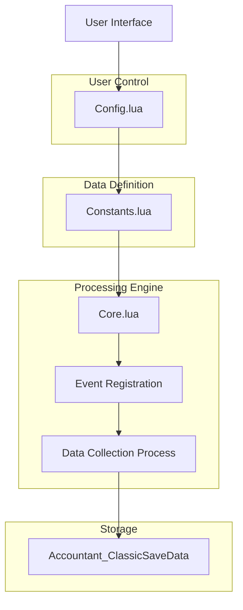
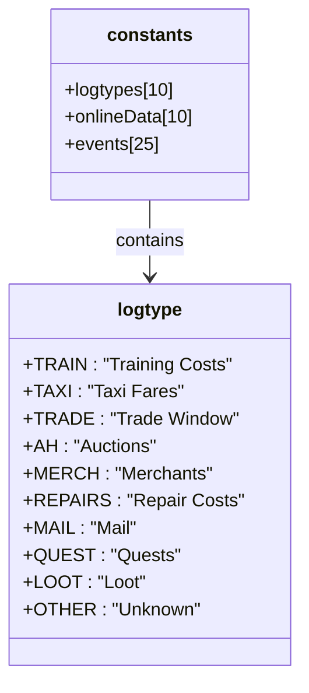
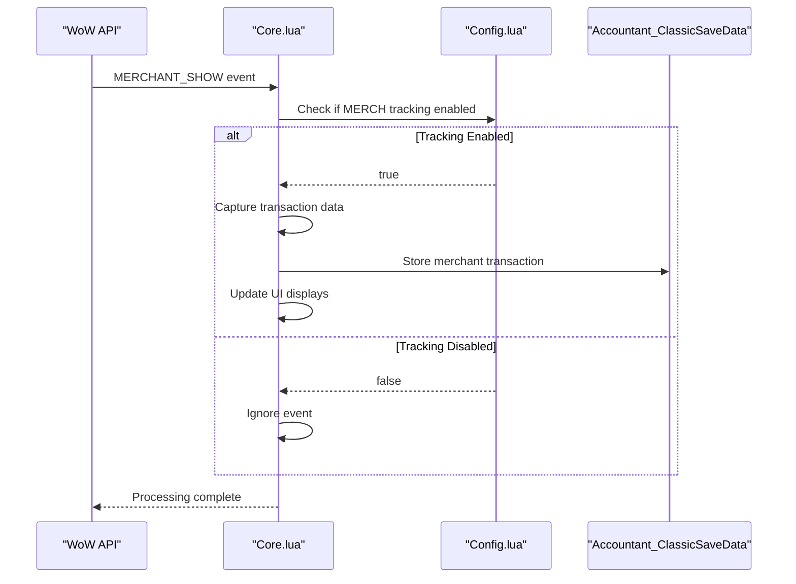
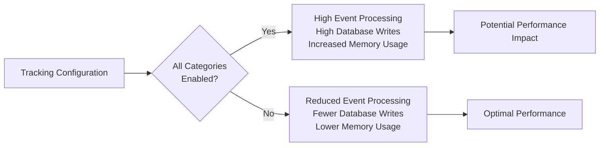
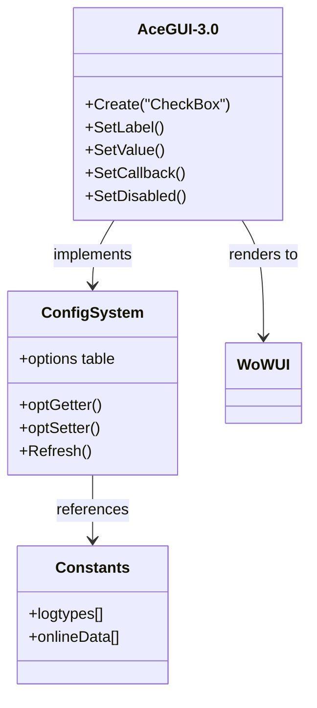

# Data Tracking Options

<cite>
**Referenced Files in This Document**   
- [Constants.lua](file://Core/Constants.lua#L1-L260)
- [Core.lua](file://Core/Core.lua#L1-L2306)
- [Config.lua](file://Core/Config.lua#L1-L430)
</cite>

## Table of Contents
1. [Introduction](#introduction)
2. [Data Tracking Configuration](#data-tracking-configuration)
3. [Mapping to Constants.logtypes](#mapping-to-constantslogtypes)
4. [Event Handling in Core.lua](#event-handling-in-corelua)
5. [Performance Impact Analysis](#performance-impact-analysis)
6. [UI Implementation with AceGUI-3.0](#ui-implementation-with-acegui-30)
7. [User Experience Considerations](#user-experience-considerations)
8. [Best Practice Recommendations](#best-practice-recommendations)

## Introduction
Accountant_Classic is a World of Warcraft addon designed to track financial transactions across various in-game activities. This document details the data tracking preferences system that allows users to selectively enable or disable monitoring of specific transaction types such as Merchant interactions, Repair costs, Quest rewards, and Auction House activities. The configuration system provides granular control over what financial data is collected, stored, and displayed, balancing comprehensive tracking with performance optimization.

**Section sources**
- [Constants.lua](file://Core/Constants.lua#L1-L260)
- [Core.lua](file://Core/Core.lua#L1-L2306)

## Data Tracking Configuration

The data tracking system in Accountant_Classic enables users to control which types of financial transactions are monitored through configurable toggles. These settings determine whether specific categories of in-game economic activities are recorded in the addon's database.

The tracking categories are defined in the `constants.logtypes` table within Constants.lua, which contains the following transaction types:
- TRAIN: Training costs for abilities and skills
- TAXI: Transportation fees for flight paths
- TRADE: Transactions conducted through the trade window
- AH: Auction House activities (sales and purchases)
- MERCH: Merchant transactions (buying and selling)
- REPAIRS: Equipment repair costs
- MAIL: Mail-related financial transactions
- QUEST: Quest completion rewards
- LOOT: Looted currency from enemies and containers
- OTHER: Miscellaneous money changes not categorized above

Users can enable or disable tracking for each of these categories independently, allowing for customized monitoring based on individual preferences and performance requirements.

**Diagram sources**
- [Constants.lua](file://Core/Constants.lua#L1-L260)
- [Core.lua](file://Core/Core.lua#L1-L2306)
- [Config.lua](file://Core/Config.lua#L1-L430)

**Section sources**
- [Constants.lua](file://Core/Constants.lua#L1-L260)
- [Core.lua](file://Core/Core.lua#L1-L2306)

## Mapping to Constants.logtypes

The data tracking preferences are directly mapped to the `constants.logtypes` table defined in Constants.lua. This table serves as the authoritative source for all transaction categories that can be tracked by the addon.

When the addon initializes, it creates database structures for each log type specified in `constants.logtypes`. The onlineData table in Constants.lua provides additional metadata for each log type, including display titles that are used in the user interface:

**Diagram sources**
- [Constants.lua](file://Core/Constants.lua#L1-L260)

**Section sources**
- [Constants.lua](file://Core/Constants.lua#L1-L260)

## Event Handling in Core.lua

The event handling system in Core.lua is responsible for processing in-game events and recording financial transactions based on the user's tracking preferences. The addon registers for specific WoW API events through the `AccountantClassic_RegisterEvents` function, which iterates through the `private.constants.events` table to register event listeners.

When an event occurs (such as MERCHANT_SHOW, QUEST_TURNED_IN, or PLAYER_MONEY), the addon checks whether the corresponding tracking category is enabled before recording the transaction. This conditional processing ensures that disabled tracking modes prevent data collection without affecting other functionality.

The event handling flow follows this sequence:
1. Event trigger from WoW API
2. Check if corresponding tracking category is enabled
3. If enabled, capture money change and transaction context
4. Store data in appropriate log mode (Session, Day, Week, etc.)
5. Update UI displays

**Diagram sources**
- [Core.lua](file://Core/Core.lua#L1-L2306)
- [Constants.lua](file://Core/Constants.lua#L1-L260)

**Section sources**
- [Core.lua](file://Core/Core.lua#L1-L2306)

## Performance Impact Analysis

The data tracking system presents a trade-off between comprehensive monitoring and performance efficiency. Tracking all categories versus selective monitoring has significant implications for addon performance.

### Tracking All Categories
When all tracking categories are enabled, the addon:
- Registers for approximately 25 different WoW API events
- Processes every money-related event in the game
- Performs frequent database writes
- Consumes more memory for event handling
- May impact frame rate during intense economic activity

### Selective Monitoring
When only specific categories are enabled:
- Reduces the number of registered events proportionally
- Decreases CPU usage by avoiding unnecessary event processing
- Minimizes database write operations
- Reduces memory footprint
- Improves overall addon responsiveness

The performance impact is most noticeable during activities with high transaction frequency, such as:
- Extended Auction House browsing
- Multiple merchant interactions in succession
- Rapid quest completion sequences
- Intensive crafting and trading sessions

Disabling tracking for categories that are not relevant to the user's playstyle can result in measurable performance improvements, particularly on lower-end systems or when running multiple addons simultaneously.

**Diagram sources**
- [Core.lua](file://Core/Core.lua#L1-L2306)
- [Constants.lua](file://Core/Constants.lua#L1-L260)

**Section sources**
- [Core.lua](file://Core/Core.lua#L1-L2306)

## UI Implementation with AceGUI-3.0

The user interface for data tracking preferences is implemented using AceGUI-3.0, a powerful widget library for creating configurable addon interfaces. The checkbox groups that control tracking preferences leverage AceGUI's CheckBox widget to provide a consistent and accessible user experience.

The configuration system in Config.lua defines the options structure that is rendered by AceConfigDialog-3.0, which in turn uses AceGUI-3.0 widgets to create the visual interface. Each tracking category is represented as a toggleable option that maps directly to the corresponding entry in Constants.logtypes.

Key implementation details:
- Checkbox states are stored in the addon's database profile
- State changes trigger immediate UI updates through the Refresh() method
- The AceGUI framework handles focus management and user interaction
- Widget positioning and styling follow WoW UI conventions

The AceGUI-3.0 CheckBox widget provides the following features:
- Visual feedback on state changes
- Keyboard navigation support
- Tooltip integration
- Disabled state rendering
- Sound effects for state transitions

**Diagram sources**
- [Config.lua](file://Core/Config.lua#L1-L430)
- [Core.lua](file://Core/Core.lua#L1-L2306)

**Section sources**
- [Config.lua](file://Core/Config.lua#L1-L430)

## User Experience Considerations

Users may experience confusion when certain data appears to be missing from their financial reports. This typically occurs when specific tracking categories have been disabled in the configuration interface.

Common scenarios that lead to user confusion:
- Disabling "QUEST" tracking results in missing quest reward data
- Turning off "MERCH" tracking prevents recording of vendor transactions
- Disabling "AH" tracking means auction house activities are not logged
- Turning off "REPAIRS" tracking omits equipment repair costs

To mitigate confusion, the addon could implement the following user experience improvements:
- Display clear notifications when tracking is disabled for active activities
- Provide visual indicators on the main interface showing which categories are being tracked
- Include explanatory tooltips that clarify the impact of disabling specific tracking modes
- Implement a warning dialog when attempting to disable tracking during relevant activities

The current implementation does not provide real-time feedback about disabled tracking states, which can lead users to believe the addon is malfunctioning when data is simply not being collected due to their configuration choices.

**Section sources**
- [Core.lua](file://Core/Core.lua#L1-L2306)
- [Config.lua](file://Core/Config.lua#L1-L430)

## Best Practice Recommendations

Based on the analysis of the data tracking system, the following best practices are recommended for optimal use of Accountant_Classic:

### Configuration Strategy
- Enable only the tracking categories relevant to your playstyle
- Disable "OTHER" tracking if you don't need to monitor miscellaneous money changes
- Keep "QUEST" and "LOOT" tracking enabled for comprehensive income reporting
- Consider disabling "AH" tracking if you rarely use the Auction House

### Performance Optimization
- On lower-end systems, limit tracking to essential categories only
- Disable tracking categories that generate frequent events but provide little value to your financial analysis
- Monitor addon performance during intense economic activities and adjust tracking settings accordingly

### Data Accuracy
- Ensure all relevant tracking categories are enabled before starting economic analysis
- Periodically review your tracking configuration to ensure it aligns with your current gameplay
- Be aware that changing tracking settings does not affect historical data collection

### Troubleshooting
When data appears to be missing:
1. Verify that the relevant tracking category is enabled in the configuration
2. Check that the addon has proper permissions and is not blocked by other addons
3. Confirm that the events you expect to be tracked are actually occurring in-game
4. Restart the game client if configuration changes don't take effect

Following these recommendations will ensure accurate financial tracking while maintaining optimal addon performance.

**Section sources**
- [Constants.lua](file://Core/Constants.lua#L1-L260)
- [Core.lua](file://Core/Core.lua#L1-L2306)
- [Config.lua](file://Core/Config.lua#L1-L430)