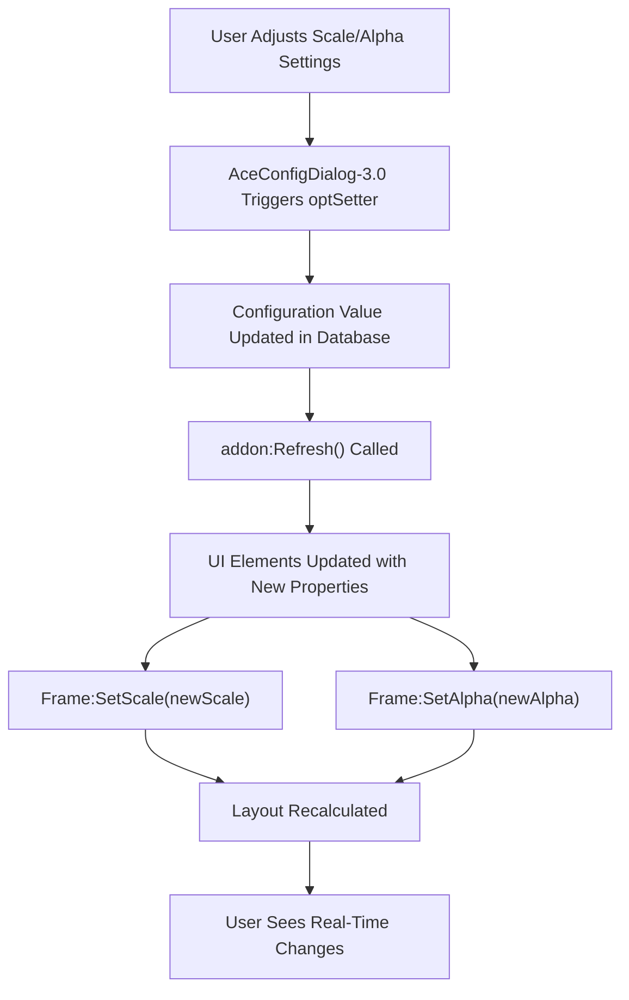

# Display Settings

<cite>
**Referenced Files in This Document**   
- [Core/Config.lua](file://Core/Config.lua)
- [Core/Core.xml](file://Core/Core.xml)
- [Core/Template.xml](file://Core/Template.xml)
</cite>

## Table of Contents
1. [Display Settings](#display-settings)
2. [Configuration Interface Structure](#configuration-interface-structure)
3. [UI Element Scaling and Transparency](#ui-element-scaling-and-transparency)
4. [Real-Time Preview with AceConfigDialog-3.0](#real-time-preview-with-aceconfigdialog-30)
5. [Font Size and Tooltip Formatting](#font-size-and-tooltip-formatting)
6. [Responsive Design for Different Screen Resolutions](#responsive-design-for-different-screen-resolutions)
7. [Performance Implications of Transparency Effects](#performance-implications-of-transparency-effects)
8. [Common UI Layout Issues](#common-ui-layout-issues)

## Configuration Interface Structure

The display configuration options are defined within the `Config.lua` file using the AceConfig-3.0 framework. The configuration tree is structured hierarchically under the `options` table, which is registered with `AceConfigRegistry-3.0` and integrated into the Blizzard options panel via `AceConfigDialog-3.0`.

The main configuration group is divided into logical sections such as General Settings, Minimap Button Settings, LDB Display Settings, and Scale and Transparency controls. Each option uses standardized widget types (toggle, range, select) to provide a consistent user experience.

```lua
options = {
    type = "group",
    name = addon.LocName,
    args = {
        general = {
            order = 1,
            type = "group",
            name = L["Options"],
            get = optGetter,
            set = optSetter,
            args = {
                showmoneyinfo = {
                    order = 12,
                    type = "toggle",
                    name = L["Show money on screen"],
                    width = "full",
                },
                group4 = {
                    order = 40,
                    type = "group",
                    name = L["Scale and Transparency"],
                    inline = true,
                    args = {
                        scale = {
                            order = 42,
                            type = "range",
                            name = L["Accountant Classic Frame's Scale"],
                            min = 0.5, max = 1.75, bigStep = 0.02,
                            isPercent = true,
                            width = "full",
                        },
                        alpha = {
                            order = 43,
                            type = "range",
                            name = L["Accountant Classic Frame's Transparency"],
                            min = 0.1, max = 1, bigStep = 0.1,
                            isPercent = true,
                            width = "full",
                        },
                    },
                },
            },
        },
    },
}
```

**Section sources**
- [Core/Config.lua](file://Core/Config.lua#L120-L250)

## UI Element Scaling and Transparency

The display settings include dedicated controls for adjusting both the main frame's scale and transparency (alpha), as well as separate settings for the floating money information frame. These settings are implemented using range sliders in the configuration interface.

### Main Frame Scaling and Transparency
The main Accountant Classic frame's visual properties are controlled by two range sliders:
- **Scale**: Adjustable from 0.5x to 1.75x original size in increments of 0.02
- **Transparency (Alpha)**: Adjustable from 10% to 100% opacity in increments of 0.1

These values are stored in the addon's database profile under `db.profile.scale` and `db.profile.alpha` respectively. When modified, they trigger a `Refresh()` call to update the UI immediately.

### Floating Info Frame Settings
When the on-screen money display is enabled (`showmoneyinfo`), additional controls become available for the floating action bar:
- **Info Scale**: Adjustable from 0.5x to 3.0x original size
- **Info Alpha**: Adjustable from 10% to 100% opacity

These settings are conditionally disabled when the floating money frame is not visible, as controlled by the `disabled` function in the configuration.

```lua
group4 = {
    order = 40,
    type = "group",
    name = L["Scale and Transparency"],
    inline = true,
    args = {
        group41 = {
            order = 41,
            type = "group",
            name = L["Main Frame's Scale and Alpha Settings"],
            inline = true,
            args = {
                scale = {
                    order = 42,
                    type = "range",
                    name = L["Accountant Classic Frame's Scale"],
                    min = 0.5, max = 1.75, bigStep = 0.02,
                    isPercent = true,
                    width = "full",
                },
                alpha = {
                    order = 43,
                    type = "range",
                    name = L["Accountant Classic Frame's Transparency"],
                    min = 0.1, max = 1, bigStep = 0.1,
                    isPercent = true,
                    width = "full",
                },
            },
        },
        group42 = {
            order = 51,
            type = "group",
            name = L["Onscreen Actionbar's Scale and Alpha Settings"],
            inline = true,
            disabled = function() return not addon.db.profile.showmoneyinfo end,
            args = {
                infoscale = {
                    order = 52,
                    type = "range",
                    name = L["Accountant Classic Floating Info's Scale"],
                    min = 0.5, max = 3, bigStep = 0.1,
                    isPercent = true,
                    width = "full",
                },
                infoalpha = {
                    order = 53,
                    type = "range",
                    name = L["Accountant Classic Floating Info's Transparency"],
                    min = 0.1, max = 1, bigStep = 0.1,
                    isPercent = true,
                    width = "full",
                },
            },
        },
    },
}
```

**Section sources**
- [Core/Config.lua](file://Core/Config.lua#L200-L250)

## Real-Time Preview with AceConfigDialog-3.0

The configuration system implements real-time preview functionality through AceConfigDialog-3.0's callback mechanism. When users adjust sliders or toggle checkboxes, the changes are immediately applied to the UI through the `optSetter` function and subsequent `Refresh()` call.

### Configuration Callback Implementation
The `optSetter` function extracts the configuration key from the info table and updates the corresponding database value:

```lua
function optSetter(info, value)
    local key = info[#info]
    addon.db.profile[key] = value
    addon:Refresh()
end
```

This pattern ensures that any configuration change triggers a full UI refresh, making the adjustments immediately visible to the user.

### Dynamic UI Updates
The `Refresh()` method (defined in Core.lua, not shown in provided files) is responsible for applying the current configuration values to all UI elements. This includes:
- Updating frame scale using `SetScale()`
- Adjusting frame transparency using `SetAlpha()`
- Repositioning elements as needed
- Refreshing text formatting and display

The real-time preview behavior enhances usability by allowing users to fine-tune their display settings without needing to close and reopen the interface.

**Section sources**
- [Core/Config.lua](file://Core/Config.lua#L25-L35)

## Font Size and Tooltip Formatting

While direct font size controls are not exposed in the configuration interface, font appearance is influenced by the overall scaling settings. The UI uses standard Blizzard font templates inherited from the game's UI framework.

### Font Inheritance
The main interface elements use the following font templates as defined in Core.xml:
- **GameFontHighlight**: Used for main title text
- **GameFontHighlightSmall**: Used for section headers and labels
- **NumberFontNormal**: Used for monetary values
- **GameFontNormalSmall**: Used for supplementary information

```xml
<FontString name="$parentTitleText" inherits="GameFontHighlight" text="ACCLOC_TITLE">
    <Size>
        <AbsDimension x="620" y="14"/>
    </Size>
    <Anchors>
        <Anchor point="TOP" relativePoint="TOP">
            <Offset>
                <AbsDimension x="0" y="-21"/>
            </Offset>
        </Anchor>
    </Anchors>
</FontString>
```

### Tooltip Configuration
Tooltip formatting is controlled through several configuration options:
- **Show money on minimap button's tooltip**: Toggles display of current character's money
- **Show session info on minimap button's tooltip**: Toggles display of session earnings data
- **Display Instruction Tips**: Controls whether operational tips are shown

These settings are implemented as boolean toggles in the configuration interface and affect the content generated by the tooltip display functions.

**Section sources**
- [Core/Core.xml](file://Core/Core.xml#L30-L40)
- [Core/Config.lua](file://Core/Config.lua#L150-L170)

## Responsive Design for Different Screen Resolutions

The UI layout is designed to be responsive across different screen resolutions through a combination of anchored positioning and scalable elements.

### Frame Positioning Strategy
The main frame uses absolute positioning relative to the screen's top-left corner:

```xml
<Anchors>
    <Anchor point="TOPLEFT">
        <Offset>
            <AbsDimension x="0" y="-104"/>
        </Offset>
    </Anchor>
</Anchors>
```

This ensures the frame appears in a consistent location regardless of screen resolution. The frame is also clamped to the screen (`SetClampedToScreen(true)`) to prevent it from being dragged off-screen.

### Scalable Layout Elements
All UI elements use relative positioning based on parent frames, allowing them to maintain their spatial relationships when scaling is applied. The configuration system automatically handles layout adjustments when scale factors change.

For optimal visibility on different resolutions:
- On lower resolutions (e.g., 1080p), users may need to reduce the scale to 0.8-1.0 to prevent the frame from obscuring gameplay
- On higher resolutions (e.g., 1440p or 4K), users can increase the scale to 1.2-1.5 for better readability
- The floating money frame can be repositioned using the Reset Position button, which sets it to a default location

**Section sources**
- [Core/Core.xml](file://Core/Core.xml#L10-L20)
- [Core/Config.lua](file://Core/Config.lua#L130-L140)

## Performance Implications of Transparency Effects

Transparency (alpha blending) effects have minimal performance impact in modern WoW clients, but certain considerations should be noted:

### GPU Rendering Impact
Semi-transparent UI elements require additional GPU processing for alpha blending. However, since Accountant Classic typically displays only one main frame and optionally one floating frame, the performance impact is negligible on modern hardware.

### Best Practices for Performance
- Avoid setting alpha below 0.3 (30%) as very transparent elements provide poor readability without significant performance benefit
- Use the default 1.0 scale when possible, as extreme scaling (below 0.7 or above 1.5) can cause text rendering artifacts
- Disable the floating money frame when not needed to reduce the number of active UI elements

The addon does not implement any special performance optimizations for transparency, as the UI complexity is low and the performance impact is minimal even on older systems.

**Section sources**
- [Core/Config.lua](file://Core/Config.lua#L230-L240)

## Common UI Layout Issues

Several potential UI layout issues can occur when adjusting display settings, particularly related to scaling and positioning.

### Overlapping UI Elements
When the main frame scale is set too high, it may overlap with other addons or default UI elements. This can be resolved by:
- Reducing the scale value
- Manually repositioning the frame by dragging its title bar
- Using the Reset Position button for the floating money frame

### Misaligned Frames After Scaling
Due to the way WoW handles UI scaling, some visual misalignment may occur when using non-standard scale values. This is a limitation of the underlying UI framework and cannot be completely eliminated.

### Resolution-Specific Issues
On ultrawide or high-DPI displays, users may experience:
- Frames appearing too small (solution: increase scale)
- Frames positioned too far from screen edges (solution: manually reposition)

The configuration system does not currently include automatic resolution detection or adaptive layout features, relying instead on user-adjusted settings for optimal display.



**Diagram sources**
- [Core/Config.lua](file://Core/Config.lua#L25-L35)
- [Core/Core.xml](file://Core/Core.xml#L10-L20)

**Section sources**
- [Core/Config.lua](file://Core/Config.lua#L200-L250)
- [Core/Core.xml](file://Core/Core.xml#L10-L20)