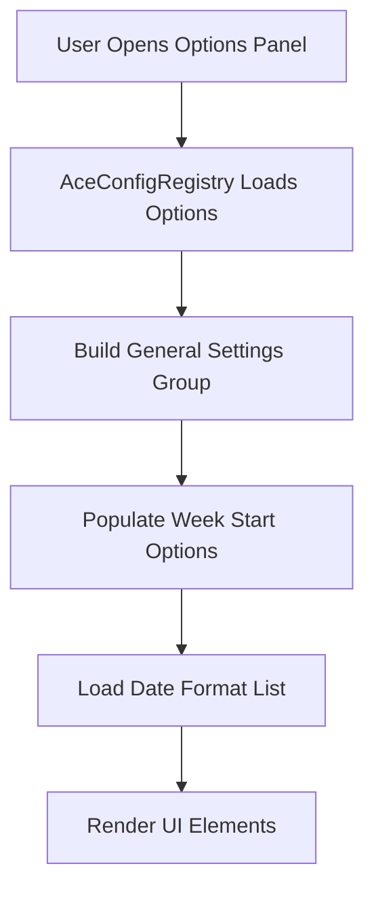
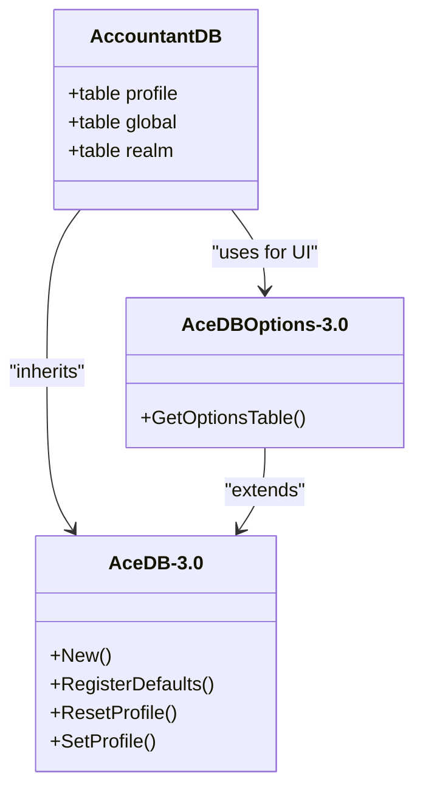
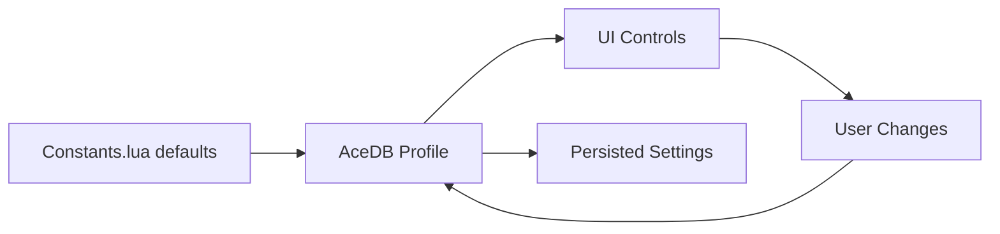

# General Settings

<cite>
**Referenced Files in This Document**   
- [Config.lua](file://Core/Config.lua#L1-L430)
- [Constants.lua](file://Core/Constants.lua#L1-L260)
- [Core.lua](file://Core/Core.lua#L262-L304)
</cite>

## Table of Contents
1. [General Settings](#general-settings)
2. [Core Configuration Options](#core-configuration-options)
3. [Data Storage and Profile Management](#data-storage-and-profile-management)
4. [User Interface Integration](#user-interface-integration)
5. [Default Values and Constants](#default-values-and-constants)
6. [Troubleshooting Common Issues](#troubleshooting-common-issues)

## Core Configuration Options

The Accountant_Classic addon provides a comprehensive set of general settings that allow users to customize the behavior and appearance of financial tracking features. These options are exposed through the Blizzard Interface Options panel using AceConfigRegistry-3.0 and AceConfigDialog-3.0, enabling seamless integration with the standard WoW UI.

### General and Data Display Format Settings

The primary configuration group, labeled **General and Data Display Format Settings**, includes several key toggles and selectors:

- **Show money on screen**: Enables or disables the floating money frame that displays current balance directly on the screen.
- **Display Instruction Tips**: Toggles tooltips for both the minimap button and floating money frame to guide new users.
- **Converts a number into a localized string, grouping digits as required**: Controls numeric formatting (e.g., 1,000 vs 1000) based on locale preferences.
- **Remember character selected**: Persists the last selected character in dropdown menus across sessions.
- **Show all realms' characters info**: When enabled, aggregates financial data across all realms; otherwise, limits display to the current realm.
- **Show all factions' characters info**: Similar to cross-realm visibility but applies to faction-based filtering.

**Section sources**
- [Config.lua](file://Core/Config.lua#L100-L200)

### Time Period and Date Configuration

Users can define temporal parameters for financial reporting:

- **Start of Week**: A dropdown allowing selection of the first day of the week (Sunday through Saturday), which affects weekly financial summaries.
- **Select the date format**: Offers three predefined formats:
  - `mm/dd/yy`
  - `dd/mm/yy`
  - `yy/mm/dd`

These settings influence how dates appear in tabs such as "All Chars" and "Week".



**Diagram sources**
- [Config.lua](file://Core/Config.lua#L180-L200)
- [Constants.lua](file://Core/Constants.lua#L250-L260)

## Data Storage and Profile Management

Accountant_Classic leverages AceDB-3.0 for robust settings persistence and profile management across characters and installations.

### Profile Structure and Initialization

Settings are stored under the `profile` namespace within the AceDB object. During initialization (`initOptions` in Core.lua), the system checks for existing saved variables:

```lua
if (Accountant_ClassicSaveData[AC_SERVER][AC_PLAYER] == nil ) then
    Accountant_ClassicSaveData[AC_SERVER][AC_PLAYER] = {
        options = AccountantClassicDefaultOptions,
        data = { },
    };
end
```

This ensures a clean default profile is created for new users while preserving existing configurations.

### Global vs Character-Specific Settings

By default, most settings are character-specific. However, global settings synchronization is achieved through AceDB's profile system. Users can manually copy profiles or set a default profile that applies across characters.

AceDBOptions-3.0 provides the framework for profile management, including:
- Creating new profiles
- Copying settings between profiles
- Deleting unused profiles
- Resetting to defaults



**Diagram sources**
- [Constants.lua](file://Core/Constants.lua#L50-L90)
- [Core.lua](file://Core/Core.lua#L262-L304)
- [Libs/AceDB-3.0/AceDB-3.0.lua](file://Libs/AceDB-3.0/AceDB-3.0.lua)
- [Libs/AceDBOptions-3.0/AceDBOptions-3.0.lua](file://Libs/AceDBOptions-3.0/AceDBOptions-3.0.lua)

**Section sources**
- [Core.lua](file://Core/Core.lua#L262-L304)
- [Constants.lua](file://Core/Constants.lua#L50-L90)

## User Interface Integration

The configuration system integrates with the Blizzard options framework via AceConfigDialog-3.0, registering its settings under the main addon name.

### Option Registration Process

In `SetupOptions()`, the addon performs the following:

```lua
AceConfigReg:RegisterOptionsTable(addon.LocName, getOptions)
self.optionsFrames.General = AceConfigDialog:AddToBlizOptions(addon.LocName, nil, nil, "general")
```

This registers the options table and adds a top-level entry to the Interface Options panel.

### Option Getters and Setters

A unified getter/setter pattern is used:

```lua
function optGetter(info)
    local key = info[#info]
    return addon.db.profile[key]
end

function optSetter(info, value)
    local key = info[#info]
    addon.db.profile[key] = value
    addon:Refresh()
end
```

Whenever a setting is changed, `addon:Refresh()` is called to apply changes immediately.

**Section sources**
- [Config.lua](file://Core/Config.lua#L50-L90)

## Default Values and Constants

Default settings are defined in `Constants.lua` within the `constants.defaults` table:

```lua
constants.defaults = {
    profile = {
        showmoneyinfo = true, 
        showintrotip = true,
        cross_server = true,
        show_allFactions = true,
        trackzone = true,
        weekstart = 1,
        dateformat = 1,
        scale = 1,
        alpha = 1,
        infoscale = 1,
        infoalpha = 1,
        rememberSelectedCharacter = true,
    },
}
```

These defaults are applied during profile creation and serve as fallbacks if settings are missing or corrupted.

The relationship between Constants.lua and the UI is direct: UI controls bind to these default values, and user modifications are stored in the AceDB profile, overriding the defaults without modifying them.



**Diagram sources**
- [Constants.lua](file://Core/Constants.lua#L50-L90)
- [Config.lua](file://Core/Config.lua#L70-L90)

**Section sources**
- [Constants.lua](file://Core/Constants.lua#L50-L90)

## Troubleshooting Common Issues

### Settings Not Applying After Reload

**Symptoms**: Changes made in options panel do not take effect after `/reload ui`.

**Root Causes**:
1. Missing `addon:Refresh()` call in setter function
2. Profile not properly saved to SavedVariables
3. Event handler not re-initialized after reload

**Solutions**:
1. Verify that all setters call `addon:Refresh()`:
   ```lua
   set = function(info, value)
       addon.db.profile.cross_server = value
       addon:PopulateCharacterList()
       addon:Refresh() -- Ensure this is present
   end
   ```
2. Confirm profile is being written by checking `WTF/Account/SavedVariables/Accountant_Classic.lua`
3. Ensure event hooks are re-registered in `OnEnable()` or equivalent

### Minimap Button Not Responding

Check `minimapButton` toggle in settings:
```lua
get = function()
    return not addon.db.profile.minimap.hide
end,
set = AccountantClassic_ButtonToggle,
```

Ensure `AccountantClassic_ButtonToggle` function exists and properly shows/hides the button.

### Date Format Not Changing

Verify that `dateformat` setting is correctly linked to UI:
- Check that `values = function() return addon.constants.dateformats end` returns expected list
- Confirm `dateformats` exists in Constants.lua
- Ensure UI is reading from correct profile value

**Section sources**
- [Config.lua](file://Core/Config.lua#L100-L200)
- [Constants.lua](file://Core/Constants.lua#L250-L260)