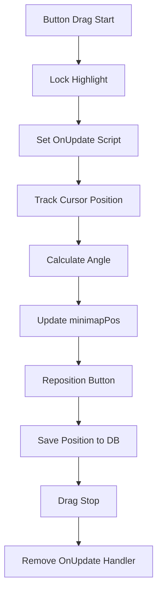
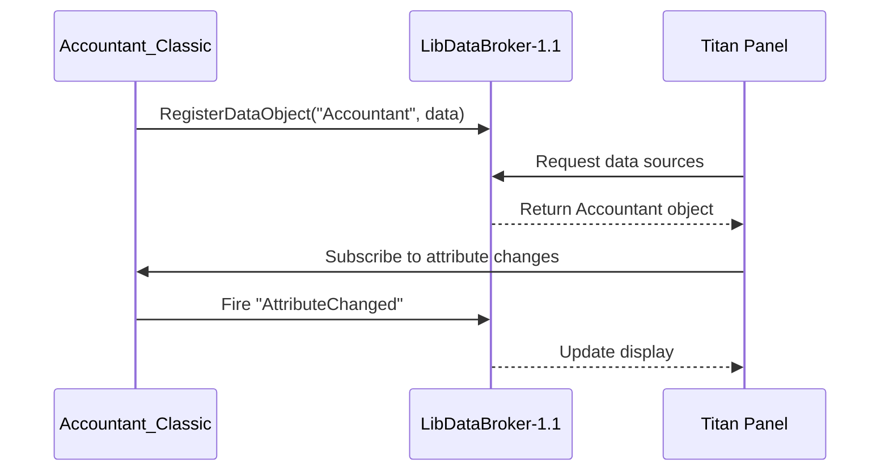

# Minimap and LDB Configuration

<cite>
**Referenced Files in This Document**   
- [Config.lua](file://Core/Config.lua#L0-L430)
- [LibDBIcon-1.0.lua](file://Libs/LibDBIcon-1.0/LibDBIcon-1.0.lua#L0-L571)
- [LibDataBroker-1.1.lua](file://Libs/LibDataBroker-1.1/LibDataBroker-1.1.lua#L0-L90)
</cite>

## Table of Contents
1. [Minimap Button Configuration](#minimap-button-configuration)  
2. [LibDataBroker (LDB) Integration](#libdatabroker-ldb-integration)  
3. [Tooltip and Display Options](#tooltip-and-display-options)  
4. [Position and Drag Behavior Management](#position-and-drag-behavior-management)  
5. [Troubleshooting Common Issues](#troubleshooting-common-issues)  
6. [Best Practices for Multi-Monitor Setups](#best-practices-for-multi-monitor-setups)  
7. [Integration with LDB-Compatible Display Addons](#integration-with-ldb-compatible-display-addons)

## Minimap Button Configuration

The minimap button in Accountant_Classic is managed through AceConfig and LibDBIcon-1.0, allowing users to toggle visibility, lock position, and control tooltip content. The configuration is defined in `Config.lua` under the "Minimap Button Settings" group.

Key options include:
- **Show minimap button**: Toggles the visibility of the minimap icon.
- **Show money**: Displays current character's money in the tooltip.
- **Show session info**: Includes session-based income and expenditure data in the tooltip.

The button state is controlled via the `minimap.hide` profile setting. When disabled, the button is shown; when enabled, it is hidden. The toggle function `AccountantClassic_ButtonToggle` is used to update this state.

```lua
minimapButton = {
    order = 22,
    type = "toggle",
    name = L["Show minimap button"],
    get = function()
        return not addon.db.profile.minimap.hide
    end,
    set = AccountantClassic_ButtonToggle,
}
```

Users can drag the button around the minimap perimeter when unlocked. The position is saved in `db.minimapPos` and restored on login.

**Section sources**
- [Config.lua](file://Core/Config.lua#L200-L230)

## LibDataBroker (LDB) Integration

Accountant_Classic integrates with LibDataBroker-1.1 to expose financial data to LDB-compatible display addons (e.g., Titan Panel, ChocolateBar). The addon registers a data object that provides real-time access to monetary statistics.

The LDB data object is created using `LibStub("LibDataBroker-1.1"):NewDataObject()`, though the actual registration occurs in core initialization not shown in the provided files. The data object supports attributes such as:
- `type`: Set to "data source"
- `text`: Dynamic display value based on user settings
- `OnClick`, `OnEnter`, `OnLeave`: Event handlers for user interaction

LibDataBroker enables third-party launchers to consume this data feed and display it in customizable formats. The `ldbDisplayType` option in the configuration allows users to select what data appears on LDB displays:
- Total
- This Session
- Today
- This Week
- This Month

```lua
ldbDisplayType = {
    order = 32,
    type = "select",
    name = L["LDB Display Type"],
    desc = L["Data type to be displayed on LDB"],
    values = function()
        local menu = { 
            L["Total"],
            L["This Session"],
            L["Today"],
            L["This Week"],
            L["This Month"],
        }
        return menu
    end,
}
```

**Section sources**
- [Config.lua](file://Core/Config.lua#L240-L260)
- [LibDataBroker-1.1.lua](file://Libs/LibDataBroker-1.1/LibDataBroker-1.1.lua#L0-L90)

## Tooltip and Display Options

The minimap button supports dynamic tooltip content based on user preferences. Two primary display modes are available:
- **Summary mode**: Shows only total money
- **Detailed mode**: Includes session, daily, weekly, and monthly breakdowns

Additional tooltip behaviors:
- **Show money on button**: Toggles money display in the tooltip
- **Show session info**: Adds session-based income and spending details
- **Instruction tips**: Enables contextual help tips on hover

Tooltip content is rendered via the `OnTooltipShow` handler registered with the LDB data object. If not defined, `OnEnter` is used as fallback. The tooltip uses `GameTooltip` anchored relative to the minimap button.

LibDBIcon-1.0 handles tooltip visibility based on mouse events:
- `onEnter`: Shows tooltip and stops fade-out animation
- `onLeave`: Hides tooltip and starts fade-out if configured

```lua
local function onEnter(self)
    if isDraggingButton then return end
    local obj = self.dataObject
    if obj.OnTooltipShow then
        lib.tooltip:SetOwner(self, "ANCHOR_NONE")
        lib.tooltip:SetPoint(getAnchors(self))
        obj.OnTooltipShow(lib.tooltip)
        lib.tooltip:Show()
    elseif obj.OnEnter then
        obj.OnEnter(self)
    end
end
```

**Section sources**
- [LibDBIcon-1.0.lua](file://Libs/LibDBIcon-1.0/LibDBIcon-1.0.lua#L80-L100)

## Position and Drag Behavior Management

LibDBIcon-1.0 manages the minimap button's position and drag behavior using a circular coordinate system. The button's position is stored as an angle (0–360 degrees) in `db.minimapPos`.

### Position Calculation
The `updatePosition` function converts the stored angle into x/y offsets from the minimap center:
- Uses trigonometric functions (`cos`, `sin`) to calculate coordinates
- Adjusts for minimap shape (round, square, corner-cut) via `GetMinimapShape()`
- Applies radius offset to prevent overlap with minimap border



**Diagram sources**
- [LibDBIcon-1.0.lua](file://Libs/LibDBIcon-1.0/LibDBIcon-1.0.lua#L130-L180)

### Drag Controls
- **Drag Start**: Triggers `onDragStart`, locks highlight, enables `OnUpdate`
- **OnUpdate**: Continuously updates position based on cursor
- **Drag Stop**: Saves position, unlocks highlight

The button can be locked via `lib:Lock(name)` which removes drag scripts:
```lua
function lib:Lock(name)
    local button = lib:GetMinimapButton(name)
    if button then
        button:SetScript("OnDragStart", nil)
        button:SetScript("OnDragStop", nil)
        if button.db then
            button.db.lock = true
        end
    end
end
```

**Section sources**
- [LibDBIcon-1.0.lua](file://Libs/LibDBIcon-1.0/LibDBIcon-1.0.lua#L130-L220)

## Troubleshooting Common Issues

### Missing Minimap Icon
**Symptoms**: Button does not appear on minimap  
**Causes and Solutions**:
- `minimap.hide = true` in profile → Use `/accountant config` to enable "Show minimap button"
- Button dragged behind UI elements → Reset position via configuration
- Addon load error → Check for Lua errors with `/console scriptErrors 1`

### Unresponsive Clicks
**Symptoms**: Clicking button does nothing  
**Causes**:
- `OnClick` handler not defined in data object
- Conflicting addons intercepting clicks
- Button obscured by other frames

**Debug Steps**:
1. Verify `dataObject.OnClick` is set
2. Test in clean UI (disable other addons)
3. Use `LibDBIcon10_<name>:GetPoint()` to check visibility

### Incorrect Tooltip Data
**Symptoms**: Tooltip shows outdated or wrong values  
**Causes**:
- Data not refreshed after session change
- Localization issues in number formatting

**Fix**:
- Ensure `addon:Refresh()` is called after data updates
- Verify `breakupnumbers` setting for number formatting

### Position Reset on Login
**Cause**: `db.minimapPos` not saved properly  
**Solution**: Confirm `db` table is registered with AceDB and profile is active

**Section sources**
- [Config.lua](file://Core/Config.lua#L200-L230)
- [LibDBIcon-1.0.lua](file://Libs/LibDBIcon-1.0/LibDBIcon-1.0.lua#L130-L220)

## Best Practices for Multi-Monitor Setups

When using multiple monitors, minimap button positioning can be affected by UI scale and screen resolution differences.

### Recommendations:
- **Use relative positioning**: LibDBIcon-1.0 automatically adjusts for minimap position
- **Avoid extreme aspect ratios**: Prevents distortion in coordinate calculation
- **Test on primary and secondary displays**: Ensure button remains accessible
- **Enable "showOnMouseover"**: Reduces screen clutter when not needed

### Configuration Tips:
- Set `showOnMouseover = true` for temporary visibility
- Use `SetButtonRadius(radius)` to adjust distance from minimap edge
- Save separate profiles per character if monitors differ significantly

```lua
-- Example: Adjust radius for high-resolution displays
LibDBIcon10:SetButtonRadius(10)
```

**Section sources**
- [LibDBIcon-1.0.lua](file://Libs/LibDBIcon-1.0/LibDBIcon-1.0.lua#L30-L40)

## Integration with LDB-Compatible Display Addons

Accountant_Classic's LDB data object seamlessly integrates with popular display addons:

### Supported Launchers:
- **Titan Panel**: Shows as selectable module
- **ChocolateBar**: Appears in bar dropdown
- **ElvUI**: Integrates into datatext panels
- **NDui**: Supports as custom data text

### Data Flow:


**Diagram sources**
- [LibDataBroker-1.1.lua](file://Libs/LibDataBroker-1.1/LibDataBroker-1.1.lua#L50-L70)

### Best Practices:
- Use `ldb:DataObjectIterator()` to discover available sources
- Handle `LibDataBroker_DataObjectCreated` events for dynamic loading
- Respect `OnTooltipShow` vs `OnEnter` preference in display addons

Users can switch between LDB display types (Total, Session, etc.) without restarting the UI, as changes are propagated via attribute callbacks.

**Section sources**
- [LibDataBroker-1.1.lua](file://Libs/LibDataBroker-1.1/LibDataBroker-1.1.lua#L0-L90)