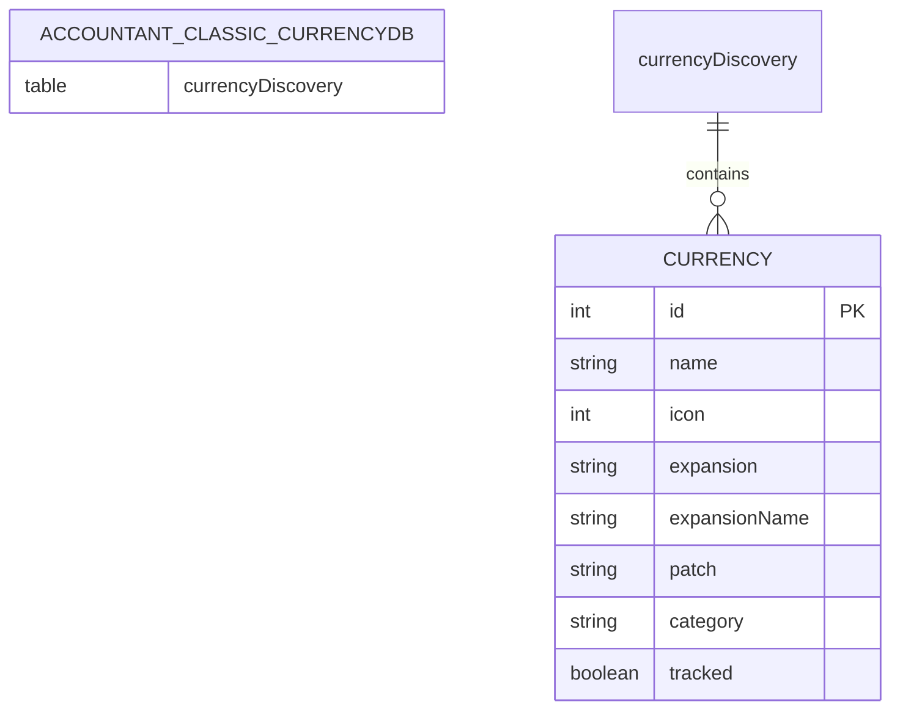
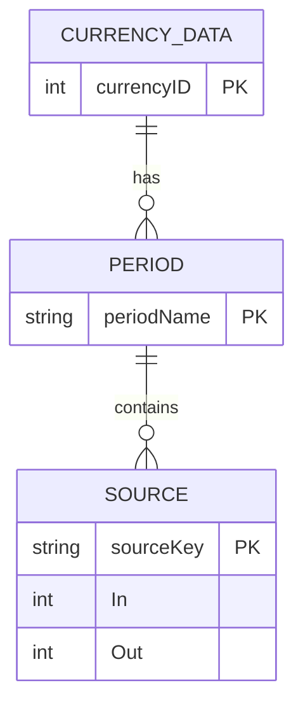
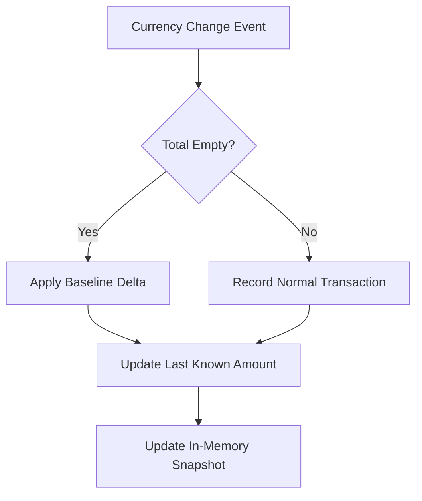
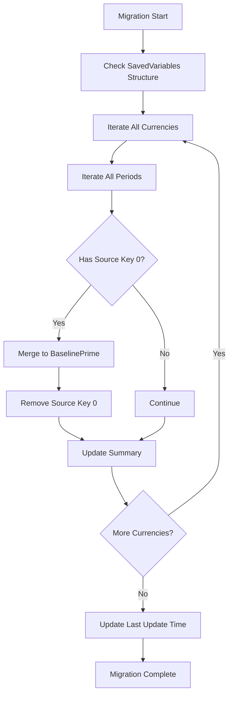
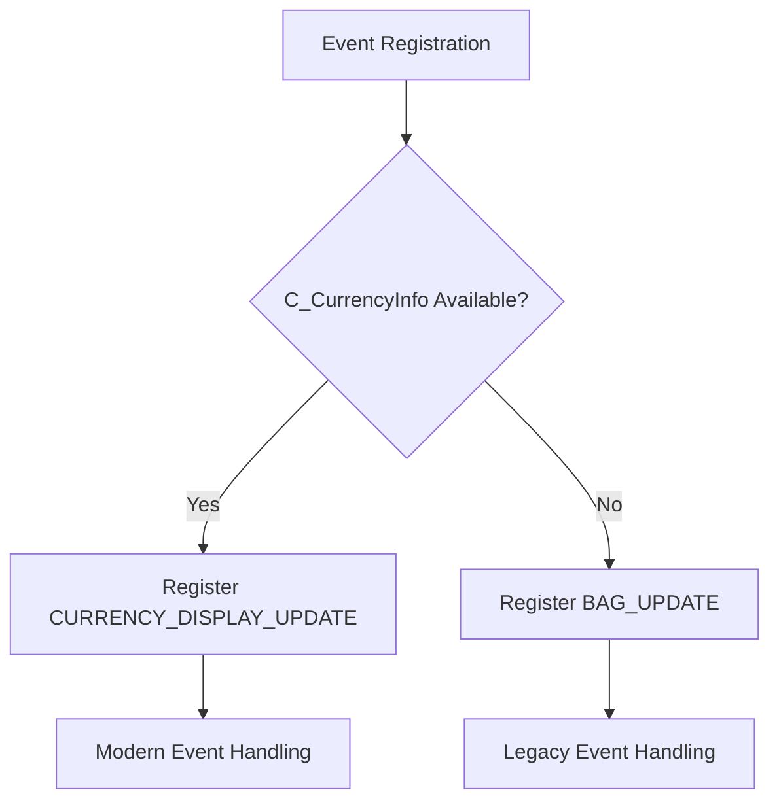

# Currency Data Model

<cite>
**Referenced Files in This Document**   
- [CurrencyStorage.lua](file://CurrencyTracker/CurrencyStorage.lua)
- [CurrencyDataManager.lua](file://CurrencyTracker/CurrencyDataManager.lua)
- [CurrencyConstants.lua](file://CurrencyTracker/CurrencyConstants.lua)
- [CurrencyEventHandler.lua](file://CurrencyTracker/CurrencyEventHandler.lua)
- [CurrencyCore.lua](file://CurrencyTracker/CurrencyCore.lua)
- [CurrencyFrame.lua](file://CurrencyTracker/CurrencyFrame.lua)
- [CurrencyTracker-Usage.md](file://Docs/CurrencyTracker-Usage.md)
- [CharacterLogin-Process-Flow.md](file://Docs/CharacterLogin-Process-Flow.md)
- [Traders-Tender-Process-Flow.md](file://Docs/Traders-Tender-Process-Flow.md)
</cite>

## Table of Contents
1. [Introduction](#introduction)
2. [Account-Wide Discovery Storage](#account-wide-discovery-storage)
3. [Period-Based Aggregation Structure](#period-based-aggregation-structure)
4. [Baseline Handling Mechanisms](#baseline-handling-mechanisms)
5. [Migration Process](#migration-process)
6. [Backward Compatibility Considerations](#backward-compatibility-considerations)

## Introduction
The Currency Data Model is a comprehensive system designed to track, store, and manage in-game currency data within the Accountant Classic addon. It provides robust mechanisms for dynamic currency discovery, time-based aggregation, baseline reconciliation, and backward compatibility across different World of Warcraft client versions. This document details the core components of the model, focusing on its account-wide discovery storage, period-based aggregation structure, baseline handling mechanisms, migration process, and backward compatibility considerations.

**Section sources**
- [CurrencyStorage.lua](file://CurrencyTracker/CurrencyStorage.lua#L1-L1222)
- [CurrencyDataManager.lua](file://CurrencyTracker/CurrencyDataManager.lua#L1-L426)
- [CurrencyConstants.lua](file://CurrencyTracker/CurrencyConstants.lua#L1-L555)

## Account-Wide Discovery Storage
The account-wide discovery storage mechanism enables the tracking of dynamically discovered currencies across characters. This system ensures that once a currency is discovered on one character, its metadata is available account-wide, promoting consistency and reducing redundant discovery.

The discovery storage is managed through the `Accountant_Classic_CurrencyDB` global table, which contains a `currencyDiscovery` sub-table. This structure is initialized during the storage initialization process and is designed to be persistent across sessions.

**Diagram sources**
- [CurrencyStorage.lua](file://CurrencyTracker/CurrencyStorage.lua#L345-L380)

Currency discovery occurs when a currency ID is encountered that is not present in the predefined `SupportedCurrencies` list. The `SaveDiscoveredCurrency` function captures basic metadata such as name, icon, expansion, patch, and category from the live WoW API and stores it in the account-wide discovery database. This metadata is then merged with the supported currencies list to provide a comprehensive view of all available currencies.

The discovery process includes a normalization step that converts string numeric keys to actual numeric keys, ensuring consistent key types throughout the storage structure. This normalization is performed during storage initialization to maintain data integrity.

**Section sources**
- [CurrencyStorage.lua](file://CurrencyTracker/CurrencyStorage.lua#L345-L380)
- [CurrencyDataManager.lua](file://CurrencyTracker/CurrencyDataManager.lua#L125-L155)
- [CurrencyEventHandler.lua](file://CurrencyTracker/CurrencyEventHandler.lua#L570-L585)

## Period-Based Aggregation Structure
The period-based aggregation structure organizes currency data across multiple timeframes, enabling detailed analysis of income and expenditure patterns. The system tracks data for the following periods: Session, Day, Week, Month, Year, and Total.

Each currency maintains a separate data structure for each timeframe, with each period containing entries for different transaction sources. The data structure for each source includes income (In) and outgoing (Out) amounts, allowing for precise tracking of currency flows.

**Diagram sources**
- [CurrencyStorage.lua](file://CurrencyTracker/CurrencyStorage.lua#L670-L720)

The aggregation system automatically handles period rollovers, shifting data from current periods (Day, Week, Month, Year) to their previous counterparts (PrvDay, PrvWeek, PrvMonth, PrvYear) when appropriate. This rollover is triggered during login or when the system detects a change in the relevant time period.

The `ShiftCurrencyLogs` function performs this rollover by copying the current period data to the previous period bucket and resetting the current period. This ensures that historical data is preserved while maintaining clean current period aggregates.

**Section sources**
- [CurrencyStorage.lua](file://CurrencyTracker/CurrencyStorage.lua#L425-L540)
- [CurrencyDataManager.lua](file://CurrencyTracker/CurrencyDataManager.lua#L250-L280)

## Baseline Handling Mechanisms
The baseline handling mechanisms ensure that the tracker's recorded totals align with the player's actual currency holdings, particularly for account-wide currencies that may be modified outside the player's current session.

The system employs a "BaselinePrime" source key to record initial balances and reconciliation adjustments. This special source is used exclusively in the Total period to avoid skewing time-based aggregates. The `ApplyTotalOnlyBaselineDelta` function adjusts the baseline by applying signed deltas to either income (for positive deltas) or outgoing (for negative deltas).

**Diagram sources**
- [CurrencyStorage.lua](file://CurrencyTracker/CurrencyStorage.lua#L55-L90)
- [CurrencyEventHandler.lua](file://CurrencyTracker/CurrencyEventHandler.lua#L599-L628)

Baseline priming occurs at login time through the `PrimeDiscoveredCurrenciesOnLogin` function, which compares the live currency amount with the stored total and applies any necessary reconciliation. This process ensures that the tracker starts with an accurate baseline for all discovered currencies.

For currencies with unreliable change notifications (such as Trader's Tender), a specialized handler (`HandleZeroChangeCurrency`) infers transaction amounts by comparing the current amount with the last known amount, ensuring accurate tracking even when the API reports zero change.

**Section sources**
- [CurrencyStorage.lua](file://CurrencyTracker/CurrencyStorage.lua#L55-L90)
- [CurrencyEventHandler.lua](file://CurrencyTracker/CurrencyEventHandler.lua#L53-L220)
- [CurrencyCore.lua](file://CurrencyTracker/CurrencyCore.lua#L484-L517)

## Migration Process
The migration process ensures smooth transitions between different data storage formats and handles legacy data from previous versions of the addon.

The primary migration function, `MigrateZeroSourceToBaselinePrime`, converts legacy numeric source key 0 to the string key "BaselinePrime" across all timeframes. This cosmetic repair prevents the display of "ConvertOldItem" for unknown or baseline transactions, improving user experience.

**Diagram sources**
- [CurrencyStorage.lua](file://CurrencyTracker/CurrencyStorage.lua#L92-L156)

The migration process also includes a one-time per-character discovery migration that moves currency discovery data from character-specific storage to the account-wide `Accountant_Classic_CurrencyDB`. This migration is performed during storage initialization and is marked with a `_currencyDiscoveryMigrated` flag to prevent repeated execution.

Additionally, the system handles version-based migrations through the `MigrateData` function, which can be extended to accommodate future data structure changes while maintaining backward compatibility.

**Section sources**
- [CurrencyStorage.lua](file://CurrencyTracker/CurrencyStorage.lua#L92-L156)
- [CurrencyStorage.lua](file://CurrencyTracker/CurrencyStorage.lua#L345-L380)

## Backward Compatibility Considerations
The currency data model incorporates several backward compatibility mechanisms to ensure seamless operation across different World of Warcraft client versions and addon configurations.

The system maintains compatibility with both modern and legacy currency tracking APIs. When the modern `C_CurrencyInfo` API is available, it is used for currency information and event handling. Otherwise, the system falls back to the legacy `BAG_UPDATE` events for currency change detection.

**Diagram sources**
- [CurrencyEventHandler.lua](file://CurrencyTracker/CurrencyEventHandler.lua#L300-L330)

The data storage structure is designed to be additive, allowing new fields to be added without breaking compatibility with older versions. Default values are provided for missing fields, and the system gracefully handles the absence of optional components.

The repair system includes functions like `RepairRemove` and `AdjustCurrencyAggregates` that allow manual correction of data inconsistencies while maintaining the integrity of the overall data structure. These functions operate across all relevant periods and include safety checks to prevent invalid operations.

The system also provides backward compatibility for source keys, supporting both numeric and string representations and performing case-insensitive matching for common aliases like "Unknown" and "BaselinePrime".

**Section sources**
- [CurrencyEventHandler.lua](file://CurrencyTracker/CurrencyEventHandler.lua#L300-L330)
- [CurrencyStorage.lua](file://CurrencyTracker/CurrencyStorage.lua#L192-L223)
- [CurrencyCore.lua](file://CurrencyTracker/CurrencyCore.lua#L133-L165)