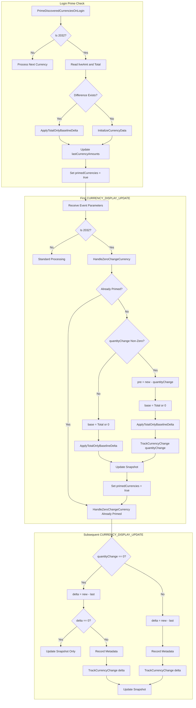
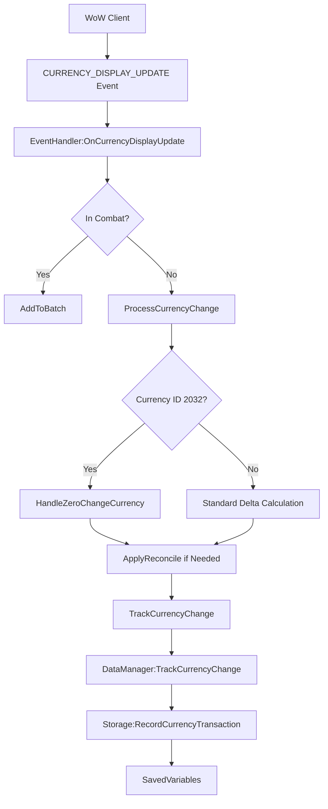

# Currency Event Processing Pipeline

<cite>
**Referenced Files in This Document**   
- [CurrencyEventHandler.lua](file://CurrencyTracker/CurrencyEventHandler.lua)
- [CurrencyStorage.lua](file://CurrencyTracker/CurrencyStorage.lua)
- [CurrencyDataManager.lua](file://CurrencyTracker/CurrencyDataManager.lua)
- [Traders-Tender-Process-Flow.md](file://Docs/Traders-Tender-Process-Flow.md)
- [CharacterLogin-Process-Flow.md](file://Docs/CharacterLogin-Process-Flow.md)
</cite>

## Table of Contents
1. [Introduction](#introduction)
2. [Event Registration and Initialization](#event-registration-and-initialization)
3. [Zero-Change Handling Logic](#zero-change-handling-logic)
4. [Login Priming Sequence](#login-priming-sequence)
5. [Baseline Reconciliation Mechanism](#baseline-reconciliation-mechanism)
6. [Trader's Tender Specialized Processing](#traders-tender-specialized-processing)
7. [Data Flow and Component Interactions](#data-flow-and-component-interactions)
8. [Error Handling and Edge Cases](#error-handling-and-edge-cases)

## Introduction
The Currency Event Processing Pipeline is responsible for monitoring, processing, and recording currency changes in the Accountant Classic addon. This system handles various currency-related events, implements specialized logic for problematic currencies like Trader's Tender, and ensures accurate tracking through proper initialization, priming, and reconciliation mechanisms. The pipeline integrates with World of Warcraft's event system to capture currency changes and maintain persistent storage across sessions.

## Event Registration and Initialization
The event processing pipeline begins with the registration of relevant World of Warcraft events through the EventHandler module. The system registers core events including ADDON_LOADED, PLAYER_LOGIN, PLAYER_ENTERING_WORLD, and PLAYER_LOGOUT to manage the lifecycle of currency tracking. For currency change detection, it prioritizes the modern CURRENCY_DISPLAY_UPDATE event when available through the C_CurrencyInfo API, falling back to BAG_UPDATE for older clients that lack this functionality.

The initialization process creates an event frame that listens for these registered events and routes them to appropriate handler functions. This dual-path approach ensures compatibility across different WoW client versions while optimizing for the most reliable event source available. The registration process includes debug logging to verify successful event binding and provides clear feedback about which event system is active.

**Section sources**
- [CurrencyEventHandler.lua](file://CurrencyTracker/CurrencyEventHandler.lua#L279-L310)
- [CharacterLogin-Process-Flow.md](file://Docs/CharacterLogin-Process-Flow.md#L0-L51)

## Zero-Change Handling Logic
The pipeline implements sophisticated zero-change handling to address unreliable event reporting from the WoW API. When currency events report a quantity change of zero or nil, the system employs a fallback mechanism that calculates the actual change by comparing the current amount with the last known amount from storage. This prevents missed transactions when the API fails to report accurate deltas.

The handling logic includes argument normalization to accommodate variations in event payload format across different client versions. For events received during combat, updates are batched and processed after combat ends to maintain performance. Legacy BAG_UPDATE events are further debounced with a 0.3-second timer to coalesce rapid bursts of bag changes into a single currency check.

**Section sources**
- [CurrencyEventHandler.lua](file://CurrencyTracker/CurrencyEventHandler.lua#L493-L511)
- [CurrencyEventHandler.lua](file://CurrencyTracker/CurrencyEventHandler.lua#L542-L570)

## Login Priming Sequence
The login priming sequence ensures accurate baseline currency tracking at the start of each session. Triggered by the PLAYER_ENTERING_WORLD event with appropriate guards to prevent execution during zone changes or UI reloads, this sequence runs exactly once per session. It iterates through all discovered currencies, comparing live amounts with stored totals to identify discrepancies.

For each currency, if a difference exists between the live amount and stored total, the system applies a baseline correction delta to the Total period without affecting time-bucketed data. This reconciliation ensures that the tracking system starts with an accurate baseline that reflects the player's actual currency holdings. The sequence also seeds in-memory snapshots to prevent drift and ensures proper initialization of currency data structures.

**Section sources**
- [CurrencyEventHandler.lua](file://CurrencyTracker/CurrencyEventHandler.lua#L388-L448)
- [CharacterLogin-Process-Flow.md](file://Docs/CharacterLogin-Process-Flow.md#L0-L51)

## Baseline Reconciliation Mechanism
The baseline reconciliation mechanism provides a robust system for correcting currency tracking discrepancies. The core of this system is the ApplyTotalOnlyBaselineDelta function in the Storage module, which applies signed deltas exclusively to the Total period using a special "BaselinePrime" source key. Positive deltas increase income, while negative deltas increase outgoing amounts in this baseline category.

This mechanism is used in multiple scenarios: during login priming to reconcile initial discrepancies, as a safety guard when processing early events before login priming completes, and for specialized currencies with unreliable change reporting. The reconciliation process carefully preserves the integrity of time-bucketed data (Session, Day, Week, etc.) while ensuring the Total period accurately reflects the player's currency history.

**Section sources**
- [CurrencyStorage.lua](file://CurrencyTracker/CurrencyStorage.lua#L15-L47)
- [CurrencyEventHandler.lua](file://CurrencyTracker/CurrencyEventHandler.lua#L32-L34)

## Trader's Tender Specialized Processing
Trader's Tender (currency ID 2032) receives specialized processing due to its unreliable API reporting, where quantityChange is frequently reported as zero even when the currency amount has changed. The dedicated HandleZeroChangeCurrency function implements a multi-phase approach to handle this edge case correctly.

During the first sighting in a session, if quantityChange is zero or nil, the system performs a Total-only reconciliation based on the difference between the new amount and the last known total, then primes the currency in memory. If quantityChange is non-zero, it calculates the pre-change amount and reconciles any baseline discrepancy before recording the normal transaction. Subsequent events use the inferred delta (new - last) to ensure accurate tracking regardless of the API-reported change value.

**Diagram sources**
- [Traders-Tender-Process-Flow.md](file://Docs/Traders-Tender-Process-Flow.md#L0-L50)
- [CurrencyEventHandler.lua](file://CurrencyTracker/CurrencyEventHandler.lua#L53-L76)

**Section sources**
- [CurrencyEventHandler.lua](file://CurrencyTracker/CurrencyEventHandler.lua#L53-L187)
- [Traders-Tender-Process-Flow.md](file://Docs/Traders-Tender-Process-Flow.md#L0-L50)

## Data Flow and Component Interactions
The currency event processing pipeline follows a well-defined data flow from event receipt to persistent storage. Events are captured by the EventHandler, which normalizes parameters and routes them to appropriate processing functions. The ProcessCurrencyChange function serves as the central hub, performing dynamic currency discovery, applying rollover logic, and delegating to specialized handlers when needed.

Currency changes are ultimately recorded through the DataManager, which interfaces with the Storage module to persist transaction data across time periods (Session, Day, Week, Month, Year, Total). The Storage module ensures proper data structure initialization, handles backward compatibility, and maintains data integrity through validation routines. This layered architecture separates concerns between event handling, business logic, and data persistence.

**Diagram sources**
- [CurrencyEventHandler.lua](file://CurrencyTracker/CurrencyEventHandler.lua#L53-L76)
- [CurrencyDataManager.lua](file://CurrencyTracker/CurrencyDataManager.lua#L50-L75)

**Section sources**
- [CurrencyEventHandler.lua](file://CurrencyTracker/CurrencyEventHandler.lua#L53-L76)
- [CurrencyDataManager.lua](file://CurrencyTracker/CurrencyDataManager.lua#L50-L75)
- [CurrencyStorage.lua](file://CurrencyTracker/CurrencyStorage.lua#L150-L180)

## Error Handling and Edge Cases
The pipeline includes comprehensive error handling for various edge cases and potential failure points. The system verifies the existence of required SavedVariables structures before attempting data operations and provides safe logging functions that work even when the main logger is not yet initialized. Currency ID normalization ensures consistent numeric key usage across the system.

For currencies with unreliable change reporting, the system implements fallback mechanisms that rely on direct amount comparisons rather than trusting the API-reported delta. The priming system includes guards to prevent multiple executions during the same session and handles cases where live reads might return nil values. The storage layer includes data validation and migration routines to handle version upgrades and structural changes while preserving existing data.

**Section sources**
- [CurrencyEventHandler.lua](file://CurrencyTracker/CurrencyEventHandler.lua#L32-L34)
- [CurrencyStorage.lua](file://CurrencyTracker/CurrencyStorage.lua#L200-L230)
- [CurrencyEventHandler.lua](file://CurrencyTracker/CurrencyEventHandler.lua#L197-L205)