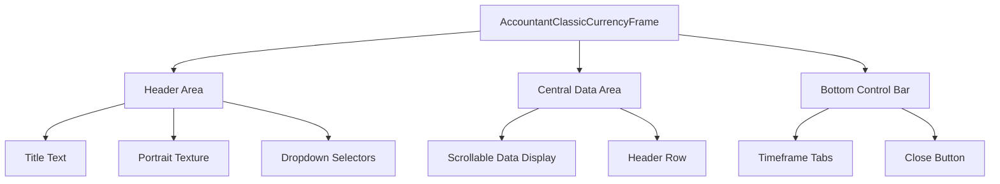
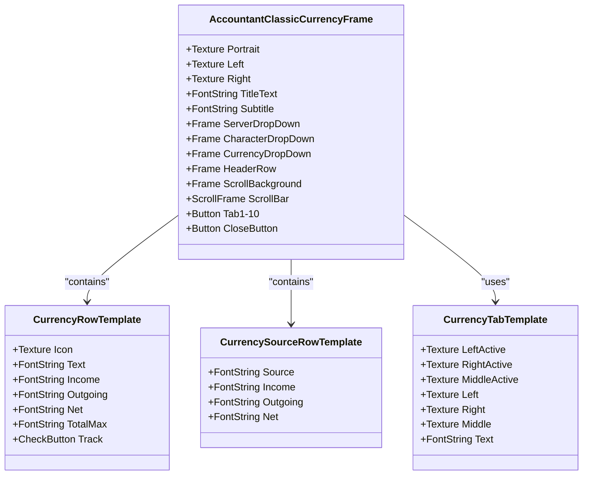
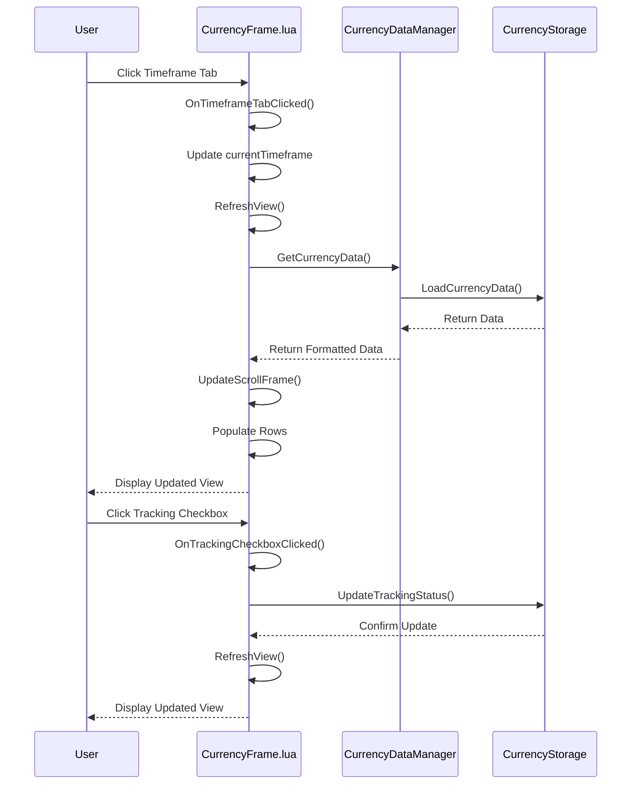
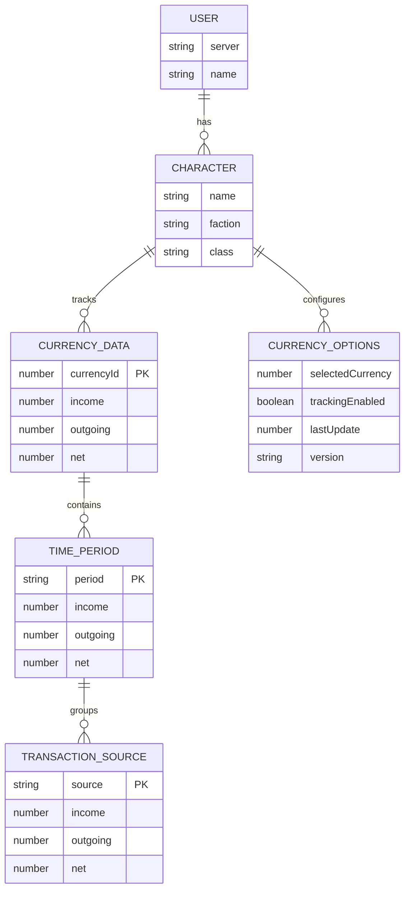
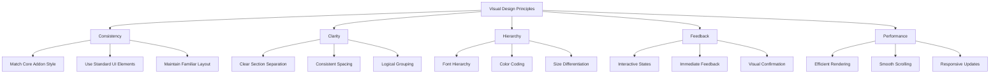
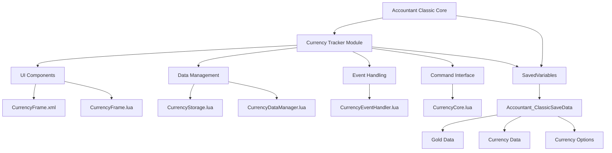

# Currency UI Components

<cite>
**Referenced Files in This Document**   
- [CurrencyFrame.xml](file://CurrencyTracker/CurrencyFrame.xml)
- [CurrencyFrame.lua](file://CurrencyTracker/CurrencyFrame.lua)
- [CurrencyCore.lua](file://CurrencyTracker/CurrencyCore.lua)
- [CurrencyStorage.lua](file://CurrencyTracker/CurrencyStorage.lua)
- [CurrencyDataManager.lua](file://CurrencyTracker/CurrencyDataManager.lua)
- [CurrencyConstants.lua](file://CurrencyTracker/CurrencyConstants.lua)
- [CurrencyEventHandler.lua](file://CurrencyTracker/CurrencyEventHandler.lua)
- [CurrencyTemplate.xml](file://CurrencyTracker/CurrencyTemplate.xml)
- [CurrencyTracker.xml](file://CurrencyTracker/CurrencyTracker.xml)
- [Core.xml](file://Core/Core.xml)
- [Template.xml](file://Core/Template.xml)
- [CurrencyTracker-UI-Design.md](file://Docs/CurrencyTracker-UI-Design.md)
</cite>

## Table of Contents
1. [Introduction](#introduction)
2. [Frame Structure](#frame-structure)
3. [XML Layout](#xml-layout)
4. [Lua Controller Logic](#lua-controller-logic)
5. [State Management](#state-management)
6. [Command Access](#command-access)
7. [Visual Design Principles](#visual-design-principles)
8. [Integration with Existing Addon UI](#integration-with-existing-addon-ui)
9. [Conclusion](#conclusion)

## Introduction
The Currency Tracker UI components provide a dedicated interface for monitoring and managing in-game currency data within the Accountant Classic addon. This documentation details the structure, implementation, and integration of the currency tracking system, which operates alongside the existing gold tracking functionality. The UI is designed to maintain visual consistency with the main addon while providing specialized features for currency management, including persistent state storage, command-line access, and dynamic data presentation.

**Section sources**
- [CurrencyTracker-UI-Design.md](file://Docs/CurrencyTracker-UI-Design.md#L1-L152)

## Frame Structure
The Currency Tracker UI is built around a primary frame structure that mirrors the design of the existing Accountant Classic main window. The main frame, `AccountantClassicCurrencyFrame`, serves as the container for all UI elements and is defined in the `CurrencyFrame.xml` file. This frame inherits key visual properties from the core addon, including dimensions (640x512), positioning (TOPLEFT at 0, -104), and background textures (`AccountantClassicFrame-Left` and `AccountantClassicFrame-Right`).

The frame structure is organized into three main sections: a top header area, a central data display area, and a bottom control bar. The header contains the window title, a portrait texture, and dropdown selectors for server, character, and currency selection. The central area features a scrollable data display with a fixed header row that labels the columns. The bottom control bar contains a series of tabs for selecting timeframes and a close button for dismissing the window.

The frame utilizes a layered approach for rendering, with background textures, artwork, and interactive elements organized into distinct layers. This structure ensures proper visual hierarchy and interaction handling. The frame is designed to be movable and clamped to the screen, providing users with flexibility in window placement while preventing it from being positioned off-screen.



**Diagram sources**
- [CurrencyFrame.xml](file://CurrencyTracker/CurrencyFrame.xml#L1-L672)

**Section sources**
- [CurrencyFrame.xml](file://CurrencyTracker/CurrencyFrame.xml#L1-L672)

## XML Layout
The XML layout for the Currency Tracker UI is defined in the `CurrencyFrame.xml` file and follows the World of Warcraft UI framework conventions. The layout is structured to provide a consistent user experience that matches the existing Accountant Classic interface. The primary frame, `AccountantClassicCurrencyFrame`, is defined with attributes that control its behavior, including `toplevel="true"` for window management, `enableMouse="true"` for interaction, and `movable="true"` for repositioning.

The layout includes several key templates that define reusable UI components. The `CurrencyRowTemplate` defines the structure for individual data rows, containing elements for currency icons, names, and financial data (income, outgoing, net, and total maximum). This template is instantiated multiple times to create the data display area. The `CurrencySourceRowTemplate` provides a similar structure for displaying transaction sources when viewing detailed currency information.

The header row is implemented as a separate frame with font strings for column labels, ensuring proper alignment with the data rows. The bottom control bar uses a series of button elements with the `CurrencyTabTemplate` to create the timeframe selection tabs. These tabs are arranged in a two-row layout that matches the design of the gold tracking interface, with the first row containing Session, Day, Week, Month, and Year tabs, and the second row containing PrvDay, PrvWeek, PrvMonth, PrvYear, and Total tabs.

The layout also includes a scroll frame, `AccountantClassicCurrencyScrollBar`, which manages the display of multiple data rows. This frame is configured to work with the `FauxScrollFrameTemplate`, providing smooth scrolling behavior and proper event handling. The scroll frame is positioned to align with the data rows and is sized to fill the available space in the central area of the window.



**Diagram sources**
- [CurrencyFrame.xml](file://CurrencyTracker/CurrencyFrame.xml#L1-L672)
- [CurrencyTemplate.xml](file://CurrencyTracker/CurrencyTemplate.xml#L1-L76)

**Section sources**
- [CurrencyFrame.xml](file://CurrencyTracker/CurrencyFrame.xml#L1-L672)
- [CurrencyTemplate.xml](file://CurrencyTracker/CurrencyTemplate.xml#L1-L76)

## Lua Controller Logic
The Lua controller logic for the Currency Tracker UI is implemented in the `CurrencyFrame.lua` file and is responsible for managing the behavior and interaction of the UI components. The controller is organized as a module within the `CurrencyTracker` namespace, specifically as `CurrencyTracker.CurrencyFrame`. This module handles initialization, data binding, user interactions, and state management for the currency tracking interface.

The controller implements several key functions for managing the UI state. The `Initialize` function sets up the initial state of the UI, including creating references to UI elements, setting up event handlers, and initializing data structures. The `Show` and `Hide` functions control the visibility of the main frame, while the `RefreshView` function updates the display with current data based on the selected timeframe and currency.

A critical aspect of the controller logic is the handling of user interactions through event callbacks. The `OnTimeframeTabClicked` function responds to clicks on the timeframe tabs, updating the current timeframe and refreshing the display. The `OnTrackingCheckboxClicked` function handles changes to the tracking status of currencies, updating the persistent storage and refreshing the view. The controller also includes functions for managing dropdown selectors, such as `CreateCurrencyDropdown` and `PopulateCurrencyDropdown`, which provide the user with options for selecting servers, characters, and specific currencies to view.

The controller implements a sophisticated data management system that separates the display logic from the data retrieval logic. It uses the `CurrencyDataManager` module to fetch currency data and then formats this data for display in the UI. The `UpdateScrollFrame` function is responsible for populating the data rows with information, handling both the "all currencies" view and the detailed view for a specific currency. This function manages the scrolling behavior, ensuring that only the visible rows are updated for performance optimization.



**Diagram sources**
- [CurrencyFrame.lua](file://CurrencyTracker/CurrencyFrame.lua#L1-L1220)

**Section sources**
- [CurrencyFrame.lua](file://CurrencyTracker/CurrencyFrame.lua#L1-L1220)

## State Management
State management in the Currency Tracker UI is implemented through a combination of in-memory state variables and persistent storage using the SavedVariables system. The controller maintains several key state variables that track the current UI configuration, including `currentTimeframe`, `currentCurrencyId`, `currentServer`, and `currentCharacter`. These variables are updated in response to user interactions and are used to determine which data to display.

The persistent state is managed through the `CurrencyStorage` module, which extends the existing `Accountant_ClassicSaveData` structure with currency-specific fields. The storage system uses an additive approach that preserves backward compatibility with older versions of the addon. The new structure includes a `currencyData` field for storing transaction data for each currency and a `currencyOptions` field for storing user preferences and settings.

The `currencyData` structure is organized hierarchically by currency ID, timeframe, and source, allowing for efficient data retrieval and aggregation. Each currency has entries for different time periods (Session, Day, Week, Month, Year, Total), and within each period, transactions are grouped by source. This structure enables the UI to display data at different levels of granularity, from a summary view across all currencies to a detailed breakdown of transactions for a specific currency.

The `currencyOptions` structure stores user preferences such as the selected currency, tracking enabled status, and last update timestamp. It also includes a version field to support data migration when the addon is updated. The storage system implements a migration strategy that ensures data integrity when moving between versions, including functions to initialize new fields, migrate data from old formats, and validate the structure of saved data.

The state management system also includes functions for saving and loading UI state, allowing users to return to their previous configuration when reopening the currency tracker. The `SaveUIState` and `LoadUIState` functions handle the persistence of the current selections for timeframe, currency, server, and character, ensuring a consistent user experience across sessions.



**Diagram sources**
- [CurrencyStorage.lua](file://CurrencyTracker/CurrencyStorage.lua#L1-L1222)
- [CurrencyDataManager.lua](file://CurrencyTracker/CurrencyDataManager.lua#L1-L425)

**Section sources**
- [CurrencyStorage.lua](file://CurrencyTracker/CurrencyStorage.lua#L1-L1222)
- [CurrencyDataManager.lua](file://CurrencyTracker/CurrencyDataManager.lua#L1-L425)

## Command Access
Command access to the Currency Tracker UI is provided through the slash command `/ct ui`, which opens, focuses, or displays the currency tracking window. This command is registered in the `CurrencyCore.lua` file and is part of the broader set of currency tracking commands. When executed, the command calls the `OpenUI` function, which in turn invokes the `Show` method on the `CurrencyFrame` controller.

The command system is designed to be extensible, allowing for additional functionality to be added in the future. The `OpenUI` function serves as a gateway to the UI components, ensuring that the necessary modules are initialized before displaying the window. This function checks for the existence of the UI controller and delegates to it if available, providing a clean separation between the command interface and the UI implementation.

In addition to the primary `/ct ui` command, the system supports a range of other commands for managing currency data, such as `/ct show` for displaying specific currency information and `/ct discover` for managing discovered currencies. These commands operate on the same underlying data structures as the UI, ensuring consistency between the command-line interface and the graphical interface.

The command access system also includes error handling and feedback mechanisms. If the UI components are not available or fail to initialize, the system provides appropriate error messages to the user. The `OpenUI` function includes fallback behavior that displays currency data in the chat window if the UI cannot be displayed, ensuring that users can still access their currency information even if the graphical interface is unavailable.

```mermaid
flowchart TD
A[/ct ui] --> B{UI Available?}
B --> |Yes| C[Call CurrencyFrame:Show()]
B --> |No| D[Display Data in Chat]
C --> E[Initialize UI Components]
E --> F[Load Saved State]
F --> G[Refresh View]
G --> H[Display Window]
D --> I[Call PrintMultipleCurrencies]
I --> J[Display in Chat]
```

**Diagram sources**
- [CurrencyCore.lua](file://CurrencyTracker/CurrencyCore.lua#L1-L1414)

**Section sources**
- [CurrencyCore.lua](file://CurrencyTracker/CurrencyCore.lua#L1-L1414)

## Visual Design Principles
The visual design of the Currency Tracker UI follows several key principles to ensure consistency, usability, and aesthetic appeal. The primary design principle is consistency with the existing Accountant Classic interface, which provides a familiar user experience and reduces the learning curve for users. This is achieved through the use of matching visual elements, including the same window dimensions, background textures, font styles, and color scheme.

The layout follows a clean, hierarchical structure that prioritizes important information and provides clear visual separation between different sections of the interface. The use of consistent spacing, alignment, and grouping helps users quickly understand the relationship between different elements and navigate the interface efficiently. The column layout in the data display area is carefully designed to provide adequate space for currency names while right-aligning numerical values for easy comparison.

Typography plays a crucial role in the visual design, with different font styles used to distinguish between different types of information. The `GameFontHighlight` style is used for column headers and important labels, while the `GameFontNormalSmall` style is used for data values. This creates a clear visual hierarchy that guides the user's attention to the most important information.

The UI incorporates subtle visual feedback mechanisms to enhance usability. The `CurrencyTabTemplate` includes active and inactive states for the timeframe tabs, providing clear visual indication of the currently selected timeframe. The tracking checkboxes use standard UI controls that are familiar to users, and their state is immediately reflected in the display. The use of consistent iconography, such as the standard close button, further enhances the familiarity and usability of the interface.

The design also considers performance and responsiveness, with optimizations to ensure smooth scrolling and quick updates. The use of the `FauxScrollFrameTemplate` provides efficient rendering of large datasets, while the separation of display logic from data retrieval ensures that the UI remains responsive even when processing large amounts of data.



**Diagram sources**
- [CurrencyFrame.xml](file://CurrencyTracker/CurrencyFrame.xml#L1-L672)
- [CurrencyTemplate.xml](file://CurrencyTracker/CurrencyTemplate.xml#L1-L76)
- [Core.xml](file://Core/Core.xml#L1-L626)
- [Template.xml](file://Core/Template.xml#L1-L179)

**Section sources**
- [CurrencyFrame.xml](file://CurrencyTracker/CurrencyFrame.xml#L1-L672)
- [CurrencyTemplate.xml](file://CurrencyTracker/CurrencyTemplate.xml#L1-L76)
- [Core.xml](file://Core/Core.xml#L1-L626)
- [Template.xml](file://Core/Template.xml#L1-L179)

## Integration with Existing Addon UI
The Currency Tracker UI is designed to integrate seamlessly with the existing Accountant Classic addon UI while maintaining its own distinct functionality. The integration is achieved through several key mechanisms that ensure consistency in appearance, behavior, and data management. The UI components are loaded through the `CurrencyTracker.xml` file, which specifies the load order of the various modules to ensure proper initialization and dependency resolution.

The visual integration is accomplished by reusing the same design elements as the core addon, including window dimensions, background textures, font styles, and control templates. The `CurrencyTabTemplate` is designed to match the appearance of the tabs in the gold tracking interface, creating a cohesive visual experience. The use of the same scrolling framework and row templates ensures that the data display area has a familiar look and feel.

Functionally, the Currency Tracker UI shares the same underlying data storage system as the gold tracker, extending the `Accountant_ClassicSaveData` structure with currency-specific fields. This shared storage approach ensures data consistency and allows for easy migration between different versions of the addon. The UI components interact with the same event system as the core addon, registering for relevant events and responding to user interactions in a consistent manner.

The integration also includes command-line access through the `/ct` slash command, which provides a unified interface for both the UI and non-UI functionality. This command system is designed to be extensible, allowing for future enhancements and additional features to be added without disrupting the existing user experience. The `OpenUI` function serves as a bridge between the command interface and the graphical interface, ensuring that users can access the same functionality through multiple entry points.

The integration strategy follows an additive approach that preserves backward compatibility with older versions of the addon. The currency tracking features are implemented as a separate module that can be enabled or disabled independently of the core functionality. This modular design allows users to choose whether to use the currency tracking features while maintaining full compatibility with the existing gold tracking system.



**Diagram sources**
- [CurrencyTracker.xml](file://CurrencyTracker/CurrencyTracker.xml#L1-L12)
- [CurrencyCore.lua](file://CurrencyTracker/CurrencyCore.lua#L1-L1414)
- [CurrencyStorage.lua](file://CurrencyTracker/CurrencyStorage.lua#L1-L1222)

**Section sources**
- [CurrencyTracker.xml](file://CurrencyTracker/CurrencyTracker.xml#L1-L12)
- [CurrencyCore.lua](file://CurrencyTracker/CurrencyCore.lua#L1-L1414)
- [CurrencyStorage.lua](file://CurrencyTracker/CurrencyStorage.lua#L1-L1222)

## Conclusion
The Currency Tracker UI components provide a comprehensive and well-integrated solution for managing in-game currency data within the Accountant Classic addon. The design follows established principles of consistency, clarity, and usability, creating a familiar and intuitive interface for users. The implementation leverages the existing addon architecture while introducing new functionality through a modular and extensible design.

The UI components are structured to provide a seamless user experience, with careful attention to visual design, state management, and integration with the existing system. The use of XML for layout definition and Lua for controller logic ensures a clean separation of concerns, making the codebase maintainable and extensible. The persistent state management system provides reliable data storage and retrieval, while the command-line interface offers flexible access to the functionality.

The integration with the existing addon UI is achieved through careful design choices that prioritize consistency and compatibility. The use of shared visual elements, data structures, and event systems ensures that the currency tracker feels like a natural extension of the core addon rather than a separate, disconnected feature. This cohesive design approach enhances the overall user experience and provides a solid foundation for future enhancements and improvements.