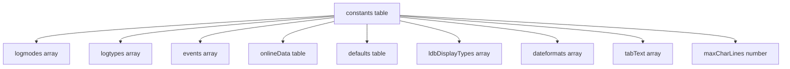
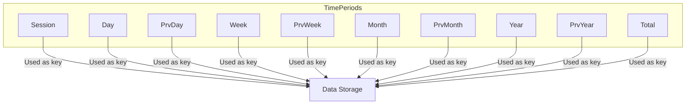
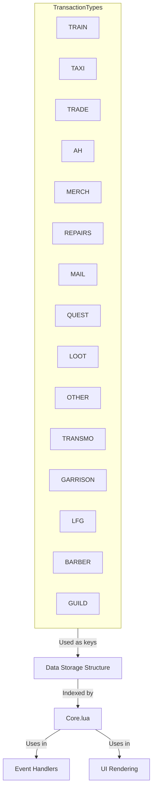
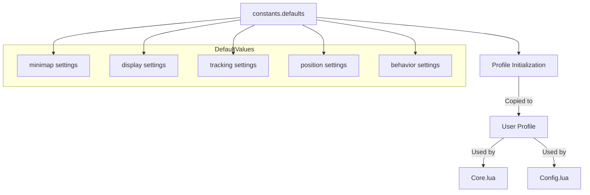
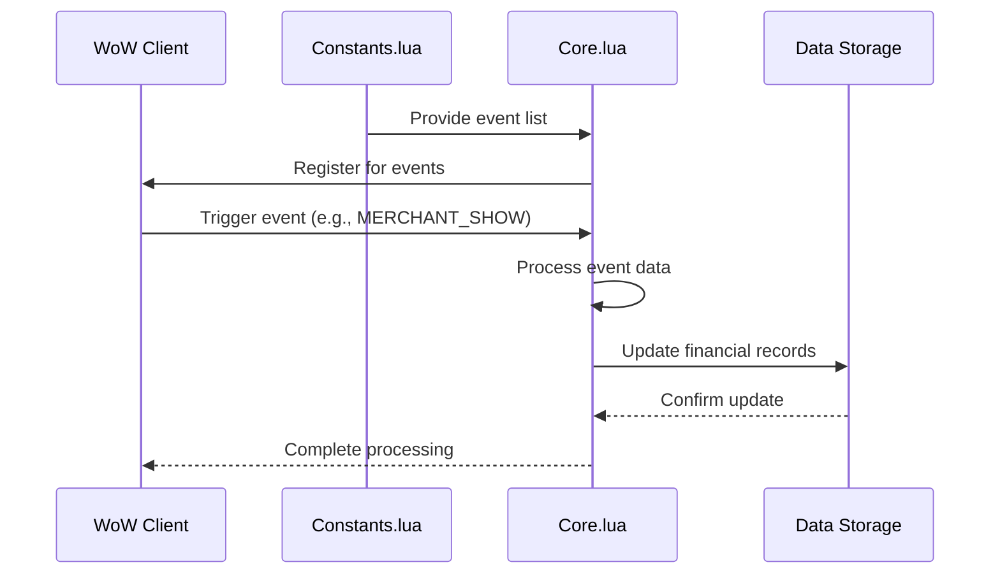
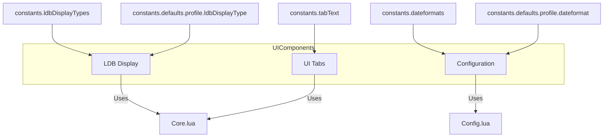
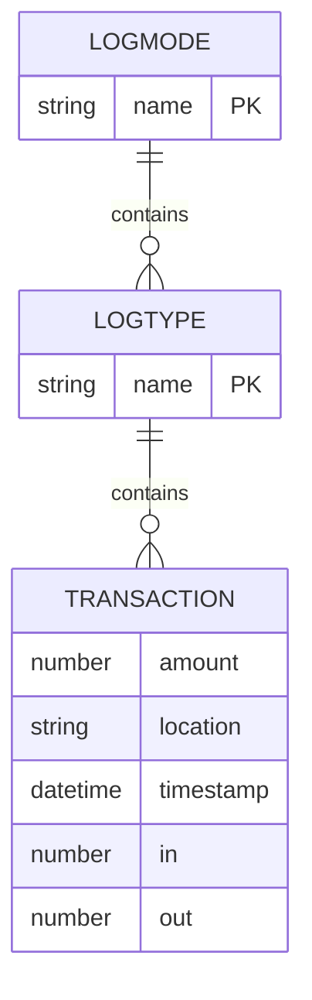
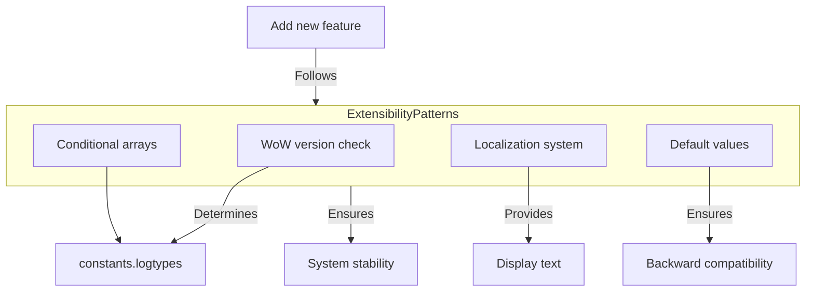

# Constants and Enumerations

<cite>
**Referenced Files in This Document**   
- [Constants.lua](file://Core/Constants.lua)
- [Core.lua](file://Core/Core.lua)
- [Config.lua](file://Core/Config.lua)
</cite>

## Table of Contents
1. [Introduction](#introduction)
2. [Constants Structure Overview](#constants-structure-overview)
3. [Time Period Buckets: logmodes](#time-period-buckets-logmodes)
4. [Transaction Sources: logtypes](#transaction-sources-logtypes)
5. [Default Configuration Values](#default-configuration-values)
6. [Event Registration and Data Flow](#event-registration-and-data-flow)
7. [UI Integration and Display](#ui-integration-and-display)
8. [Data Initialization and Storage](#data-initialization-and-storage)
9. [Extensibility and Backward Compatibility](#extensibility-and-backward-compatibility)

## Introduction
The Constants.lua module serves as the central definition point for categorical data structures within the Accountant_Classic addon. This document details how constants define the data model's framework, including time period classifications, transaction type enumerations, default configuration values, and user interface display parameters. The module establishes canonical identifiers used throughout the data pipeline, ensuring consistency across data collection, storage, and presentation layers.

**Section sources**
- [Constants.lua](file://Core/Constants.lua#L1-L260)

## Constants Structure Overview
The Constants.lua file defines a structured namespace containing enumerations, default values, and configuration flags that govern the addon's behavior. These constants are organized into logical groups that correspond to different aspects of the application's functionality.



**Diagram sources**
- [Constants.lua](file://Core/Constants.lua#L1-L260)

**Section sources**
- [Constants.lua](file://Core/Constants.lua#L1-L260)

## Time Period Buckets: logmodes
The `constants.logmodes` array defines the temporal classification system used for organizing financial data. These time period buckets serve as keys for data storage and retrieval across the application.

```lua
constants.logmodes = {"Session", "Day", "PrvDay", "Week", "PrvWeek", "Month", "PrvMonth", "Year", "PrvYear", "Total" }
```

Each logmode represents a specific time period for financial tracking:
- **Session**: Current gameplay session
- **Day**: Current calendar day
- **PrvDay**: Previous calendar day
- **Week**: Current week
- **PrvWeek**: Previous week
- **Month**: Current month
- **PrvMonth**: Previous month
- **Year**: Current year
- **PrvYear**: Previous year
- **Total**: Cumulative total across all time

These logmodes are used as direct keys in the data storage structure, enabling efficient categorization of financial transactions by time period.



**Diagram sources**
- [Constants.lua](file://Core/Constants.lua#L65-L65)
- [Core.lua](file://Core/Core.lua#L239-L265)

**Section sources**
- [Constants.lua](file://Core/Constants.lua#L65-L65)
- [Core.lua](file://Core/Core.lua#L239-L265)

## Transaction Sources: logtypes
The `constants.logtypes` array enumerates all possible transaction sources within the game, serving as canonical identifiers for categorizing financial activities.

```lua
-- Classic versions
constants.logtypes = {
    "TRAIN", "TAXI", "TRADE", "AH", "MERCH", "REPAIRS", "MAIL", "QUEST", "LOOT", "OTHER" 
}

-- Retail versions  
constants.logtypes = {
    "TRANSMO", "GARRISON", "LFG", "BARBER", "GUILD",
    "TRAIN", "TAXI", "TRADE", "AH", "MERCH", "REPAIRS", "MAIL", "QUEST", "LOOT", "OTHER" 
}
```

These transaction types are used throughout the data pipeline:
- As keys in data storage structures
- For conditional logic in event handlers
- In UI generation for tabular displays
- For filtering and reporting purposes

The implementation includes version-specific variations, with additional transaction types for retail versions of the game, demonstrating conditional logic based on the WoW client version.



**Diagram sources**
- [Constants.lua](file://Core/Constants.lua#L70-L85)
- [Core.lua](file://Core/Core.lua#L239-L265)

**Section sources**
- [Constants.lua](file://Core/Constants.lua#L70-L85)
- [Core.lua](file://Core/Core.lua#L239-L265)

## Default Configuration Values
The `constants.defaults` structure defines the initial configuration values for the addon, establishing the baseline settings for user preferences and display options.

```lua
constants.defaults = {
    profile = {
        minimap = {
            hide = false,
            show = true,
            minimapPos = 153,
        },
        showbutton = true, 
        showmoneyinfo = true, 
        showintrotip = true,
        showmoneyonbutton = true,
        showsessiononbutton = true,
        cross_server = true,
        show_allFactions = true,
        trackzone = true,
        tracksubzone = true,
        breakupnumbers = true,
        weekstart = 1,
        ldbDisplayType = 2,
        dateformat = 1,
        scale = 1,
        alpha = 1,
        infoscale = 1,
        infoalpha = 1,
        faction = playerFaction,
        class = playerClass,
        AcFramePoint = { "TOPLEFT", "UIParent", "TOPLEFT", 0, -104 },
        MnyFramePoint = { "TOPLEFT", "UIParent", "TOPLEFT", 10, -80 },
        profileCopied = false,
        rememberSelectedCharacter = true,
    },
}
```

These default values are used during profile initialization to ensure all configuration options are present, even if they haven't been explicitly set by the user.



**Diagram sources**
- [Constants.lua](file://Core/Constants.lua#L40-L100)
- [Core.lua](file://Core/Core.lua#L350-L370)
- [Config.lua](file://Core/Config.lua#L100-L150)

**Section sources**
- [Constants.lua](file://Core/Constants.lua#L40-L100)
- [Core.lua](file://Core/Core.lua#L350-L370)
- [Config.lua](file://Core/Config.lua#L100-L150)

## Event Registration and Data Flow
The constants module defines the event registration framework through the `constants.events` array, which contains all WoW API events that trigger financial data collection.

```lua
-- Classic events
constants.events = {
    "CONFIRM_TALENT_WIPE",
    "MERCHANT_SHOW",
    "MERCHANT_CLOSED",
    "MERCHANT_UPDATE",
    "QUEST_COMPLETE",
    "QUEST_FINISHED",
    "QUEST_TURNED_IN",
    "LOOT_OPENED",
    "LOOT_CLOSED",
    "TAXIMAP_OPENED",
    "TAXIMAP_CLOSED",
    "TRADE_SHOW",
    "TRADE_CLOSED",
    "MAIL_INBOX_UPDATE",
    "MAIL_SHOW",
    "MAIL_CLOSED",
    "TRAINER_SHOW",
    "TRAINER_CLOSED",
    "AUCTION_HOUSE_SHOW",
    "AUCTION_HOUSE_CLOSED",
    "CHAT_MSG_MONEY",
    "PLAYER_MONEY",
    "CURRENCY_DISPLAY_UPDATE",
    "BAG_UPDATE",
}
```

These events are registered in Core.lua using the AceEvent-3.0 library, establishing the data collection pipeline.



**Diagram sources**
- [Constants.lua](file://Core/Constants.lua#L70-L100)
- [Core.lua](file://Core/Core.lua#L200-L220)

**Section sources**
- [Constants.lua](file://Core/Constants.lua#L70-L100)
- [Core.lua](file://Core/Core.lua#L200-L220)

## UI Integration and Display
The constants module provides several arrays that directly support UI generation and display formatting, ensuring consistency across different interface elements.

```lua
-- Display types for LDB (LibDataBroker)
constants.ldbDisplayTypes = { "Total", "Session", "Day", "Week", "Month" }

-- Date format options
constants.dateformats = { "mm/dd/yy", "dd/mm/yy", "yy/mm/dd" }

-- Tab text labels
constants.tabText = {
    L["This Session"],
    L["Today"],
    L["Prv. Day"],
    L["This Week"],
    L["Prv. Week"],
    L["This Month"],
    L["Prv. Month"],
    L["This Year"],
    L["Prv. Year"],
    L["Total"],
    L["All Chars"],
}
```

These constants are used in both Core.lua and Config.lua to generate consistent UI elements and configuration options.



**Diagram sources**
- [Constants.lua](file://Core/Constants.lua#L224-L240)
- [Core.lua](file://Core/Core.lua#L1556-L1556)
- [Config.lua](file://Core/Config.lua#L250-L270)

**Section sources**
- [Constants.lua](file://Core/Constants.lua#L224-L240)
- [Core.lua](file://Core/Core.lua#L1556-L1556)
- [Config.lua](file://Core/Config.lua#L250-L270)

## Data Initialization and Storage
The constants defined in Constants.lua are integral to the data initialization process in Core.lua, where they are used to create the initial data storage structure.

```lua
local function AccountantClassic_InitZoneDB()
    -- ... initialization code ...
    for k_logmode, v_logmode in pairs(private.constants.logmodes) do
        if (Accountant_ClassicZoneDB[AC_SERVER][AC_PLAYER]["data"][v_logmode] == nil) then
            Accountant_ClassicZoneDB[AC_SERVER][AC_PLAYER]["data"][v_logmode] = { }
            for k_logtype, v_logtype in pairs(private.constants.logtypes) do
                Accountant_ClassicZoneDB[AC_SERVER][AC_PLAYER]["data"][v_logmode][v_logtype] = { }
            end
        end
    end
end
```

This initialization creates a nested data structure where:
- Top level: logmodes (time periods)
- Second level: logtypes (transaction sources)
- Third level: transaction details (amount, location, timestamp)



**Diagram sources**
- [Constants.lua](file://Core/Constants.lua#L65-L85)
- [Core.lua](file://Core/Core.lua#L239-L265)

**Section sources**
- [Constants.lua](file://Core/Constants.lua#L65-L85)
- [Core.lua](file://Core/Core.lua#L239-L265)

## Extensibility and Backward Compatibility
The constants system demonstrates thoughtful design for extensibility and backward compatibility through several patterns:

1. **Version-specific constants**: Different `logtypes` and `events` arrays for Classic vs. Retail versions
2. **Sequential indexing**: Using array indices rather than string literals for configuration options
3. **Fallback mechanisms**: Using localization strings (L[""]) for display text
4. **Graceful degradation**: Commented-out constants (e.g., "VOID") rather than removal

When adding new transaction types or time periods, developers should:
1. Add the new type to the appropriate `logtypes` array
2. Ensure corresponding entries in `onlineData` for display
3. Update `tabText` and `tabTooltipText` if creating new time periods
4. Test both Classic and Retail versions for compatibility

The system maintains backward compatibility by:
- Preserving existing array indices for configuration options
- Using descriptive string keys rather than numeric codes
- Providing default values for all configuration options
- Using conditional logic to handle version differences



**Diagram sources**
- [Constants.lua](file://Core/Constants.lua#L1-L260)
- [Core.lua](file://Core/Core.lua#L1-L50)

**Section sources**
- [Constants.lua](file://Core/Constants.lua#L1-L260)
- [Core.lua](file://Core/Core.lua#L1-L50)