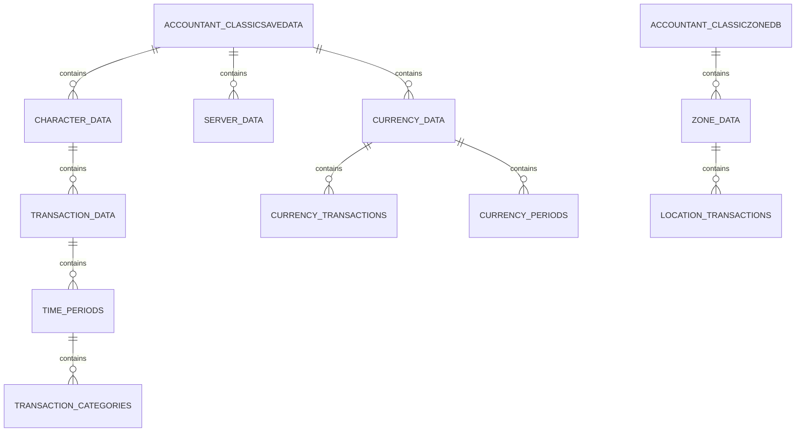
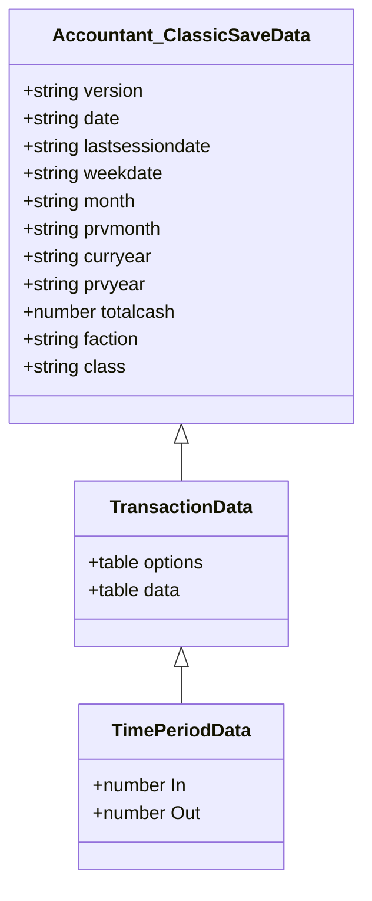
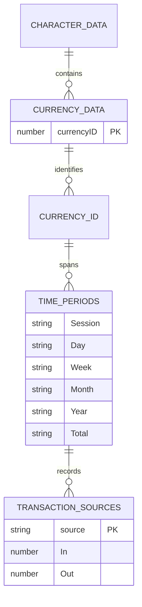
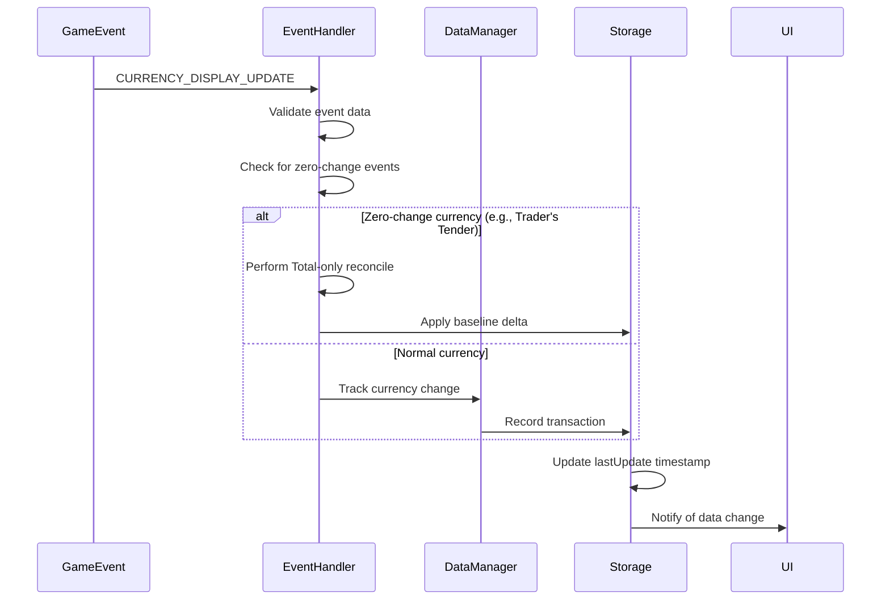
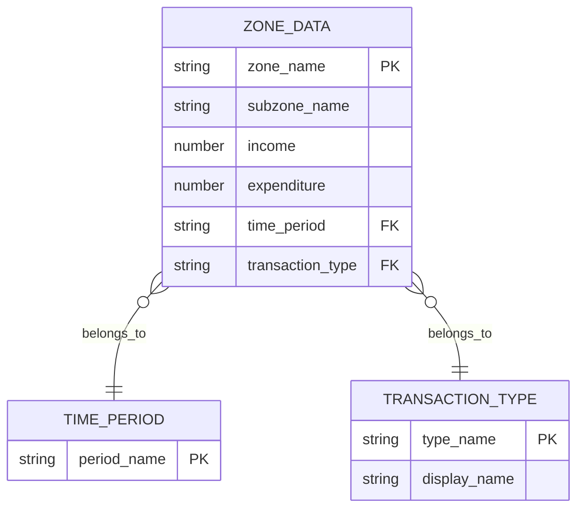
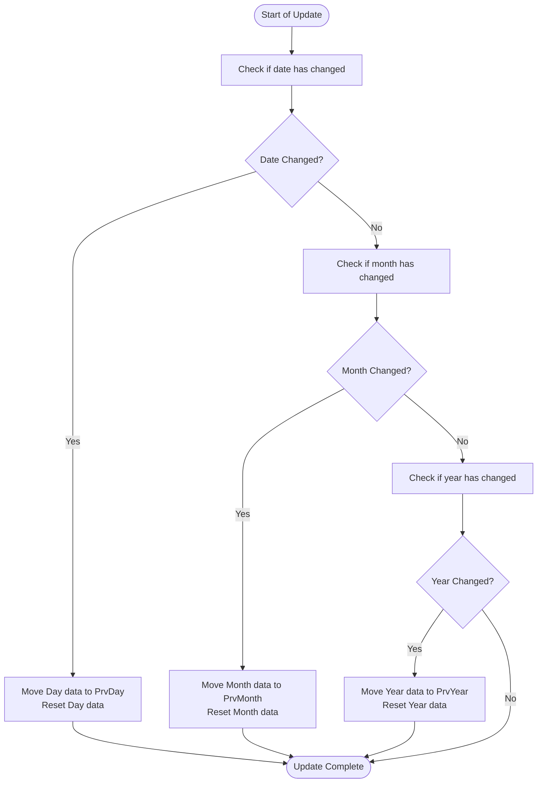
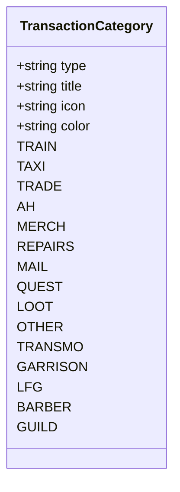
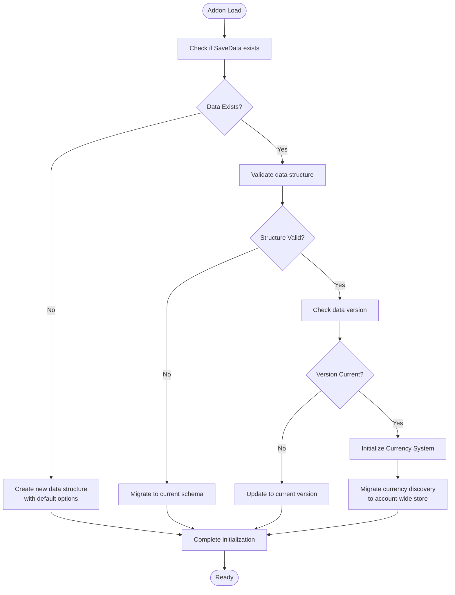
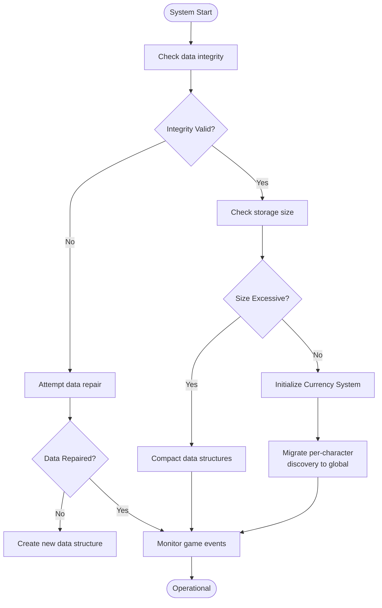
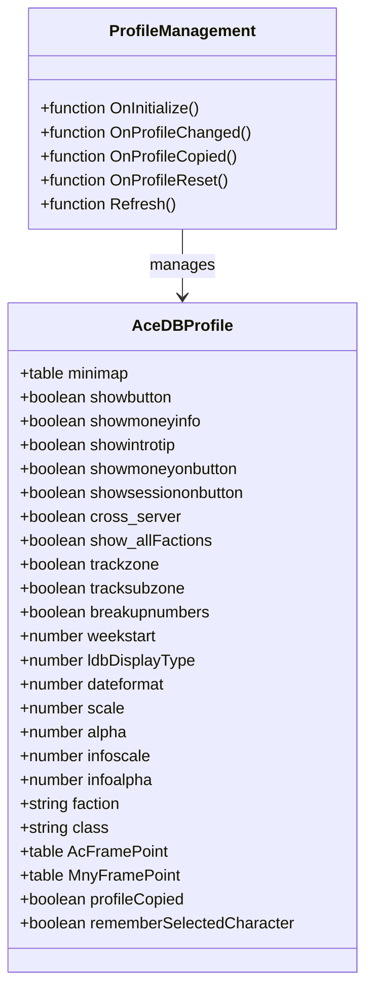

# Data Model

<cite>
**Referenced Files in This Document**   
- [Constants.lua](file://Core/Constants.lua) - *Updated in recent commit*
- [Core.lua](file://Core/Core.lua) - *Modified in recent commit*
- [CurrencyDataManager.lua](file://CurrencyTracker/CurrencyDataManager.lua) - *Added in commit 24*
- [CurrencyStorage.lua](file://CurrencyTracker/CurrencyStorage.lua) - *Modified in commit 4*
- [CurrencyConstants.lua](file://CurrencyTracker/CurrencyConstants.lua) - *Added in recent commit*
- [CurrencyEventHandler.lua](file://CurrencyTracker/CurrencyEventHandler.lua) - *Modified in commit 4*
</cite>

## Update Summary
**Changes Made**   
- Updated Accountant_ClassicSaveData structure to reflect new currency tracking system
- Added new section for Currency Tracking System reflecting account-wide storage changes
- Updated data lifecycle management to include currency-specific retention policies
- Added new diagrams for currency data flow and storage structure
- Updated section sources to reflect new and modified files

## Table of Contents
1. [Data Model Overview](#data-model-overview)
2. [Accountant_ClassicSaveData Structure](#accountant_classicsavedata-structure)
3. [Currency Tracking System](#currency-tracking-system)
4. [Accountant_ClassicZoneDB Structure](#accountant_classiczonedb-structure)
5. [Constants.logmodes and Time Periods](#constantslogmodes-and-time-periods)
6. [Constants.logtypes and Transaction Categories](#constantslogtypes-and-transaction-categories)
7. [Data Initialization and Validation](#data-initialization-and-validation)
8. [Data Access Patterns](#data-access-patterns)
9. [Data Lifecycle Management](#data-lifecycle-management)
10. [AceDB Profile System](#acedb-profile-system)

## Data Model Overview

The Accountant_Classic addon maintains financial records for World of Warcraft characters through a structured data model stored in SavedVariables. The system tracks income and expenditure across multiple time periods and transaction categories, with support for both character-specific and cross-character analysis. The data model consists of two primary storage structures: Accountant_ClassicSaveData for financial records and Accountant_ClassicZoneDB for location-based transaction analysis.



**Diagram sources**
- [Core.lua](file://Core/Core.lua#L262-L304)
- [Constants.lua](file://Core/Constants.lua#L50-L52)

## Accountant_ClassicSaveData Structure

Accountant_ClassicSaveData is the primary data structure that stores financial records for characters. It follows a hierarchical organization with server, character, and transaction-level data.

### Hierarchical Structure
The data structure is organized in a three-level hierarchy:
- **Server Level**: Top-level key representing the realm name
- **Character Level**: Second-level key representing the character name
- **Data Level**: Contains options and transaction data

```lua
Accountant_ClassicSaveData = {
  ["ServerName"] = {
    ["CharacterName"] = {
      options = { },
      data = { },
      currencyData = { },
      currencyOptions = { }
    }
  }
}
```

### Options Structure
The options table contains character-specific configuration and metadata:

**Field Definitions:**
- :version: String representing the addon version when data was last saved
- :date: String in format "dd/mm/yy" representing the current date
- :lastsessiondate: String representing the date of the last session
- :weekdate: String representing the start date of the current week
- :month: String representing the current month (1-12)
- :curryear: String representing the current year
- :totalcash: Number representing the total amount of money the character has accumulated
- :faction: String representing the character's faction (e.g., "Alliance", "Horde")
- :class: String representing the character's class

**Section sources**
- [Core.lua](file://Core/Core.lua#L100-L115)
- [Constants.lua](file://Core/Constants.lua#L20-L45)

### Transaction Data Structure
The data table contains financial transactions categorized by type and time period:



**Diagram sources**
- [Core.lua](file://Core/Core.lua#L1042-L1078)
- [Constants.lua](file://Core/Constants.lua#L50-L52)

## Currency Tracking System

The currency tracking system has been refactored to use account-wide storage for currency discovery data, enabling consistent tracking across all characters on an account.

### Account-Wide Currency Discovery
The system now uses a global store for currency discovery data, accessible via Accountant_Classic_CurrencyDB:

```lua
_G.Accountant_Classic_CurrencyDB = {
  currencyDiscovery = {
    [currencyID] = {
      id = number,
      name = string,
      icon = number,
      expansion = string,
      expansionName = string,
      patch = string,
      category = string,
      tracked = boolean
    }
  }
}
```

During initialization, per-character discovery data is migrated to this account-wide store, preserving all discovered currency metadata.

**Section sources**
- [CurrencyStorage.lua](file://CurrencyTracker/CurrencyStorage.lua#L145-L185) - *Migrated in commit 24*
- [CurrencyDataManager.lua](file://CurrencyTracker/CurrencyDataManager.lua#L250-L300)

### Currency Data Structure
Currency transaction data is stored within the character's Accountant_ClassicSaveData structure:

```lua
["CharacterName"] = {
  currencyData = {
    [currencyID] = {
      Session = { [source] = { In = number, Out = number } },
      Day = { [source] = { In = number, Out = number } },
      Week = { [source] = { In = number, Out = number } },
      Month = { [source] = { In = number, Out = number } },
      Year = { [source] = { In = number, Out = number } },
      Total = { 
        [source] = { In = number, Out = number },
        ["BaselinePrime"] = { In = number, Out = number }
      }
    }
  },
  currencyOptions = {
    selectedCurrency = number,
    trackingEnabled = boolean,
    lastUpdate = number,
    version = string,
    nearCapAlert = {
      enable = boolean,
      cap_percent = number,
      time_visible_sec = number,
      fade_duration_sec = number
    }
  }
}
```

**Field Definitions:**
- :currencyData: Table containing transaction records for all tracked currencies
- :currencyID: Numeric identifier for the currency
- :Session, Day, Week, Month, Year, Total: Time period buckets for transaction aggregation
- :source: String or numeric key representing the transaction source (mapped from C_CurrencyInfo.Enum)
- :In: Number representing income in copper
- :Out: Number representing expenditure in copper
- :BaselinePrime: Special source key for baseline initialization transactions
- :currencyOptions: Configuration options for currency tracking
- :selectedCurrency: Currently selected currency for display
- :trackingEnabled: Boolean indicating if currency tracking is enabled
- :nearCapAlert: Configuration for near-capacity warnings



**Diagram sources**
- [CurrencyStorage.lua](file://CurrencyTracker/CurrencyStorage.lua#L280-L320)
- [CurrencyDataManager.lua](file://CurrencyTracker/CurrencyDataManager.lua#L400-L450)

### Currency Event Processing
The system handles currency changes through the CURRENCY_DISPLAY_UPDATE event, with special handling for currencies with unreliable delta reporting:



**Section sources**
- [CurrencyEventHandler.lua](file://CurrencyTracker/CurrencyEventHandler.lua#L300-L700) - *Updated in commit 4*
- [CurrencyStorage.lua](file://CurrencyTracker/CurrencyStorage.lua#L40-L80)

## Accountant_ClassicZoneDB Structure

Accountant_ClassicZoneDB stores location-based transaction data, enabling analysis of financial activities by geographical location within the game world.

### Zone Data Hierarchy
The zone database follows a similar hierarchical structure to the main save data:

```lua
Accountant_ClassicZoneDB = {
  ["ServerName"] = {
    ["CharacterName"] = {
      data = { }
    }
  }
}
```

### Location-Based Transaction Storage
For each time period and transaction type, the system tracks financial data by zone:

**Field Definitions:**
- :data: Table containing time period buckets
- :time_period: One of the values from Constants.logmodes
- :transaction_type: One of the values from Constants.logtypes
- :zone_name: String representing the zone or subzone name
- :In: Number representing income in this zone
- :Out: Number representing expenditure in this zone

When location tracking is enabled (controlled by the trackzone profile option), transactions are recorded with their geographical context. If tracksubzone is enabled, subzone information is also captured.



**Diagram sources**
- [Core.lua](file://Core/Core.lua#L239-L265)
- [Core.lua](file://Core/Core.lua#L1122-L1148)

## Constants.logmodes and Time Periods

Constants.logmodes defines the time period buckets used for financial data aggregation. These time periods enable users to analyze their financial activities at different temporal granularities.

### Time Period Definitions
The following time periods are defined in Constants.logmodes:

**Time Periods:**
- :"Session": Tracks financial activities during the current login session
- :"Day": Tracks daily financial activities
- :"PrvDay": Stores data from the previous day
- :"Week": Tracks weekly financial activities
- :"PrvWeek": Stores data from the previous week
- :"Month": Tracks monthly financial activities
- :"PrvMonth": Stores data from the previous month
- :"Year": Tracks annual financial activities
- :"PrvYear": Stores data from the previous year
- :"Total": Cumulative financial data across all time

### Time Period Management
The system automatically manages time period rollovers based on the current date:

**Daily Rollover:**
When the date changes, data from the "Day" bucket is moved to "PrvDay" and the "Day" bucket is reset.

**Monthly Rollover:**
When the month changes, data from the "Month" bucket is moved to "PrvMonth" and the "Month" bucket is reset.

**Yearly Rollover:**
When the year changes, data from the "Year" bucket is moved to "PrvYear" and the "Year" bucket is reset.



**Diagram sources**
- [Constants.lua](file://Core/Constants.lua#L50-L52)
- [Core.lua](file://Core/Core.lua#L849-L882)

## Constants.logtypes and Transaction Categories

Constants.logtypes defines the transaction source categories used to classify financial activities. These categories enable users to analyze their spending and income by activity type.

### Transaction Category Definitions
The transaction categories vary based on the World of Warcraft version:

**Classic Era, TBC, and WotLK:**
- :"TRAIN": Training costs for abilities and skills
- :"TAXI": Taxi fares for flight paths
- :"TRADE": Transactions in the trade window with other players
- :"AH": Auction House activities (fees and sales)
- :"MERCH": Merchant transactions (buying and selling)
- :"REPAIRS": Repair costs for damaged equipment
- :"MAIL": Mail system transactions
- :"QUEST": Quest rewards and completion bonuses
- :"LOOT": Loot from enemies and containers
- :"OTHER": Unclassified financial transactions

**Retail Version:**
Includes all classic categories plus:
- :"TRANSMO": Transmogrification costs
- :"GARRISON": Garrison-related transactions
- :"LFG": Looking For Group dungeon rewards
- :"BARBER": Barber shop services
- :"GUILD": Guild bank transactions

### Online Data Structure
The constants.onlineData table maps transaction types to their display names and provides additional metadata:

**Field Definitions:**
- :Title: Localized display name for the transaction category
- Additional metadata may include icons or color coding



**Diagram sources**
- [Constants.lua](file://Core/Constants.lua#L60-L100)
- [Core.lua](file://Core/Core.lua#L1122-L1148)

## Data Initialization and Validation

The system implements robust data initialization and validation procedures to ensure data integrity and handle edge cases.

### Data Initialization Process
When the addon loads, it performs the following initialization steps:

1. Check if Accountant_ClassicSaveData exists, create if not
2. Check if server-specific data exists, create if not
3. Check if character-specific data exists, create if not
4. Initialize default options if missing
5. Initialize zone database if location tracking is enabled
6. Initialize currency storage structures
7. Migrate per-character currency discovery to account-wide store

```lua
function initOptions()
  if (Accountant_ClassicSaveData == nil) then
    Accountant_ClassicSaveData = {};
  end
  if (Accountant_ClassicSaveData[AC_SERVER] == nil) then
    Accountant_ClassicSaveData[AC_SERVER] = {};
  end
  if (Accountant_ClassicSaveData[AC_SERVER][AC_PLAYER] == nil) then
    Accountant_ClassicSaveData[AC_SERVER][AC_PLAYER] = {
      options = AccountantClassicDefaultOptions,
      data = { },
    };
  end
  -- Initialize currency structures
  if CurrencyTracker.Storage then
    CurrencyTracker.Storage:Initialize()
  end
  -- Additional initialization steps
end
```

### Data Validation and Migration
The system includes mechanisms to validate data integrity and migrate older data formats:

**Validation Rules:**
- Ensure all required fields exist in the options table
- Verify time period buckets are properly initialized
- Confirm transaction categories are correctly structured
- Validate currency data structures

**Migration Procedures:**
- Convert older data formats to current schema
- Update version numbers in saved data
- Migrate per-character currency discovery to account-wide store
- Preserve existing financial records during upgrades



**Section sources**
- [Core.lua](file://Core/Core.lua#L262-L304)
- [CurrencyStorage.lua](file://CurrencyTracker/CurrencyStorage.lua#L145-L185) - *Updated in commit 24*

## Data Access Patterns

The system implements efficient data access patterns for retrieving and displaying financial information.

### Character Data Retrieval
The addon provides functions to retrieve financial data for specific characters or groups of characters:

**Single Character Access:**
```lua
local characterData = Accountant_ClassicSaveData[server][character]
```

**Cross-Character Access:**
When cross_server profile option is enabled, data can be accessed across multiple servers:

```lua
for serverKey, serverValue in pairs(Accountant_ClassicSaveData) do
  for charKey, charValue in pairs(Accountant_ClassicSaveData[serverKey]) do
    -- Process character data
  end
end
```

### Currency Data Access
The system provides specialized functions for accessing currency data:

```lua
-- Get data for a specific currency and timeframe
local currencyData = CurrencyTracker.DataManager:GetCurrencyData(currencyID, "Session")

-- Get all available currencies
local availableCurrencies = CurrencyTracker.DataManager:GetAvailableCurrencies()

-- Get supported currencies by expansion
local wodCurrencies = CurrencyTracker.DataManager:GetCurrenciesByExpansion("WOD")
```

**Section sources**
- [Core.lua](file://Core/Core.lua#L598-L633)
- [CurrencyDataManager.lua](file://CurrencyTracker/CurrencyDataManager.lua#L200-L300)

## Data Lifecycle Management

The system implements comprehensive data lifecycle management to handle data retention, garbage collection, and storage optimization.

### Data Retention Policies
The addon maintains financial data according to the following retention policies:

**Time-Based Retention:**
- Session data: Cleared on logout
- Daily data: Retained indefinitely, with previous day preserved
- Weekly data: Retained indefinitely, with previous week preserved
- Monthly data: Retained indefinitely, with previous month preserved
- Annual data: Retained indefinitely, with previous year preserved
- Total data: Permanently retained

**Currency-Specific Retention:**
- Currency transaction data follows the same time period buckets as gold data
- Account-wide currency discovery data is retained permanently
- Currency options and preferences are retained per character

### Garbage Collection Strategies
The system includes mechanisms to manage data size and prevent unbounded growth:

**Automatic Cleanup:**
- Old session data is automatically cleared
- Unused data structures are removed during initialization
- Corrupted data is detected and repaired or removed
- Currency event batching prevents excessive updates during combat

**Manual Data Management:**
Users can remove character data through the configuration interface, with confirmation dialogs to prevent accidental deletion.



**Section sources**
- [Core.lua](file://Core/Core.lua#L849-L882)
- [CurrencyStorage.lua](file://CurrencyTracker/CurrencyStorage.lua#L145-L185) - *Updated in commit 24*

## AceDB Profile System

The addon utilizes AceDB-3.0 for profile management, enabling flexible configuration options for per-character and shared data settings.

### Profile Structure
The profile system is initialized with default values defined in Constants.defaults:

**Profile Options:**
- :minimap: Table controlling minimap button visibility and position
- :showbutton: Boolean for showing the minimap button
- :showmoneyinfo: Boolean for showing on-screen money information
- :showintrotip: Boolean for displaying instruction tips
- :showmoneyonbutton: Boolean for showing money on minimap button tooltip
- :showsessiononbutton: Boolean for showing session info on minimap button tooltip
- :cross_server: Boolean for enabling cross-server character data display
- :show_allFactions: Boolean for enabling all factions data display
- :trackzone: Boolean for enabling location tracking
- :tracksubzone: Boolean for enabling subzone tracking
- :breakupnumbers: Boolean for number formatting with digit grouping
- :weekstart: Number indicating the first day of the week (1-7)
- :ldbDisplayType: Number indicating the data type displayed on LDB
- :dateformat: Number indicating the preferred date format
- :scale: Number for main frame scale
- :alpha: Number for main frame transparency
- :infoscale: Number for floating info scale
- :infoalpha: Number for floating info transparency
- :faction: String for character's faction
- :class: String for character's class
- :AcFramePoint: Table for main frame position
- :MnyFramePoint: Table for money frame position
- :profileCopied: Boolean indicating if profile has been copied
- :rememberSelectedCharacter: Boolean for remembering dropdown selection

### Profile Management
The system supports profile operations including creation, copying, and resetting:

**Initialization:**
```lua
function addon:OnInitialize()
  self.db = AceDB:New("Accountant_ClassicDB", private.constants.defaults, true);
  profile = self.db.profile
  -- Register callbacks for profile changes
end
```

**Callback Handling:**
The system registers callbacks for profile changes to refresh the UI when settings are modified.



**Diagram sources**
- [Constants.lua](file://Core/Constants.lua#L20-L45)
- [Core.lua](file://Core/Core.lua#L2104-L2135)