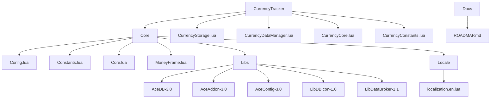
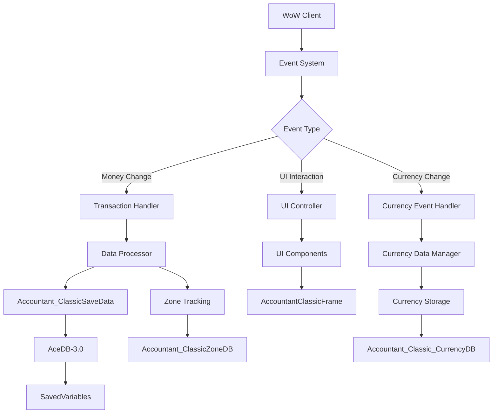
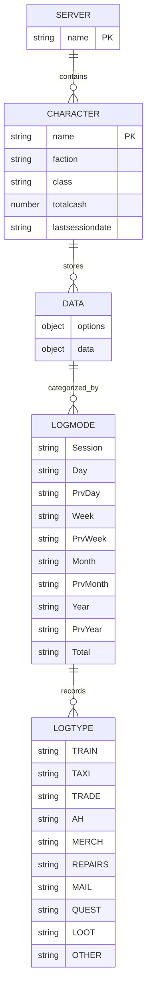
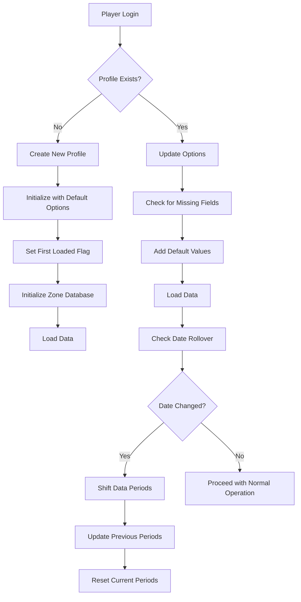
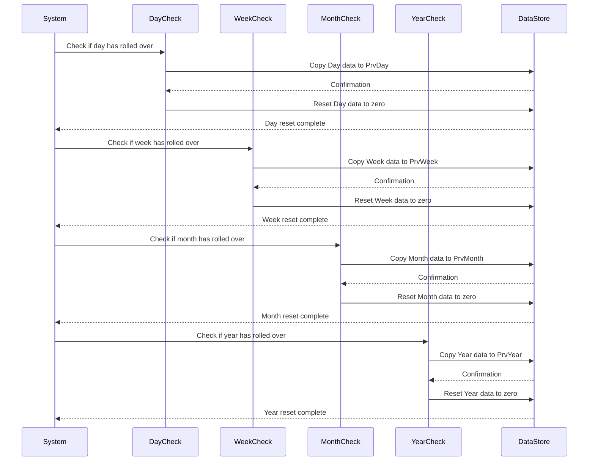
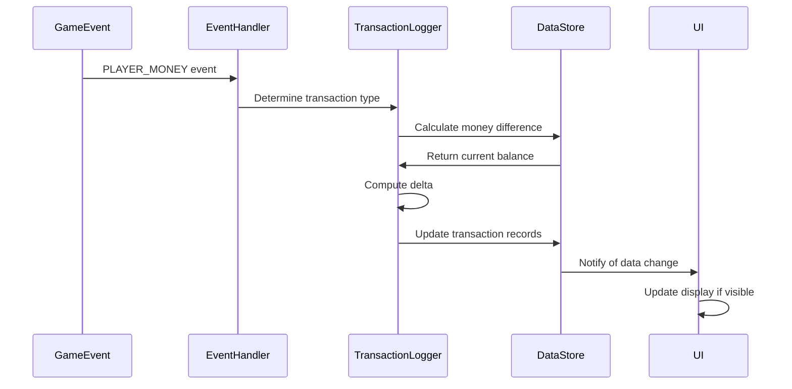
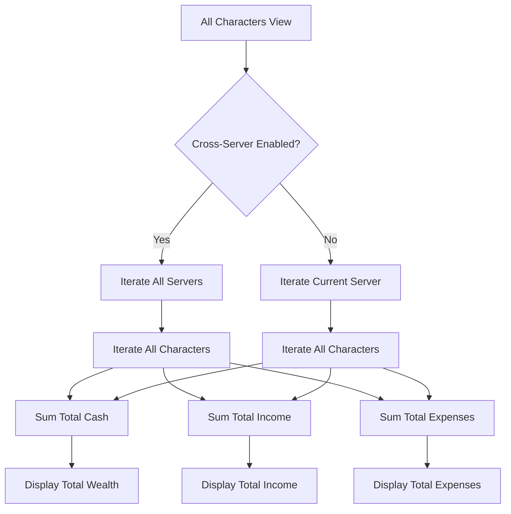
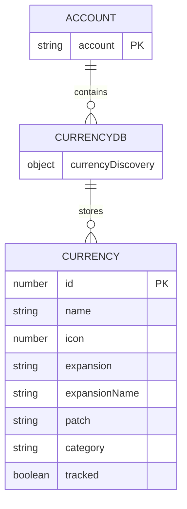
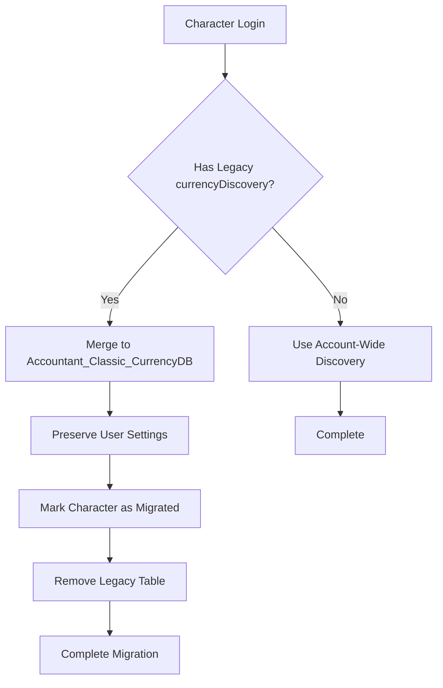
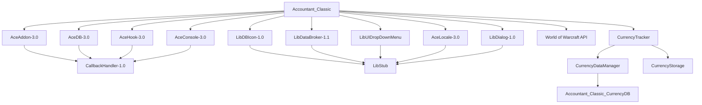

# Saved Variables Schema

<cite>
**Referenced Files in This Document**   
- [Core.lua](file://Core/Core.lua#L1-L2306) - *Updated in recent commit*
- [Constants.lua](file://Core/Constants.lua#L1-L261)
- [CurrencyStorage.lua](file://CurrencyTracker/CurrencyStorage.lua#L1-L1222) - *Modified in commit 24*
- [CurrencyDataManager.lua](file://CurrencyTracker/CurrencyDataManager.lua#L1-L426) - *Modified in commit 24*
</cite>

## Update Summary
**Changes Made**
- Updated documentation to reflect migration of currencyDiscovery from per-character to account-wide storage
- Added new section on Accountant_Classic_CurrencyDB structure and migration process
- Updated diagram sources to include new currency tracking files
- Modified section sources to reflect changes in CurrencyStorage.lua and CurrencyDataManager.lua
- Added documentation for the new account-wide currency discovery system

## Table of Contents
1. [Introduction](#introduction)
2. [Project Structure](#project-structure)
3. [Core Components](#core-components)
4. [Architecture Overview](#architecture-overview)
5. [Detailed Component Analysis](#detailed-component-analysis)
6. [Dependency Analysis](#dependency-analysis)
7. [Performance Considerations](#performance-considerations)
8. [Troubleshooting Guide](#troubleshooting-guide)
9. [Conclusion](#conclusion)

## Introduction
Accountant_Classic is a World of Warcraft addon designed to track financial transactions for players across multiple characters and realms. This document provides comprehensive documentation for the `Accountant_ClassicSaveData` structure, which serves as the primary SavedVariables storage mechanism for persistent data. The schema is managed through AceDB-3.0, enabling robust profile management, data inheritance, and cross-character tracking capabilities. The system captures income and expenses across various time periods and transaction types, providing detailed financial analytics for players. Recent updates have introduced account-wide currency tracking through the Accountant_Classic_CurrencyDB structure, which centralizes discovered currency metadata across all characters.

## Project Structure
The Accountant_Classic project follows a modular structure with clear separation of concerns. The core functionality resides in the Core directory, while libraries, localization, and documentation are organized in dedicated folders. The addon leverages Ace3 framework components for dependency management, event handling, and database operations.

**Diagram sources**
- [Core.lua](file://Core/Core.lua#L1-L2306)
- [Constants.lua](file://Core/Constants.lua#L1-L261)
- [CurrencyStorage.lua](file://CurrencyTracker/CurrencyStorage.lua#L1-L1222)

## Core Components
The core components of Accountant_Classic revolve around the `Accountant_ClassicSaveData` structure, which stores financial data hierarchically by server, character, and account profiles. The system uses AceDB-3.0 for profile management, allowing users to switch between different configurations and inherit settings from default profiles. The primary data structure captures transaction data across multiple time periods (session, day, week, month, year, total) and transaction types (merchant, repairs, quests, etc.). Additionally, the system now includes the `Accountant_Classic_CurrencyDB` structure for account-wide storage of discovered currency metadata, enabling consistent currency tracking across all characters on an account.

**Section sources**
- [Core.lua](file://Core/Core.lua#L1-L2306)
- [Constants.lua](file://Core/Constants.lua#L1-L261)
- [CurrencyStorage.lua](file://CurrencyTracker/CurrencyStorage.lua#L1-L1222)

## Architecture Overview
The architecture of Accountant_Classic follows a layered approach with clear separation between data storage, business logic, and user interface components. The system uses event-driven programming to capture financial transactions, with hooks into WoW's event system to detect money changes from various sources.

**Diagram sources**
- [Core.lua](file://Core/Core.lua#L1-L2306)
- [CurrencyDataManager.lua](file://CurrencyTracker/CurrencyDataManager.lua#L1-L426)

## Detailed Component Analysis

### Accountant_ClassicSaveData Structure Analysis
The `Accountant_ClassicSaveData` structure is the central data repository for financial information, organized hierarchically by server and character. This structure enables cross-character financial tracking while maintaining data isolation between different realms.

**Diagram sources**
- [Core.lua](file://Core/Core.lua#L262-L304)
- [Constants.lua](file://Core/Constants.lua#L50-L52)

#### Schema Layout and Hierarchical Organization
The `Accountant_ClassicSaveData` structure follows a three-level hierarchy: server → character → data. This organization enables efficient data retrieval and management across multiple characters and realms.

**Top-Level Structure:**
- **Server Level**: Top-level key representing the realm name
- **Character Level**: Second-level key representing the character name
- **Data Level**: Contains two main components:
  - **options**: Configuration and metadata
  - **data**: Financial transaction records

**Key Components:**
- **options**: Stores character-specific metadata and configuration
  - **version**: Current addon version
  - **date**: Current date (dd/mm/yy format)
  - **lastsessiondate**: Date of last session
  - **weekdate**: Week start date
  - **month**: Current month
  - **weekstart**: Day of week that starts the week
  - **curryear**: Current year
  - **totalcash**: Current gold amount
  - **faction**: Character faction
  - **class**: Character class

- **data**: Contains transaction records organized by log type and time period
  - **Log Types**: TRAIN, TAXI, TRADE, AH, MERCH, REPAIRS, MAIL, QUEST, LOOT, OTHER
  - **Time Periods**: Session, Day, PrvDay, Week, PrvWeek, Month, PrvMonth, Year, PrvYear, Total

**Section sources**
- [Core.lua](file://Core/Core.lua#L262-L304)
- [Constants.lua](file://Core/Constants.lua#L50-L52)

#### Data Initialization and Integrity Management
The system implements a sophisticated initialization process to ensure data integrity and prevent corruption. When a character logs in for the first time, the system creates the necessary data structures with default values.

**Diagram sources**
- [Core.lua](file://Core/Core.lua#L262-L304)
- [Core.lua](file://Core/Core.lua#L849-L983)

The initialization process ensures that all required fields are present by comparing the current profile against `AccountantClassicDefaultOptions`. Any missing fields are populated with default values, maintaining backward compatibility when new features are added.

**Section sources**
- [Core.lua](file://Core/Core.lua#L262-L304)
- [Core.lua](file://Core/Core.lua#L849-L983)

#### Time Period Management and Data Shifting
The system automatically manages time period rollovers (day, week, month, year) to maintain accurate financial records across different time frames. This process ensures that historical data is preserved while current data is reset for the new period.

**Diagram sources**
- [Core.lua](file://Core/Core.lua#L849-L983)

The time period management system checks for rollovers on every addon load and UI update. When a rollover is detected, the system:
1. Copies current period data to the corresponding "previous" period
2. Resets the current period data to zero
3. Updates the date tracking fields in the options table

This ensures that financial data is accurately segmented by time period while maintaining historical records.

**Section sources**
- [Core.lua](file://Core/Core.lua#L849-L983)

#### Transaction Processing and Event Handling
The transaction processing system captures financial events from various sources within the game and records them in the appropriate categories. The system uses WoW's event system to detect money changes and categorize them based on the context.

**Diagram sources**
- [Core.lua](file://Core/Core.lua#L1500-L1599)

The event handling system maps specific WoW events to transaction types:
- **MERCHANT_SHOW**: Sets transaction type to MERCH
- **MERCHANT_UPDATE** with InRepairMode(): Sets transaction type to REPAIRS
- **QUEST_COMPLETE**: Sets transaction type to QUEST
- **LOOT_OPENED**: Sets transaction type to LOOT
- **TRAINER_SHOW**: Sets transaction type to TRAIN
- **TAXIMAP_OPENED**: Sets transaction type to TAXI
- **TRADE_SHOW**: Sets transaction type to TRADE
- **AUCTION_HOUSE_SHOW**: Sets transaction type to AH
- **MAIL_INBOX_UPDATE**: Sets transaction type to MAIL or AH
- **CHAT_MSG_MONEY**: Handles shared loot money

**Section sources**
- [Core.lua](file://Core/Core.lua#L1500-L1599)

#### Cross-Character and Cross-Server Data Aggregation
The system supports aggregation of financial data across multiple characters and servers, enabling comprehensive financial analysis at the account level.

**Diagram sources**
- [Core.lua](file://Core/Core.lua#L1739-L1798)

The aggregation system allows users to view financial data filtered by:
- Specific server
- Character faction (Alliance, Horde, or All)
- Individual character
- All characters across all servers

This enables comprehensive financial tracking across an entire account.

**Section sources**
- [Core.lua](file://Core/Core.lua#L1739-L1798)

#### Accountant_Classic_CurrencyDB Structure and Migration
The `Accountant_Classic_CurrencyDB` structure is a new account-wide global store that holds discovered currency metadata across all characters. This structure was introduced to eliminate redundant storage of currency discovery information and ensure consistency across characters.

**Diagram sources**
- [CurrencyStorage.lua](file://CurrencyTracker/CurrencyStorage.lua#L491-L520)
- [CurrencyDataManager.lua](file://CurrencyTracker/CurrencyDataManager.lua#L1-L426)

The migration process moves currency discovery data from per-character storage to the account-wide `Accountant_Classic_CurrencyDB.currencyDiscovery` table:

**Diagram sources**
- [CurrencyStorage.lua](file://CurrencyTracker/CurrencyStorage.lua#L520-L560)

The migration process ensures that:
1. All discovered currencies from each character are merged into the account-wide store
2. User preferences (such as tracking status) are preserved during migration
3. Legacy per-character discovery tables are removed after successful migration
4. Future currency discoveries are stored directly in the account-wide database

This change reduces SavedVariables size and ensures that newly discovered currencies are immediately available across all characters on the account.

**Section sources**
- [CurrencyStorage.lua](file://CurrencyTracker/CurrencyStorage.lua#L491-L560)
- [CurrencyDataManager.lua](file://CurrencyTracker/CurrencyDataManager.lua#L1-L426)

## Dependency Analysis
The Accountant_Classic addon relies on several external libraries and WoW API components to provide its functionality. These dependencies are managed through the LibStub system, ensuring version compatibility and preventing conflicts.

**Diagram sources**
- [Core.lua](file://Core/Core.lua#L30-L45)
- [CurrencyDataManager.lua](file://CurrencyTracker/CurrencyDataManager.lua#L1-L426)

The dependency structure shows that Accountant_Classic is built on the Ace3 framework, which provides:
- **AceAddon-3.0**: Addon lifecycle management
- **AceDB-3.0**: Profile and SavedVariables management
- **AceHook-3.0**: Secure hooking of game functions
- **AceConsole-3.0**: Slash command handling
- **AceLocale-3.0**: Localization support

Additional libraries provide specific functionality:
- **LibDBIcon-1.0**: Minimap button integration
- **LibDataBroker-1.1**: Data feed for Titan Panel and similar addons
- **LibUIDropDownMenu**: Dropdown menu UI components
- **LibDialog-1.0**: Dialog box management

The CurrencyTracker module provides:
- **CurrencyDataManager**: Centralized currency data operations
- **CurrencyStorage**: Persistent storage with backward compatibility
- **Accountant_Classic_CurrencyDB**: Account-wide currency discovery store

**Section sources**
- [Core.lua](file://Core/Core.lua#L30-L45)
- [CurrencyDataManager.lua](file://CurrencyTracker/CurrencyDataManager.lua#L1-L426)

## Performance Considerations
The Accountant_Classic addon is designed with performance in mind, minimizing impact on game performance while maintaining accurate financial tracking.

### Data Access Patterns
The system optimizes data access through several strategies:
- **Caching**: Frequently accessed data is cached in memory to reduce lookup times
- **Lazy Loading**: Data is loaded only when needed, reducing startup time
- **Batch Operations**: Multiple data updates are processed in batches when possible

### Serialization Overhead
The SavedVariables system in WoW has inherent serialization overhead when saving data to disk. Accountant_Classic minimizes this impact by:
- **Incremental Updates**: Only writing changed data when possible
- **Data Compression**: Using efficient data structures to minimize SavedVariables size
- **Write Throttling**: Limiting the frequency of save operations to prevent performance spikes

The migration to account-wide currency storage in `Accountant_Classic_CurrencyDB` significantly reduces SavedVariables size by eliminating redundant per-character currency discovery data.

### Memory Usage
The addon maintains a relatively small memory footprint by:
- **Efficient Data Structures**: Using tables with minimal overhead
- **Garbage Collection**: Properly cleaning up unused references
- **On-Demand Loading**: Loading character data only when viewed

The system is designed to handle multiple characters and servers without significant performance degradation, making it suitable for accounts with extensive character rosters.

## Troubleshooting Guide
This section addresses common issues and their solutions related to the Accountant_ClassicSaveData structure.

### Data Corruption or Missing Data
If financial data appears corrupted or missing, users can:
1. Verify the SavedVariables file exists and is not empty
2. Check for proper file permissions
3. Reset the addon data through the UI options
4. Manually edit the SavedVariables file if necessary

### Profile Inheritance Issues
If profile settings are not being inherited correctly:
1. Verify the default profile is properly configured
2. Check that the current profile is set to inherit from the correct parent
3. Reset the profile to defaults and reconfigure

### Time Period Rollover Problems
If time period data is not rolling over correctly:
1. Verify system date and time settings
2. Check that the week start day is properly configured
3. Manually trigger a data reload

### Cross-Character Data Aggregation Issues
If data is not aggregating correctly across characters:
1. Verify the cross-server option is properly configured
2. Check that all characters have been logged into at least once
3. Ensure the character data structure is properly initialized

### Currency Discovery Migration Issues
If currency discovery data is not appearing across characters:
1. Verify that all characters have been logged in since the update
2. Check that the migration message was displayed for each character
3. Confirm that `Accountant_Classic_CurrencyDB.currencyDiscovery` contains the expected data
4. Manually verify that legacy `currencyDiscovery` tables have been removed from character data

**Section sources**
- [Core.lua](file://Core/Core.lua#L262-L304)
- [Core.lua](file://Core/Core.lua#L849-L983)
- [CurrencyStorage.lua](file://CurrencyTracker/CurrencyStorage.lua#L491-L560)

## Conclusion
The Accountant_ClassicSaveData structure provides a robust and scalable solution for tracking financial transactions in World of Warcraft. Through its hierarchical organization by server, character, and account profiles, the system enables comprehensive financial analysis across multiple time periods and transaction types. The integration with AceDB-3.0 ensures reliable data persistence and profile management, while the event-driven architecture captures financial transactions accurately and efficiently. The recent addition of the Accountant_Classic_CurrencyDB structure for account-wide currency discovery enhances the system by eliminating redundant data storage and ensuring consistent currency tracking across all characters. The system's design considerations for performance, data integrity, and user experience make it a valuable tool for players seeking to manage their in-game finances effectively.