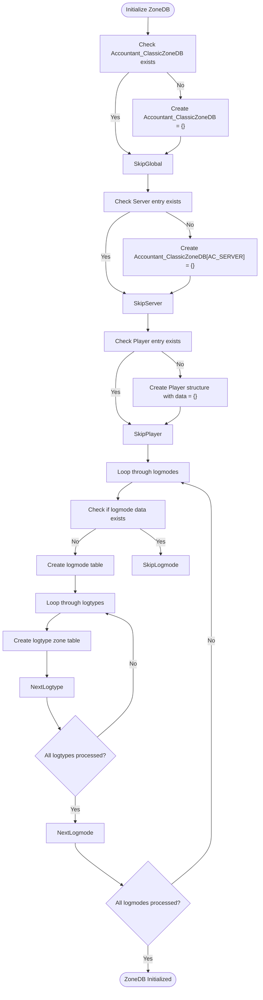
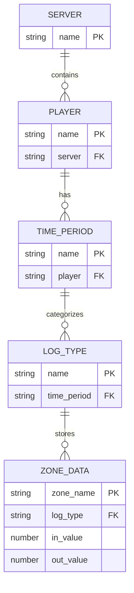
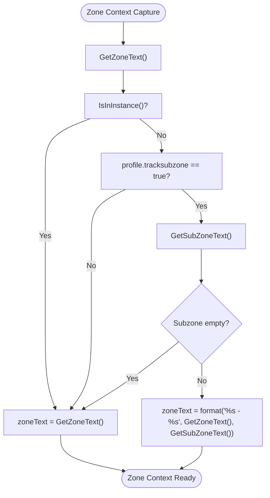
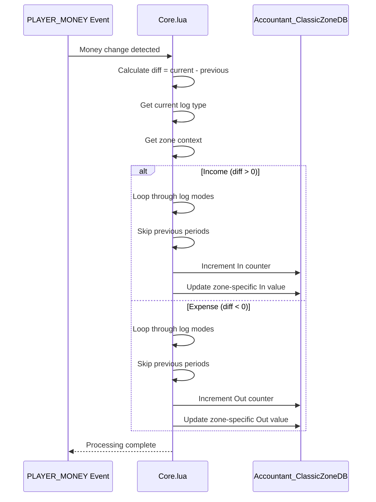
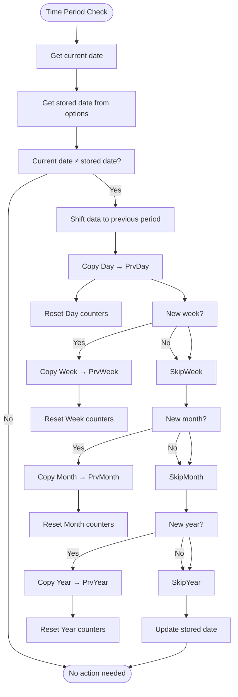

# Zone Database Structure

<cite>
**Referenced Files in This Document**   
- [Core.lua](file://Core/Core.lua#L239-L265)
- [Constants.lua](file://Core/Constants.lua#L1-L260)
- [localization.en.lua](file://Locale/localization.en.lua#L1-L148)
</cite>

## Table of Contents
1. [Introduction](#introduction)
2. [Zone Database Initialization](#zone-database-initialization)
3. [Data Structure and Organization](#data-structure-and-organization)
4. [Zone Tracking and Context Handling](#zone-tracking-and-context-handling)
5. [Data Updates and Transaction Logging](#data-updates-and-transaction-logging)
6. [Time-Based Data Management](#time-based-data-management)
7. [Localization and Zone Name Normalization](#localization-and-zone-name-normalization)
8. [Edge Cases and Special Scenarios](#edge-cases-and-special-scenarios)
9. [Memory Optimization and Data Pruning](#memory-optimization-and-data-pruning)

## Introduction
Accountant_ClassicZoneDB is a specialized data structure within the Accountant Classic addon that tracks financial transactions by geographical location in World of Warcraft. This system enables players to analyze their gold income and expenses based on the zones where transactions occur. The database captures both zone and subzone information, providing granular insights into spending and earning patterns across Azeroth and other game regions. By integrating with the game's event system and localization framework, the zone database offers a comprehensive view of location-based economic activity while maintaining compatibility across different language clients.

## Zone Database Initialization

The Accountant_ClassicZoneDB structure is initialized through the `AccountantClassic_InitZoneDB()` function in Core.lua. This initialization process creates a hierarchical data structure organized by server, player, and time periods. The function first checks for the existence of the global Accountant_ClassicZoneDB table and creates it if necessary. It then establishes the server-specific and player-specific containers, setting up the foundational structure for storing zone-based transaction data. During initialization, the function iterates through all defined log modes (such as Session, Day, Week, etc.) and log types (including MERCH, REPAIRS, QUEST, etc.), creating empty tables for each combination to ensure the complete data structure is pre-allocated.

**Diagram sources**
- [Core.lua](file://Core/Core.lua#L239-L265)

**Section sources**
- [Core.lua](file://Core/Core.lua#L239-L265)

## Data Structure and Organization

The Accountant_ClassicZoneDB employs a multi-level hierarchical structure to organize financial data by geographical location. At the top level, data is partitioned by server name, allowing for cross-realm tracking. Within each server container, individual player data is stored, with each player having a "data" object that contains transaction records organized by time period. The time periods correspond to the log modes defined in Constants.lua, including Session, Day, PrvDay, Week, PrvWeek, Month, PrvMonth, Year, PrvYear, and Total.

Within each time period, transactions are further categorized by log type, which represents the source of the financial activity (e.g., quest rewards, repair costs, merchant transactions). Each log type container holds a dictionary where zone names serve as keys, and the values are objects containing separate "In" and "Out" properties for tracking income and expenses. This structure enables efficient aggregation of financial data by location, allowing the UI to display breakdowns of earnings and expenditures for specific zones.

**Diagram sources**
- [Core.lua](file://Core/Core.lua#L239-L265)
- [Constants.lua](file://Core/Constants.lua#L1-L260)

**Section sources**
- [Core.lua](file://Core/Core.lua#L239-L265)
- [Constants.lua](file://Core/Constants.lua#L1-L260)

## Zone Tracking and Context Handling

Zone tracking is implemented through the integration of World of Warcraft's UI events and zone detection functions. The system captures the current zone context using `GetZoneText()` and optionally `GetSubZoneText()` when subzone tracking is enabled in the addon's configuration. The zone name is normalized and stored in the `zoneText` variable, which serves as the key for location-based data aggregation. When subzone tracking is active and the player is not in an instance, the system combines the zone and subzone names with a hyphen separator (e.g., "Westfall - Sentinel Hill") to provide more granular location data.

The tracking system respects the player's configuration preferences, particularly the `trackzone` and `tracksubzone` profile settings. These settings allow players to control the level of detail in location tracking, balancing between comprehensive data collection and database size. The system also handles edge cases such as instanced dungeons and battlegrounds by defaulting to zone-level tracking rather than subzone tracking when `IsInInstance()` returns true, recognizing that subzone information may be less meaningful in these contexts.

**Diagram sources**
- [Core.lua](file://Core/Core.lua#L1100-L1120)

**Section sources**
- [Core.lua](file://Core/Core.lua#L1100-L1120)

## Data Updates and Transaction Logging

Financial transactions are logged in real-time through the `updateLog()` function, which processes money changes detected by the `PLAYER_MONEY` event. When a money change occurs, the system calculates the difference between the current and previous balances, determining whether the change represents income (positive difference) or expenses (negative difference). The transaction is then attributed to the current context (log type) and recorded in the appropriate location within the Accountant_ClassicZoneDB structure.

For income transactions, the system iterates through all relevant time periods (excluding previous periods like PrvDay, PrvWeek, etc.) and increments the "In" counter for the current zone in each applicable log type category. Similarly, for expenses, the "Out" counter is incremented. The zone-specific data is updated only when zone tracking is enabled (`profile.trackzone == true`), ensuring that the database reflects the player's configuration preferences. This real-time updating mechanism ensures that the zone database remains current and accurately reflects the player's financial activities as they occur in the game world.

**Diagram sources**
- [Core.lua](file://Core/Core.lua#L1122-L1148)

**Section sources**
- [Core.lua](file://Core/Core.lua#L1122-L1148)

## Time-Based Data Management

The zone database implements a systematic approach to time-based data management, handling the transition between different time periods such as days, weeks, months, and years. When a new day begins, the system shifts data from the current period to the previous period, preserving historical information while creating fresh containers for new transactions. This process involves copying the "Day" data to "PrvDay" and resetting the "Day" counters to zero, ensuring accurate tracking across time boundaries.

Similar shifting operations occur for other time periods, with dedicated code sections handling week, month, and year transitions. The system checks the current date against the stored date in the player's options and performs the appropriate data shift when a new period begins. This time-based management ensures that the zone database maintains accurate historical records while providing clean, up-to-date information for current tracking periods. The implementation is consistent across both the main financial data and the zone-specific data, maintaining data integrity throughout the system.

**Diagram sources**
- [Core.lua](file://Core/Core.lua#L849-L882)
- [Core.lua](file://Core/Core.lua#L981-L1002)

**Section sources**
- [Core.lua](file://Core/Core.lua#L849-L882)
- [Core.lua](file://Core/Core.lua#L981-L1002)

## Localization and Zone Name Normalization

The zone database leverages AceLocale-3.0 to handle localization and ensure consistent zone name representation across different language clients. When zone names are captured from the game, they are automatically normalized to the player's current locale, allowing for accurate data aggregation regardless of the client language. This localization system ensures that zone names are consistently represented in the database, preventing fragmentation that could occur if the same zone were stored under different names in different locales.

The addon's localization framework, defined in the Locale directory, contains translations for all user-facing strings, including zone names and category labels. This system allows the zone database to store and display zone information in the player's preferred language while maintaining internal consistency. The integration with AceLocale also enables the addon to support future language expansions, as new localization files can be added without modifying the core database structure or tracking logic.

**Section sources**
- [localization.en.lua](file://Locale/localization.en.lua#L1-L148)

## Edge Cases and Special Scenarios

The zone database implementation addresses several edge cases and special scenarios to ensure robust and accurate tracking. For instanced dungeons and battlegrounds, identified through the `IsInInstance()` function, the system defaults to zone-level tracking rather than subzone tracking, recognizing that subzone information may be less meaningful in these contexts. This approach prevents the database from being populated with potentially confusing or redundant subzone data from temporary instances.

Phased zones, which represent alternate versions of the same geographical area, are handled by treating each phase as a distinct location. This ensures that financial activities in different phases are properly segregated in the database, providing accurate tracking even when players move between phased versions of the same zone. The system also handles edge cases related to character transfers and server migrations by organizing data hierarchically by server name, allowing for clear separation of financial records across different realms.

**Section sources**
- [Core.lua](file://Core/Core.lua#L1100-L1120)

## Memory Optimization and Data Pruning

The zone database incorporates several memory optimization strategies to maintain performance and prevent excessive data accumulation. The primary optimization is the hierarchical time-based structure, which automatically limits the scope of stored data to relevant time periods. By shifting older data to previous period containers and eventually allowing it to expire from active tracking, the system maintains a manageable dataset size.

The implementation also includes configuration options that allow players to control the level of detail in location tracking. By disabling subzone tracking or zone tracking entirely, players can reduce the database footprint according to their preferences and performance requirements. The system avoids storing redundant data by pre-allocating the complete structure during initialization rather than dynamically creating tables, which reduces memory fragmentation and improves access performance. These optimization strategies ensure that the zone database remains efficient and responsive, even after extended gameplay sessions with extensive financial activity.

**Section sources**
- [Core.lua](file://Core/Core.lua#L239-L265)
- [Constants.lua](file://Core/Constants.lua#L1-L260)