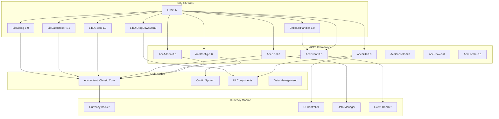

# Development Guide

<cite>
**Referenced Files in This Document**   
- [Core.lua](file://Core/Core.lua#L1-L2306) - *Updated in recent commit*
- [Constants.lua](file://Core/Constants.lua#L1-L261) - *Updated in recent commit*
- [Config.lua](file://Core/Config.lua#L1-L431) - *Updated in recent commit*
- [MoneyFrame.lua](file://Core/MoneyFrame.lua#L1-L169) - *Updated in recent commit*
- [CurrencyCore.lua](file://CurrencyTracker/CurrencyCore.lua#L1-L269) - *Updated in recent commit*
- [CurrencyUIController.lua](file://CurrencyTracker/CurrencyUIController.lua#L1-L1129) - *Updated in recent commit*
- [CurrencyTracker.xml](file://CurrencyTracker/CurrencyTracker.xml#L1-L13) - *Updated in recent commit*
- [Revision.txt](file://Docs/Revision.txt#L1-L736) - *Updated in recent commit*
- [README.md](file://README.md#L1-L120) - *Updated in recent commit*
- [Libs.xml](file://Libs/Libs.xml) - *Updated in recent commit*
- [CurseForge-Packaging.md](file://Docs/CurseForge-Packaging.md#L1-L70) - *Added in recent commit*
- [GoldTracker-Classification-Refactor.md](file://Docs/GoldTracker-Classification-Refactor.md#L1-L218) - *Added in recent commit*
- [GoldTracker-Event-Classification.md](file://Docs/GoldTracker-Event-Classification.md#L1-L83) - *Added in recent commit*
</cite>

## Update Summary
**Changes Made**   
- Added new section on CurseForge packaging and release process with detailed tagging instructions
- Added new section on Gold Tracker classification refactoring with data-driven design approach
- Updated versioning and release procedures section with new packaging workflow
- Added new documentation files to referenced files list
- Enhanced source tracking with new file references and annotations

## Table of Contents
1. [Introduction](#introduction)
2. [Project Structure](#project-structure)
3. [Build Process](#build-process)
4. [Testing Methodology](#testing-methodology)
5. [Development Environment Setup](#development-environment-setup)
6. [Contribution Workflow](#contribution-workflow)
7. [Versioning and Release Procedures](#versioning-and-release-procedures)
8. [Dependency Management](#dependency-management)
9. [Debugging Techniques](#debugging-techniques)
10. [CurseForge Packaging Process](#curseforge-packaging-process)
11. [Gold Tracker Classification Refactoring](#gold-tracker-classification-refactoring)

## Introduction
Accountant_Classic is a lightweight World of Warcraft addon designed to track incoming and outgoing gold by source across multiple time ranges including Session, Day, Week, Month, Year, and Total. The addon provides a clear breakdown table, character summaries, and quality-of-life features such as a minimap/LDB button with configurable display and optional zone-level breakdown for where money was earned or spent. Built on the ACE3 framework, it supports localization and is compatible with various WoW clients including Classic Era, Hardcore, SoD, Wrath Classic, Cata Classic, and Retail. The addon listens to WoW UI events to determine transaction context and attributes balance changes accordingly, using a priming approach to avoid counting initial balances as income. This document serves as a comprehensive guide for developers contributing to the project, covering build processes, testing methodologies, environment setup, contribution workflows, versioning, dependency management, debugging techniques, and recent architectural improvements.

## Project Structure
The Accountant_Classic repository follows a modular structure organized into core functionality, libraries, localization, and documentation. The Core directory contains the main addon logic with files like Core.lua handling event processing and UI rendering, Constants.lua defining event mappings and data structures, Config.lua managing user preferences, and MoneyFrame.lua implementing the floating money display. The CurrencyTracker directory contains experimental functionality for tracking in-game currencies beyond gold, with a modular architecture including constants, data management, event handling, UI control, and display integration. The Libs directory houses third-party dependencies including ACE3 libraries and utility libraries like LibDBIcon and LibDataBroker. The Locale directory contains localization files for multiple languages, while the Docs directory includes licensing information, roadmap documentation, and version history. XML manifest files coordinate the loading order of Lua scripts, ensuring proper initialization sequence.

```mermaid
graph TB
subgraph "Core Functionality"
Core[Core/]
Core --> CoreLua[Core.lua]
Core --> Constants[Constants.lua]
Core --> Config[Config.lua]
Core --> MoneyFrame[MoneyFrame.lua]
Core --> CoreXML[Core.xml]
end
subgraph "Currency Tracking Module"
CurrencyTracker[CurrencyTracker/]
CurrencyTracker --> CurrencyConstants[CurrencyConstants.lua]
CurrencyTracker --> CurrencyStorage[CurrencyStorage.lua]
CurrencyTracker --> CurrencyDataManager[CurrencyDataManager.lua]
CurrencyTracker --> CurrencyEventHandler[CurrencyEventHandler.lua]
CurrencyTracker --> CurrencyUIController[CurrencyUIController.lua]
CurrencyTracker --> CurrencyDisplayIntegration[CurrencyDisplayIntegration.lua]
CurrencyTracker --> CurrencyCore[CurrencyCore.lua]
CurrencyTracker --> CurrencyTrackerXML[CurrencyTracker.xml]
end
subgraph "Libraries"
Libs[Libs/]
Libs --> Ace3[AceAddon-3.0, AceEvent-3.0, etc.]
Libs --> LibDBIcon[LibDBIcon-1.0]
Libs --> LibDataBroker[LibDataBroker-1.1]
Libs --> LibStub[LibStub]
Libs --> LibsXML[Libs.xml]
end
subgraph "Localization"
Locale[Locale/]
Locale --> Locales[Locales.xml]
Locale --> Localization[localization.*.lua]
end
subgraph "Documentation"
Docs[Docs/]
Docs --> LICENSE[LICENSE.txt]
Docs --> ROADMAP[ROADMAP.md]
Docs --> Revision[Revision.txt]
Docs --> GPL[gpl-v2.txt]
end
Bindings[Bindings.xml]
README[README.md]
Core --> Libs
Core --> Locale
Core --> Docs
CurrencyTracker --> Core
CurrencyTracker --> Libs
```

**Diagram sources**
- [Core.xml](file://Core/Core.xml)
- [CurrencyTracker.xml](file://CurrencyTracker/CurrencyTracker.xml)
- [Libs.xml](file://Libs/Libs.xml)

**Section sources**
- [README.md](file://README.md#L1-L120)

## Build Process
The build process for Accountant_Classic is straightforward as it is a pure Lua addon that does not require compilation. The primary requirements are proper file organization and XML manifest updates to ensure correct loading order. The addon follows the WoW addon structure with the main folder named Accountant_Classic containing all necessary files and subdirectories. The Core.xml file serves as the primary manifest, listing all Lua scripts in the order they should be loaded, with dependencies loaded before dependent files. The Libs.xml file manages third-party library loading, ensuring ACE3 components and utility libraries are initialized before the main addon code. When adding new files, developers must update the appropriate XML manifest to include the new script in the loading sequence. The CurrencyTracker module has its own CurrencyTracker.xml manifest that loads its components in a specific order: Constants → Storage → DataManager → EventHandler → UIController → DisplayIntegration → Core. No build tools or compilation steps are required; changes are effective immediately when the addon folder is placed in the WoW AddOns directory. The only validation step is ensuring XML syntax is correct and all file paths in manifests are accurate.

**Section sources**
- [Core.xml](file://Core/Core.xml)
- [CurrencyTracker.xml](file://CurrencyTracker/CurrencyTracker.xml)
- [Libs.xml](file://Libs/Libs.xml)

## Testing Methodology
Testing for Accountant_Classic focuses on verifying financial tracking accuracy across different transaction types and edge cases. The primary testing approach involves manual verification of money tracking by performing various in-game actions and confirming the addon correctly categorizes and records transactions. Key transaction types to test include merchant transactions (buying/selling), repairs (single item and all items), taxi fares, trainer costs, auction house activities (posting, winning, expired auctions), mail (sending/receiving money), quest rewards, loot (solo and group), and specialized transactions like barber shop visits, transmogrification, and garrison activities. The priming mechanism must be tested to ensure it properly initializes the baseline without counting the initial balance as income. Edge cases include handling money changes when the addon is first installed, after UI reloads, during combat, and when multiple money events occur simultaneously. The All Characters tab should be tested for proper sorting and filtering across servers and factions. The currency tracking module requires testing of the two-tier tab system, currency dropdown functionality, and data persistence across sessions. Automated verification scripts like Task11Verification.lua and Task12Verification.lua are provided for the currency tracking features.

```mermaid
flowchart TD
Start([Start Testing]) --> TestSetup["Set up test environment\n- Clean profile\n- Known starting gold"]
TestSetup --> Merchant["Test Merchant Transactions"]
Merchant --> BuySell["Buy and sell items"]
BuySell --> VerifyMerchant["Verify: MERCH category\nCorrect amounts"]
TestSetup --> Repairs["Test Repair Costs"]
Repairs --> Single["Repair single item"]
Repairs --> All["Repair all items"]
Single --> VerifyRepairs["Verify: REPAIRS category\nCorrect amounts"]
All --> VerifyRepairs
TestSetup --> Taxi["Test Taxi Fares"]
Taxi --> Ride["Take taxi routes"]
Ride --> VerifyTaxi["Verify: TAXI category\nCorrect amounts"]
TestSetup --> Trainer["Test Trainer Costs"]
Trainer --> Train["Train skills"]
Train --> VerifyTrainer["Verify: TRAIN category\nCorrect amounts"]
TestSetup --> AH["Test Auction House"]
AH --> Post["Post items"]
AH --> Win["Win auctions"]
AH --> Expire["Expired auctions"]
Post --> VerifyAH["Verify: AH category\nCorrect amounts"]
Win --> VerifyAH
Expire --> VerifyAH
TestSetup --> Mail["Test Mail Transactions"]
Mail --> Send["Send money"]
Mail --> Receive["Receive money"]
Send --> VerifyMail["Verify: MAIL category\nCorrect amounts"]
Receive --> VerifyMail
TestSetup --> Quest["Test Quest Rewards"]
Quest --> Complete["Complete quests"]
Complete --> VerifyQuest["Verify: QUEST category\nCorrect amounts"]
TestSetup --> Loot["Test Loot"]
Loot --> Solo["Solo loot"]
Loot --> Group["Group shared loot"]
Solo --> VerifyLoot["Verify: LOOT category\nCorrect amounts"]
Group --> VerifyLoot
TestSetup --> Special["Test Special Transactions"]
Special --> Barber["Barber shop"]
Special --> Transmog["Transmogrification"]
Special --> Garrison["Garrison activities"]
Barber --> VerifySpecial["Verify: BARBER, TRANSMO, GARRISON\nCorrect amounts"]
Transmog --> VerifySpecial
Garrison --> VerifySpecial
TestSetup --> Priming["Test Priming Mechanism"]
Priming --> Install["Install on new character"]
Install --> VerifyPriming["Verify: Baseline set\nNo false income"]
TestSetup --> Edge["Test Edge Cases"]
Edge --> Reload["UI reload during transactions"]
Edge --> Combat["Money changes in combat"]
Edge --> Simultaneous["Multiple money events"]
Reload --> VerifyEdge["Verify: Correct tracking\nNo data loss"]
Combat --> VerifyEdge
Simultaneous --> VerifyEdge
TestSetup --> UI["Test UI Features"]
UI --> Tabs["Time period tabs"]
UI --> AllChars["All Characters tab"]
UI --> Minimap["Minimap button"]
UI --> LDB["LDB display"]
Tabs --> VerifyUI["Verify: Correct data display\nProper navigation"]
AllChars --> VerifyUI
Minimap --> VerifyUI
LDB --> VerifyUI
VerifyMerchant --> End([Testing Complete])
VerifyRepairs --> End
VerifyTaxi --> End
VerifyTrainer --> End
VerifyAH --> End
VerifyMail --> End
VerifyQuest --> End
VerifyLoot --> End
VerifySpecial --> End
VerifyPriming --> End
VerifyEdge --> End
VerifyUI --> End
```



**Diagram sources**
- [Core.lua](file://Core/Core.lua#L1-L2306)
- [Constants.lua](file://Core/Constants.lua#L1-L261)

## Development Environment Setup
Setting up a development environment for Accountant_Classic requires configuring a WoW Classic test client with appropriate debugging tools. Developers should install the addon by copying the Accountant_Classic folder into their WoW AddOns directory, with different paths for various WoW versions: _retail_/Interface/AddOns/ for Retail, _classic_/Interface/AddOns/ for Classic Era/Hardcore/SoD, and _classic_*/Interface/AddOns/ for Wrath Classic/Cata Classic. The test client should have addons enabled on the character selection screen. Essential debugging tools include BugGrabber and BugSack for capturing Lua errors, and AddonControl for managing addon loading. Developers should enable script error display by typing /console scriptErrors 1 in the chat window, which shows Lua errors directly in the game interface. The SavedVariables directory should be monitored to verify data persistence across sessions. For localization testing, the client UI language can be changed to verify translation accuracy. The Libs folder contains all necessary third-party libraries, so no additional library installation is required. Version control should be set up with Git to track changes and facilitate collaboration. The development workflow involves making changes to Lua files, reloading the UI with /reload, and testing functionality in-game.

**Section sources**
- [README.md](file://README.md#L1-L120)

## Contribution Workflow
The contribution workflow for Accountant_Classic follows a standard Git-based process with branching strategies, pull requests, and code reviews. Developers should fork the repository and create feature branches from the main branch for new functionality or bug fixes. Branch names should be descriptive and follow the convention feature/descriptive-name or fix/descriptive-name. Before submitting a pull request, contributors must ensure their changes adhere to the project's coding standards, include appropriate comments, and do not contain unnecessary debug code. Pull requests should include a clear description of the changes, reference any related issues, and provide testing instructions. The code review process involves maintainers examining the changes for correctness, performance, and adherence to project standards. Reviewers may request modifications before approving the pull request. Once approved, maintainers will merge the pull request into the main branch. Contributors should not commit third-party libraries as they are managed separately in the Libs directory. For localization updates, contributors can modify the appropriate localization.*.lua file in the Locale directory. All contributions should be accompanied by appropriate testing to verify functionality and prevent regressions.

**Section sources**
- [README.md](file://README.md#L1-L120)

## Versioning and Release Procedures
Versioning for Accountant_Classic is managed through the Revision.txt file, which contains a detailed changelog and version history. The versioning scheme follows a major.minor.patch format, with major version increments for significant changes, minor increments for feature additions, and patch increments for bug fixes. Each release entry in Revision.txt includes the version number, release date, and a list of changes, with special attention to ToC (Table of Contents) updates for WoW client compatibility. The release process involves updating the version number in both Revision.txt and the addon metadata, ensuring all changes are properly documented, and verifying compatibility with supported WoW clients. Before release, maintainers perform comprehensive testing across different WoW versions to ensure functionality and stability. The addon's interface version (ToC) is updated to match the target WoW client version, allowing the addon to load properly. Releases are distributed through platforms like CurseForge, with both standard and no-lib versions available. The changelog in Revision.txt serves as the authoritative record of changes, with recent updates including library updates, bug fixes, and compatibility improvements for various WoW expansions.

**Section sources**
- [Revision.txt](file://Docs/Revision.txt#L1-L736)

## Dependency Management
Dependency management in Accountant_Classic is handled through the Libs folder, which contains embedded third-party libraries. The primary dependencies are ACE3 libraries including AceAddon-3.0, AceEvent-3.0, AceDB-3.0, AceGUI-3.0, and AceConfig-3.0, which provide the addon framework, event handling, data storage, UI components, and configuration management. Additional libraries include LibDBIcon-1.0 for minimap button integration, LibDataBroker-1.1 for data object management, LibStub for library loading, and LibUIDropDownMenu for dropdown menu functionality. These libraries are hard-embedded within the addon to ensure consistent behavior and avoid conflicts with other addons. When updating libraries, developers must carefully test for compatibility and ensure the new versions do not introduce breaking changes. The Libs.xml file controls the loading order of libraries, ensuring dependencies are initialized before the main addon code. The CurrencyTracker module depends on the main addon's core functionality and uses the same library ecosystem. Developers should avoid adding new external dependencies unless absolutely necessary, preferring to use existing libraries or implement lightweight solutions.



**Diagram sources**
- [Libs.xml](file://Libs/Libs.xml)
- [Core.lua](file://Core/Core.lua#L1-L2306)

## Debugging Techniques
Debugging techniques for WoW addons like Accountant_Classic involve using both in-game tools and code-level analysis. The primary debugging method is enabling script error display by typing /console scriptErrors 1 in the chat window, which shows Lua errors directly in the game interface instead of silently failing. Developers should use BugGrabber and BugSack addons to capture and analyze Lua errors. The addon's saved variables can be inspected by examining the Accountant_ClassicSaveData and Accountant_ClassicZoneDB tables in the SavedVariables directory to verify data persistence and integrity. For real-time debugging, developers can use print() statements or the addon's built-in ACC_Print function to output diagnostic information to the chat window. The /reload command refreshes the UI and reloads all addons, allowing quick testing of changes. Breakpoints can be set using the debugger() function to pause execution and inspect variable states. For the currency tracking module, the /ct slash commands provide testing functionality including /ct test for two-tier system verification, /ct status for system status, and /ct verify for implementation verification. Developers should also analyze the addon's event handling to ensure proper registration and processing of WoW UI events.

**Section sources**
- [Core.lua](file://Core/Core.lua#L1-L2306)
- [CurrencyCore.lua](file://CurrencyTracker/CurrencyCore.lua#L1-L269)

## CurseForge Packaging Process
The packaging and release process for Accountant_Classic utilizes CurseForge's automatic packager through a GitHub webhook system. To trigger a build, developers must push an annotated tag to the repository. The release type is determined by the tag name:
- Alpha: tag contains `alpha`
- Beta: tag contains `beta`
- Release: tag contains neither `alpha` nor `beta`

The packaged file follows the naming convention `<package-as>-<project-version>.zip`, where `package-as` is defined in pkgmeta.yaml as `Accountant_Classic`. The webhook must be configured in GitHub with the appropriate payload URL, content type, and push event triggers. The typical release flow involves pushing the branch, creating an annotated tag with a descriptive message, and pushing the tag to trigger the packager. For re-tagging (overwriting an existing tag), the tag must first be deleted both locally and remotely before recreating and pushing the new tag. After pushing the tag, developers should verify the build on the CurseForge project page to ensure the ZIP file was created with the correct name and contents according to the pkgmeta.yaml ignore rules.

**Section sources**
- [CurseForge-Packaging.md](file://Docs/CurseForge-Packaging.md#L1-L70)
- [pkgmeta.yaml](file://pkgmeta.yaml)

## Gold Tracker Classification Refactoring
A new data-driven architecture has been proposed to improve the maintainability and extensibility of the gold tracking classification system. This refactoring aims to replace the current imperative event classification logic in Core.lua with a declarative rule-based system. The proposed architecture introduces a GoldClassification.lua module that defines a registry of rules, each specifying event mappings, classification types, mode (sticky/transient/clear), priority, and optional conditions. This approach reduces code scattering, improves correctness through explicit precedence and time-bound expiry, and makes adding new event mappings (such as Dragonflight Crafting Orders) a simple matter of adding a table entry rather than modifying core logic. The refactoring is designed to be backward compatible, preserving the current data model and behavior while providing a safer, more maintainable foundation for future enhancements. The implementation follows a systematic, safe refactor process that allows parallel operation of old and new systems during testing, gradual migration of rules, and comprehensive validation before full deployment.

**Section sources**
- [GoldTracker-Classification-Refactor.md](file://Docs/GoldTracker-Classification-Refactor.md#L1-L218)
- [GoldTracker-Event-Classification.md](file://Docs/GoldTracker-Event-Classification.md#L1-L83)
- [Core.lua](file://Core/Core.lua#L1-L2306)