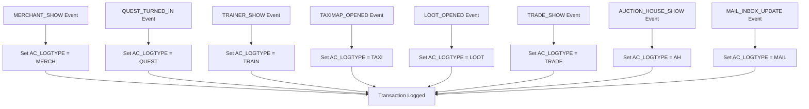
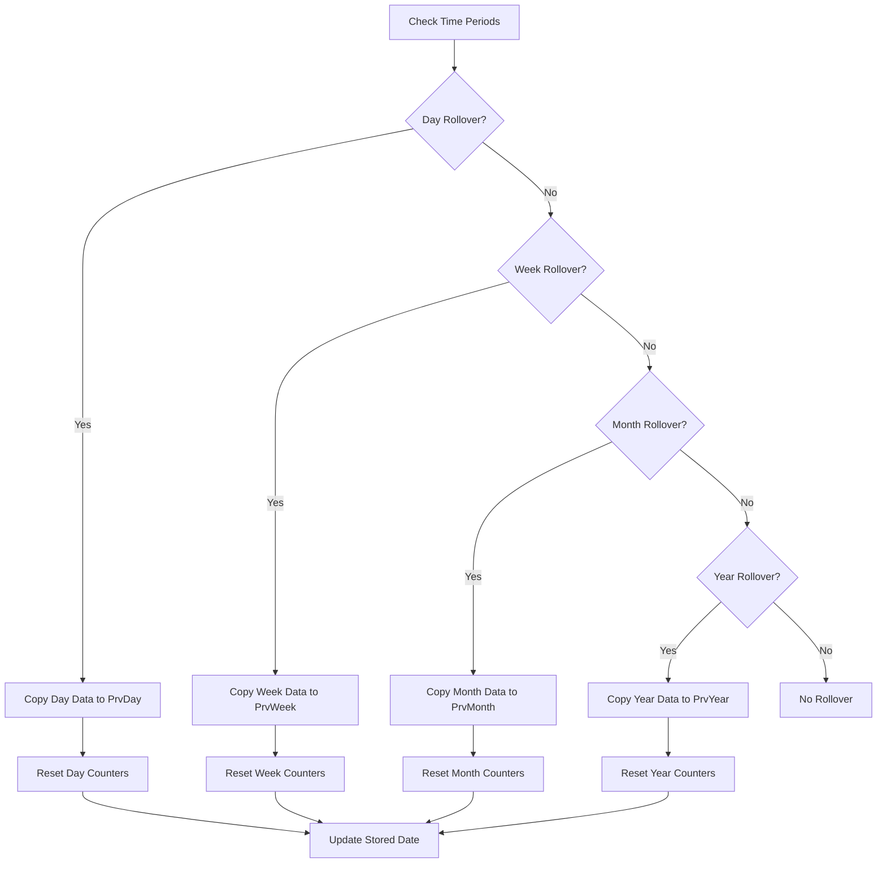
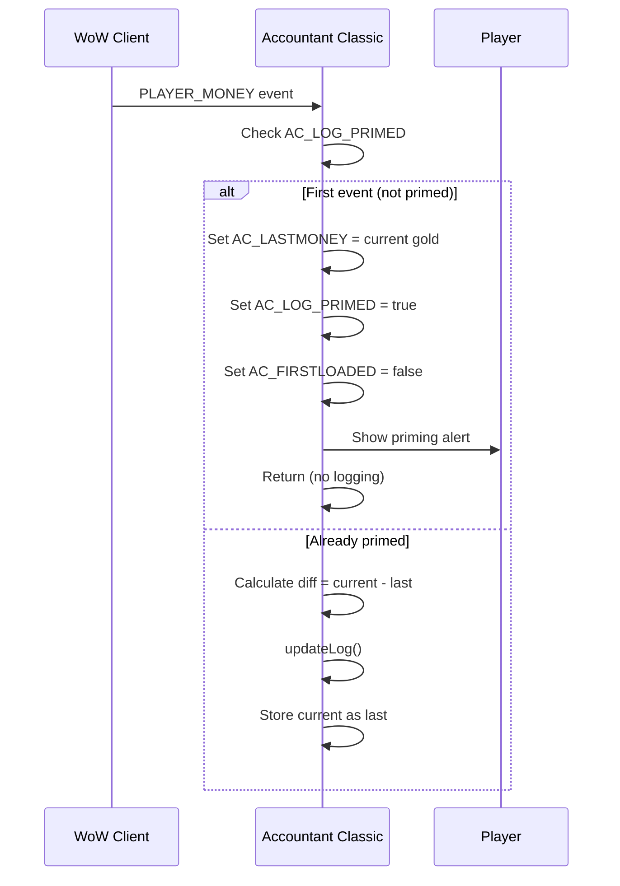
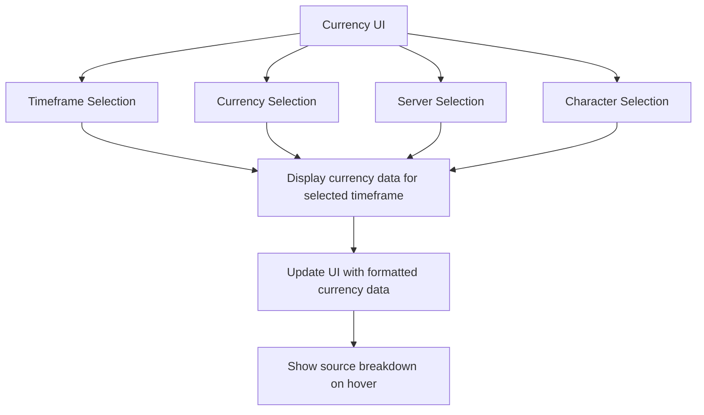

# Feature Reference

<cite>
**Referenced Files in This Document**   
- [Core.lua](file://Core/Core.lua) - *Updated in recent commit*
- [CurrencyCore.lua](file://CurrencyTracker/CurrencyCore.lua) - *Modified in recent commit*
- [CurrencyEventHandler.lua](file://CurrencyTracker/CurrencyEventHandler.lua) - *Modified in recent commit*
- [CurrencyFrame.lua](file://CurrencyTracker/CurrencyFrame.lua) - *Added in recent commit*
- [CurrencyFrame.xml](file://CurrencyTracker/CurrencyFrame.xml) - *Added in recent commit*
</cite>

## Update Summary
**Changes Made**   
- Added new section on Currency Tracking System to reflect new currency tracking features
- Added new section on Near-Cap Warning System for currency thresholds
- Updated Transaction Categorization System to reflect unified source tracking
- Added new section on Currency UI with timeframe support
- Updated Event Handling section to include currency event processing
- Enhanced source tracking with updated file references and annotations

## Table of Contents
1. [Transaction Categorization System](#transaction-categorization-system)
2. [Time Period Tracking](#time-period-tracking)
3. [Event Handling and Transaction Logging](#event-handling-and-transaction-logging)
4. [Cross-Character Data Aggregation](#cross-character-data-aggregation)
5. [Zone-Level Transaction Breakdown](#zone-level-transaction-breakdown)
6. [Data Persistence and Historical Maintenance](#data-persistence-and-historical-maintenance)
7. [Edge Case Handling](#edge-case-handling)
8. [Financial Insights and Usage Patterns](#financial-insights-and-usage-patterns)
9. [Currency Tracking System](#currency-tracking-system)
10. [Currency UI with Timeframe Support](#currency-ui-with-timeframe-support)
11. [Near-Cap Warning System](#near-cap-warning-system)

## Transaction Categorization System

The Accountant Classic addon implements a comprehensive transaction categorization system that tracks financial activities across multiple sources. The categorization is defined in the `Constants.lua` file, which establishes the foundation for how transactions are classified and displayed.

The system categorizes transactions into distinct source types, with different categories available depending on the World of Warcraft version. For Classic Era, TBC, and WOTLK versions, the following transaction sources are tracked:
- **Merchant**: Purchases from NPC vendors
- **Repairs**: Equipment repair costs
- **Taxi**: Transportation fees for flight paths
- **Trainer**: Training costs for skills and abilities
- **Auction House**: Transactions through the auction house
- **Mail**: Gold received or sent via in-game mail
- **Quest**: Rewards from quest completions
- **Loot**: Gold obtained from looting enemies or containers
- **Trade**: Gold exchanged in player-to-player trades
- **Other**: Unclassified money transactions

For more recent versions, additional categories have been added:
- **Garrison**: Garrison-related transactions
- **Barber**: Barber shop services
- **Void**: Void storage transactions
- **Transform**: Transmogrification costs
- **Guild**: Guild bank transactions

The categorization is implemented through WoW API event hooks that set the `AC_LOGTYPE` variable based on the current activity. For example, when a player opens a merchant interface, the `MERCHANT_SHOW` event triggers and sets `AC_LOGTYPE` to "MERCH". Similarly, when a player completes a quest, the `QUEST_TURNED_IN` event sets `AC_LOGTYPE` to "QUEST".



**Diagram sources**
- [Core.lua](file://Core/Core.lua#L1520-L1551)
- [Constants.lua](file://Core/Constants.lua#L100-L140)

**Section sources**
- [Core.lua](file://Core/Core.lua#L1520-L1551)
- [Constants.lua](file://Core/Constants.lua#L100-L140)

## Time Period Tracking

The addon tracks financial data across multiple time periods, allowing users to analyze their gold flow at different granularities. The time periods are defined in the `constants.logmodes` table in `Constants.lua` and include:

- **Session**: Current play session
- **Day**: Current calendar day
- **Week**: Current week (configurable start day)
- **Month**: Current calendar month
- **Year**: Current calendar year
- **Total**: Lifetime tracking

The system also maintains "previous" period data (PrvDay, PrvWeek, PrvMonth, PrvYear) to preserve historical information when time periods roll over. This allows users to compare current performance with previous periods.

The time period tracking is implemented through the `AccountantClassic_LogsShifting()` function in `Core.lua`, which checks for period rollovers and handles the transition of data between current and previous periods. When a new day begins, the system:

1. Checks if the current date differs from the stored date
2. If different, copies the current day's data to the previous day's storage
3. Resets the current day's counters to zero
4. Updates the stored date to the current date

Similar processes occur for week, month, and year rollovers. The week start day is configurable through the addon settings, allowing users to define whether weeks start on Sunday, Monday, or another day.



**Diagram sources**
- [Core.lua](file://Core/Core.lua#L849-L869)
- [Constants.lua](file://Core/Constants.lua#L60-L62)

**Section sources**
- [Core.lua](file://Core/Core.lua#L849-L869)
- [Constants.lua](file://Core/Constants.lua#L60-L62)

## Event Handling and Transaction Logging

The financial tracking system relies on WoW API events to detect and log money transactions. The primary events used are `PLAYER_MONEY` and `CHAT_MSG_MONEY`, which are registered in the `AccountantClassic_RegisterEvents()` function.

The `PLAYER_MONEY` event is triggered whenever a player's gold amount changes. When this event fires, the system calculates the difference between the current and previous gold amounts to determine the transaction amount. Positive differences are recorded as income, while negative differences are recorded as expenses.

```lua
function AccountantClassic_OnEvent(self, event, ...)
    if event == "PLAYER_MONEY" then
        if not AC_LOG_PRIMED then
            AC_LASTMONEY = GetMoney()
            AccountantClassic_Profile["options"].totalcash = AC_LASTMONEY
            AC_LOG_PRIMED = true
            AC_FIRSTLOADED = false
            AccountantClassic_ShowPrimingAlert()
            return
        end
        updateLog()
    end
end
```

The `CHAT_MSG_MONEY` event is used to handle party loot distribution, where gold is shared among group members. When this event is detected, the system parses the chat message to extract the amount of gold received and updates the transaction logs accordingly.

A key feature of the event handling system is the "Priming Approach" for baseline initialization. When a character first loads the addon, there is a risk of counting the character's existing gold as income. To prevent this, the system implements a one-time priming process:

1. When the addon loads for the first time on a character, `AC_FIRSTLOADED` is true
2. The first `PLAYER_MONEY` or `CHAT_MSG_MONEY` event triggers the priming process
3. The current gold amount is stored as the baseline (`AC_LASTMONEY`)
4. A one-time chat alert notifies the user that baseline priming has occurred
5. Subsequent money changes are tracked normally

This approach prevents the initial gold balance from being counted as income while still capturing all subsequent transactions.



The system also handles currency tracking events such as `CURRENCY_DISPLAY_UPDATE` and `BAG_UPDATE`, forwarding them to the CurrencyTracker module for processing. This integration ensures that currency changes are captured alongside gold transactions.

**Diagram sources**
- [Core.lua](file://Core/Core.lua#L1520-L1551)
- [Core.lua](file://Core/Core.lua#L1225-L1270)

**Section sources**
- [Core.lua](file://Core/Core.lua#L1520-L1551)
- [Core.lua](file://Core/Core.lua#L1225-L1270)

## Cross-Character Data Aggregation

The addon provides comprehensive cross-character data aggregation, allowing users to view financial information across multiple characters on the same or different servers. This functionality is implemented through the `PopulateCharacterList()` function and the "All Chars" tab interface.

The data structure is organized hierarchically:
- **Server**: Top-level grouping by realm
- **Character**: Individual character data within each server
- **Financial Data**: Transaction records for each character

When the "All Chars" tab is selected, the system aggregates data from all tracked characters. Users can filter the display by:
- **Server**: View characters from a specific realm or all realms
- **Faction**: View characters from a specific faction or all factions

The aggregation process works as follows:
1. The system iterates through all saved character data
2. For each character, it retrieves the financial data for the selected time period
3. The data is summed to produce totals for all characters
4. The results are displayed in the interface

The sorting functionality allows users to organize the character list by:
- **Name**: Character and server name
- **Money**: Total gold amount
- **Updated**: Date of last session

```lua
function addon:PopulateCharacterList(server, faction)
    local i = 1
    for serverkey, servervalue in orderedpairs(Accountant_ClassicSaveData) do
        for charkey, charvalue in orderedpairs(Accountant_ClassicSaveData[serverkey]) do
            if (not faction or faction == "All") then
                AC_CHARSCROLL_LIST[i] = { serverkey, charkey }
                i = i + 1
            else
                if (charvalue.options.faction == faction) then
                    AC_CHARSCROLL_LIST[i] = { serverkey, charkey }
                    i = i + 1
                end
            end
        end
    end
    AC_CURR_LINES = i - 1
end
```

The cross-character aggregation also supports sorting, which is implemented through the `AC_SORT_BY` and `AC_SORT_ASC` variables. When a user clicks on a column header, the sort criteria are updated and the character list is re-sorted accordingly.

**Section sources**
- [Core.lua](file://Core/Core.lua#L445-L505)
- [Core.lua](file://Core/Core.lua#L2076-L2105)

## Zone-Level Transaction Breakdown

The addon includes a sophisticated zone-level transaction breakdown feature that preserves location context for financial transactions. This allows users to analyze where they earn and spend gold within the game world.

The zone tracking system is controlled by two profile settings:
- **trackzone**: Enables or disables zone tracking
- **tracksubzone**: Determines whether to track subzones (e.g., specific areas within a larger zone)

When zone tracking is enabled, the system captures the current zone and subzone information whenever a transaction occurs. The zone text is constructed as:
- If in an instance (dungeon, raid): Only the zone name
- If tracking subzones and a subzone exists: "Zone Name - Subzone Name"
- Otherwise: Zone name only

The zone data is stored in the `Accountant_ClassicZoneDB` structure, which mirrors the main financial data structure but includes zone-specific breakdowns. For each time period and transaction type, the system maintains separate income and outgoing amounts for each zone.

When a user hovers over a transaction category in the interface, a tooltip displays the zone breakdown. The `AccountantClassic_LogTypeOnShow()` function retrieves the zone data and formats it for display, showing each zone and the corresponding gold amount.

```lua
function AccountantClassic_LogTypeOnShow(self)
    if (profile.trackzone == true and self.logType and self.cashflow) then
        local logmode = private.constants.logmodes[AC_CURRTAB]
        local logType = self.logType
        local cashflow = self.cashflow
        
        for k_zone, v_zone in orderedpairs(Accountant_ClassicZoneDB[serverkey][charkey]["data"][logmode][logType]) do
            mIn = Accountant_ClassicZoneDB[serverkey][charkey]["data"][logmode][logType][k_zone]["In"]
            mOut = Accountant_ClassicZoneDB[serverkey][charkey]["data"][logmode][logType][k_zone]["Out"]
            -- Add to tooltip text
        end
    end
end
```

The zone tracking is integrated with the main transaction logging process. When `updateLog()` is called, it checks if zone tracking is enabled and updates the zone-specific counters accordingly.

**Section sources**
- [Core.lua](file://Core/Core.lua#L1122-L1148)
- [Core.lua](file://Core/Core.lua#L2050-L2074)

## Data Persistence and Historical Maintenance

The addon implements a robust data persistence system that maintains historical financial data across sessions. The data is stored in the SavedVariables system, which persists between game sessions and client restarts.

The primary data structures are:
- **Accountant_ClassicSaveData**: Main storage for financial data
- **Accountant_ClassicZoneDB**: Zone-specific transaction breakdowns
- **Accountant_ClassicDB**: Addon settings and profile data

The data persistence system handles several key aspects:

### Initialization and Options Management
When the addon loads, it initializes the data structures through the `initOptions()` function. If no saved data exists, it creates new structures with default values. The system also ensures that all required options are present, adding any missing options with default values through the `AccountantClassic_UpdateOptions()` function.

### Data Structure
The financial data is organized hierarchically:
- **Server**: Realm name
- **Character**: Character name
- **Options**: Character-specific settings and metadata
- **Data**: Transaction records by category and time period

Each transaction category (Merchant, Repairs, etc.) contains income and outgoing amounts for each time period (Session, Day, Week, etc.).

### Data Migration
The system includes mechanisms for handling data migration when the addon is updated. The `AccountantClassicDefaultOptions` table includes version tracking, and the initialization process ensures that new options are added to existing profiles without disrupting existing data.

### Profile Management
The addon supports multiple profiles through AceDB, allowing users to maintain different configurations. Profile changes trigger a refresh of the interface to reflect the new settings.

The historical data is maintained by never overwriting previous period data. When a time period rolls over, the current period's data is copied to the corresponding "previous" period storage before being reset. This ensures that historical data is preserved indefinitely.

**Section sources**
- [Core.lua](file://Core/Core.lua#L700-L750)
- [Core.lua](file://Core/Core.lua#L849-L869)

## Edge Case Handling

The financial tracking system includes comprehensive edge case handling to ensure accurate data recording under various conditions.

### Negative Gold Values
The system properly handles negative gold values by treating them as outgoing transactions. When a money difference is calculated, negative values are converted to positive amounts and recorded as expenses:

```lua
if (diff < 0) then
    diff = diff * -1
    -- Record as outgoing
    AC_DATA[logtype][logmode].Out = AC_DATA[logtype][logmode].Out + diff
end
```

### Rapid Transaction Bursts
To handle rapid transaction bursts (such as looting multiple items quickly), the system uses the `PLAYER_MONEY` event as the authoritative source of truth. Since this event fires after all transactions in a burst have been processed, the system captures the net change rather than individual transactions, preventing potential race conditions.

### First-Session Skew
The "Priming Approach" specifically addresses the edge case of first-session data skew. Without this mechanism, a character's initial gold balance would be incorrectly recorded as income. The priming system ensures that only changes after the baseline is established are recorded.

### Session Continuity
When a player logs out and back in during the same calendar day, the system maintains continuity by preserving the current day's transaction data. The `AccountantClassic_LogsShifting()` function only resets daily data when the actual date changes, not when the addon reloads.

### Data Integrity
The system includes several safeguards for data integrity:
- **Nil checks**: Variables are checked for nil values before use
- **Type validation**: Data types are validated where appropriate
- **Boundary checks**: Array bounds are checked to prevent indexing errors
- **Fallback values**: Default values are provided when data is missing

### Event Ordering
The system accounts for potential event ordering issues. For example, the `CHAT_MSG_MONEY` event for party loot distribution fires before the `PLAYER_MONEY` event. The `AccountantClassic_OnShareMoney()` function handles this by temporarily adjusting the `AC_LASTMONEY` value to prevent double-counting.

**Section sources**
- [Core.lua](file://Core/Core.lua#L1225-L1270)
- [Core.lua](file://Core/Core.lua#L1122-L1148)

## Financial Insights and Usage Patterns

The addon provides several features that enable users to extract meaningful financial insights from the tracked data.

### Data Aggregation and Summarization
The interface displays comprehensive summaries for each time period, showing:
- **Total Incomings**: Sum of all income sources
- **Total Outgoings**: Sum of all expense categories
- **Net Profit/Loss**: Difference between income and expenses

These summaries are calculated dynamically when the interface is displayed, ensuring that users always see up-to-date information.

### Comparative Analysis
By tracking both current and previous periods, users can perform comparative analysis:
- Compare daily income/expense patterns
- Analyze weekly trends
- Evaluate monthly financial performance
- Track year-over-year progress

### Source Breakdown
The categorization system allows users to identify which activities generate the most income and which expenses consume the most gold. This enables strategic decision-making, such as:
- Focusing on high-income activities
- Reducing expenses in specific categories
- Optimizing gold-making strategies

### Cross-Character Analysis
The "All Chars" tab enables users to analyze their financial portfolio across multiple characters, identifying:
- Characters with the highest net worth
- Characters with the highest income generation
- Characters with the highest expense ratios

### Usage Patterns
Common usage patterns include:
1. **Daily Review**: Checking the "Today" tab at the end of a play session to review financial activity
2. **Weekly Planning**: Using the "This Week" data to set financial goals for the coming week
3. **Expense Management**: Monitoring specific expense categories (like repairs) to control spending
4. **Income Optimization**: Identifying the most profitable activities and focusing on them
5. **Character Comparison**: Using the "All Chars" tab to balance resources across alts

The data can also be used for long-term financial planning, such as saving for expensive purchases or tracking progress toward financial goals.

**Section sources**
- [Core.lua](file://Core/Core.lua#L1600-L1800)
- [Core.lua](file://Core/Core.lua#L2000-L2105)

## Currency Tracking System

The addon has been enhanced with a comprehensive currency tracking system that extends the financial tracking capabilities beyond gold to include all in-game currencies. This system is implemented in the CurrencyTracker module and integrates with the core financial tracking infrastructure.

The currency tracking system uses a unified source tracking approach with the `quantityGainSource` field to identify the origin of currency changes. This replaces legacy negative sources with a consistent positive numeric source key system. The system handles both gains and losses through the same source identification mechanism, ensuring consistent tracking regardless of transaction direction.

```lua
-- Determine numeric source key (unified):
-- Modern clients often populate quantityGainSource for BOTH gains and losses.
-- Prefer quantityGainSource; fall back to quantityLostSource (destroyReason) only if needed.
local sourceKey
do
    local src = tonumber(quantityGainSource) or tonumber(quantityLostSource)
    if src then
        sourceKey = src
    else
        sourceKey = "Unknown"
    end
end
```

The system supports dynamic discovery of new currencies, automatically adding support for currencies that the player encounters. When a previously unknown currency is detected, the system saves basic metadata about the currency and begins tracking its transactions.

The currency tracking is integrated with the event system through the `ProcessCurrencyChange` function, which handles currency updates from various sources including the `CURRENCY_DISPLAY_UPDATE` event and bag updates. The system also includes special handling for currencies with unreliable API data, such as Trader's Tender (currency ID 2032).

**Section sources**
- [CurrencyEventHandler.lua](file://CurrencyTracker/CurrencyEventHandler.lua#L542-L570)
- [CurrencyCore.lua](file://CurrencyTracker/CurrencyCore.lua#L419-L445)
- [Core.lua](file://Core/Core.lua#L1531-L1558)

## Currency UI with Timeframe Support

A new UI has been implemented for currency tracking that provides comprehensive visualization of currency data with full timeframe support. The UI is accessible through the `/ct ui` command and provides a standalone window that mirrors the style and functionality of the gold tracking interface.

The currency UI supports all standard time periods:
- **Session**: Current play session
- **Day**: Current calendar day
- **Week**: Current week
- **Month**: Current calendar month
- **Year**: Current calendar year
- **Total**: Lifetime tracking

The interface includes a currency selection dropdown that allows users to view data for specific currencies or see a summary across all tracked currencies. The UI also includes server and character selection dropdowns, enabling cross-character analysis of currency holdings.

The UI state is persistent, remembering the user's last selected timeframe, server, character, and currency for future sessions. This state is stored in the `currencyOptions` structure within the saved variables.

The UI is built using XML templates and Lua code that work together to provide a responsive interface. The `CurrencyFrame.xml` file defines the UI layout and components, while the `CurrencyFrame.lua` file handles the logic and data binding.



**Diagram sources**
- [CurrencyFrame.xml](file://CurrencyTracker/CurrencyFrame.xml)
- [CurrencyFrame.lua](file://CurrencyTracker/CurrencyFrame.lua)

**Section sources**
- [CurrencyFrame.xml](file://CurrencyTracker/CurrencyFrame.xml)
- [CurrencyFrame.lua](file://CurrencyTracker/CurrencyFrame.lua)
- [Docs/CurrencyTracker-UI-Design.md](file://Docs/CurrencyTracker-UI-Design.md)

## Near-Cap Warning System

The addon includes a configurable near-cap warning system that alerts users when their currency holdings approach maximum capacity. This feature helps prevent players from losing currency due to reaching cap limits.

The warning system is configurable through the following settings:
- **Threshold**: The percentage of maximum capacity that triggers the warning (configurable)
- **Duration**: How long the warning remains visible (configurable)
- **Notification Method**: How the warning is presented to the user

The system monitors all tracked currencies and evaluates their current amounts against their maximum capacities. When a currency reaches the configured threshold, a warning is displayed to the user. The warning includes the currency name, current amount, maximum capacity, and the percentage filled.

```lua
-- Check if currency is approaching cap
if currentAmount >= (maxCapacity * threshold) then
    -- Trigger warning
    ShowNearCapWarning(currencyID, currentAmount, maxCapacity)
end
```

The warning system is integrated with the currency tracking event handlers, checking currency amounts whenever a `CURRENCY_DISPLAY_UPDATE` event occurs. This ensures that warnings are generated promptly when currency amounts change.

The system also includes a repair function that can be used to fix legacy data issues where currency tracking may have been inconsistent. This repair function normalizes source tracking and ensures data integrity across all currency records.

**Section sources**
- [CurrencyCore.lua](file://CurrencyTracker/CurrencyCore.lua)
- [Core.lua](file://Core/Core.lua)
- [CurrencyEventHandler.lua](file://CurrencyTracker/CurrencyEventHandler.lua)