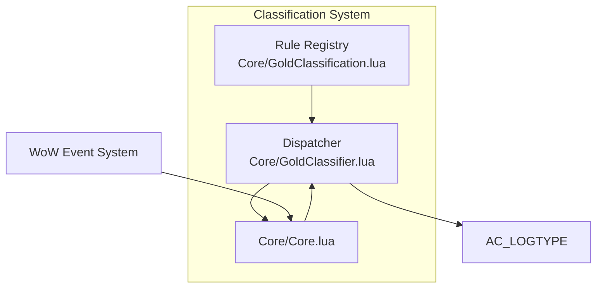
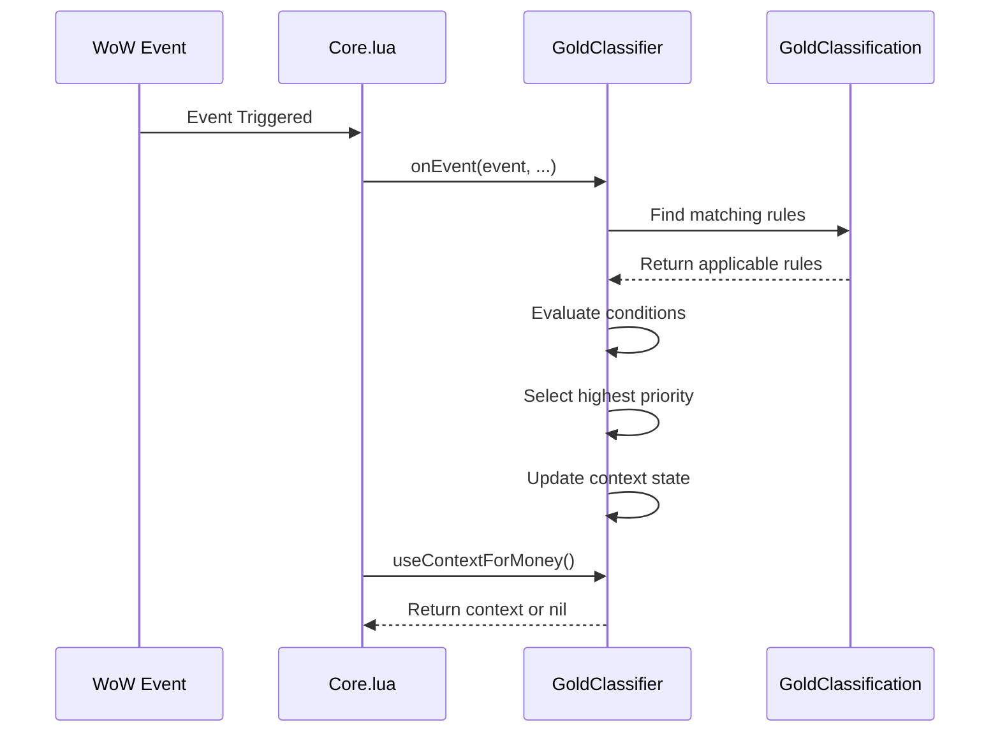

# Gold Tracker Refactor Design

<cite>
**Referenced Files in This Document**   
- [Core/GoldClassification.lua](file://Core/GoldClassification.lua)
- [Core/GoldClassifier.lua](file://Core/GoldClassifier.lua)
- [Core/Core.lua](file://Core/Core.lua)
- [Docs/GoldTracker-Classification-Refactor.md](file://Docs/GoldTracker-Classification-Refactor.md)
- [Docs/GoldTracker-Event-Classification.md](file://Docs/GoldTracker-Event-Classification.md)
- [Core/Constants.lua](file://Core/Constants.lua)
</cite>

## Table of Contents
1. [Introduction](#introduction)
2. [Proposed Data-Driven Architecture](#proposed-data-driven-architecture)
3. [Rule Schema Definition](#rule-schema-definition)
4. [Dispatcher Design](#dispatcher-design)
5. [Migration Plan](#migration-plan)
6. [Backward Compatibility Considerations](#backward-compatibility-considerations)
7. [Testing Strategy](#testing-strategy)
8. [Conclusion](#conclusion)

## Introduction

This document outlines the proposed refactor of the Gold Tracker classification system in the Accountant Classic addon. The current implementation relies on a procedural chain of conditional statements within `AccountantClassic_OnEvent()` to determine the context of gold transactions. This approach has led to scattered logic, difficulty in auditing, and challenges in extending the system with new features.

The proposed solution introduces a data-driven architecture that centralizes classification rules in a declarative registry. This refactor aims to improve maintainability, enable safer extension of functionality, and provide a clearer separation of concerns between event handling and classification logic.

**Section sources**
- [Docs/GoldTracker-Classification-Refactor.md](file://Docs/GoldTracker-Classification-Refactor.md#L0-L24)
- [Docs/GoldTracker-Event-Classification.md](file://Docs/GoldTracker-Event-Classification.md#L0-L21)

## Proposed Data-Driven Architecture

The refactor introduces two new core components: `Core/GoldClassification.lua` and `Core/GoldClassifier.lua`. This architecture separates the definition of classification rules from their execution logic, enabling a more modular and maintainable design.

The key principle is to keep the runtime behavior unchanged during the initial implementation phase. The new modules will be loaded but not integrated into the event flow until thorough testing confirms their correctness. This approach minimizes risk and allows for a clean review phase.



**Diagram sources**
- [Core/GoldClassification.lua](file://Core/GoldClassification.lua)
- [Core/GoldClassifier.lua](file://Core/GoldClassifier.lua)
- [Core/Core.lua](file://Core/Core.lua)

**Section sources**
- [Docs/GoldTracker-Classification-Refactor.md](file://Docs/GoldTracker-Classification-Refactor.md#L26-L46)
- [Docs/GoldTracker-Classification-Refactor.md](file://Docs/GoldTracker-Classification-Refactor.md#L69-L79)

## Rule Schema Definition

The classification rules are defined as Lua tables with a specific schema that captures all necessary information for context determination. Each rule specifies the conditions under which a particular transaction type should be classified.

### Rule Properties

- **event**: String or array of strings representing WoW event names that trigger this rule
- **type**: String value corresponding to an `AC_LOGTYPE` constant
- **mode**: String indicating the persistence behavior:
  - `"sticky"`: Persists until overridden or explicitly cleared
  - `"transient"`: Consumed by the next `PLAYER_MONEY` event (with optional expiry)
  - `"clear"`: Sets context to empty string
- **priority**: Numeric value determining rule precedence (higher values win)
- **cond**: Optional function that evaluates additional conditions
- **branch**: Optional string ("retail"|"classic") for version-specific rules
- **minTOC/maxTOC**: Optional numeric values for client build gating
- **ttlSec**: Optional number specifying expiry window for transient modes (default 5 seconds)

### Example Rules

The following example demonstrates the rule schema in practice, showing how different game events map to transaction types with appropriate modes and conditions:

```lua
local Rules = {
  { event = {"MERCHANT_SHOW"}, type = "MERCH", mode = "sticky", priority = 50 },
  { event = {"MERCHANT_UPDATE"}, type = "REPAIRS", mode = "transient", priority = 80, 
    cond = function() return InRepairMode() == true end, ttlSec = 5 },
  { event = {"TAXIMAP_OPENED"}, type = "TAXI", mode = "transient", priority = 70, ttlSec = 5 },
  { event = {"MAIL_INBOX_UPDATE"}, type = "AH", mode = "transient", priority = 60, 
    cond = isAhSellerInvoice },
  { event = {"GARRISON_MISSION_FINISHED","GARRISON_ARCHITECT_OPENED",
             "GARRISON_MISSION_NPC_OPENED","GARRISON_SHIPYARD_NPC_OPENED"}, 
    type = "GARRISON", mode = "sticky", priority = 40, branch = "retail" },
}
```

**Section sources**
- [Docs/GoldTracker-Classification-Refactor.md](file://Docs/GoldTracker-Classification-Refactor.md#L26-L46)
- [Core/GoldClassification.lua](file://Core/GoldClassification.lua)

## Dispatcher Design

The dispatcher component, implemented in `Core/GoldClassifier.lua`, is responsible for evaluating rules and managing the classification context. It exposes a minimal API designed for safe integration with the existing codebase.

### Dispatcher API

- **init(rules, env)**: Initializes the dispatcher with rules and environment configuration
  - Filters rules by branch and TOC version
  - Builds an event-indexed lookup table for efficient rule matching
- **onEvent(event, ...)**: Processes incoming events and updates internal context state
  - Evaluates applicable rules for the event
  - Manages sticky and transient context stacks
  - Does not modify `AC_LOGTYPE` directly
- **useContextForMoney()**: Returns the current classification context for money transactions
  - Consumes transient contexts when used
  - Returns nil if no valid context exists, allowing fallback to existing behavior
- **getDebugState()**: Provides diagnostic information for verbose logging and debugging

### Dispatcher Responsibilities

The dispatcher follows a clear sequence of operations:

1. **Index Building**: At initialization, creates a mapping from event names to applicable rules
2. **Event Processing**: For each event, fetches relevant rules, evaluates conditions, and selects the highest-priority match
3. **Context Management**: Updates internal state based on rule mode (sticky, transient, or clear)
4. **Context Retrieval**: Provides the current classification context when requested during money transactions



**Diagram sources**
- [Core/GoldClassifier.lua](file://Core/GoldClassifier.lua#L1-L50)
- [Core/GoldClassification.lua](file://Core/GoldClassification.lua#L1-L20)

**Section sources**
- [Docs/GoldTracker-Classification-Refactor.md](file://Docs/GoldTracker-Classification-Refactor.md#L78-L94)
- [Docs/GoldTracker-Classification-Refactor.md](file://Docs/GoldTracker-Classification-Refactor.md#L95-L130)

## Migration Plan

The migration to the new data-driven architecture will follow a systematic, step-by-step approach designed to minimize risk and ensure backward compatibility.

### Step-by-Step Migration

1. **Scaffold Creation**
   - Create `Core/GoldClassification.lua` containing the rule registry
   - Create `Core/GoldClassifier.lua` implementing the dispatcher logic
   - Add both files to the `.toc` file to ensure loading
   - Do not modify `Core/Core.lua` at this stage

2. **Non-Invasive Wiring**
   - Import `GoldClassifier` in `Core/Core.lua`
   - Add `GoldClassifier:onEvent(event, ...)` at the start of `AccountantClassic_OnEvent()`
   - Run in parallel with existing logic, logging decisions under verbose mode

3. **Read Path Integration**
   - In the `PLAYER_MONEY` branch, call `GoldClassifier:useContextForMoney()`
   - Use the returned context if available; otherwise fall back to existing `AC_LOGTYPE`
   - Guard with a feature flag for A/B testing

4. **Gradual Rule Migration**
   - Migrate stable, well-understood mappings (MERCHANT_SHOW → MERCH, etc.)
   - Confirm behavioral parity under verbose logs
   - Remove corresponding `elseif` branches from `AccountantClassic_OnEvent()`
   - Add comments referencing the rule registry for future maintenance

5. **Feature Enhancement**
   - Implement transient expiry windows for contexts like TAXI, LOOT, and MAIL/AH
   - Add version gating for retail-only features using the `branch` property
   - Prepare for future features like Crafting Orders

6. **Final Integration and Cleanup**
   - Remove all remaining classification logic from `AccountantClassic_OnEvent()`
   - Ensure comprehensive test coverage
   - Ship with verbose logging disabled by default

**Section sources**
- [Docs/GoldTracker-Classification-Refactor.md](file://Docs/GoldTracker-Classification-Refactor.md#L150-L190)

## Backward Compatibility Considerations

The refactor design prioritizes backward compatibility to ensure a seamless transition for users and maintain existing data integrity.

### Compatibility Guarantees

- **Data Model Preservation**: The underlying SavedVariables structure and data model remain unchanged
- **Behavioral Consistency**: The `OTHER` fallback behavior is preserved when no classification context exists
- **Incremental Migration**: The step-by-step approach allows reverting to the previous behavior at any point
- **Feature Flag Protection**: Initial integration is guarded by feature flags to prevent unintended changes

### Risk Mitigation

- **Rule Conflicts**: Resolved through explicit priority values with clear documentation
- **Transient Context Expiry**: Implemented with configurable TTL values to handle delayed money changes
- **Missing Rules**: Default behavior falls back to existing classification logic
- **Unexpected Events**: Ignored safely without disrupting the classification process

The design ensures that even if the new system fails to classify a transaction, the existing fallback mechanisms in `updateLog()` will handle it appropriately, maintaining the addon's core functionality.

**Section sources**
- [Docs/GoldTracker-Classification-Refactor.md](file://Docs/GoldTracker-Classification-Refactor.md#L190-L205)

## Testing Strategy

A comprehensive testing strategy will ensure the reliability and correctness of the refactored classification system.

### Testing Matrix

The following scenarios will be tested across both retail and classic client versions:

| Scenario | Test Cases |
|--------|------------|
| Merchant Transactions | Buy/sell items, repair with/without repair mode |
| Transportation | Taxi usage, flight path completion |
| Questing | Quest completion with rewards, quest turn-in |
| Loot |拾取物品, 装备升级, 战利品分配 |
| Trade | Player-to-player trading, gold exchange |
| Mail System | Auction house mail (buyer/seller), regular mail |
| Retail-Exclusive Features | Garrison missions, barber shop, transmogrification, LFG rewards |
| Edge Cases | Rapid successive events, delayed money changes, combat transitions |

### Validation Approach

- **Verbose Logging**: Enable detailed logging to compare classification decisions between old and new systems
- **A/B Testing**: Run both systems in parallel, comparing outputs for consistency
- **Regression Testing**: Verify that existing functionality continues to work as expected
- **Performance Monitoring**: Ensure the new system does not introduce performance regressions

### Quality Assurance

- **Automated Tests**: Where possible, implement automated tests for core classification logic
- **Manual Verification**: Conduct thorough manual testing across various gameplay scenarios
- **Community Feedback**: Release beta versions to gather feedback from active users
- **Monitoring**: Implement diagnostic tools to monitor classification accuracy in production

**Section sources**
- [Docs/GoldTracker-Classification-Refactor.md](file://Docs/GoldTracker-Classification-Refactor.md#L150-L190)

## Conclusion

The proposed data-driven refactor of the Gold Tracker classification system represents a significant improvement in maintainability, extensibility, and reliability. By centralizing classification rules in a declarative registry and implementing a dedicated dispatcher, the system becomes more transparent and easier to extend with new features.

The step-by-step migration plan ensures a low-risk transition that preserves backward compatibility while gradually replacing the legacy procedural logic. This approach allows for thorough testing at each stage and provides clear rollback options if needed.

With this architecture in place, adding support for new game features such as Crafting Orders will be reduced to adding a rule entry in `Core/GoldClassification.lua`, testing under verbose logs, and shipping the update—eliminating the need for invasive changes to core event handling logic.

The refactor not only addresses current maintenance challenges but also establishes a foundation for future enhancements, making the Accountant Classic addon more adaptable to evolving gameplay mechanics and user requirements.