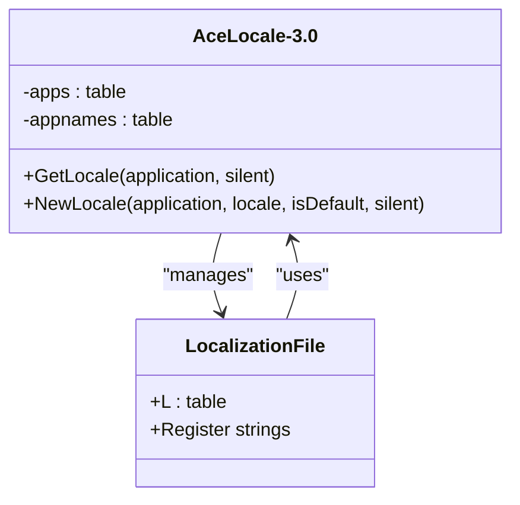
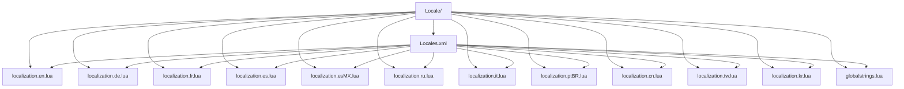
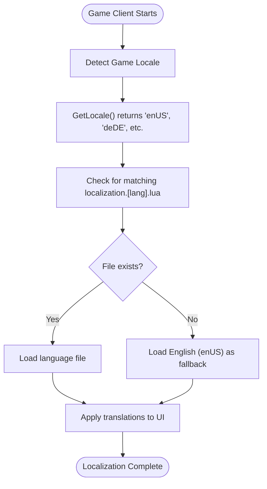
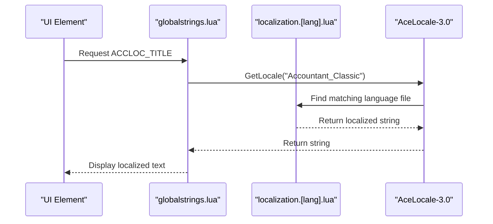

# Localization

<cite>
**Referenced Files in This Document**   
- [localization.en.lua](file://Locale/localization.en.lua) - *Updated with Currency Tracker strings in commit 21*
- [localization.cn.lua](file://Locale/localization.cn.lua) - *Updated with Currency Tracker strings in commit 22*
- [CurrencyCore.lua](file://CurrencyTracker/CurrencyCore.lua) - *Added localization for /ct commands in commit 21*
- [CurrencyConstants.lua](file://CurrencyTracker/CurrencyConstants.lua) - *Added source code tokens in commit 22*
- [CurrencyEventHandler.lua](file://CurrencyTracker/CurrencyEventHandler.lua) - *Uses localized source labels in commit 22*
- [AceLocale-3.0.lua](file://Libs/AceLocale-3.0/AceLocale-3.0.lua)
- [Locales.xml](file://Locale/Locales.xml)
- [globalstrings.lua](file://Locale/globalstrings.lua)
</cite>

## Update Summary
**Changes Made**   
- Updated documentation to reflect new Currency Tracker localization features
- Added new section for Currency Tracker command localization
- Enhanced String Key Usage section with Currency Tracker examples
- Updated Contributing New Translations with Currency Tracker guidelines
- Added new diagram for Currency Tracker localization flow
- Updated section sources to reflect analyzed files

## Table of Contents
1. [Introduction](#introduction)
2. [Localization System Overview](#localization-system-overview)
3. [File Structure and Organization](#file-structure-and-organization)
4. [Workflow for String Translation](#workflow-for-string-translation)
5. [String Key Usage in Codebase](#string-key-usage-in-codebase)
6. [Contributing New Translations](#contributing-new-translations)
7. [Language Selection Mechanism](#language-selection-mechanism)
8. [Common Localization Issues](#common-localization-issues)
9. [Integration with UI and Configuration](#integration-with-ui-and-configuration)
10. [Currency Tracker Command Localization](#currency-tracker-command-localization)
11. [Conclusion](#conclusion)

## Introduction
The Accountant_Classic addon implements a comprehensive localization system to support multiple languages using the AceLocale-3.0 library. This documentation details how multilingual support is managed across 12 languages (enUS, deDE, frFR, esES, esMX, ruRU, itIT, ptBR, zhCN, zhTW, koKR) through dedicated localization files. The system enables seamless translation of all user-facing text while maintaining consistency and ease of maintenance.

**Section sources**
- [localization.en.lua](file://Locale/localization.en.lua)
- [AceLocale-3.0.lua](file://Libs/AceLocale-3.0/AceLocale-3.0.lua)

## Localization System Overview
Accountant_Classic utilizes AceLocale-3.0, a robust localization framework that allows for efficient management of multilingual strings. The system is designed to automatically detect the user's game client locale and load the appropriate language file, falling back to English (enUS) as the default when translations are missing.



**Diagram sources**
- [AceLocale-3.0.lua](file://Libs/AceLocale-3.0/AceLocale-3.0.lua)
- [localization.en.lua](file://Locale/localization.en.lua)

**Section sources**
- [AceLocale-3.0.lua](file://Libs/AceLocale-3.0/AceLocale-3.0.lua)
- [localization.en.lua](file://Locale/localization.en.lua)

## File Structure and Organization
The localization system is organized in the Locale directory with a clear file structure:



**Diagram sources**
- [Locales.xml](file://Locale/Locales.xml)
- [Locale/](file://Locale/)

**Section sources**
- [Locales.xml](file://Locale/Locales.xml)
- [localization.en.lua](file://Locale/localization.en.lua)

### Localization File Structure
Each localization file follows a consistent pattern:

```lua
local L = LibStub("AceLocale-3.0"):NewLocale("Accountant_Classic", "localeCode", isDefault)
if not L then return end

L["String Key"] = "Translated String"
L["Another Key"] = "Another Translation"
```

The `isDefault` parameter is set to `true` only in the English (enUS) file, establishing it as the base language. All other language files use `false`.

### Global Strings
The globalstrings.lua file serves as a central repository for commonly used string references, mapping localization keys to global variables for easy access throughout the codebase:

```lua
local L = LibStub("AceLocale-3.0"):GetLocale("Accountant_Classic");

ACCLOC_TITLE = L["Accountant Classic"];
ACCLOC_OPTS = L["Accountant Classic Options"];
ACCLOC_STARTWEEK = L["Start of Week"];
```

This approach allows core functionality to reference localized strings without direct dependency on the localization files.

## Workflow for String Translation
The translation workflow follows a systematic process from defining base strings to creating language-specific overrides.

### Default String Definition
English strings are defined in localization.en.lua with the `isDefault` flag set to `true`:

```lua
local AceLocale = LibStub:GetLibrary("AceLocale-3.0");
local L = AceLocale:NewLocale("Accountant_Classic", "enUS", true, true);

if not L then return end

L["Accountant Classic"] = "Accountant Classic"
L["Total Incomings"] = "Total Incomings"
L["Total Outgoings"] = "Total Outgoings"
```

The dual `true` parameters indicate that this is both the default locale and that missing translations should be reported.

### Language-Specific Overrides
Language files create translations by referencing the same string keys:

```lua
local L = LibStub("AceLocale-3.0"):NewLocale("Accountant_Classic", "deDE", false)
if not L then return end

L["Accountant Classic"] = "Accountant Classic"
L["Total Incomings"] = "Gesamteinnahmen"
L["Total Outgoings"] = "Gesamtausgaben"
```

When a translation is missing, AceLocale-3.0 automatically falls back to the English string, ensuring the interface remains functional.

### Translation Process
1. **Identify new strings**: Add English translations to localization.en.lua
2. **Register string keys**: Use consistent, descriptive keys
3. **Create language files**: Translate strings in respective localization.[lang].lua files
4. **Test localization**: Verify display in target language clients
5. **Update Locales.xml**: Ensure new files are included in the XML manifest

**Section sources**
- [localization.en.lua](file://Locale/localization.en.lua)
- [localization.de.lua](file://Locale/localization.de.lua)
- [globalstrings.lua](file://Locale/globalstrings.lua)

## String Key Usage in Codebase
Localized strings are referenced throughout the codebase using the L table, which is obtained via AceLocale's GetLocale method.

### Accessing Localized Strings
In any module requiring localization, strings are accessed as follows:

```lua
local L = LibStub("AceLocale-3.0"):GetLocale("Accountant_Classic")
-- Use L["key"] to get the localized string
print(L["Accountant Classic"])
```

### Key Naming Conventions
The system uses descriptive keys that reflect the string's purpose:

- **UI Elements**: `L["Options"]`, `L["Exit"]`, `L["Reset"]`
- **Tabs**: `L["This Session"]`, `L["Today"]`, `L["This Week"]`
- **Categories**: `L["Quest Rewards"]`, `L["Merchants"]`, `L["Repair Costs"]`
- **Tooltips**: `L["TT1"]`, `L["TT2"]`, etc.
- **Configuration**: `L["Show minimap button"]`, `L["Start of Week"]`
- **Currency Tracker**: `L["CT_HeaderFormat"]`, `L["CT_TotalIncome"]`, `L["ConvertOldItem"]`

### Parameterized Strings
The system supports parameterized strings using standard Lua formatting:

```lua
L["Are you sure you want to reset the \"%s\" data?"] = "Are you sure you want to reset the \"%s\" data?"
-- Usage: string.format(L["Are you sure you want to reset the \"%s\" data?"], sessionName)
```

This allows dynamic content insertion while maintaining proper grammar in all languages.

**Section sources**
- [localization.en.lua](file://Locale/localization.en.lua)
- [globalstrings.lua](file://Locale/globalstrings.lua)
- [CurrencyCore.lua](file://CurrencyTracker/CurrencyCore.lua)

## Contributing New Translations
Contributors can add new language support by following these guidelines.

### Creating a New Language File
To add support for a new language (e.g., Spanish - Spain):

1. Create a new file: `localization.esES.lua`
2. Use the standard header:
```lua
local L = LibStub("AceLocale-3.0"):NewLocale("Accountant_Classic", "esES", false)
if not L then return end
```
3. Translate all string keys from localization.en.lua
4. Add the file to Locales.xml

### Formatting Requirements
- **File Encoding**: UTF-8 without BOM
- **Line Endings**: Unix (LF)
- **Indentation**: 2 spaces (no tabs)
- **String Keys**: Preserve exact key names from English file
- **Quotes**: Use double quotes for translated strings
- **Comments**: Use `--` for single-line comments

### Character Encoding Considerations
Special characters must be properly encoded:

```lua
-- French example with accented characters
L["Accountant Classic Options"] = "Options d'Accountant Classic"
L["Net Profit / Loss"] = "Bénéfice / Perte net"

-- Russian example with Cyrillic
L["Accountant Classic"] = "Accountant Classic"
L["Total Incomings"] = "Общий доход"
```

All files should be saved in UTF-8 encoding to support international characters.

### Translation Best Practices
- **Context Preservation**: Maintain the original meaning and context
- **Length Considerations**: Account for text expansion (German can be 30% longer than English)
- **Placeholders**: Never modify `%s`, `%d`, or other format specifiers
- **Consistency**: Use consistent terminology across the interface
- **Cultural Sensitivity**: Adapt content appropriately for target cultures
- **Currency Tracker Specifics**: When translating Currency Tracker source labels (e.g., `L["QuestReward"]`), ensure technical accuracy as these represent specific game mechanics and API enumerations.

**Section sources**
- [localization.en.lua](file://Locale/localization.en.lua)
- [localization.de.lua](file://Locale/localization.de.lua)
- [Locales.xml](file://Locale/Locales.xml)
- [CurrencyConstants.lua](file://CurrencyTracker/CurrencyConstants.lua)

## Language Selection Mechanism
The system automatically determines which language file to load based on the game client's locale setting.

### Locale Detection Process


**Diagram sources**
- [AceLocale-3.0.lua](file://Libs/AceLocale-3.0/AceLocale-3.0.lua)
- [localization.en.lua](file://Locale/localization.en.lua)

### AceLocale-3.0 Implementation
The library handles locale detection through:

```lua
local gameLocale = GetLocale()
if gameLocale == "enGB" then
    gameLocale = "enUS"
end
```

This ensures British English clients use American English translations.

### Loading Priority
The system follows this priority when loading translations:

1. Exact match for current locale (e.g., deDE for German client)
2. Fallback to base language (enUS) if specific translation is missing
3. Use string key as fallback if even English translation is missing

This cascading approach ensures the interface remains functional in all scenarios.

**Section sources**
- [AceLocale-3.0.lua](file://Libs/AceLocale-3.0/AceLocale-3.0.lua)
- [localization.en.lua](file://Locale/localization.en.lua)

## Common Localization Issues
Several common issues can arise in multilingual implementations, along with their solutions.

### Missing Translations
When a string key exists in the English file but not in a language-specific file:

```lua
-- Problem: Missing translation in localization.de.lua
-- Solution: Add the missing key
L["New Feature"] = "Neue Funktion"
```

AceLocale-3.0 will automatically use the English string as fallback and issue a warning during development.

### Text Overflow in UI Elements
Different languages have varying text lengths:

```lua
-- English: "Options" (7 characters)
-- German: "Optionen" (8 characters) 
-- French: "Options" (7 characters)
-- Russian: "Параметры" (9 characters)
```

**Solutions:**
- Design UI with flexible layouts
- Use abbreviations where appropriate
- Implement dynamic font scaling
- Test with longest expected translations

### Date and Number Formatting
The system includes specific handling for number formatting:

```lua
L["Converts a number into a localized string, grouping digits as required."] = "Converts a number into a localized string, grouping digits as required."
```

This ensures proper digit grouping (e.g., 1,000 vs 1.000) based on regional conventions.

### Special Character Handling
Certain languages require special attention:

```lua
-- Chinese example
L["Accountant Classic"] = "Accountant Classic"

-- Russian example with Cyrillic
L["Accountant Classic"] = "Accountant Classic"
```

All files must be saved in UTF-8 encoding to properly display special characters.

### Right-to-Left Languages
While not currently supported, the system architecture can accommodate RTL languages through:
- UI layout adjustments
- Text alignment settings
- Font selection for RTL scripts

**Section sources**
- [localization.en.lua](file://Locale/localization.en.lua)
- [localization.de.lua](file://Locale/localization.de.lua)
- [localization.cn.lua](file://Locale/localization.cn.lua)

## Integration with UI and Configuration
Localized strings are seamlessly integrated into the main UI and configuration panels.

### Main UI Integration
The primary interface elements use localized strings:

```lua
-- Tab labels
L["This Session"] = "This Session"
L["Today"] = "Today" 
L["This Week"] = "This Week"

-- Section headers
L["Quest Rewards"] = "Quest Rewards"
L["Merchants"] = "Merchants"
L["Repair Costs"] = "Repair Costs"
```

These strings appear in the main Accountant Classic window, providing a consistent multilingual experience.

### Configuration Panel Integration
The options interface extensively uses localization:

```lua
-- Option labels
L["Show minimap button"] = "Show minimap button"
L["Show money on screen"] = "Show money on screen"
L["Start of Week"] = "Start of Week"

-- Button labels
L["Reset"] = "Reset"
L["Options"] = "Options"
L["Exit"] = "Exit"
```

### Global Variable Mapping
The globalstrings.lua file creates convenient references:

```lua
ACCLOC_TITLE = L["Accountant Classic"];
ACCLOC_OPTS = L["Accountant Classic Options"];
ACCLOC_MINIBUT = L["Show minimap button"];
```

This allows core modules to access localized strings without directly referencing the L table.

### Tooltip Integration
Tooltips use dedicated translation keys:

```lua
-- Minimap button tooltip
L["TT1"] = "This Session"
L["TT2"] = "Today"
L["TT3"] = "Yesterday"

-- Configuration tooltips
L["Show money on minimap button's tooltip"] = "Show money on minimap button's tooltip"
L["Show session info on minimap button's tooltip"] = "Show session info on minimap button's tooltip"
```



**Diagram sources**
- [globalstrings.lua](file://Locale/globalstrings.lua)
- [localization.en.lua](file://Locale/localization.en.lua)
- [AceLocale-3.0.lua](file://Libs/AceLocale-3.0/AceLocale-3.0.lua)

**Section sources**
- [globalstrings.lua](file://Locale/globalstrings.lua)
- [localization.en.lua](file://Locale/localization.en.lua)

## Currency Tracker Command Localization
The Currency Tracker module implements comprehensive localization for its command-line interface and dynamic content.

### Command Output Localization
The `/ct show` and `/ct show-all` commands now display localized output through dedicated string keys:

```lua
-- Summary header format
L["CT_AllCurrenciesHeader"] = "=== All Currencies - %s ==="

-- Column labels
L["CT_LineIncome"] = "Income"
L["CT_LineOutgoing"] = "Outgoing"
L["CT_LineNet"] = "Net"
L["CT_LineTotalMax"] = "TotalMax"
L["CT_Unlimited"] = "Unlimited"
```

These strings are used in the `PrintMultipleCurrencies` method to generate localized command output.

### Timeframe Label Resolution
The system resolves timeframe labels through a combination of UI tab labels and direct localization:

```lua
-- Map internal timeframe keys to display labels
local function CT_GetTimeframeLabel(tf)
    local map = {
        Session = "This Session",
        Day = "Today",
        PrvDay = "Prv. Day",
        -- ... other mappings
    }
    local key = map[tf] or tf
    local LL = CT_GetL()
    return (LL and LL[key]) or key
end
```

This ensures consistency between UI tab names and command output.

### Currency Source Label Localization
Currency transaction sources are localized using Enum.CurrencySource values:

```lua
-- Source code tokens defined in CurrencyConstants.lua
CurrencyTracker.SourceCodeTokens = {
    [0]  = "ConvertOldItem",
    [1]  = "ConvertOldPvPCurrency",
    [2]  = "ItemRefund",
    -- ... other sources
}

-- Localized display strings
L["ConvertOldItem"] = "Convert Old Item"
L["ConvertOldPvPCurrency"] = "Convert Old PvP Currency"
L["ItemRefund"] = "Item Refund"
```

When displaying transaction details, the system resolves numeric source codes to their localized string representations.

### Dynamic Currency Name Localization
The system supports localization of currency names themselves:

```lua
-- Override names for specific currencies
CurrencyConstants.OverrideName = {
    [2409] = "Loot Whelpling Crest Fragment",
    [2410] = "Loot Drake Crest Fragment",
    -- ... other overrides
}

-- Localization lookup for currency names
local currencyName = (currencyInfo and currencyInfo.name) or ("Currency " .. tostring(currencyID))
if L and L[currencyName] then
    currencyName = L[currencyName]
end
```

This allows both API-provided names and override names to be localized.

```mermaid
flowchart TD
Command[/ct show-all today/] --> Parse[ParseShowCommand]
Parse --> Resolve[Resolve Timeframe]
Resolve --> Collect[CollectMultipleCurrencies]
Collect --> Format[Format Output]
Format --> Lookup[Get Localized Strings]
Lookup --> LTable[L["CT_AllCurrenciesHeader"]]
Lookup --> LTable2[L["CT_LineIncome"]]
Lookup --> LTable3[L["CT_LineOutgoing"]]
Lookup --> LTable4[L["CT_LineNet"]]
Format --> Display[Display in Chat]
```

**Diagram sources**
- [CurrencyCore.lua](file://CurrencyTracker/CurrencyCore.lua)
- [localization.en.lua](file://Locale/localization.en.lua)
- [CurrencyConstants.lua](file://CurrencyTracker/CurrencyConstants.lua)

**Section sources**
- [CurrencyCore.lua](file://CurrencyTracker/CurrencyCore.lua)
- [localization.en.lua](file://Locale/localization.en.lua)
- [CurrencyConstants.lua](file://CurrencyTracker/CurrencyConstants.lua)
- [CurrencyEventHandler.lua](file://CurrencyTracker/CurrencyEventHandler.lua)

## Conclusion
The localization system in Accountant_Classic provides a robust, scalable solution for multilingual support. By leveraging AceLocale-3.0, the addon efficiently manages translations across 12 languages while maintaining a clean, maintainable codebase. The system's fallback mechanism ensures functionality even when translations are incomplete, and its modular design makes it easy to add new languages. Through consistent key naming, proper file organization, and thoughtful UI integration, the localization framework delivers a seamless experience for users worldwide, regardless of their preferred language.

The recent enhancements to support the Currency Tracker module demonstrate the system's flexibility, extending localization to command-line interfaces, dynamic content, and game API enumerations. As the addon continues to evolve, this system will readily accommodate new features and additional language support, ensuring Accountant_Classic remains accessible to the global World of Warcraft community.