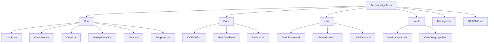
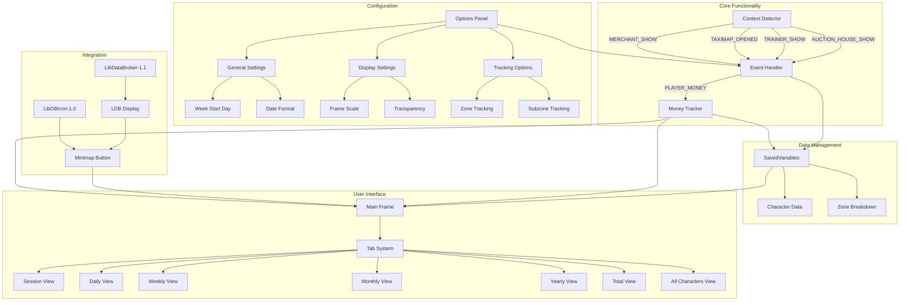
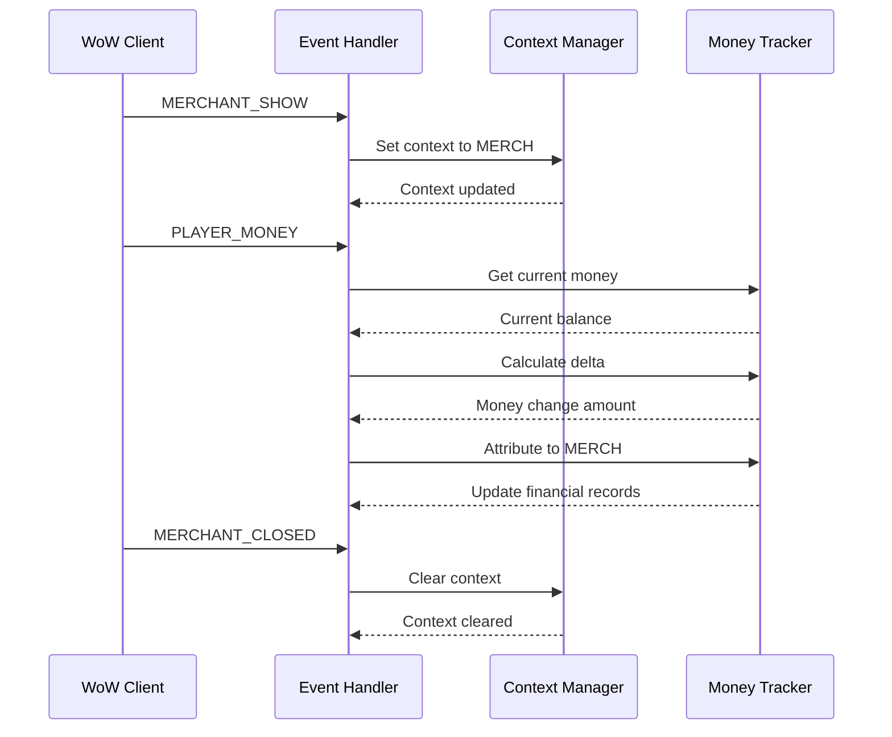
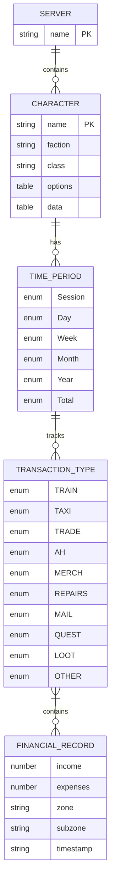
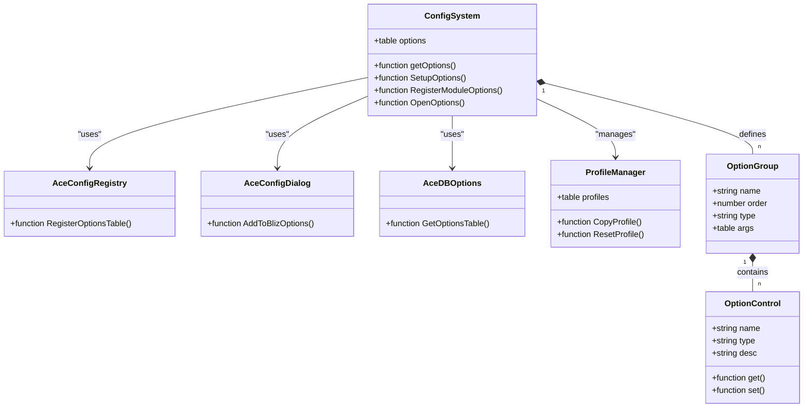
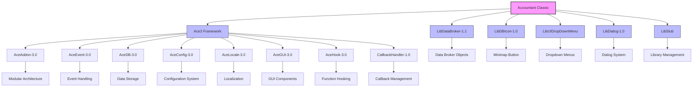

# Project Overview

<cite>
**Referenced Files in This Document**   
- [README.md](file://README.md)
- [Core.lua](file://Core/Core.lua)
- [Constants.lua](file://Core/Constants.lua)
- [Config.lua](file://Core/Config.lua)
- [MoneyFrame.lua](file://Core/MoneyFrame.lua)
- [localization.en.lua](file://Locale/localization.en.lua)
- [Core.xml](file://Core/Core.xml)
- [Template.xml](file://Core/Template.xml)
- [LibDBIcon-1.0.lua](file://Libs/LibDBIcon-1.0/LibDBIcon-1.0.lua)
- [ROADMAP.md](file://Docs/ROADMAP.md)
</cite>

## Table of Contents
1. [Introduction](#introduction)
2. [Project Structure](#project-structure)
3. [Core Components](#core-components)
4. [Architecture Overview](#architecture-overview)
5. [Detailed Component Analysis](#detailed-component-analysis)
6. [Dependency Analysis](#dependency-analysis)
7. [Performance Considerations](#performance-considerations)
8. [Troubleshooting Guide](#troubleshooting-guide)
9. [Conclusion](#conclusion)

## Introduction
Accountant Classic is a lightweight World of Warcraft addon designed to track player gold flow across multiple categories and time periods. It serves as a financial tracking tool for WoW Classic players, enabling them to monitor income and expenses from various in-game sources such as quests, merchants, repairs, auction house transactions, mail, and more. The addon provides a clear breakdown of monetary activity through an intuitive interface, allowing players to analyze their economic behavior and identify major gold sinks or sources of income.

Built on the Ace3 framework, Accountant Classic leverages modular design principles to ensure extensibility, maintainability, and seamless integration with other addons. It supports multiple time windows including Session, Day, Week, Month, Year, and Total, offering both real-time and historical financial insights. A cross-character financial overview tab enables players to compare wealth across all their characters, while a minimap button powered by LibDBIcon-1.0 provides quick access and configurable display options. The addon also features a floating money frame that displays session-specific financial data directly on the screen.

This document provides a comprehensive analysis of the Accountant Classic addon, covering its architecture, core components, functionality, and integration points. It aims to serve as a detailed reference for developers, contributors, and advanced users seeking to understand or extend the addon's capabilities.

## Project Structure
The Accountant Classic project follows a well-organized directory structure that separates core functionality, libraries, configuration, and documentation. The root directory contains essential files such as README.md, which provides an overview of the addon, and Docs/, which houses licensing information, roadmap details, and revision history. The Core/ directory contains the primary implementation files responsible for the addon's functionality, including event handling, UI rendering, and data management.

The Libs/ directory includes third-party libraries that provide critical functionality: Ace3 framework components (AceAddon-3.0, AceEvent-3.0, AceDB-3.0, etc.) enable modular architecture and configuration management; LibDataBroker-1.1 facilitates integration with data display systems; and LibDBIcon-1.0 handles minimap button creation and management. The Locale/ directory contains localization files for multiple languages, with localization.en.lua providing English translations for all UI elements. Additional assets include XML templates for UI elements in Core/Template.xml and Core/Core.xml, which define the addon's main frame and interactive components.

**Diagram sources**
- [README.md](file://README.md)
- [Core/Core.lua](file://Core/Core.lua)

**Section sources**
- [README.md](file://README.md)
- [Core/Core.lua](file://Core/Core.lua)

## Core Components
The Accountant Classic addon consists of several core components that work together to provide comprehensive financial tracking functionality. The primary components include the event system, data storage mechanism, user interface, and configuration system. These components are implemented using the Ace3 framework, which provides a modular architecture that allows for clean separation of concerns and easy extensibility.

The event system listens for specific WoW UI events such as MERCHANT_SHOW, TAXIMAP_OPENED, and PLAYER_MONEY to determine the current financial context and track money changes accordingly. The data storage mechanism uses SavedVariables to persist financial data across sessions, with separate storage for character-specific data (Accountant_ClassicSaveData) and optional zone breakdown data (Accountant_ClassicZoneDB). The user interface presents financial information through a main frame with multiple tabs for different time periods and a cross-character overview, while the configuration system allows users to customize various aspects of the addon's behavior and appearance.

**Section sources**
- [Core.lua](file://Core/Core.lua)
- [Constants.lua](file://Core/Constants.lua)
- [Config.lua](file://Core/Config.lua)

## Architecture Overview
Accountant Classic follows a modular architecture built on the Ace3 framework, which provides a robust foundation for addon development in World of Warcraft. The addon's architecture can be understood as a collection of interconnected components that handle specific aspects of functionality, including event handling, data management, user interface rendering, and configuration. This modular approach enables clean separation of concerns, making the codebase easier to maintain and extend.

The core of the architecture is the AceAddon-3.0 component, which manages the addon's lifecycle and provides integration with other Ace3 modules. AceEvent-3.0 handles WoW UI events, allowing the addon to respond to in-game actions that affect the player's finances. AceDB-3.0 manages configuration and saved data, storing user preferences and financial records in a structured format. The user interface is built using XML templates that define the layout and appearance of the main frame and its components, while Lua scripts handle dynamic behavior and data binding.

**Diagram sources**
- [Core.lua](file://Core/Core.lua)
- [Constants.lua](file://Core/Constants.lua)
- [Core.xml](file://Core/Core.xml)

## Detailed Component Analysis

### Event System Analysis
The event system in Accountant Classic is responsible for detecting in-game actions that affect the player's finances and attributing money changes to the appropriate categories. This system uses AceEvent-3.0 to register for specific WoW UI events that indicate the player is engaged in a financial transaction. When these events occur, the addon sets a context variable (AC_LOGTYPE) that determines how subsequent money changes should be categorized.

For example, when the MERCHANT_SHOW event fires, the context is set to MERCH, indicating that any money changes that occur while the merchant interface is open should be attributed to merchant transactions. Similarly, the TAXIMAP_OPENED event sets the context to TAXI, TRAINER_SHOW sets it to TRAIN, and AUCTION_HOUSE_SHOW sets it to AH. This context-based approach allows the addon to accurately track the source of income and expenses without requiring manual categorization by the player.

The event system also handles special cases such as group loot distribution through the CHAT_MSG_MONEY event, which allows the addon to parse exact amounts shared with party members and attribute them correctly. This prevents double counting and ensures accurate financial tracking in group scenarios.

**Diagram sources**
- [Core.lua](file://Core/Core.lua)
- [Constants.lua](file://Core/Constants.lua)

**Section sources**
- [Core.lua](file://Core/Core.lua)
- [Constants.lua](file://Core/Constants.lua)

### Data Management Analysis
The data management system in Accountant Classic is responsible for storing and retrieving financial information across sessions. It uses WoW's SavedVariables system to persist data, with two primary storage structures: Accountant_ClassicSaveData for character-specific financial records and Accountant_ClassicZoneDB for optional zone-level breakdowns. This separation allows the addon to maintain comprehensive financial data while providing flexibility for users who want more detailed location-based tracking.

The Accountant_ClassicSaveData structure is organized hierarchically by server, then by character, with each character having options and data sections. The options section stores user preferences and metadata such as faction, class, and last session date, while the data section contains financial records organized by time period (Session, Day, Week, etc.) and transaction type (TRAIN, TAXI, TRADE, AH, MERCH, REPAIRS, MAIL, QUEST, LOOT, OTHER). This structure enables efficient querying and display of financial information across different time frames and categories.

**Diagram sources**
- [Core.lua](file://Core/Core.lua)
- [Constants.lua](file://Core/Constants.lua)

**Section sources**
- [Core.lua](file://Core/Core.lua)
- [Constants.lua](file://Core/Constants.lua)

### User Interface Analysis
The user interface of Accountant Classic is implemented using a combination of XML templates and Lua scripts, following WoW's standard UI development practices. The main frame is defined in Core.xml and Template.xml, which specify the layout, appearance, and interactive elements of the addon's interface. The Lua scripts in Core.lua handle dynamic behavior such as tab switching, data display, and user interactions.

The interface consists of a main window with multiple tabs that allow users to view financial data across different time periods: This Session, Today, This Week, This Month, This Year, Total, and All Characters. Each tab displays a table showing income and expenses by source, with totals at the bottom. The All Characters tab provides a cross-realm, cross-faction overview of all tracked characters, with sorting capabilities based on character name, money amount, or last update date.

```mermaid
flowchart TD
A[Main Frame] --> B[Header Section]
A --> C[Tab System]
A --> D[Data Display Area]
A --> E[Control Buttons]
B --> F[Title: Accountant Classic]
B --> G[Portrait]
C --> H[This Session]
C --> I[Today]
C --> J[Prv. Day]
C --> K[This Week]
C --> L[Prv. Week]
C --> M[This Month]
C --> N[Prv. Month]
C --> O[This Year]
C --> P[Prv. Year]
C --> Q[Total]
C --> R[All Chars]
D --> S[Source Column]
D --> T[Incomings Column]
D --> U[Outgoings Column]
S --> V[Training Costs]
S --> W[Taxi Fares]
S --> X[Trade Window]
S --> Y[Auctions]
S --> Z[Merchants]
S --> AA[Repair Costs]
S --> AB[Mail]
S --> AC[Quests]
S --> AD[Loot]
S --> AE[Unknown]
T --> AF[Income amounts]
U --> AG[Expense amounts]
E --> AH[Reset Button]
E --> AI[Options Button]
E --> AJ[Exit Button]
style A fill:#f9f,stroke:#333,stroke-width:2px
style B fill:#bbf,stroke:#333,stroke-width:1px
style C fill:#bbf,stroke:#333,stroke-width:1px
style D fill:#bbf,stroke:#333,stroke-width:1px
style E fill:#bbf,stroke:#333,stroke-width:1px
```

**Diagram sources**
- [Core.xml](file://Core/Core.xml)
- [Template.xml](file://Core/Template.xml)
- [Core.lua](file://Core/Core.lua)

**Section sources**
- [Core.xml](file://Core/Core.xml)
- [Template.xml](file://Core/Template.xml)
- [Core.lua](file://Core/Core.lua)

### Configuration System Analysis
The configuration system in Accountant Classic provides users with extensive customization options for the addon's behavior and appearance. Implemented using AceConfig-3.0 and AceDBOptions-3.0, the configuration system integrates with WoW's Interface Options panel, allowing users to access settings through the standard game interface. The system stores user preferences in the addon's database, which is managed by AceDB-3.0.

The configuration options are organized into logical groups, including General and Data Display Format Settings, Minimap Button Settings, LDB Display Settings, Scale and Transparency, and Character Data's Removal. These groups contain various controls such as toggles, dropdowns, and sliders that allow users to customize aspects like whether to show the minimap button, which data to display on the button tooltip, the start day of the week for weekly tracking, date format, frame scale, transparency, and more.

**Diagram sources**
- [Config.lua](file://Core/Config.lua)
- [Constants.lua](file://Core/Constants.lua)

**Section sources**
- [Config.lua](file://Core/Config.lua)
- [Constants.lua](file://Core/Constants.lua)

## Dependency Analysis
Accountant Classic relies on several external libraries and frameworks to provide its functionality, with the most significant being the Ace3 framework and LibDataBroker ecosystem. These dependencies are managed through the Libs/ directory, which contains all required third-party libraries. The addon's dependency structure follows best practices for WoW addon development, minimizing direct dependencies while leveraging well-established libraries for common functionality.

The Ace3 framework provides the foundation for the addon's architecture, with specific components handling different aspects of functionality: AceAddon-3.0 manages the addon lifecycle and module system; AceEvent-3.0 handles WoW UI events; AceDB-3.0 manages configuration and saved data; AceConfig-3.0 provides the configuration system; and AceLocale-3.0 enables multi-language support. Additionally, LibDBIcon-1.0 handles minimap button creation and management, while LibDataBroker-1.1 enables integration with data display systems.

**Diagram sources**
- [Core.lua](file://Core/Core.lua)
- [Libs/LibDBIcon-1.0/LibDBIcon-1.0.lua](file://Libs/LibDBIcon-1.0/LibDBIcon-1.0.lua)

**Section sources**
- [Core.lua](file://Core/Core.lua)
- [Libs/LibDBIcon-1.0/LibDBIcon-1.0.lua](file://Libs/LibDBIcon-1.0/LibDBIcon-1.0.lua)

## Performance Considerations
Accountant Classic is designed with performance in mind, implementing several optimizations to minimize its impact on game performance. The addon uses efficient data structures and algorithms to track financial information, with careful attention to memory usage and processing overhead. One key performance consideration is the use of a priming approach to initialize financial tracking, which prevents the addon from counting a character's initial gold balance as income while avoiding the need to suppress all money changes during the first session.

The addon also implements lazy loading and on-demand initialization for certain components, such as the floating money frame, which is only created and updated when enabled by the user. Event handling is optimized to minimize unnecessary processing, with the addon only responding to relevant WoW UI events and using efficient data structures to store and retrieve financial information. The use of the Ace3 framework's event system ensures that event handlers are properly registered and unregistered, preventing memory leaks and performance degradation over time.

Additionally, the addon avoids expensive operations during combat or rapid money changes, ensuring that it does not interfere with gameplay. The configuration system is designed to minimize the performance impact of user settings, with most options being checked only when necessary rather than on every frame update. The SavedVariables storage system is optimized to reduce file size and loading times, with data organized in a hierarchical structure that allows for efficient querying and updates.

**Section sources**
- [Core.lua](file://Core/Core.lua)
- [MoneyFrame.lua](file://Core/MoneyFrame.lua)

## Troubleshooting Guide
When encountering issues with Accountant Classic, users should first verify that the addon is properly installed and enabled in the WoW client. Common issues include the minimap button not appearing, financial data not being tracked correctly, or the main frame failing to open. For the minimap button issue, users should check the addon's configuration to ensure that the "Show minimap button" option is enabled and that the button has not been accidentally hidden or locked.

If financial data is not being tracked correctly, users should verify that the addon has permission to access the necessary game events and that no conflicting addons are interfering with its operation. The addon includes a priming alert that appears once per session to confirm that baseline initialization has occurred, which helps users verify that tracking is active. If the main frame fails to open, users can try using the slash commands /accountant or /acc to toggle the interface, or check for errors in the WoW error log.

For more advanced troubleshooting, users can examine the SavedVariables files (Accountant_ClassicSaveData.lua and Accountant_ClassicZoneDB.lua) to verify that data is being stored correctly. Developers and advanced users can also enable verbose logging to diagnose specific issues, though this option is not exposed in the standard configuration interface. If problems persist, users should consult the addon's documentation and community resources for additional support.

**Section sources**
- [README.md](file://README.md)
- [Core.lua](file://Core/Core.lua)

## Conclusion
Accountant Classic is a well-designed and feature-rich financial tracking addon for World of Warcraft Classic that provides players with valuable insights into their in-game economic activities. By leveraging the Ace3 framework and following best practices for addon development, the addon achieves a balance between functionality, performance, and usability. Its modular architecture makes it easy to maintain and extend, while its comprehensive feature set addresses the needs of players who want to track and analyze their gold flow across multiple categories and time periods.

The addon's integration with the LibDataBroker ecosystem and support for multi-language localization demonstrate its commitment to interoperability and accessibility. The inclusion of a cross-character financial overview and customizable display options enhances its utility for players with multiple characters or specific interface preferences. As evidenced by the ROADMAP.md file, the development team has plans to expand the addon's capabilities to include tracking of all in-game currencies beyond gold, further increasing its value to the WoW Classic community.

Overall, Accountant Classic serves as an excellent example of how thoughtful design and adherence to established frameworks can produce a high-quality addon that meets the needs of its target audience while remaining maintainable and extensible for future development.