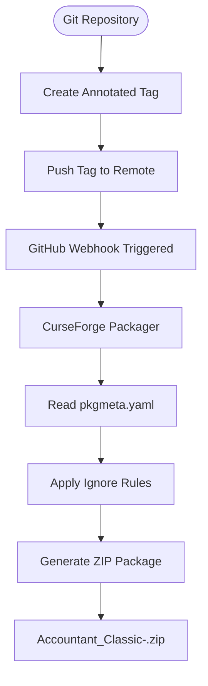

# Release Process and Packaging

<cite>
**Referenced Files in This Document**   
- [pkgmeta.yaml](file://pkgmeta.yaml)
- [Docs/CurseForge-Packaging.md](file://Docs/CurseForge-Packaging.md)
- [Core/Core.lua](file://Core/Core.lua)
- [Revision.txt](file://Docs/Revision.txt)
</cite>

## Table of Contents
1. [Introduction](#introduction)
2. [Versioning Scheme](#versioning-scheme)
3. [Tagging Workflow](#tagging-workflow)
4. [CurseForge Integration](#curseforge-integration)
5. [Packaging Configuration](#packaging-configuration)
6. [Practical Examples](#practical-examples)
7. [Troubleshooting Common Issues](#troubleshooting-common-issues)
8. [Verification Process](#verification-process)

## Introduction
This document outlines the complete release and packaging process for the Accountant_Classic addon. It covers the versioning strategy, tagging procedures, CurseForge integration workflow, packaging configuration, and provides practical examples and troubleshooting guidance for common release issues. The process is designed to ensure consistent, reliable, and properly categorized releases across alpha, beta, and stable channels.

## Versioning Scheme
The project follows a semantic versioning scheme with a three-part version number (major.minor.patch) followed by optional pre-release identifiers for alpha and beta builds. The version is automatically extracted from the addon metadata using the `C_AddOns.GetAddOnMetadata` API in `Core/Core.lua`. Historical version information and release notes are maintained in `Docs/Revision.txt`, which contains a comprehensive changelog dating back to the earliest versions of the addon.

**Section sources**
- [Core/Core.lua](file://Core/Core.lua#L101)
- [Docs/Revision.txt](file://Docs/Revision.txt#L0-L742)

## Tagging Workflow
The release process is triggered by creating annotated Git tags that correspond to the desired release type. The tagging workflow requires creating annotated tags (using `git tag -a`) rather than lightweight tags. The tag name determines the release type according to the following rules:
- **Alpha releases**: Tags containing "alpha" (e.g., 3.0.00-alpha.2)
- **Beta releases**: Tags containing "beta" (e.g., 3.0.00-beta.1)
- **Release builds**: Tags containing neither "alpha" nor "beta" (e.g., 3.0.00)

Before creating a tag, ensure that the branch has been pushed to the remote repository to avoid tagging a commit that is not accessible to the packaging system.

**Section sources**
- [Docs/CurseForge-Packaging.md](file://Docs/CurseForge-Packaging.md#L0-L70)

## CurseForge Integration
The project uses CurseForge's automatic packager via a GitHub webhook integration. When an annotated tag is pushed to the repository, it triggers the CurseForge build pipeline. The webhook is configured in the GitHub repository settings with a payload URL pointing to the CurseForge API endpoint. The integration requires the push event to be enabled in the webhook configuration. The build process automatically generates a ZIP package with the name formatted as `<package-as>-<project-version>.zip`, where `package-as` is defined in the `pkgmeta.yaml` file.

**Section sources**
- [Docs/CurseForge-Packaging.md](file://Docs/CurseForge-Packaging.md#L0-L70)

## Packaging Configuration
Packaging behavior is controlled by the `pkgmeta.yaml` configuration file in the repository root. This file specifies the `package-as` parameter, which determines the base name of the generated ZIP file (set to "Accountant_Classic"). The file also contains an `ignore` section that specifies files and directories to exclude from the packaged release. Currently, the configuration excludes development files such as `CLAUDE.md` and the entire `Docs` directory, ensuring that only essential addon files are included in the final package.



**Diagram sources**
- [pkgmeta.yaml](file://pkgmeta.yaml#L0-L5)

**Section sources**
- [pkgmeta.yaml](file://pkgmeta.yaml#L0-L5)
- [Docs/CurseForge-Packaging.md](file://Docs/CurseForge-Packaging.md#L0-L70)

## Practical Examples
The following examples demonstrate the complete workflow for creating different types of releases:

### Alpha Release Example
```bash
# Push latest changes to master branch
git push origin master

# Create annotated alpha tag
git tag -a 3.0.00-alpha.2 -m "Release 3.0.00-alpha.2"

# Push tag to trigger packaging
git push origin 3.0.00-alpha.2
```

### Beta Release Example
```bash
# Push latest changes
git push origin master

# Create annotated beta tag
git tag -a 3.0.00-beta.1 -m "Release 3.0.00-beta.1"

# Push tag to trigger packaging
git push origin 3.0.00-beta.1
```

### Stable Release Example
```bash
# Push latest changes
git push origin master

# Create annotated release tag
git tag -a 3.0.00 -m "Release 3.0.00"

# Push tag to trigger packaging
git push origin 3.0.00
```

### Re-tagging Example
If a tag needs to be recreated (e.g., due to packaging errors), it must first be deleted locally and remotely:
```bash
# Delete local tag
git tag -d 3.0.00-alpha.2
# Delete remote tag
git push origin :refs/tags/3.0.00-alpha.2
# Recreate and push again
git tag -a 3.0.00-alpha.2 -m "Release 3.0.00-alpha.2 (repack)"
git push origin 3.0.00-alpha.2
```

**Section sources**
- [Docs/CurseForge-Packaging.md](file://Docs/CurseForge-Packaging.md#L0-L70)

## Troubleshooting Common Issues
This section addresses common problems encountered during the release process and their solutions.

### Missing Webhook Configuration
If pushes to tags do not trigger packaging, verify that the webhook is properly configured in GitHub Settings → Webhooks with the correct payload URL, content type (application/json), and push event enabled.

### Incorrect Release Type Classification
If a release is classified incorrectly (e.g., beta tagged as alpha), check the tag name for the presence of "alpha" or "beta" substrings. The system uses simple string matching to determine release type.

### Packaging Includes Ignored Files
If files specified in the `ignore` section of `pkgmeta.yaml` appear in the packaged ZIP, verify the syntax and indentation in the YAML file. The ignore patterns are case-sensitive and must match the exact file or directory names.

### Tag Not Found on Remote
When creating a tag, ensure that the target commit has already been pushed to the remote repository. Creating a tag on a local-only commit will prevent the webhook from triggering the packaging process.

### Reusing Existing Tags
To update a release with the same version number, the existing tag must be deleted both locally and remotely before creating a new one, as shown in the re-tagging example above.

**Section sources**
- [pkgmeta.yaml](file://pkgmeta.yaml#L0-L5)
- [Docs/CurseForge-Packaging.md](file://Docs/CurseForge-Packaging.md#L0-L70)

## Verification Process
After pushing a tag, verify the successful creation of the release by following these steps:

1. Navigate to the CurseForge project page and access the Files section
2. Look for a new build entry that matches the tag name that was pushed
3. Confirm that the ZIP file name follows the expected pattern: `Accountant_Classic-<tag>.zip`
4. Verify that the package contents respect the `ignore` rules specified in `pkgmeta.yaml`
5. Download and inspect the package to ensure all required files are present and no development files are included

The packaging system automatically applies the ignore rules, so files like `CLAUDE.md` and the entire `Docs` directory should not appear in the final package.

**Section sources**
- [pkgmeta.yaml](file://pkgmeta.yaml#L0-L5)
- [Docs/CurseForge-Packaging.md](file://Docs/CurseForge-Packaging.md#L65-L70)