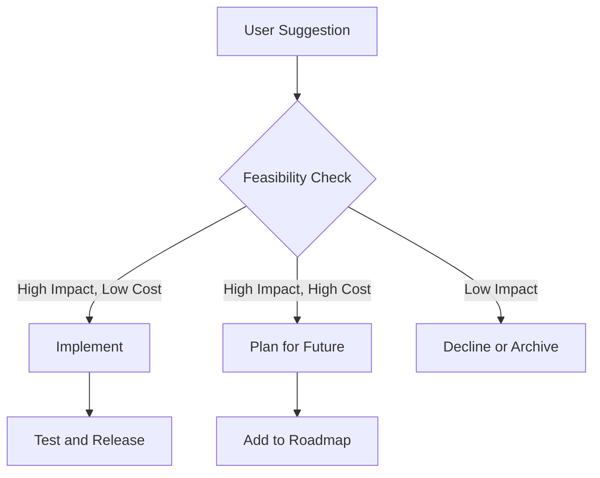

# Roadmap and Future Features

<cite>
**Referenced Files in This Document**   
- [ROADMAP.md](file://Docs/ROADMAP.md)
- [Core.lua](file://Core/Core.lua)
- [Constants.lua](file://Core/Constants.lua)
- [Config.lua](file://Core/Config.lua)
- [MoneyFrame.lua](file://Core/MoneyFrame.lua)
</cite>

## Table of Contents
1. [Near-term Roadmap](#near-term-roadmap)
2. [Medium-term Roadmap](#medium-term-roadmap)
3. [Long-term and Conceptual Features](#long-term-and-conceptual-features)
4. [Technical Constraints and Design Principles](#technical-constraints-and-design-principles)
5. [Feature Prioritization and Community Input](#feature-prioritization-and-community-input)

## Near-term Roadmap

The near-term roadmap for Accountant Classic focuses on expanding currency tracking capabilities, improving user experience, and enhancing configuration flexibility.

### All In-Game Currencies Tracking

Accountant Classic plans to extend its financial tracking beyond gold to include all in-game currencies such as Emblems, Badges, and Tokens. This enhancement will provide comprehensive financial oversight across multiple currency types.

The implementation will:
- Record gains and expenditures of all tracked currencies by source
- Display currency breakdowns across multiple time periods: Session, Day, Week, Month, Year, and Total
- Support optional per-zone or per-activity attribution where feasible
- Utilize either separate tabs or a unified currency panel with filtering capabilities

The codebase already includes infrastructure for currency tracking through the `C_CurrencyInfo` API, with conditional logic based on the WoW client version:

```lua
-- Determine WoW TOC Version
local WoWClassicEra, WoWClassicTBC, WoWWOTLKC, WoWCataC, WoWRetail
local wowversion  = select(4, GetBuildInfo())
-- ...
GetBackpackCurrencyInfo = C_CurrencyInfo.GetBackpackCurrencyInfo
GetCurrencyInfo = C_CurrencyInfo.GetCurrencyInfo
```

This conditional API assignment ensures backward compatibility with older clients while leveraging modern APIs when available.

**Section sources**
- [ROADMAP.md](file://Docs/ROADMAP.md#L6-L14)
- [Core.lua](file://Core/Core.lua#L25-L35)

### User Experience and Accessibility Improvements

The UX improvements focus on making the addon more accessible and user-friendly:

- **Keyboard navigation**: Enhanced keyboard support for users who prefer or require keyboard-only interaction
- **Display options**: Implementation of larger font options and frame scaling presets for improved readability
- **Tooltip enhancements**: Improved tooltips with source attribution and last updated timestamps for better context

These changes align with modern accessibility standards and will make the addon usable for a wider range of players with different visual and interaction preferences.

**Section sources**
- [ROADMAP.md](file://Docs/ROADMAP.md#L15-L17)

### Configuration and Data Management

The near-term roadmap includes significant improvements to configuration management:

- **Priming chat message toggle**: Users will be able to disable the one-time baseline initialization message that alerts when tracking begins
- **Export/Import functionality**: Support for exporting and importing settings and saved data at both per-character and per-account levels

The priming system is already implemented in the codebase as a one-time baseline initialization to prevent first-session data skew:

```lua
-- Priming flag for one-time baseline initialization
local AC_LOG_PRIMED = false

-- One-time UI alert for baseline priming
local AC_PRIMING_ALERTED = false
local function AccountantClassic_ShowPrimingAlert()
    if AC_PRIMING_ALERTED then return end
    AC_PRIMING_ALERTED = true
    local msg = "|cffffd200Accountant Classic: Baseline primed. Subsequent money changes will be tracked.|r"
    ACC_Print(msg)
end
```

This implementation replaces the previous approach of blocking all logging during the first session, instead allowing normal logging after the baseline is established.

**Section sources**
- [ROADMAP.md](file://Docs/ROADMAP.md#L18-L20)
- [Core.lua](file://Core/Core.lua#L104-L129)

## Medium-term Roadmap

The medium-term development focuses on deeper analytical capabilities, improved categorization, and data maintenance.

### Enhanced Categorization Logic

The categorization system will be refined to provide more granular source tracking:

- **Detailed source classification**: Differentiation between dungeon, raid, and world quest income sources where applicable
- **Improved fallback mechanisms**: Smarter handling when `AC_LOGTYPE` is not explicitly set, ensuring more accurate categorization

The current implementation already supports multiple log types across different WoW versions:

```lua
constants.logtypes = {
    "TRAIN", "TAXI", "TRADE", "AH", "MERCH", "REPAIRS", "MAIL", "QUEST", "LOOT", "OTHER" 
}
-- Enhanced version for newer clients
constants.logtypes = {
    "TRANSMO", "GARRISON", "LFG", "BARBER", "GUILD",
    "TRAIN", "TAXI", "TRADE", "AH", "MERCH", "REPAIRS", "MAIL", "QUEST", "LOOT", "OTHER" 
}
```

This structure allows for expansion of log types based on game version, providing a foundation for more granular categorization.

**Section sources**
- [ROADMAP.md](file://Docs/ROADMAP.md#L23-L25)
- [Constants.lua](file://Core/Constants.lua#L89-L109)

### Historical Analytics

The analytics capabilities will be expanded to provide meaningful insights into financial patterns:

- **Trend visualization**: Simple charts showing weekly and monthly net changes to identify financial patterns
- **Top sources reporting**: Identification of the top 5 income and expenditure sources over user-selected time ranges

These features will transform Accountant Classic from a simple tracking tool into an analytical platform that helps players understand their in-game economic behavior.

**Section sources**
- [ROADMAP.md](file://Docs/ROADMAP.md#L26-L28)

### Data Maintenance

To ensure long-term performance and data integrity, the following maintenance features are planned:

- **Data archiving**: Older data will be compacted into summary formats to reduce memory footprint
- **Integrity verification**: Built-in checks and self-repair prompts to maintain data consistency

The current codebase already implements date-based data organization that could support archiving:

```lua
local AccountantClassicDefaultOptions = {
    version = AccountantClassic_Version, 
    date = cdate,
    lastsessiondate = cdate,
    weekdate = "", 
    month = cmonth,
    curryear = cyear,
    totalcash = 0,
}
```

**Section sources**
- [ROADMAP.md](file://Docs/ROADMAP.md#L29-L31)
- [Core.lua](file://Core/Core.lua#L174-L184)

## Long-term and Conceptual Features

The long-term vision for Accountant Classic includes extensibility, advanced configuration, and improved localization.

### API Surface for Addon Integration

A lightweight API will be developed to allow other addons to query Accountant Classic data:

- **Data querying**: Other addons can retrieve totals and deltas by period and source
- **Inter-addon communication**: Enables integration with broader addon ecosystems for comprehensive character management

This would transform Accountant Classic from a standalone tool into a data provider within the addon ecosystem.

**Section sources**
- [ROADMAP.md](file://Docs/ROADMAP.md#L34-L36)

### Multi-Profile Support

The configuration system will be enhanced to support multiple named profiles:

- **Named configurations**: Users can create multiple configuration sets per account
- **Quick switching**: Rapid profile switching to accommodate different playstyles or characters

The current implementation already uses AceDB-3.0 for profile management, providing a solid foundation:

```lua
local AceDB = LibStub("AceDB-3.0")
-- ...
function addon:SetupOptions()
    self.optionsFrames = {}
    AceConfigReg:RegisterOptionsTable(addon.LocName, getOptions)
    self.optionsFrames.General = AceConfigDialog:AddToBlizOptions(addon.LocName, nil, nil, "general")
    self:RegisterModuleOptions("Profiles", giveProfiles, L["Profile Options"])
end
```

**Section sources**
- [ROADMAP.md](file://Docs/ROADMAP.md#L37-L39)
- [Config.lua](file://Core/Config.lua#L350-L360)

### Localization Improvements

Ongoing efforts will ensure comprehensive localization support:

- **Complete UI translation**: All new UI elements and messages will be fully localized
- **Community contributions**: Support for community-provided translations to maintain language coverage

The addon already uses AceLocale-3.0 for localization, with language files for multiple regions in the Locale directory.

**Section sources**
- [ROADMAP.md](file://Docs/ROADMAP.md#L40-L42)

## Technical Constraints and Design Principles

The development roadmap is guided by technical constraints and performance considerations.

### Client Compatibility

Currency tracking implementation varies by client version, with graceful degradation:

- **Modern clients**: Utilize official APIs like `C_CurrencyInfo` for reliable data
- **Legacy clients**: Implement fallback mechanisms to maintain functionality

```lua
if wowversion > 90000 then
    WoWRetail = true
    GetBackpackCurrencyInfo = C_CurrencyInfo.GetBackpackCurrencyInfo
    GetCurrencyInfo = C_CurrencyInfo.GetCurrencyInfo
end
```

This approach ensures broad compatibility while taking advantage of modern APIs when available.

### Performance Optimization

Strict performance guidelines are followed to maintain gameplay responsiveness:

- **Combat avoidance**: No performance-heavy operations during combat
- **Rapid update handling**: Optimized processing during rapid money or currency changes
- **Memory efficiency**: SavedVariables size remains modest with configurable retention limits

The event registration system is carefully managed to avoid unnecessary processing:

```lua
function addon:PopulateCharacterList(server, faction)
    -- Efficient data processing with ordered pairs and sorting
    for serverkey, servervalue in orderedpairs(Accountant_ClassicSaveData) do
        -- ...
    end
end
```

**Section sources**
- [ROADMAP.md](file://Docs/ROADMAP.md#L44-L48)
- [Core.lua](file://Core/Core.lua#L25-L35)

## Feature Prioritization and Community Input

The development roadmap reflects a balance between user requests, technical feasibility, and gameplay impact.

### Development Priorities

The prioritization follows this hierarchy:
1. **Data accuracy**: Ensuring reliable tracking is the highest priority
2. **Performance**: Maintaining smooth gameplay experience
3. **User requests**: Addressing common community requests
4. **Feature expansion**: Adding new capabilities

The priming system exemplifies this priority, where data accuracy was improved without sacrificing first-session transaction tracking.

### Community-Driven Development

The project welcomes community involvement:
- **Issue reporting**: Users can open issues to report bugs or suggest features
- **Pull requests**: Contributions are welcome for new features and improvements
- **Feedback integration**: User suggestions are evaluated for inclusion based on impact and feasibility



**Diagram sources**
- [ROADMAP.md](file://Docs/ROADMAP.md#L50-L53)

The roadmap explicitly invites community participation: "If you have suggestions or want to help, please open an issue or PR. Contributions are welcome!"

This open development model ensures that Accountant Classic evolves to meet the needs of its user base while maintaining technical integrity.

**Section sources**
- [ROADMAP.md](file://Docs/ROADMAP.md#L50-L53)