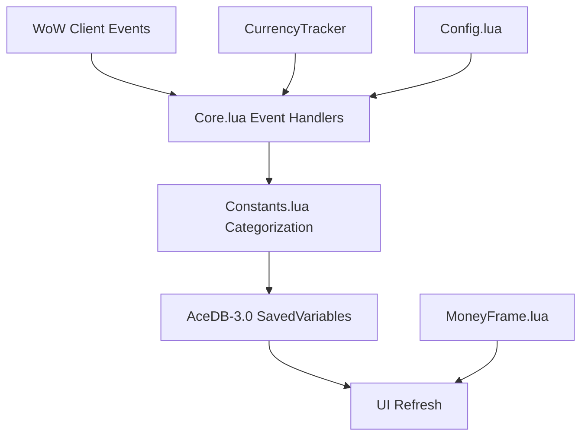
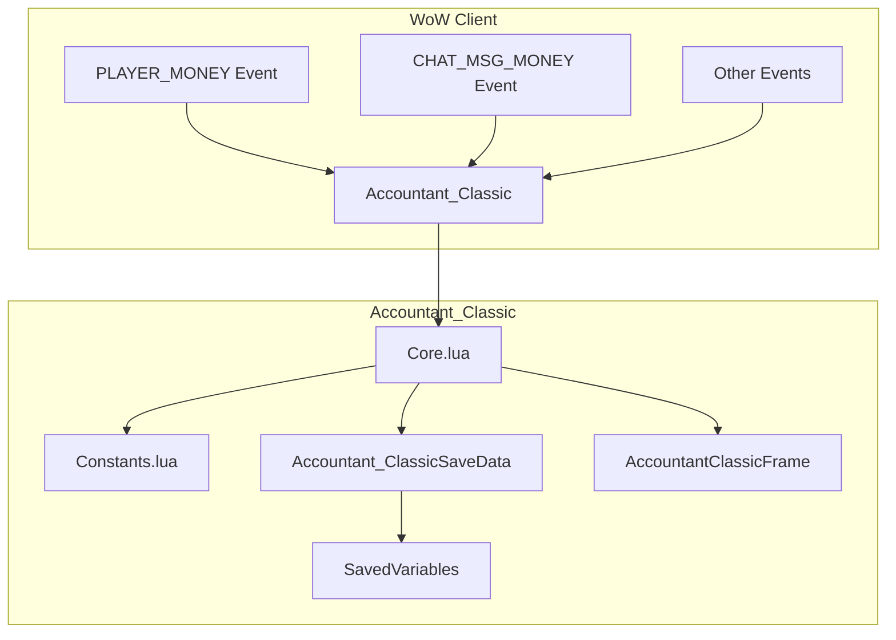
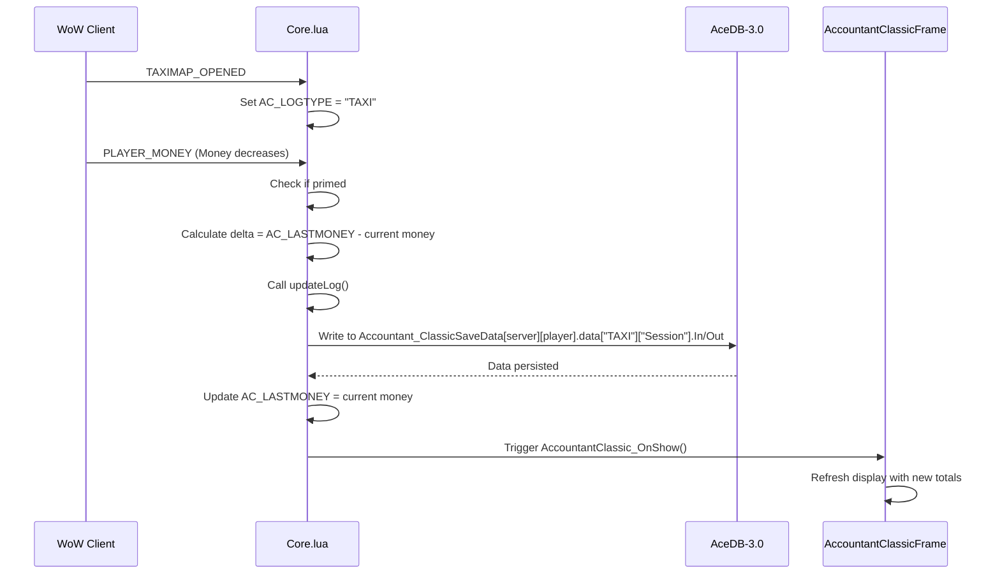

# Data Flow and Processing

<cite>
**Referenced Files in This Document**   
- [Core.lua](file://Core/Core.lua)
- [Constants.lua](file://Core/Constants.lua)
- [Config.lua](file://Core/Config.lua)
- [MoneyFrame.lua](file://Core/MoneyFrame.lua)
- [AceDB-3.0.lua](file://Libs/AceDB-3.0/AceDB-3.0.lua)
</cite>

## Table of Contents
1. [Introduction](#introduction)
2. [Project Structure](#project-structure)
3. [Core Components](#core-components)
4. [Architecture Overview](#architecture-overview)
5. [Detailed Component Analysis](#detailed-component-analysis)
6. [Data Flow Pipeline](#data-flow-pipeline)
7. [Data Integrity and Initialization](#data-integrity-and-initialization)
8. [Data Retrieval and Cross-Character Summaries](#data-retrieval-and-cross-character-summaries)
9. [AceDB Profile System and Data Isolation](#acedb-profile-system-and-data-isolation)
10. [Conclusion](#conclusion)

## Introduction
Accountant_Classic is a World of Warcraft addon designed to track a player's financial transactions across various in-game activities. This document details the data flow pipeline from the moment a financial event occurs in the game client to its storage, aggregation, and presentation in the user interface. The system leverages the Ace3 framework, particularly AceDB-3.0, for robust data management and profile isolation. The core functionality revolves around capturing events like `PLAYER_MONEY` and `LOOT_MONEY_RECEIVED`, categorizing the transaction, and persisting it in a structured database for later analysis.

## Project Structure
The project is organized into several key directories:
- **Core**: Contains the primary logic, including event handling (`Core.lua`), configuration (`Config.lua`), constants (`Constants.lua`), and UI elements (`MoneyFrame.lua`).
- **CurrencyTracker**: A separate module for tracking non-gold currencies (e.g., Valor Points, Justice Points).
- **Docs**: Documentation files, including licenses and a roadmap.
- **Libs**: Third-party libraries, most importantly the Ace3 suite (AceAddon, AceDB, AceEvent, etc.) and LibDataBroker.
- **Locale**: Localization files for multiple languages.

This structure follows a modular design, with the `Core` directory housing the main application logic and `Libs` providing essential, reusable functionality.



**Diagram sources**
- [Core.lua](file://Core/Core.lua)
- [Constants.lua](file://Core/Constants.lua)
- [AceDB-3.0.lua](file://Libs/AceDB-3.0/AceDB-3.0.lua)

**Section sources**
- [Core.lua](file://Core/Core.lua)
- [Constants.lua](file://Core/Constants.lua)

## Core Components
The core components of Accountant_Classic are tightly integrated to form a cohesive data processing system. The primary components are:
- **Core.lua**: The main module responsible for event registration, transaction categorization, data persistence, and UI logic.
- **Constants.lua**: Defines the application's configuration, including event types, transaction categories (`logtypes`), and time-based aggregation modes (`logmodes`).
- **Config.lua**: Manages the addon's user-configurable settings using AceConfig-3.0.
- **MoneyFrame.lua**: A secondary module that creates an optional floating UI element to display current session information.
- **AceDB-3.0**: The underlying database library that manages SavedVariables, profile switching, and data persistence.

These components work together to ensure that financial data is captured accurately, stored reliably, and presented in a user-friendly manner.

**Section sources**
- [Core.lua](file://Core/Core.lua#L1-L100)
- [Constants.lua](file://Core/Constants.lua#L1-L50)
- [Config.lua](file://Core/Config.lua#L1-L30)

## Architecture Overview
The architecture of Accountant_Classic is event-driven and data-centric. It follows a clear pipeline:
1.  **Event Capture**: The addon registers for specific WoW client events (e.g., `PLAYER_MONEY`, `MERCHANT_SHOW`) using AceEvent-3.0.
2.  **Categorization**: When an event fires, `Core.lua` uses a state machine to determine the transaction type (e.g., "MERCH" for merchants, "REPAIRS" for repairs) based on the event sequence.
3.  **Data Aggregation**: The transaction amount is calculated by comparing the current money value with the last recorded value.
4.  **Data Persistence**: The categorized transaction data is stored in an AceDB-managed database, which is structured by character, server, and time period.
5.  **Data Presentation**: The stored data is retrieved and aggregated (e.g., by day, week) to populate the addon's main UI frame for display.

This architecture ensures a clean separation of concerns, with event handling, business logic, and data storage being distinct responsibilities.



**Diagram sources**
- [Core.lua](file://Core/Core.lua)
- [Constants.lua](file://Core/Constants.lua)
- [AceDB-3.0.lua](file://Libs/AceDB-3.0/AceDB-3.0.lua)

## Detailed Component Analysis

### Core.lua Analysis
`Core.lua` is the heart of the addon. It initializes the addon, registers events, and contains the primary logic for processing financial data.

#### Event Registration and Handling
The addon registers for a wide array of events defined in `Constants.lua`. The `AccountantClassic_RegisterEvents` function loops through this list and registers each one with AceEvent-3.0. The main event handler, `addon:OnEvent`, is triggered for each registered event.

```lua
function addon:OnEvent(event, arg1, arg2)
    if event == "ADDON_LOADED" and arg1 == private.addon_name then
        initOptions()
        AccountantClassic_RegisterEvents(self)
        -- ... other initialization
    elseif event == "PLAYER_MONEY" then
        -- Handle money change
        if not AC_LOG_PRIMED then
            -- Priming logic
        else
            updateLog()
        end
    elseif event == "MERCHANT_SHOW" then
        AC_LOGTYPE = "MERCH"
    -- ... other event cases
    end
end
```

**Section sources**
- [Core.lua](file://Core/Core.lua#L1482-L1551)

#### Transaction Categorization Logic
The categorization is implemented as a simple state machine. A global variable `AC_LOGTYPE` is set when a "start" event (e.g., `MERCHANT_SHOW`) is fired. When the subsequent `PLAYER_MONEY` event occurs, the transaction is categorized based on the current value of `AC_LOGTYPE`.

```lua
-- In Constants.lua
constants.events = {
    "MERCHANT_SHOW",
    "MERCHANT_UPDATE",
    "TAXIMAP_OPENED",
    -- ... other events
}

-- In Core.lua
elseif event == "MERCHANT_SHOW" then
    AC_LOGTYPE = "MERCH";
elseif event == "MERCHANT_UPDATE" then
    if (InRepairMode() == true) then
        AC_LOGTYPE = "REPAIRS";
    end
elseif event == "TAXIMAP_OPENED" then
    AC_LOGTYPE = "TAXI";
-- ... etc
```

This approach allows the addon to distinguish between different types of money spent at a merchant (e.g., buying items vs. repairing gear).

**Section sources**
- [Core.lua](file://Core/Core.lua#L1482-L1522)
- [Constants.lua](file://Core/Constants.lua#L70-L100)

### Constants.lua Analysis
This file defines the static configuration for the addon, which is critical for the data flow.

#### Constants.logtypes and Constants.logmodes
- **`logtypes`**: A list of transaction categories. The addon uses these keys to store data in the database. Examples include "TRAIN" (training costs), "TAXI", "AH" (Auction House), and "LOOT".
- **`logmodes`**: A list of time-based aggregation modes. These define how data is grouped and stored. The modes are: "Session", "Day", "PrvDay", "Week", "PrvWeek", "Month", "PrvMonth", "Year", "PrvYear", "Total".

```lua
-- In Constants.lua
constants.logtypes = {
    "TRAIN", "TAXI", "TRADE", "AH", "MERCH", "REPAIRS", "MAIL", "QUEST", "LOOT", "OTHER" 
}

constants.logmodes = {"Session", "Day", "PrvDay", "Week", "PrvWeek", "Month", "PrvMonth", "Year", "PrvYear", "Total" }
```

These constants are used as keys in the database structure, enabling the addon to answer queries like "How much did I spend on repairs this week?"

**Section sources**
- [Constants.lua](file://Core/Constants.lua#L100-L130)

## Data Flow Pipeline
The journey of a financial transaction from the game client to the database is a well-defined sequence.

### Sequence: Event to Database Update
The following sequence diagram illustrates the flow when a player pays for a taxi ride.



**Diagram sources**
- [Core.lua](file://Core/Core.lua#L1482-L1551)
- [Constants.lua](file://Core/Constants.lua#L100-L130)

### Code Example: Event-to-Transaction Mapping
The `updateLog` function is central to the data persistence process. It is called after a money change is detected. It calculates the difference between the current money and `AC_LASTMONEY`, then updates the database for all relevant `logmodes`.

```lua
-- Simplified version of updateLog logic
local function updateLog()
    local currentMoney = GetMoney()
    local delta = currentMoney - AC_LASTMONEY -- Positive = income, Negative = expense

    for _, mode in ipairs(private.constants.logmodes) do
        if delta > 0 then
            Accountant_ClassicSaveData[AC_SERVER][AC_PLAYER]["data"][AC_LOGTYPE][mode]["In"] = 
                (Accountant_ClassicSaveData[AC_SERVER][AC_PLAYER]["data"][AC_LOGTYPE][mode]["In"] or 0) + delta
        else
            Accountant_ClassicSaveData[AC_SERVER][AC_PLAYER]["data"][AC_LOGTYPE][mode]["Out"] = 
                (Accountant_ClassicSaveData[AC_SERVER][AC_PLAYER]["data"][AC_LOGTYPE][mode]["Out"] or 0) + math.abs(delta)
        end
    end

    AC_LASTMONEY = currentMoney -- Update baseline for next transaction
end
```

This function demonstrates the aggregation by `logmode`. A single transaction is recorded in multiple time periods (e.g., "Session", "Day", "Week") simultaneously.

**Section sources**
- [Core.lua](file://Core/Core.lua#L1520-L1624)

## Data Integrity and Initialization
Ensuring data accuracy is paramount, especially during the first session on a character.

### The Priming Approach
Historically, addons would ignore all transactions in the first session to avoid counting the character's starting gold as income. Accountant_Classic uses a more sophisticated "Priming Approach."

1.  **Baseline Initialization**: The first time a `PLAYER_MONEY` or `CHAT_MSG_MONEY` event is received, the addon sets `AC_LASTMONEY` to the current gold amount. This establishes a baseline.
2.  **One-Time Alert**: A single, non-intrusive chat message is displayed to inform the user that tracking has started.
3.  **Normal Logging**: All subsequent money changes are tracked normally.

This method prevents the initial gold from being counted as income while still capturing all legitimate transactions from the very first session.

```lua
-- In Core.lua, PLAYER_MONEY handler
if not AC_LOG_PRIMED then
    AC_LASTMONEY = GetMoney()
    AccountantClassic_Profile["options"].totalcash = AC_LASTMONEY
    AC_LOG_PRIMED = true
    AC_FIRSTLOADED = false
    AccountantClassic_ShowPrimingAlert()
    return -- Exit early, do not call updateLog for this event
end
```

**Section sources**
- [Core.lua](file://Core/Core.lua#L1520-L1551)
- [README.md](file://README.md#L113-L119)

### Handling Negative Values and Preventing Duplicates
- **Negative Values**: The system handles negative values implicitly. The `delta` is calculated as `currentMoney - AC_LASTMONEY`. A negative delta indicates an expense, which is added to the "Out" counter.
- **Preventing Duplicates**: The state machine approach for categorization helps prevent duplicates. The `AC_LOGTYPE` is only set by "start" events, and the transaction is only recorded on the subsequent `PLAYER_MONEY` event. This ensures that a single money change is only logged once, under the most recent activity.

## Data Retrieval and Cross-Character Summaries
The addon provides powerful data retrieval features, particularly on the "All Chars" tab.

### Aggregation by Time Period and Character
Data is retrieved and aggregated based on the selected `logmode` and the current UI state (e.g., which character is selected). The `AccountantClassic_OnShow` function is responsible for populating the UI.

```lua
-- In Core.lua, simplified data retrieval for "All Chars" tab
if (AC_CURRTAB == AC_TABS) then -- All Chars tab
    addon:PopulateCharacterList(AC_SELECTED_SERVER, AC_SELECTED_FACTION)
    for i, charData in ipairs(AC_CHARSCROLL_LIST) do
        local server, char = charData[1], charData[2]
        local totalIn = 0
        local totalOut = 0
        -- Sum up all "In" and "Out" values for the selected logmode
        for _, logtype in ipairs(private.constants.logtypes) do
            totalIn = totalIn + (Accountant_ClassicSaveData[server][char]["data"][logtype][selectedLogMode]["In"] or 0)
            totalOut = totalOut + (Accountant_ClassicSaveData[server][char]["data"][logtype][selectedLogMode]["Out"] or 0)
        end
        -- Display totalIn, totalOut, and last session date for this character
    end
end
```

The `PopulateCharacterList` function queries the entire `Accountant_ClassicSaveData` table, filtering by server and faction if necessary, to build a list of all tracked characters.

**Section sources**
- [Core.lua](file://Core/Core.lua#L1520-L1624)
- [Core.lua](file://Core/Core.lua#L1225-L1270)

## AceDB Profile System and Data Isolation
The addon uses AceDB-3.0 to manage its SavedVariables, which provides a powerful profile system for data isolation.

### Data Structure and Isolation
The primary data table, `Accountant_ClassicSaveData`, is structured as a nested Lua table:
```
Accountant_ClassicSaveData
└── [Server Name]
    └── [Character Name]
        ├── options (profile settings)
        └── data
            └── [LogType]
                └── [LogMode] -> { In = X, Out = Y }
```
This structure naturally isolates data by server and character. Each character's financial history is stored independently.

### Profile Management
AceDB-3.0 allows users to manage profiles. While the addon primarily uses character-specific data, the profile system is used for UI settings (scale, position, etc.). The `Config.lua` file uses `AceDBOptions-3.0` to integrate profile management into the addon's options panel.

```lua
-- In Config.lua
function addon:SetupOptions()
    -- ... other setup
    self:RegisterModuleOptions("Profiles", giveProfiles, L["Profile Options"])
end
```

This allows a user to, for example, create a "Compact" profile with smaller fonts and apply it to all their characters, while their financial data remains separate.

**Section sources**
- [AceDB-3.0.lua](file://Libs/AceDB-3.0/AceDB-3.0.lua#L0-L15)
- [Config.lua](file://Core/Config.lua#L400-L430)

## Conclusion
Accountant_Classic implements a robust and efficient data flow pipeline for tracking in-game finances. By leveraging the Ace3 framework, it achieves a clean separation of concerns, with well-defined components for event handling, data categorization, persistence, and presentation. The use of the "Priming Approach" ensures data integrity from the first session, while the hierarchical data structure enables flexible aggregation by time period and character. The integration with AceDB-3.0 provides a reliable and user-friendly system for data storage and profile management. This architecture results in a powerful tool that allows players to gain deep insights into their economic activities within the game world.