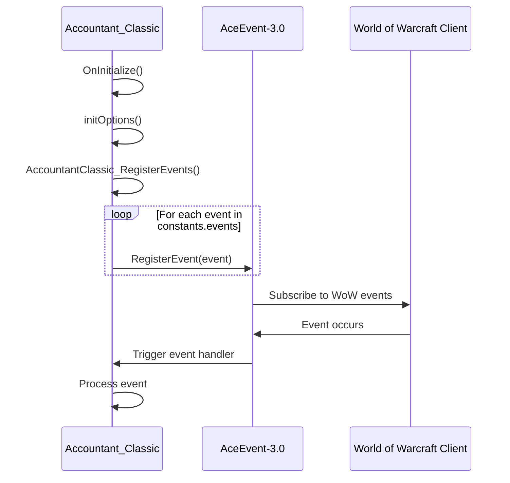
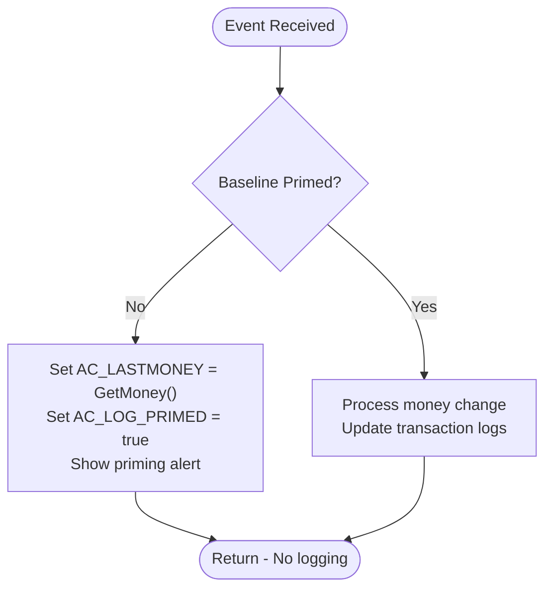
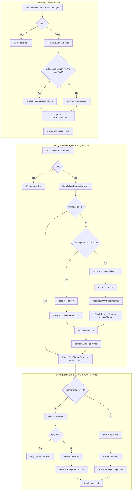
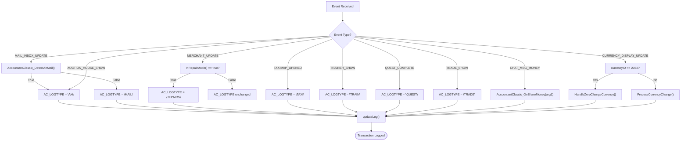
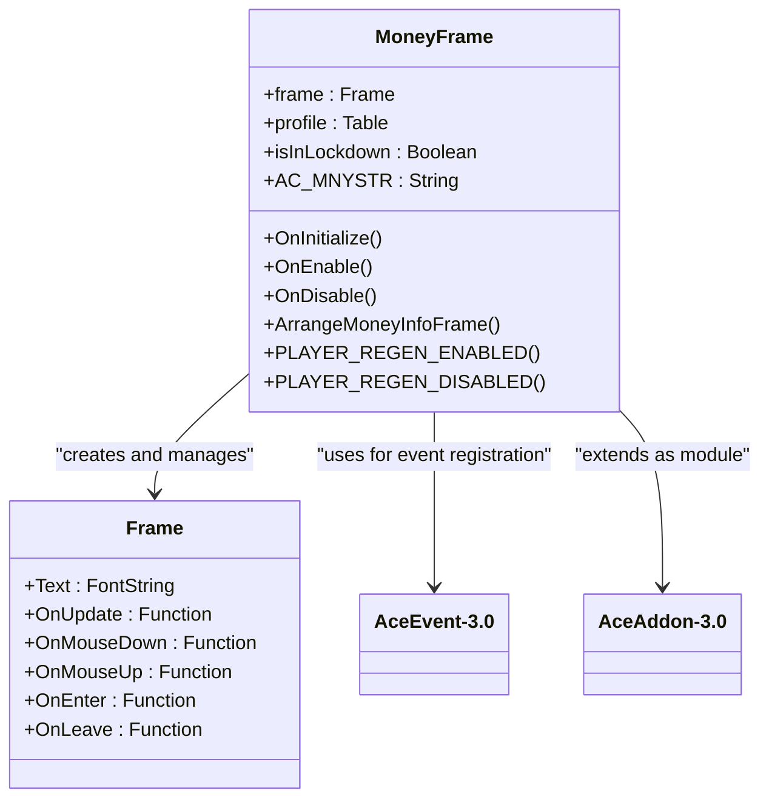

# Event Handling System

<cite>
**Referenced Files in This Document**   
- [Core.lua](file://Core/Core.lua)
- [MoneyFrame.lua](file://Core/MoneyFrame.lua)
- [Constants.lua](file://Core/Constants.lua)
- [CurrencyEventHandler.lua](file://CurrencyTracker/CurrencyEventHandler.lua) - *Updated in recent commit cdb65218*
- [Traders-Tender-Process-Flow.md](file://Docs/Traders-Tender-Process-Flow.md) - *New documentation for Trader's Tender handling*
</cite>

## Update Summary
**Changes Made**   
- Updated Core Event Handling Logic section to reflect new baseline priming mechanism
- Added new section on Trader's Tender Zero-Change Event Handling
- Added new section on Login Priming Session Guard
- Updated Event Filtering and Source Classification with Trader's Tender details
- Added new Mermaid diagram for Trader's Tender lifecycle
- Enhanced source tracking with new file references and annotations

## Table of Contents
1. [Introduction](#introduction)
2. [Event Registration and Initialization](#event-registration-and-initialization)
3. [Core Event Handling Logic](#core-event-handling-logic)
4. [Trader's Tender Zero-Change Event Handling](#traders-tender-zero-change-event-handling)
5. [Login Priming Session Guard](#login-priming-session-guard)
6. [Event Filtering and Source Classification](#event-filtering-and-source-classification)
7. [Secure Hook Implementation](#secure-hook-implementation)
8. [Independent Money Display System](#independent-money-display-system)
9. [Performance Considerations](#performance-considerations)

## Introduction
Accountant_Classic is a World of Warcraft addon designed to track player money transactions across various in-game activities. The addon implements an event-driven architecture using the Ace3 framework, specifically leveraging AceEvent-3.0 for event management and AceHook-3.0 for function interception. This document details the event handling system, focusing on how the addon registers for and responds to critical client events such as PLAYER_MONEY, MAIL_INBOX_UPDATE, AUCTION_HOUSE_SHOW, TAXIMAP_OPENED, and UNIT_INVENTORY_CHANGED. The system is designed to accurately capture money changes from different sources while preventing redundant processing and maintaining performance during extended gameplay sessions.

## Event Registration and Initialization

The event registration process begins during addon initialization when the `AccountantClassic_RegisterEvents` function is called. This function iterates through the event list defined in Constants.lua and registers each event with AceEvent-3.0. The event registration is centralized and uses a configuration-driven approach, allowing for easy maintenance and modification of the event list based on the game version.



**Diagram sources**
- [Core.lua](file://Core/Core.lua#L1482-L1551)
- [Constants.lua](file://Core/Constants.lua#L94-L200)

**Section sources**
- [Core.lua](file://Core/Core.lua#L1482-L1551)
- [Constants.lua](file://Core/Constants.lua#L94-L200)

## Core Event Handling Logic

The core event handling logic is implemented in the main event dispatcher within Core.lua. When events are triggered by the World of Warcraft client, the addon processes them to determine the appropriate logging category and update the financial records accordingly. The event handler uses a cascading conditional structure to identify the event type and set the corresponding transaction category.

The system implements a sophisticated priming mechanism to prevent the initial character balance from being incorrectly recorded as income. Instead of blocking all logging during the first session (which would lose legitimate transactions), the addon uses a one-time baseline initialization approach. When the first PLAYER_MONEY or CHAT_MSG_MONEY event occurs, the current balance is captured as the baseline (AC_LASTMONEY), effectively "priming" the system. Subsequent money changes are then tracked normally, avoiding the initial skew while preserving all transaction data.



**Section sources**
- [Core.lua](file://Core/Core.lua#L130-L154)
- [Core.lua](file://Core/Core.lua#L1520-L1551)

## Trader's Tender Zero-Change Event Handling

A specialized handler has been implemented for account-wide currencies like Trader's Tender (ID 2032) where the API-reported quantityChange is unreliable and often zero. The `HandleZeroChangeCurrency` function in CurrencyEventHandler.lua provides dedicated processing for these cases, ensuring accurate tracking without spurious income events.

The handler uses a multi-phase approach:
1. **First Sighting (Not Primed)**: When the currency is first encountered in a session, if quantityChange is zero or nil, it performs a Total-only reconcile (new - lastKnown) via Storage:ApplyTotalOnlyBaselineDelta, then primes in-memory state without logging a transaction. If quantityChange is non-zero, it computes the pre-transaction amount and records the normal event delta.
2. **Subsequent Events**: For already primed currencies, zero-change events are processed by comparing the live amount with the in-memory snapshot. If they differ, an inferred delta is calculated and logged, preventing spurious income from login events.

This specialized handling prevents the common issue of Trader's Tender showing spurious income on login when the API reports zero change but the actual balance has changed.



**Diagram sources**
- [CurrencyEventHandler.lua](file://CurrencyTracker/CurrencyEventHandler.lua#L53-L195) - *Updated in recent commit cdb65218*
- [Traders-Tender-Process-Flow.md](file://Docs/Traders-Tender-Process-Flow.md) - *New documentation for Trader's Tender handling*

**Section sources**
- [CurrencyEventHandler.lua](file://CurrencyTracker/CurrencyEventHandler.lua#L53-L195) - *Updated in recent commit cdb65218*

## Login Priming Session Guard

To prevent repeated login priming on zone changes and UI reloads, a session guard mechanism has been implemented. The `didLoginPrime` flag ensures that login priming runs exactly once per session, regardless of how many times PLAYER_ENTERING_WORLD fires.

The priming process is now strictly guarded by three conditions:
1. The `didLoginPrime` flag must be false
2. The `isInitialLogin` parameter must be true (indicating a fresh login, not a zone change)
3. The `isReloadingUi` parameter must be false (ensuring it doesn't trigger on UI reloads)

This guard mechanism ensures that the baseline priming for currencies occurs only during the initial login sequence when the UI is fully ready, preventing duplicate processing and potential data inconsistencies that could occur from multiple priming attempts during a single session.

```lua
function EventHandler:OnPlayerEnteringWorld(isInitialLogin, isReloadingUi)
    -- Run baseline priming only once per session after the UI is fully ready.
    -- PLAYER_ENTERING_WORLD fires on zoning and instances, so guard it strictly.
    if didLoginPrime then
        return
    end
    -- Prefer Blizzard flags when present: only on true initial login and not on UI reloads.
    if isInitialLogin == false then
        return
    end
    if isReloadingUi == true then
        return
    end
    self:PrimeDiscoveredCurrenciesOnLogin()
    didLoginPrime = true
end
```

**Section sources**
- [CurrencyEventHandler.lua](file://CurrencyTracker/CurrencyEventHandler.lua#L382-L413) - *Updated in recent commit 638e8592*

## Event Filtering and Source Classification

The event filtering system distinguishes between different money sources through a combination of event detection and contextual analysis. Each event type is mapped to a specific transaction category stored in the AC_LOGTYPE variable, which determines how the transaction is categorized in the logs.

For example, when a TAXIMAP_OPENED event occurs, the system sets AC_LOGTYPE to "TAXI", indicating that subsequent money changes are likely taxi fares. Similarly, MERCHANT_SHOW events trigger the "MERCH" category, while MERCHANT_UPDATE events check if the player is in repair mode to distinguish between general merchant transactions and repair costs.

The system also includes special handling for mail transactions, using the `AccountantClassic_DetectAhMail()` function to differentiate between auction house mail (categorized as "AH") and regular mail (categorized as "MAIL"). This prevents auction house transactions from being misclassified as general mail income or expenses.

A new specialized handler has been added for Trader's Tender (currency ID 2032) to address its unreliable API behavior. When a CURRENCY_DISPLAY_UPDATE event is received for this currency, the system routes it through the dedicated `HandleZeroChangeCurrency` function which implements the zero-change event handling logic described in the previous section.



**Section sources**
- [Core.lua](file://Core/Core.lua#L1482-L1522)
- [Constants.lua](file://Core/Constants.lua#L94-L200)
- [CurrencyEventHandler.lua](file://CurrencyTracker/CurrencyEventHandler.lua#L542-L570) - *Updated in recent commit cdb65218*

## Secure Hook Implementation

In addition to event registration, Accountant_Classic uses AceHook-3.0 to securely hook specific game functions that involve money transactions. The most notable example is the `RepairAllItems` function, which is hooked to capture repair costs. When this function is called, the addon intercepts it and sets the AC_LOGTYPE to "REPAIRS" before the actual repair transaction occurs.

This secure hooking approach allows the addon to capture money changes that might not generate standard events or might generate events in an order that makes accurate tracking difficult. By intercepting the function call directly, the system can ensure that the transaction context is properly established before the money change occurs.

The use of AceHook-3.0 provides several advantages:
- Safe hooking that preserves original function behavior
- Easy unhooking when the addon is disabled
- Protection against hook conflicts with other addons
- Clean separation between hooking logic and event handling

```lua
function addon:RepairAllItems(guildBankRepair)
    if (not guildBankRepair) then
        AC_LOGTYPE = "REPAIRS";
    end
end
```

**Section sources**
- [Core.lua](file://Core/Core.lua#L1937-L1941)

## Independent Money Display System

The MoneyFrame module operates as an independent component that listens to money updates without direct coordination with the core logging system. Implemented as an AceModule named "MoneyFrame", it registers for PLAYER_REGEN_ENABLED and PLAYER_REGEN_DISABLED events to track combat status, which affects user interface interactivity.

The display system uses an OnUpdate handler to continuously monitor the player's current money value through the GetMoney() API. To optimize performance, it only updates the display text when the money value has actually changed, comparing the current formatted value with the previously displayed value (AC_MNYSTR). This prevents unnecessary UI updates and reduces computational overhead.



**Diagram sources**
- [MoneyFrame.lua](file://Core/MoneyFrame.lua#L122-L167)

**Section sources**
- [MoneyFrame.lua](file://Core/MoneyFrame.lua#L0-L168)

## Performance Considerations

The event handling system incorporates several performance optimizations to minimize resource usage during extended gameplay sessions:

1. **Event Batching**: The system processes events efficiently by only updating logs when necessary, reducing the frequency of data structure modifications.

2. **Conditional Processing**: The priming mechanism prevents unnecessary processing during the initial setup phase, while the AC_LOG_PRIMED flag ensures baseline initialization occurs exactly once per session.

3. **Display Optimization**: The MoneyFrame module minimizes UI updates by comparing current and previous money values before refreshing the display, reducing string formatting operations.

4. **Memory Management**: The addon uses local variables and efficient table structures to minimize memory footprint, with careful management of event handlers that are properly unregistered when no longer needed.

5. **Event Filtering**: By using specific event types rather than broad monitoring, the system reduces the number of event callbacks and improves overall efficiency.

The architecture demonstrates careful consideration of performance implications, balancing comprehensive tracking with resource efficiency to ensure smooth operation even during intensive gameplay scenarios with frequent money transactions.

**Section sources**
- [Core.lua](file://Core/Core.lua#L130-L154)
- [MoneyFrame.lua](file://Core/MoneyFrame.lua#L122-L167)