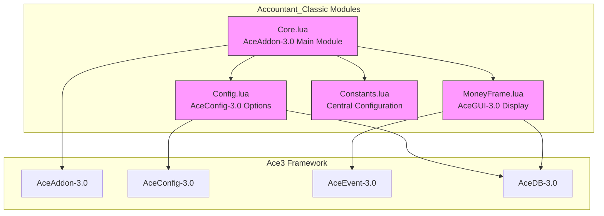
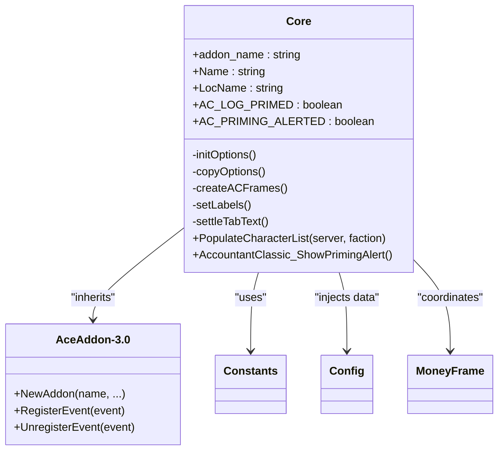
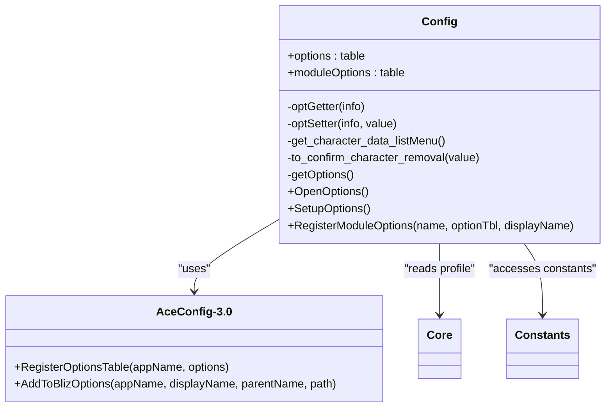
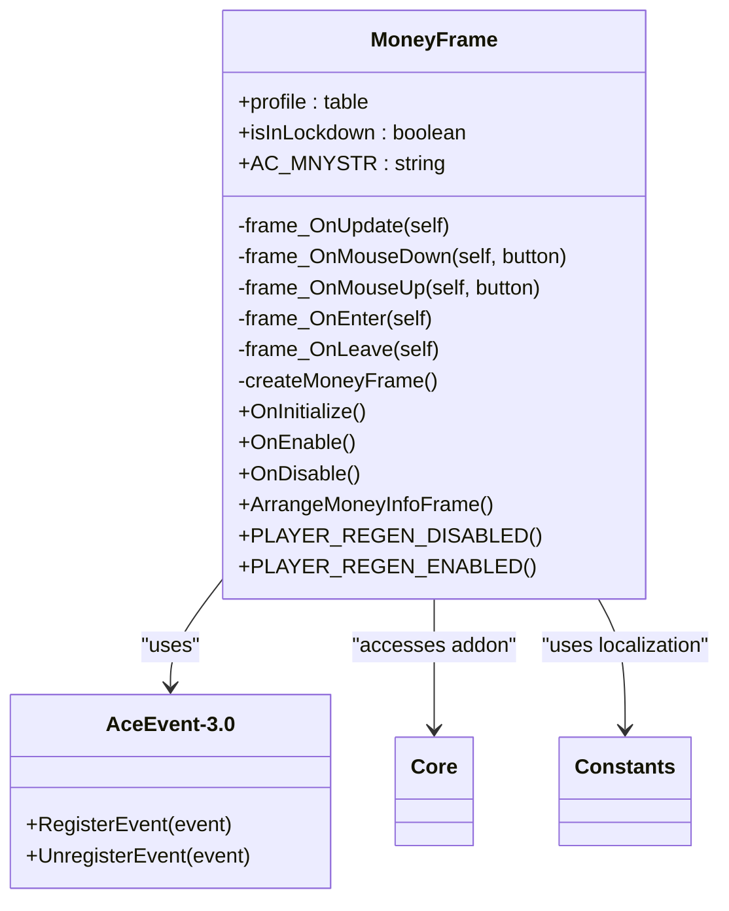
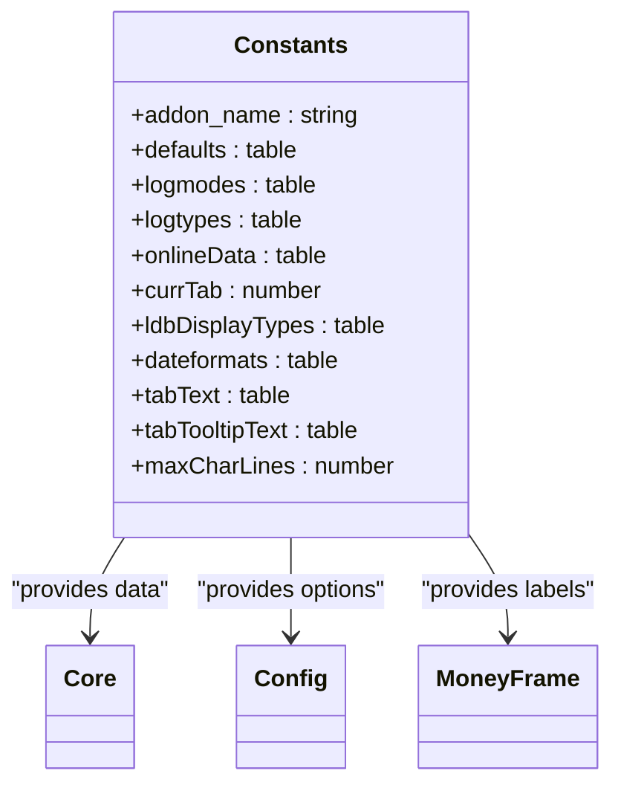

# Module Responsibilities

<cite>
**Referenced Files in This Document**   
- [Core.lua](file://Core/Core.lua)
- [Config.lua](file://Core/Config.lua)
- [MoneyFrame.lua](file://Core/MoneyFrame.lua)
- [Constants.lua](file://Core/Constants.lua)
</cite>

## Table of Contents
1. [Introduction](#introduction)
2. [Core Components](#core-components)
3. [Architecture Overview](#architecture-overview)
4. [Detailed Component Analysis](#detailed-component-analysis)
5. [Dependency Analysis](#dependency-analysis)
6. [Conclusion](#conclusion)

## Introduction
Accountant_Classic is a World of Warcraft addon designed to track player financial transactions across various gameplay activities. Built using the Ace3 framework, it provides detailed logging of income and expenses categorized by activity type and time period. The addon features a modular architecture with distinct components handling initialization, configuration, UI display, and data management. This document details the responsibilities and interactions of the core modules: Core.lua, Config.lua, MoneyFrame.lua, and Constants.lua, providing insight into how they work together to deliver a comprehensive financial tracking solution for players.

## Core Components
The Accountant_Classic addon consists of four primary modules that work together to provide financial tracking functionality. Core.lua serves as the main addon component responsible for initialization, event handling, and transaction processing coordination. Config.lua implements the options interface using AceConfig-3.0, allowing users to customize the addon's behavior and appearance. MoneyFrame.lua provides a standalone floating display module that shows current session financial information. Constants.lua acts as the central repository for configuration defaults, transaction categories, and UI constants used throughout the addon.

**Section sources**
- [Core.lua](file://Core/Core.lua#L1-L2306)
- [Config.lua](file://Core/Config.lua#L1-L431)
- [MoneyFrame.lua](file://Core/MoneyFrame.lua#L1-L169)
- [Constants.lua](file://Core/Constants.lua#L1-L261)

## Architecture Overview


**Diagram sources**
- [Core.lua](file://Core/Core.lua#L1-L2306)
- [Config.lua](file://Core/Config.lua#L1-L431)
- [MoneyFrame.lua](file://Core/MoneyFrame.lua#L1-L169)
- [Constants.lua](file://Core/Constants.lua#L1-L261)

## Detailed Component Analysis

### Core.lua Analysis
Core.lua serves as the primary AceAddon-3.0 component in Accountant_Classic, responsible for initialization, event registration, and transaction processing coordination. It acts as the central hub that connects all other modules and manages the addon's lifecycle.



**Diagram sources**
- [Core.lua](file://Core/Core.lua#L1-L2306)
- [Constants.lua](file://Core/Constants.lua#L1-L261)

**Section sources**
- [Core.lua](file://Core/Core.lua#L1-L2306)

#### Initialization and Event Management
Core.lua initializes as an AceAddon-3.0 component using LibStub to access the AceAddon-3.0 library. The addon is created with multiple mixins including AceConsole-3.0 and AceHook-3.0, enabling console commands and function hooking capabilities.

```lua
local addon = LibStub("AceAddon-3.0"):NewAddon(private.addon_name, "AceConsole-3.0", "AceHook-3.0")
```

The module implements a comprehensive event registration system through the `AccountantClassic_RegisterEvents` function, which registers for various WoW events related to financial transactions such as merchant interactions, auction house activities, quest completions, and player money changes.

```lua
function AccountantClassic_RegisterEvents(self)
    for key, value in pairs(private.constants.events) do
        self:RegisterEvent(value);
    end
end
```

#### Priming Approach for Baseline Initialization
Core.lua implements a sophisticated "Priming Approach" to handle the initial money balance when a character first loads. Instead of ignoring all transactions during the first session (which could lose legitimate transaction data), it establishes a baseline by recording the current money amount exactly once, then allows normal logging to proceed.

```lua
local AC_LOG_PRIMED = false
-- ... when first safe event occurs:
AC_LASTMONEY = GetMoney()
AC_LOG_PRIMED = true
```

This approach prevents the initial balance from being counted as "income" while preserving all subsequent transactions. A one-time UI alert is also implemented to inform players when the baseline has been established.

### Config.lua Analysis
Config.lua implements the AceConfig-3.0 framework to provide a comprehensive options interface for Accountant_Classic. It manages user preferences and settings through a structured configuration system that integrates with the game's native interface panels.



**Diagram sources**
- [Config.lua](file://Core/Config.lua#L1-L431)
- [Core.lua](file://Core/Core.lua#L1-L2306)

**Section sources**
- [Config.lua](file://Core/Config.lua#L1-L431)

#### Options Structure and User Interface
The configuration system is organized into logical groups that correspond to different aspects of the addon's functionality. The main options table includes sections for general settings, minimap button configuration, LDB display options, and character data management.

```lua
local options = {
    type = "group",
    name = addon.LocName,
    args = {
        general = {
            order = 1,
            type = "group",
            name = L["Options"],
            get = optGetter,
            set = optSetter,
            args = {
                -- Various option groups
            },
        },
    },
}
```

Each option is defined with properties such as order, type (toggle, select, range, etc.), name, description, and width. The system uses getter and setter functions to interface with the addon's database profile, ensuring that changes are properly saved and applied.

#### Profile Management and Character Data Removal
Config.lua includes functionality for managing character data, including a character removal system that prompts users for confirmation before deleting financial records. This is implemented using both LibDialog-1.0 and native StaticPopupDialogs for compatibility and reliability.

```lua
local function to_confirm_character_removal(value)
    -- Create confirmation dialog with character-specific information
    StaticPopupDialogs["ACCOUNTANT_CLASSIC_CONFIRM_REMOVE"] = {
        text = L["The selected character is about to be removed..."],
        button1 = OKAY,
        button2 = CANCEL,
        OnAccept = function()
            addon:CharacterRemovalProceed(selected_srv, selected_char)
        end,
        timeout = 0,
        whileDead = true,
        hideOnEscape = true,
    }
    StaticPopup_Show("ACCOUNTANT_CLASSIC_CONFIRM_REMOVE")
end
```

### MoneyFrame.lua Analysis
MoneyFrame.lua implements a standalone AceGUI-3.0-based floating display module that shows current session financial information. It operates as a separate module within the addon, demonstrating the modular design pattern enabled by AceAddon-3.0.



**Diagram sources**
- [MoneyFrame.lua](file://Core/MoneyFrame.lua#L1-L169)
- [Core.lua](file://Core/Core.lua#L1-L2306)

**Section sources**
- [MoneyFrame.lua](file://Core/MoneyFrame.lua#L1-L169)

#### Floating Frame Implementation
The money frame is created as a draggable UI element that displays the player's current gold amount and provides access to the main addon interface. It uses standard WoW UI frame creation methods enhanced with AceEvent-3.0 for event handling.

```lua
local function createMoneyFrame()
    local f = CreateFrame("Frame", "AccountantClassicMoneyInfoFrame", UIParent)
    f:SetWidth(160)
    f:SetHeight(21)
    f:SetPoint("TOPLEFT", UIParent, "TOPLEFT", 10, -80)
    f:SetClampedToScreen(true)
    f:SetMovable(true)
    f:EnableMouse(true)
    f:RegisterForDrag("LeftButton")
    
    f.Text = f:CreateFontString("AccountantClassicMoneyInfoText", "OVERLAY", "GameFontNormal")
    f.Text:SetPoint("TOPLEFT", f, "TOPLEFT", 0, 0)
    f:SetScript("OnUpdate", frame_OnUpdate)
    f:SetScript("OnMouseDown", frame_OnMouseDown)
    f:SetScript("OnMouseUp", frame_OnMouseUp)
    f:SetScript("OnEnter", frame_OnEnter)
    f:SetScript("OnLeave", frame_OnLeave)
    return f
end
```

#### Event-Driven Updates and Combat Lockdown Handling
The MoneyFrame module registers for PLAYER_REGEN_ENABLED and PLAYER_REGEN_DISABLED events to handle combat lockdown states, preventing the frame from being moved during combat for UI security compliance.

```lua
function MoneyFrame:OnEnable()
    self:RegisterEvent("PLAYER_REGEN_ENABLED")
    self:RegisterEvent("PLAYER_REGEN_DISABLED")
    if (profile.showmoneyinfo == true) then
        self.frame:Show()
        self:ArrangeMoneyInfoFrame()
    else
        self.frame:Hide()
    end
end

function MoneyFrame:PLAYER_REGEN_DISABLED()
    isInLockdown = true
end

function MoneyFrame:PLAYER_REGEN_ENABLED()
    isInLockdown = false
end
```

The frame's OnUpdate script continuously monitors the player's money amount and updates the display only when changes occur, optimizing performance by avoiding unnecessary UI refreshes.

### Constants.lua Analysis
Constants.lua serves as the central repository for configuration defaults, time period definitions, transaction categories, and UI constants used throughout the Accountant_Classic addon. It provides a single source of truth for these values, ensuring consistency across all modules.



**Diagram sources**
- [Constants.lua](file://Core/Constants.lua#L1-L261)
- [Core.lua](file://Core/Core.lua#L1-L2306)

**Section sources**
- [Constants.lua](file://Core/Constants.lua#L1-L261)

#### Configuration Defaults and Environment Detection
The Constants module defines the default profile settings that are applied when the addon is first installed or when a new character profile is created. These defaults cover UI appearance, display preferences, and tracking options.

```lua
constants.defaults = {
    profile = {
        minimap = {
            hide = false,
            show = true,
            minimapPos = 153,
        },
        showbutton = true, 
        showmoneyinfo = true, 
        showintrotip = true,
        -- Additional default settings
    },
}
```

It also includes environment detection logic to determine which version of World of Warcraft is running, allowing the addon to adapt its event handling and feature set based on the game version.

```lua
local wowversion = select(4, GetBuildInfo())
if wowversion < 20000 then
    WoWClassicEra = true
elseif wowversion < 30000 then 
    WoWClassicTBC = true
-- Additional version checks
end
```

#### Transaction Categories and Time Periods
Constants.lua defines the core data structures that categorize financial transactions and time periods used for reporting. The logmodes table specifies the different time periods for which financial data is tracked:

```lua
constants.logmodes = {"Session", "Day", "PrvDay", "Week", "PrvWeek", "Month", "PrvMonth", "Year", "PrvYear", "Total" }
```

The logtypes table defines the categories of transactions that are tracked:

```lua
constants.logtypes = {
    "TRAIN", "TAXI", "TRADE", "AH", "MERCH", "REPAIRS", "MAIL", "QUEST", "LOOT", "OTHER" 
}
```

These categories are mapped to human-readable labels in the onlineData table, which varies based on the game version to include appropriate features like Garrison, Barber Shop, and Transmogrification in newer versions.

## Dependency Analysis
```mermaid
graph TD
Core --> Constants : "reads configuration"
Core --> Config : "passes data for options"
Core --> MoneyFrame : "coordinates display"
Config --> Core : "accesses addon instance"
Config --> Constants : "reads UI constants"
MoneyFrame --> Core : "accesses addon instance"
MoneyFrame --> Constants : "reads localization"
Constants --> Core : "provides defaults"
Constants --> Config : "provides option values"
Constants --> MoneyFrame : "provides display text"
style Core fill:#f9f,stroke:#333
style Config fill:#f9f,stroke:#333
style MoneyFrame fill:#f9f,stroke:#333
style Constants fill:#f9f,stroke:#333
```

**Diagram sources**
- [Core.lua](file://Core/Core.lua#L1-L2306)
- [Config.lua](file://Core/Config.lua#L1-L431)
- [MoneyFrame.lua](file://Core/MoneyFrame.lua#L1-L169)
- [Constants.lua](file://Core/Constants.lua#L1-L261)

**Section sources**
- [Core.lua](file://Core/Core.lua#L1-L2306)
- [Config.lua](file://Core/Config.lua#L1-L431)
- [MoneyFrame.lua](file://Core/MoneyFrame.lua#L1-L169)
- [Constants.lua](file://Core/Constants.lua#L1-L261)

### Module Interaction Patterns
The Accountant_Classic addon demonstrates several key interaction patterns between its modules:

1. **Dependency Injection**: Core.lua injects data into Config.lua for display in the settings interface, particularly when populating character lists and other dynamic options.

2. **Event Subscription**: MoneyFrame.lua subscribes to PLAYER_REGEN_ENABLED and PLAYER_REGEN_DISABLED events to manage its behavior during combat, demonstrating the event-driven architecture.

3. **Centralized Configuration**: All modules access Constants.lua for shared configuration data, ensuring consistency and reducing duplication.

4. **Profile-Based Settings**: Both Config.lua and MoneyFrame.lua access the addon's database profile to retrieve user preferences, with Core.lua managing the profile initialization.

### Initialization Sequence
The addon follows a specific initialization sequence when loaded:

1. Constants.lua is loaded first, establishing the configuration defaults and environment detection.
2. Core.lua initializes as the main AceAddon-3.0 component, setting up the addon instance.
3. Config.lua and MoneyFrame.lua are loaded, registering themselves with the core addon.
4. Core.lua calls initialization functions to set up the database, UI frames, and event handlers.
5. The options system is configured, making the settings available through the game's interface.

This sequence ensures that all dependencies are resolved before modules attempt to access shared resources.

## Conclusion
Accountant_Classic demonstrates a well-structured modular design using the Ace3 framework, with clear separation of concerns between its core components. Core.lua serves as the central coordinator, handling initialization, event registration, and transaction processing. Config.lua provides a comprehensive options interface using AceConfig-3.0, allowing users to customize the addon's behavior. MoneyFrame.lua implements a standalone floating display module that enhances accessibility. Constants.lua acts as the central repository for configuration data, ensuring consistency across the addon.

The inter-module dependencies follow established patterns, with Core.lua injecting data into Config.lua for display in settings, and MoneyFrame.lua subscribing to relevant events to update its display. The use of Ace3 libraries enables robust functionality while maintaining compatibility across different World of Warcraft versions. This architecture provides a solid foundation for a financial tracking addon that is both feature-rich and maintainable.