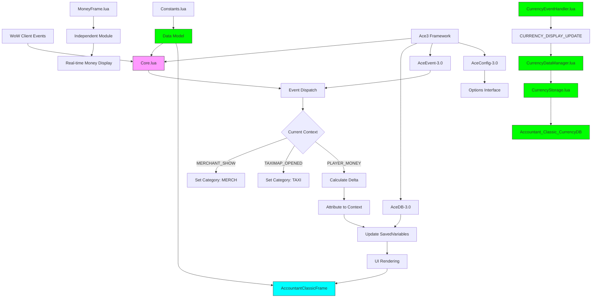
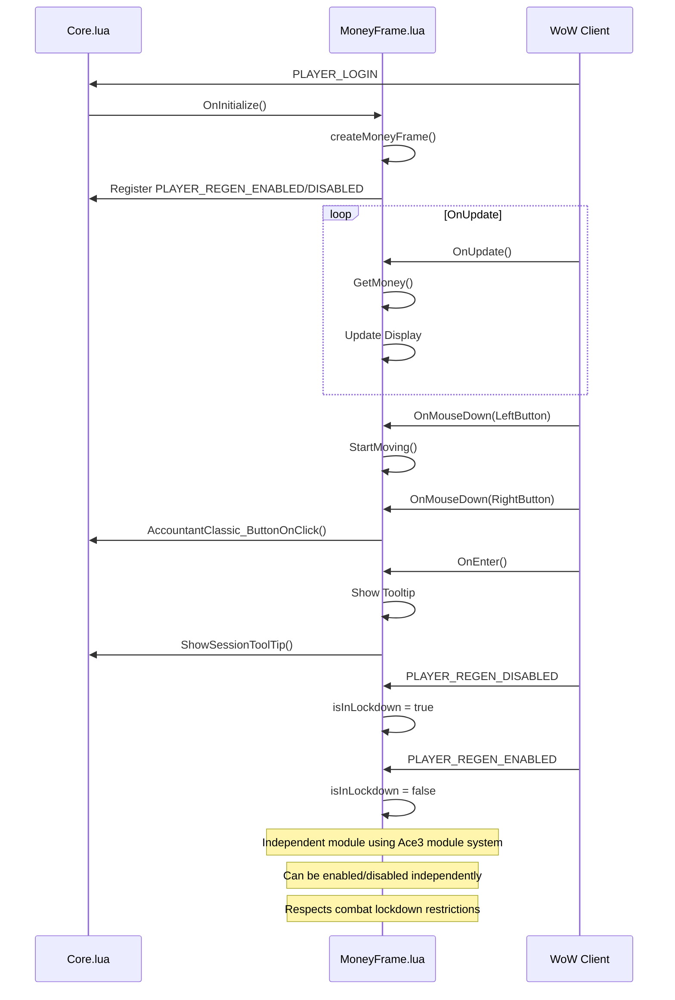

# Technical Architecture

<cite>
**Referenced Files in This Document**   
- [Core.lua](file://Core/Core.lua)
- [Constants.lua](file://Core/Constants.lua)
- [MoneyFrame.lua](file://Core/MoneyFrame.lua)
- [Config.lua](file://Core/Config.lua)
- [CurrencyDataManager.lua](file://CurrencyTracker/CurrencyDataManager.lua) - *Updated in commit 24*
- [CurrencyEventHandler.lua](file://CurrencyTracker/CurrencyEventHandler.lua) - *Updated in commit 4*
- [CurrencyStorage.lua](file://CurrencyTracker/CurrencyStorage.lua) - *Updated in commits 24 and 4*
- [LibStub.lua](file://Libs/LibStub/LibStub.lua)
- [CallbackHandler-1.0.lua](file://Libs/CallbackHandler-1.0/CallbackHandler-1.0.lua)
</cite>

## Update Summary
**Changes Made**   
- Updated documentation to reflect migration of currency discovery from per-character to account-wide storage
- Added details on specialized event handling for zero-change currency events, particularly for Trader's Tender (2032)
- Enhanced architecture overview with new currency tracking components and data flow
- Added new section on Currency Data Management with updated diagrams
- Updated dependency analysis to include currency tracking module interactions
- Revised performance considerations to address account-wide data handling

## Table of Contents
1. [Introduction](#introduction)
2. [Project Structure](#project-structure)
3. [Core Components](#core-components)
4. [Architecture Overview](#architecture-overview)
5. [Detailed Component Analysis](#detailed-component-analysis)
6. [Dependency Analysis](#dependency-analysis)
7. [Performance Considerations](#performance-considerations)
8. [Troubleshooting Guide](#troubleshooting-guide)
9. [Conclusion](#conclusion)

## Introduction
Accountant_Classic is a lightweight World of Warcraft addon designed to track gold inflows and outflows across multiple time ranges including Session, Day, Week, Month, Year, and Total. Built on the Ace3 framework, it implements a component-based architecture with clear separation of concerns between data, logic, and presentation layers. The addon listens to WoW client events to determine financial context (such as Merchant, Taxi, or Auction House interactions) and attributes money changes accordingly. It features cross-character data aggregation, localization support, and a configurable user interface with both main window and minimap/LDB integration. The system employs event-driven programming patterns and leverages Ace3 libraries for configuration management, database handling, and event processing. Recent updates have enhanced the system with account-wide currency tracking and improved event handling for special currencies.

## Project Structure
The project follows a modular structure organized by functional components and dependencies. The core functionality resides in the Core directory, while third-party libraries are isolated in the Libs directory. Localization assets are maintained separately in the Locale directory.

```mermaid
graph TB
subgraph "Core Components"
Core[Core/]
Config[Config.lua]
Constants[Constants.lua]
CoreLua[Core.lua]
MoneyFrame[MoneyFrame.lua]
CoreXML[Core.xml]
end
subgraph "Currency Tracker"
CurrencyTracker[CurrencyTracker/]
CurrencyDataManager[CurrencyDataManager.lua]
CurrencyEventHandler[CurrencyEventHandler.lua]
CurrencyStorage[CurrencyStorage.lua]
CurrencyCore[CurrencyCore.lua]
CurrencyFrame[CurrencyFrame.lua]
end
subgraph "Libraries"
Libs[Libs/]
Ace3[Ace3 Framework]
LibStub[LibStub]
CallbackHandler[CallbackHandler-1.0]
end
subgraph "Localization"
Locale[Locale/]
Locales[Locales.xml]
Localization[localization.en.lua]
end
subgraph "Documentation"
Docs[Docs/]
README[README.md]
ROADMAP[ROADMAP.md]
end
Core --> Libs
Core --> Locale
CurrencyTracker --> Core
CurrencyTracker --> Libs
Config --> Constants
CoreLua --> Constants
CoreLua --> Config
MoneyFrame --> CoreLua
CoreXML --> CoreLua
style Core fill:#f9f,stroke:#333
style CurrencyTracker fill:#0f0,stroke:#333
style Libs fill:#bbf,stroke:#333
style Locale fill:#f96,stroke:#333
```

**Diagram sources**
- [Core.xml](file://Core/Core.xml#L1-L627)
- [Core.lua](file://Core/Core.lua#L1-L2306)

**Section sources**
- [Core.xml](file://Core/Core.xml#L1-L627)
- [README.md](file://README.md#L1-L120)

## Core Components
The system's core components follow a Model-View-Controller pattern implemented through Ace3's addon architecture. Core.lua serves as the primary controller, managing event registration, data initialization, and inter-module coordination. Constants.lua provides the data model definitions including log types, events, and UI text. The XML templates define the UI structure and layout, while MoneyFrame.lua operates as an independent module for displaying real-time money information. The CurrencyTracker module has been enhanced with three key components: CurrencyDataManager.lua for data operations, CurrencyEventHandler.lua for event monitoring, and CurrencyStorage.lua for persistent storage with backward compatibility.

**Section sources**
- [Core.lua](file://Core/Core.lua#L1-L2306)
- [Constants.lua](file://Core/Constants.lua#L1-L261)
- [MoneyFrame.lua](file://Core/MoneyFrame.lua#L1-L169)
- [CurrencyDataManager.lua](file://CurrencyTracker/CurrencyDataManager.lua#L1-L425) - *Updated in commit 24*
- [CurrencyEventHandler.lua](file://CurrencyTracker/CurrencyEventHandler.lua#L1-L932) - *Updated in commit 4*
- [CurrencyStorage.lua](file://CurrencyTracker/CurrencyStorage.lua#L1-L1222) - *Updated in commits 24 and 4*

## Architecture Overview
Accountant_Classic implements an event-driven architecture built on the Ace3 framework, where Core.lua acts as the primary addon controller. The system follows a component-based design with clear separation between data management, business logic, and UI presentation. Recent updates have enhanced the currency tracking system with account-wide storage and specialized event handling.



**Diagram sources**
- [Core.lua](file://Core/Core.lua#L1-L2306)
- [Constants.lua](file://Core/Constants.lua#L1-L261)
- [MoneyFrame.lua](file://Core/MoneyFrame.lua#L1-L169)
- [CurrencyEventHandler.lua](file://CurrencyTracker/CurrencyEventHandler.lua#L1-L932) - *Updated in commit 4*
- [CurrencyDataManager.lua](file://CurrencyTracker/CurrencyDataManager.lua#L1-L425) - *Updated in commit 24*
- [CurrencyStorage.lua](file://CurrencyTracker/CurrencyStorage.lua#L1-L1222) - *Updated in commits 24 and 4*

## Detailed Component Analysis

### Core Module Analysis
The Core module (Core.lua) serves as the central controller for the Accountant_Classic addon, leveraging the Ace3 framework to manage events, data, and UI interactions.

```mermaid
classDiagram
class AccountantClassic {
+string constants
+string Name
+string LocName
+table db
+table profile
+boolean AC_LOG_PRIMED
+boolean AC_PRIMING_ALERTED
+initOptions()
+updateLog()
+AccountantClassic_OnEvent()
+AccountantClassic_OnShow()
+AccountantClassic_RegisterEvents()
+PopulateCharacterList()
+Refresh()
}
class Constants {
+table logmodes
+table logtypes
+table events
+table onlineData
+table tabText
+table defaults
}
AccountantClassic --> Constants : "uses"
AccountantClassic --> AceDB-3.0 : "manages"
AccountantClassic --> AceEvent-3.0 : "listens to"
AccountantClassic --> LibDBIcon-1.0 : "controls"
AccountantClassic --> LibDataBroker-1.1 : "integrates with"
note right of AccountantClassic
Primary addon controller using Ace3 framework
Manages event registration, data initialization,
and inter-module coordination
end note
note right of Constants
Data model definitions and configuration
Contains all log types, events, and UI text
Provides default settings structure
end note
```

**Diagram sources**
- [Core.lua](file://Core/Core.lua#L1-L2306)
- [Constants.lua](file://Core/Constants.lua#L1-L261)

**Section sources**
- [Core.lua](file://Core/Core.lua#L1-L2306)
- [Constants.lua](file://Core/Constants.lua#L1-L261)

### Money Tracking Workflow
The money tracking system follows a precise workflow to accurately attribute gold changes to their sources while avoiding false positives from initial balance readings.

```mermaid
flowchart TD
A[PLAYER_MONEY or CHAT_MSG_MONEY Event] --> B{AC_LOG_PRIMED?}
B --> |No| C[Set AC_LASTMONEY = Current Balance]
C --> D[Set AC_LOG_PRIMED = true]
D --> E[Show Priming Alert]
E --> F[Normal Logging]
B --> |Yes| F[Normal Logging]
F --> G[Calculate Delta = Current - Last]
G --> H{Delta ≠ 0?}
H --> |No| I[Update AC_LASTMONEY]
H --> |Yes| J[Determine Current Context]
J --> K[Attribute Delta to Context]
K --> L[Update SavedVariables]
L --> M[Update UI Display]
M --> N[Update AC_LASTMONEY]
style C fill:#f96,stroke:#333
style D fill:#f96,stroke:#333
style E fill:#f96,stroke:#333
style F fill:#0f0,stroke:#333
style K fill:#0f0,stroke:#333
style L fill:#0f0,stroke:#333
note over C,D,E: "Priming Phase - One-time initialization"
note over F,K,L: "Normal Logging Phase"
```

**Diagram sources**
- [Core.lua](file://Core/Core.lua#L1-L2306)
- [Constants.lua](file://Core/Constants.lua#L1-L261)

**Section sources**
- [Core.lua](file://Core/Core.lua#L1-L2306)

### Configuration System Analysis
The configuration system leverages Ace3's configuration libraries to provide a comprehensive options interface with profile management capabilities.

```mermaid
classDiagram
class Config {
+table options
+function getOptions()
+function SetupOptions()
+function RegisterModuleOptions()
+function OpenOptions()
}
class AceConfigRegistry-3.0 {
+RegisterOptionsTable()
+IterateOptionsTables()
}
class AceConfigDialog-3.0 {
+AddToBlizOptions()
+OpenToCategory()
}
class AceDBOptions-3.0 {
+GetOptionsTable()
}
Config --> AceConfigRegistry-3.0 : "registers with"
Config --> AceConfigDialog-3.0 : "adds to"
Config --> AceDBOptions-3.0 : "uses"
note right of Config
Central configuration handler
Builds options table using Ace3 libraries
Manages options frame creation
end note
note right of AceConfigRegistry-3.0
Ace3 configuration registry
Stores options tables by addon name
Provides access to registered options
end note
note right of AceConfigDialog-3.0
Ace3 configuration dialog
Integrates options with Blizzard interface
Handles options display and navigation
end note
```

**Diagram sources**
- [Config.lua](file://Core/Config.lua#L1-L431)
- [Libs/AceConfig-3.0](file://Libs/AceConfig-3.0#L1-L1)

**Section sources**
- [Config.lua](file://Core/Config.lua#L1-L431)

### MoneyFrame Module Analysis
The MoneyFrame module provides an independent but integrated component for displaying real-time money information with configurable positioning and appearance.



**Diagram sources**
- [MoneyFrame.lua](file://Core/MoneyFrame.lua#L1-L169)
- [Core.lua](file://Core/Core.lua#L1-L2306)

**Section sources**
- [MoneyFrame.lua](file://Core/MoneyFrame.lua#L1-L169)

### Currency Data Management Analysis
The CurrencyTracker module has been enhanced with a robust data management system that handles currency tracking across multiple characters through account-wide storage.

```mermaid
classDiagram
class CurrencyDataManager {
+boolean isInitialized
+table Constants
+Initialize()
+TrackCurrencyChange(currencyID, amount, source, zone)
+GetCurrencyData(currencyID, timeframe)
+GetAvailableCurrencies()
+GetSupportedCurrencies()
+GetCurrenciesByExpansion(expansion)
+GetCurrenciesByPatch(patch)
+GetCurrenciesForCurrentVersion()
+IsCurrencySupported(currencyID)
+GetCurrentWoWVersion()
+ComparePatchVersions(version1, version2)
+GetCurrencyInfo(currencyID)
+GetCurrenciesGroupedByExpansion()
+GetTrackedCurrencies()
+ValidateData()
+GetStorageStats()
+ResetAllData()
+IsTrackingEnabled()
+SetTrackingEnabled(enabled)
+SaveCurrencySelection(currencyID)
+LoadCurrencySelection()
}
class CurrencyEventHandler {
+boolean isInitialized
+boolean isEnabled
+table eventFrame
+table registeredEvents
+table lastCurrencyAmounts
+table updateBatch
+table batchTimer
+boolean inCombat
+table primedCurrencies
+table bagDebounceTimer
+boolean didLoginPrime
+Initialize()
+Enable()
+Disable()
+RegisterEvents()
+UnregisterEvents()
+OnEvent(event, ...)
+OnAddonLoaded()
+OnPlayerLogin()
+OnPlayerEnteringWorld(isInitialLogin, isReloadingUi)
+OnPlayerLogout()
+OnEnterCombat()
+OnLeaveCombat()
+OnCurrencyDisplayUpdate(currencyType, quantity, quantityChange, quantityGainSource, quantityLostSource)
+OnBagUpdate(bagID)
+ProcessCurrencyChange(currencyID, newQuantity, quantityChange, quantityGainSource, quantityLostSource)
+HandleZeroChangeCurrency(self, currencyID, newQuantity, quantityChange, quantityGainSource, quantityLostSource)
+PrimeDiscoveredCurrenciesOnLogin()
+CheckBagCurrencies()
+AddToBatch(eventType, ...)
+ProcessBatchUpdates()
}
class CurrencyStorage {
+string CURRENCY_VERSION
+number DEFAULT_CURRENCY
+table TIME_PERIODS
+boolean isInitialized
+Initialize()
+InitializeCurrencyStorage()
+InitializeCurrencyData(currencyID)
+RecordCurrencyTransaction(currencyID, amount, isIncome, source, zone)
+GetCurrencyData(currencyID, timeframe)
+GetAvailableCurrencies()
+SaveCurrencySelection(currencyID)
+LoadCurrencySelection()
+IsTrackingEnabled()
+SetTrackingEnabled(enabled)
+ApplyTotalOnlyBaselineDelta(currencyID, delta)
+MigrateZeroSourceToBaselinePrime()
+RepairRemove(currencyID, amount, sourceKey, kind)
+ResetSession()
+AdjustCurrencyAggregates(currencyID, delta, sourceKey)
+ShiftCurrencyLogs()
+MigrateData(oldVersion, newVersion)
+SaveDiscoveredCurrency(currencyID)
+GetDiscoveredCurrencies()
+RecordEventMetadata(currencyID, gainSource, lostSource, sign)
}
CurrencyDataManager --> CurrencyStorage : "uses"
CurrencyEventHandler --> CurrencyDataManager : "uses"
CurrencyEventHandler --> CurrencyStorage : "uses"
note right of CurrencyDataManager
Handles all currency data operations and storage
Provides generic tracking logic that works with any currency ID
Manages supported currency definitions and metadata
end note
note right of CurrencyEventHandler
Monitors WoW events for currency changes
Detects currency changes and identifies transaction sources
Handles specialized cases like zero-change events
end note
note right of CurrencyStorage
Manages persistent storage of currency data
Extends existing SavedVariables structure
Ensures backward compatibility and handles data versioning
Implements account-wide global store for currency discovery
end note
```

**Diagram sources**
- [CurrencyDataManager.lua](file://CurrencyTracker/CurrencyDataManager.lua#L1-L425) - *Updated in commit 24*
- [CurrencyEventHandler.lua](file://CurrencyTracker/CurrencyEventHandler.lua#L1-L932) - *Updated in commit 4*
- [CurrencyStorage.lua](file://CurrencyTracker/CurrencyStorage.lua#L1-L1222) - *Updated in commits 24 and 4*

**Section sources**
- [CurrencyDataManager.lua](file://CurrencyTracker/CurrencyDataManager.lua#L1-L425) - *Updated in commit 24*
- [CurrencyEventHandler.lua](file://CurrencyTracker/CurrencyEventHandler.lua#L1-L932) - *Updated in commit 4*
- [CurrencyStorage.lua](file://CurrencyTracker/CurrencyStorage.lua#L1-L1222) - *Updated in commits 24 and 4*

### Currency Tracking Workflow
The currency tracking system follows an enhanced workflow with specialized handling for account-wide data and zero-change events.

```mermaid
flowchart TD
A[CURRENCY_DISPLAY_UPDATE Event] --> B{Currency ID 2032?}
B --> |Yes| C[HandleZeroChangeCurrency]
C --> D{Primed?}
D --> |No| E[Reconcile Total-only baseline]
E --> F[Prime in-memory snapshot]
F --> G[Normal Logging]
D --> |Yes| G[Normal Logging]
B --> |No| H{Primed?}
H --> |No| I[Seed from Total.net]
I --> J[Prime in-memory snapshot]
J --> K[Normal Logging]
H --> |Yes| K[Normal Logging]
K --> L[Calculate Delta]
L --> M{Delta ≠ 0?}
M --> |No| N[Update Last Amount]
M --> |Yes| O[Determine Source]
O --> P[Attribute Delta to Context]
P --> Q[Update SavedVariables]
Q --> R[Update UI Display]
R --> S[Update Last Amount]
style C fill:#0f0,stroke:#333
style E fill:#0f0,stroke:#333
style F fill:#0f0,stroke:#333
style I fill:#0f0,stroke:#333
style J fill:#0f0,stroke:#333
style K fill:#0f0,stroke:#333
style P fill:#0f0,stroke:#333
style Q fill:#0f0,stroke:#333
note over C,E,F: "Special handling for Trader's Tender (2032)"
note over I,J,K: "General currency priming"
note over P,Q: "Normal Logging Phase"
```

**Diagram sources**
- [CurrencyEventHandler.lua](file://CurrencyTracker/CurrencyEventHandler.lua#L1-L932) - *Updated in commit 4*
- [CurrencyStorage.lua](file://CurrencyTracker/CurrencyStorage.lua#L1-L1222) - *Updated in commits 24 and 4*

**Section sources**
- [CurrencyEventHandler.lua](file://CurrencyTracker/CurrencyEventHandler.lua#L1-L932) - *Updated in commit 4*
- [CurrencyStorage.lua](file://CurrencyTracker/CurrencyStorage.lua#L1-L1222) - *Updated in commits 24 and 4*

## Dependency Analysis
The addon relies on a well-defined set of dependencies managed through the Ace3 framework and LibStub library loader. These dependencies provide essential functionality for configuration, event handling, and UI components. The CurrencyTracker module introduces additional dependencies for account-wide data management.

```mermaid
graph TD
A[Accountant_Classic] --> B[LibStub]
B --> C[Ace3 Framework]
C --> D[AceAddon-3.0]
C --> E[AceDB-3.0]
C --> F[AceEvent-3.0]
C --> G[AceConfig-3.0]
C --> H[AceGUI-3.0]
C --> I[AceHook-3.0]
C --> J[AceLocale-3.0]
A --> K[CallbackHandler-1.0]
A --> L[LibDBIcon-1.0]
A --> M[LibDataBroker-1.1]
A --> N[LibDialog-1.0]
A --> O[LibUIDropDownMenu]
A --> P[CurrencyTracker]
P --> Q[CurrencyDataManager]
P --> R[CurrencyEventHandler]
P --> S[CurrencyStorage]
Q --> S
R --> Q
R --> S
S --> T[Accountant_Classic_CurrencyDB]
D --> U[Addon Lifecycle Management]
E --> V[Data Persistence]
F --> W[Event Registration]
G --> X[Options Interface]
H --> Y[GUI Components]
I --> Z[Function Hooking]
J --> AA[Localization]
style A fill:#f9f,stroke:#333
style C fill:#bbf,stroke:#333
style K fill:#f96,stroke:#333
style L fill:#f96,stroke:#333
style M fill:#f96,stroke:#333
style P fill:#0f0,stroke:#333
style T fill:#0f0,stroke:#333
note over A: "Main Addon"
note over C: "Ace3 Framework Libraries"
note over K,L,M,N,O: "Third-party Libraries"
note over P: "Currency Tracking Module"
note over T: "Account-wide Global Store"
```

**Diagram sources**
- [LibStub.lua](file://Libs/LibStub/LibStub.lua#L1-L52)
- [CallbackHandler-1.0.lua](file://Libs/CallbackHandler-1.0/CallbackHandler-1.0.lua#L1-L203)
- [Core.lua](file://Core/Core.lua#L1-L2306)
- [CurrencyDataManager.lua](file://CurrencyTracker/CurrencyDataManager.lua#L1-L425) - *Updated in commit 24*
- [CurrencyEventHandler.lua](file://CurrencyTracker/CurrencyEventHandler.lua#L1-L932) - *Updated in commit 4*
- [CurrencyStorage.lua](file://CurrencyTracker/CurrencyStorage.lua#L1-L1222) - *Updated in commits 24 and 4*

**Section sources**
- [LibStub.lua](file://Libs/LibStub/LibStub.lua#L1-L52)
- [CallbackHandler-1.0.lua](file://Libs/CallbackHandler-1.0/CallbackHandler-1.0.lua#L1-L203)
- [CurrencyDataManager.lua](file://CurrencyTracker/CurrencyDataManager.lua#L1-L425) - *Updated in commit 24*
- [CurrencyEventHandler.lua](file://CurrencyTracker/CurrencyEventHandler.lua#L1-L932) - *Updated in commit 4*
- [CurrencyStorage.lua](file://CurrencyTracker/CurrencyStorage.lua#L1-L1222) - *Updated in commits 24 and 4*

## Performance Considerations
The system demonstrates efficient performance characteristics through several design choices that optimize data handling and event processing.

The AceDB-3.0 library provides efficient data storage with automatic profile management, minimizing disk I/O operations. The event-driven architecture ensures that processing only occurs when relevant WoW client events fire, rather than using continuous polling. The priming mechanism prevents unnecessary processing during the first session while maintaining accuracy for subsequent transactions.

Data aggregation across multiple characters is handled efficiently through ordered iteration and sorting only when the All Characters tab is displayed. The UI updates are optimized by only refreshing when actual money changes occur, and the MoneyFrame module uses string comparison to avoid unnecessary text updates.

For large datasets spanning multiple characters and time periods, the system uses Lua tables with string keys for O(1) lookup performance. The modular design allows components like MoneyFrame to be disabled when not needed, reducing memory footprint and CPU usage.

Recent updates have enhanced performance with account-wide currency discovery storage, eliminating redundant per-character data. The migration from per-character to account-wide storage reduces memory usage and improves data consistency across characters. The specialized handling of zero-change events for currencies like Trader's Tender (2032) prevents false transaction logging and maintains data accuracy.

**Section sources**
- [Core.lua](file://Core/Core.lua#L1-L2306)
- [Constants.lua](file://Core/Constants.lua#L1-L261)
- [CurrencyDataManager.lua](file://CurrencyTracker/CurrencyDataManager.lua#L1-L425) - *Updated in commit 24*
- [CurrencyEventHandler.lua](file://CurrencyTracker/CurrencyEventHandler.lua#L1-L932) - *Updated in commit 4*
- [CurrencyStorage.lua](file://CurrencyTracker/CurrencyStorage.lua#L1-L1222) - *Updated in commits 24 and 4*

## Troubleshooting Guide
Common issues and their solutions for the Accountant_Classic addon:

**Issue: Money tracking not starting on first use**
- **Cause**: The priming mechanism requires an initial money event to establish baseline
- **Solution**: Perform any money transaction (e.g., vendor sale) to trigger priming

**Issue: Data not appearing across characters**
- **Cause**: Cross-server data display disabled in options
- **Solution**: Enable "Show all realms' characters info" in General settings

**Issue: MoneyFrame not movable**
- **Cause**: Combat lockdown restrictions
- **Solution**: Move frame outside of combat

**Issue: Incorrect money attribution**
- **Cause**: Context switching delay between events
- **Solution**: The system uses the most recent context event, which may occasionally mismatch rare edge cases

**Issue: Configuration options not saving**
- **Cause**: Profile corruption or write permissions
- **Solution**: Reset to defaults or reinstall addon

**Issue: High memory usage with many characters**
- **Cause**: Data accumulation over time
- **Solution**: Use character data removal feature to clean old profiles

**Issue: Currency tracking not working for certain currencies**
- **Cause**: Account-wide currency discovery migration not completed
- **Solution**: The system automatically migrates per-character discovery data to account-wide storage on first use. If issues persist, reload UI or restart game.

**Issue: Trader's Tender (2032) transactions not recorded correctly**
- **Cause**: Special handling required for zero-change events
- **Solution**: The system now properly handles Trader's Tender with specialized event processing. Ensure you are running the latest version.

**Section sources**
- [Core.lua](file://Core/Core.lua#L1-L2306)
- [Config.lua](file://Core/Config.lua#L1-L431)
- [CurrencyEventHandler.lua](file://CurrencyTracker/CurrencyEventHandler.lua#L1-L932) - *Updated in commit 4*
- [CurrencyStorage.lua](file://CurrencyTracker/CurrencyStorage.lua#L1-L1222) - *Updated in commits 24 and 4*

## Conclusion
Accountant_Classic demonstrates a well-architected addon design that effectively leverages the Ace3 framework to create a maintainable and extensible system. The component-based approach with clear separation of concerns between Core.lua (controller), Constants.lua (model), and XML templates (view) follows MVC-like patterns that enhance code organization and readability.

The event-driven architecture efficiently responds to WoW client events without unnecessary polling, while the priming mechanism elegantly solves the challenge of baseline initialization without losing transaction data. The modular design allows features like the MoneyFrame to operate independently while integrating seamlessly with the core system.

Recent updates have significantly enhanced the currency tracking system by migrating currency discovery from per-character to account-wide storage, improving data consistency and reducing memory usage. The specialized handling of zero-change events for currencies like Trader's Tender (2032) ensures accurate transaction recording even when the WoW client provides unreliable change data.

Dependency management through LibStub and Ace3 libraries provides robust functionality for configuration, data storage, and UI components while maintaining compatibility across different WoW versions. The system's performance characteristics are optimized for both memory usage and processing efficiency, making it suitable for long-term use across multiple characters.

Future enhancements could include expanded currency tracking beyond gold, improved data export capabilities, and enhanced visualization options, building upon the solid architectural foundation already established.