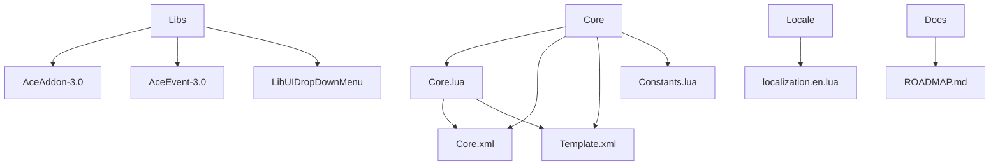
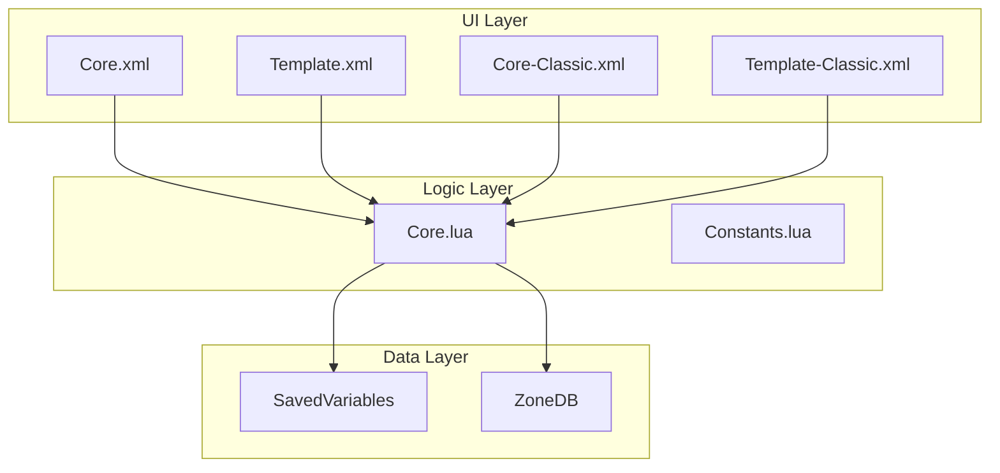
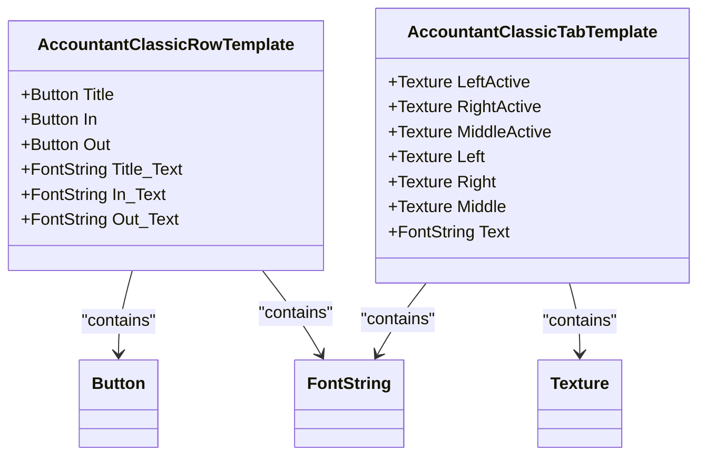
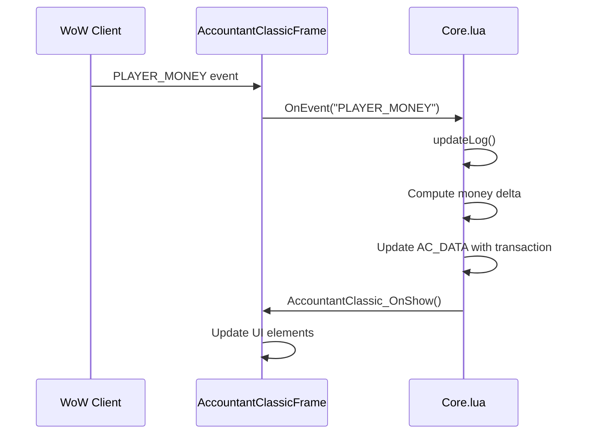

# UI Architecture and Templates

<cite>
**Referenced Files in This Document**   
- [Core.lua](file://Core/Core.lua)
- [Core.xml](file://Core/Core.xml)
- [Template.xml](file://Core/Template.xml)
- [Core-Classic.xml](file://Core/Core-Classic.xml)
- [Template-Classic.xml](file://Core/Template-Classic.xml)
</cite>

## Table of Contents
1. [Introduction](#introduction)
2. [Project Structure](#project-structure)
3. [Core Components](#core-components)
4. [Architecture Overview](#architecture-overview)
5. [Detailed Component Analysis](#detailed-component-analysis)
6. [Data Binding and Event Handling](#data-binding-and-event-handling)
7. [Responsive Design and Compatibility](#responsive-design-and-compatibility)
8. [Conclusion](#conclusion)

## Introduction
Accountant_Classic is a World of Warcraft addon designed to track player financial transactions across various time periods and character profiles. The addon employs a modular architecture that separates UI definition from business logic, using XML for declarative UI layout and Lua for dynamic behavior and data processing. This documentation explores the UI architecture, template system, and integration between XML-defined components and Lua logic, focusing on how the addon maintains compatibility across different WoW Classic versions while providing a responsive and interactive financial tracking interface.

## Project Structure
The project follows a feature-based organization with distinct directories for core functionality, libraries, localization, and documentation. The Core directory contains the primary Lua and XML files that define the addon's behavior and user interface. The Libs directory houses third-party libraries for configuration, event handling, and UI components. The structure emphasizes separation of concerns, with UI definitions isolated in XML files and logic implemented in Lua modules.



**Diagram sources**
- [Core.lua](file://Core/Core.lua)
- [Core.xml](file://Core/Core.xml)
- [Template.xml](file://Core/Template.xml)

**Section sources**
- [Core.lua](file://Core/Core.lua)
- [Core.xml](file://Core/Core.xml)
- [Template.xml](file://Core/Template.xml)

## Core Components
The core components of Accountant_Classic consist of the main financial tracking logic in Core.lua and the UI definitions in Core.xml and Template.xml. The Lua component handles event processing, data storage, and business logic, while the XML files define the visual layout, widget hierarchy, and static UI elements. This separation allows for independent development and maintenance of the UI and logic layers.

The addon uses AceAddon-3.0 as its foundation, providing lifecycle management and dependency handling. Key components include event registration for financial tracking, data persistence through SavedVariables, and UI event handling for user interactions. The Core.lua file contains the primary addon object, initialization routines, and methods for processing money changes and updating the display.

**Section sources**
- [Core.lua](file://Core/Core.lua)

## Architecture Overview
The UI architecture of Accountant_Classic follows a Model-View-Controller pattern, with XML templates defining the view, Lua logic implementing the controller, and SavedVariables serving as the model. The main financial window is constructed using Frame templates that contain ScrollFrames for tabular data display, Buttons for navigation controls, and Text elements for financial information.

The architecture leverages WoW's UI framework inheritance system, allowing templates to be reused across different contexts. The addon maintains two sets of XML files: Core.xml and Template.xml for modern WoW Classic versions, and Core-Classic.xml and Template-Classic.xml for compatibility with earlier Classic versions. This dual-template approach ensures consistent functionality while adapting to UI constraints and API differences between game versions.



**Diagram sources**
- [Core.lua](file://Core/Core.lua)
- [Core.xml](file://Core/Core.xml)
- [Template.xml](file://Core/Template.xml)
- [Core-Classic.xml](file://Core/Core-Classic.xml)
- [Template-Classic.xml](file://Core/Template-Classic.xml)

## Detailed Component Analysis

### Main Window and Frame Templates
The main financial window is defined in Core.xml and Core-Classic.xml, with slight variations to accommodate different WoW Classic versions. The AccountantClassicFrame serves as the root container, containing a title bar, close button, and multiple UI elements for displaying financial data. The frame uses a fixed size of 640x512 pixels with background textures loaded from the Images directory.

The window contains several key components:
- **ScrollFrame**: AccountantClassicScrollBar provides vertical scrolling for tabular data using FauxScrollFrameTemplate
- **Tab Buttons**: Multiple Button elements with AccountantClassicTabTemplate handle time period navigation
- **Data Display**: FontString elements show totals, headers, and financial summaries
- **Control Buttons**: Options, Reset, and Exit buttons provide user interaction

The template system allows for consistent styling across components while enabling version-specific adjustments. For example, Core-Classic.xml uses different button positioning and spacing to accommodate the Classic UI's visual style.

**Section sources**
- [Core.xml](file://Core/Core.xml)
- [Core-Classic.xml](file://Core/Core-Classic.xml)

### Row Templates and Tabular Data
The AccountantClassicRowTemplate, defined in Template.xml and Template-Classic.xml, provides the structure for displaying financial data rows. Each row contains three Button elements: Title, In, and Out, representing the transaction category, incoming money, and outgoing money respectively. These buttons contain FontString elements for text display with appropriate formatting.

The template uses a fixed height of 19 pixels and a width of 600 pixels, with specific positioning for each column:
- **Title**: 280 pixels wide, positioned at x=3
- **In**: 160 pixels wide, positioned at x=273
- **Out**: 160 pixels wide, positioned at x=434

This layout creates a clean, tabular presentation of financial data with proper alignment and spacing. The template is reused for all data rows, reducing code duplication and ensuring visual consistency.



**Diagram sources**
- [Template.xml](file://Core/Template.xml)
- [Template-Classic.xml](file://Core/Template-Classic.xml)

**Section sources**
- [Template.xml](file://Core/Template.xml)
- [Template-Classic.xml](file://Core/Template-Classic.xml)

## Data Binding and Event Handling

### XML Widget Creation and Event Attachment
The addon creates UI widgets declaratively in XML and attaches event handlers through Lua. The AccountantClassicFrame is instantiated from Core.xml, and its child elements are automatically created by the WoW UI framework. Dynamic elements like dropdown menus are created programmatically in Core.lua using LibUIDropDownMenu.

Event attachment occurs through the OnLoad script in Core.xml, which calls AccountantClassic_RegisterEvents(self) to register for relevant WoW UI events. The addon listens to events such as PLAYER_MONEY, CHAT_MSG_MONEY, and various UI events (MERCHANT_SHOW, AUCTION_HOUSE_SHOW, etc.) to determine the current financial context.



**Diagram sources**
- [Core.xml](file://Core/Core.xml)
- [Core.lua](file://Core/Core.lua)

**Section sources**
- [Core.xml](file://Core/Core.xml)
- [Core.lua](file://Core/Core.lua)

### Data Binding Pattern
The data binding pattern in Accountant_Classic connects XML-defined UI elements to Lua data structures through event-driven updates. When a user interacts with the interface, such as clicking a time period tab, the XML Button's OnClick handler invokes a Lua function that updates the current view.

The AccountantClassicTabButtonMixin, defined in Core.lua, provides the OnClick method for tab buttons:
```lua
function AccountantClassicTabButtonMixin:OnClick()
    local id = self:GetID()
    LibDD:CloseDropDownMenus()
    PanelTemplates_SetTab(AccountantClassicFrame, id)
    AC_CURRTAB = id
    PlaySound(841)
    AccountantClassic_OnShow()
end
```

This method updates the current tab index (AC_CURRTAB) and triggers a UI refresh by calling AccountantClassic_OnShow(). The AccountantClassic_OnShow() function reads from the AC_DATA structure, which contains financial totals organized by transaction type and time period, and updates the corresponding UI elements.

The binding between XML-defined buttons and Lua functions enables dynamic content switching based on user selection. For example, clicking the "Day" tab (id=2) sets AC_CURRTAB to 2 and displays daily financial data, while clicking "Week" (id=4) shows weekly totals.

**Section sources**
- [Core.lua](file://Core/Core.lua)

## Responsive Design and Compatibility

### Classic-Specific Template Compatibility
Accountant_Classic maintains compatibility with different WoW Classic versions through separate XML template files. The Core-Classic.xml and Template-Classic.xml files provide alternative UI definitions optimized for the original Classic UI constraints, while Core.xml and Template.xml support newer Classic versions with updated UI frameworks.

The compatibility system detects the current WoW version during initialization:
```lua
local wowversion = select(4, GetBuildInfo())
if wowversion < 20000 then
    WoWClassicEra = true
elseif wowversion < 30000 then 
    WoWClassicTBC = true
-- ... additional version checks
```

Based on the detected version, the addon uses appropriate UI elements and positioning. For example, Core-Classic.xml uses different button offsets and spacing to accommodate the Classic UI's visual style, while Core.xml leverages modern UI features like atlas textures.

The Template-Classic.xml file inherits from CharacterFrameTabButtonTemplate, ensuring visual consistency with the Classic UI, while Template.xml uses custom atlas textures for a more modern appearance. This approach allows the addon to maintain a native look and feel across different Classic versions.

**Section sources**
- [Core-Classic.xml](file://Core/Core-Classic.xml)
- [Template-Classic.xml](file://Core/Template-Classic.xml)
- [Core.xml](file://Core/Core.xml)
- [Template.xml](file://Core/Template.xml)

### Responsive Design Considerations
The addon implements responsive design principles to accommodate different screen resolutions and user preferences. The main window is movable and can be repositioned by the user, with its position saved in the profile settings. The frame's scale and transparency are configurable, allowing users to adjust the UI to their preferences.

The UI layout uses relative positioning and anchoring to maintain proper alignment across different resolutions. For example, the AccountantClassicFrame uses TOPLEFT anchoring with fixed offsets, while child elements are positioned relative to their parents. The ScrollFrame automatically adjusts its content based on the available space, ensuring that all data remains accessible.

The addon also handles dynamic content through the FauxScrollFrameTemplate, which manages the display of variable-length data lists. The AccountantClassicScrollBar_Update function calculates the appropriate scroll range and updates the visible rows, ensuring optimal performance even with large datasets.

**Section sources**
- [Core.lua](file://Core/Core.lua)

## Conclusion
Accountant_Classic demonstrates a well-structured approach to WoW addon development, with clear separation between UI definition and business logic. The XML-based UI framework provides a declarative way to define the interface, while Lua handles dynamic behavior and data processing. The use of templates reduces code duplication and ensures visual consistency across components.

The dual-template system for Classic compatibility showcases effective version management, allowing the addon to support multiple WoW Classic versions with minimal code duplication. The data binding pattern between XML-defined buttons and Lua functions enables responsive user interactions, while the event-driven architecture ensures accurate financial tracking.

The addon's architecture balances functionality with performance, using efficient data structures and minimizing UI updates. The responsive design considerations ensure usability across different screen resolutions and user preferences, making it a robust solution for financial tracking in World of Warcraft Classic.