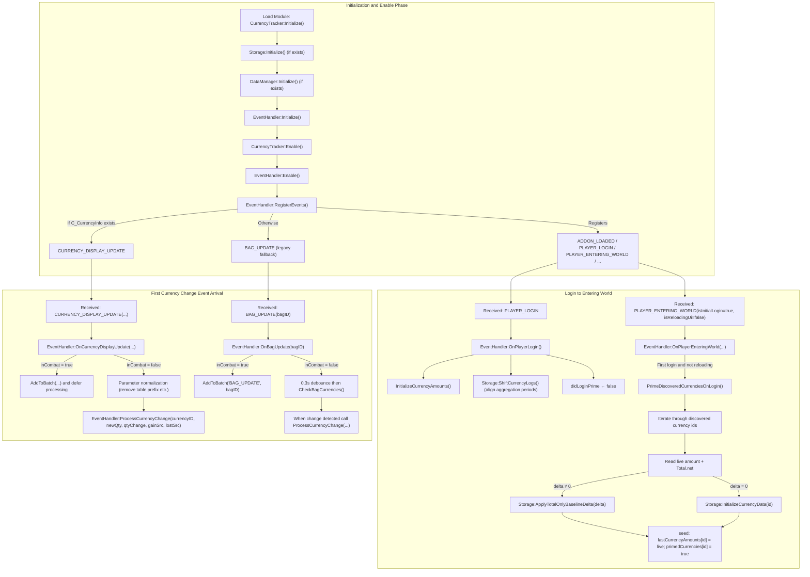
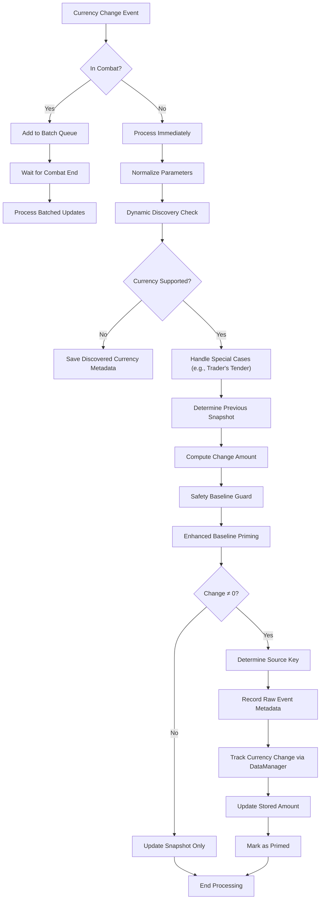
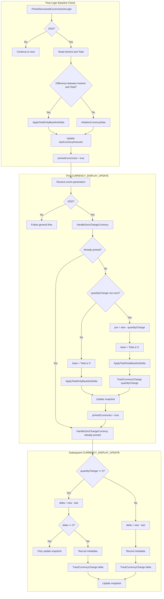
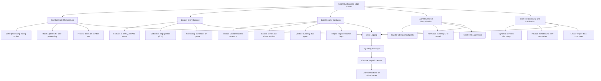
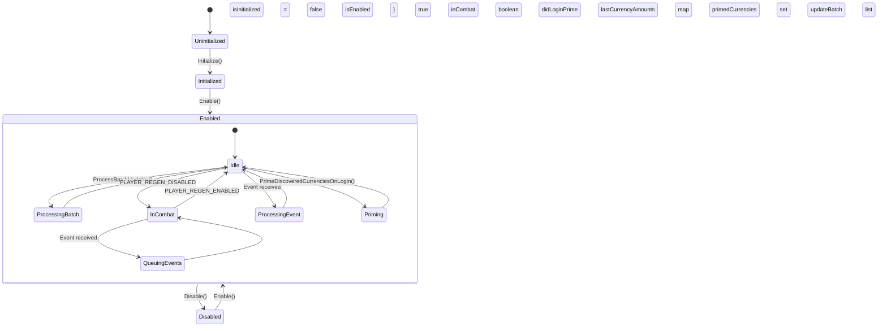
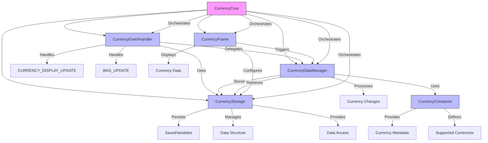

# Technical Workflows and Process Flows

<cite>
**Referenced Files in This Document**   
- [CurrencyEventHandler.lua](file://CurrencyTracker/CurrencyEventHandler.lua)
- [CurrencyStorage.lua](file://CurrencyTracker/CurrencyStorage.lua)
- [CurrencyDataManager.lua](file://CurrencyTracker/CurrencyDataManager.lua)
- [CurrencyCore.lua](file://CurrencyTracker/CurrencyCore.lua)
- [CurrencyConstants.lua](file://CurrencyTracker/CurrencyConstants.lua)
- [CurrencyFrame.lua](file://CurrencyTracker/CurrencyFrame.lua)
- [CurrencyFrame.xml](file://CurrencyTracker/CurrencyFrame.xml)
- [CharacterLogin-Process-Flow.md](file://Docs/CharacterLogin-Process-Flow.md)
- [Traders-Tender-Process-Flow.md](file://Docs/Traders-Tender-Process-Flow.md)
</cite>

## Table of Contents
1. [Introduction](#introduction)
2. [Character Login Process Flow](#character-login-process-flow)
3. [Currency Handling Workflow](#currency-handling-workflow)
4. [Trader's Tender Special Case](#traders-tender-special-case)
5. [Error Handling and Edge Cases](#error-handling-and-edge-cases)
6. [State Management](#state-management)
7. [Component Interaction](#component-interaction)
8. [Conclusion](#conclusion)

## Introduction
This document provides a comprehensive analysis of the technical workflows and process flows within the Accountant_Classic addon, focusing specifically on character login procedures and currency handling mechanisms. The documentation details the sequence of operations, state transitions, error handling procedures, and interactions between system components. The analysis is based on the provided codebase and documentation files, with emphasis on the CurrencyTracker module's functionality.

## Character Login Process Flow

The character login process in Accountant_Classic follows a well-defined sequence of initialization and enabling phases, ensuring proper setup of currency tracking functionality. The process begins with module initialization and progresses through enabling and event registration.

**Diagram sources**
- [CharacterLogin-Process-Flow.md](file://Docs/CharacterLogin-Process-Flow.md)

**Section sources**
- [CurrencyEventHandler.lua](file://CurrencyTracker/CurrencyEventHandler.lua#L100-L200)
- [CurrencyStorage.lua](file://CurrencyTracker/CurrencyStorage.lua#L500-L600)

## Currency Handling Workflow

The currency handling workflow in Accountant_Classic is designed to capture and process currency changes efficiently while maintaining data integrity. The system uses a modular approach with distinct components handling different aspects of currency tracking.

The workflow begins when a currency change event is detected, either through the modern CURRENCY_DISPLAY_UPDATE event or the legacy BAG_UPDATE event for older clients. The system first checks if the player is in combat, as processing is deferred during combat to avoid performance issues. If not in combat, the event parameters are normalized to ensure consistent data format.

The system then performs dynamic discovery to identify new currencies that the player has encountered. If a currency is not previously supported, its metadata is saved for future reference. Special handling is applied to certain currencies like Trader's Tender (ID 2032) which have unreliable change values in the API.

The core processing involves determining the previous snapshot of the currency amount, computing the change amount, and applying safety checks to maintain data integrity. If a significant change is detected, the system records the transaction details including the source of the change, updates the stored amounts across various time periods (Session, Day, Week, etc.), and marks the currency as "primed" to indicate it has been properly initialized.

**Diagram sources**
- [CurrencyEventHandler.lua](file://CurrencyTracker/CurrencyEventHandler.lua#L500-L800)

**Section sources**
- [CurrencyEventHandler.lua](file://CurrencyTracker/CurrencyEventHandler.lua#L400-L900)
- [CurrencyDataManager.lua](file://CurrencyTracker/CurrencyDataManager.lua#L100-L200)

## Trader's Tender Special Case

The Trader's Tender currency (ID 2032) requires special handling due to its unreliable API reporting. The system implements a dedicated handler that accounts for the currency's unique behavior, particularly its tendency to report zero changes even when the actual amount has changed.

**Diagram sources**
- [Traders-Tender-Process-Flow.md](file://Docs/Traders-Tender-Process-Flow.md)

**Section sources**
- [CurrencyEventHandler.lua](file://CurrencyTracker/CurrencyEventHandler.lua#L200-L400)

## Error Handling and Edge Cases

The system implements comprehensive error handling to manage various edge cases and potential failure points. This includes combat state management, legacy client support, and data integrity validation.

The error handling system is designed to be robust and resilient, ensuring that the addon continues to function correctly even in challenging circumstances. Combat state management prevents performance issues by deferring non-essential processing during combat, using a batching system to collect updates and process them when the player exits combat.

For legacy client support, the system provides a fallback mechanism using BAG_UPDATE events when the modern CURRENCY_DISPLAY_UPDATE API is not available. This ensures compatibility across different WoW client versions. The legacy path includes debouncing to coalesce rapid bag updates and prevent excessive processing.

Data integrity validation is performed at multiple levels, from ensuring the SavedVariables structure exists to validating the types and contents of currency data. The system includes repair functions to handle corrupted data, such as negative source keys, and maintains detailed logging for debugging purposes.

Event parameter normalization handles various edge cases in the event data, such as the occasional table payload prefix in CURRENCY_DISPLAY_UPDATE events. The system also manages currency discovery and initialization, ensuring that newly encountered currencies are properly tracked and their metadata is preserved.

**Section sources**
- [CurrencyEventHandler.lua](file://CurrencyTracker/CurrencyEventHandler.lua#L800-L900)
- [CurrencyStorage.lua](file://CurrencyTracker/CurrencyStorage.lua#L1000-L1200)

## State Management

The system maintains several state variables to track the current status of currency tracking and processing. These states ensure proper initialization, prevent duplicate processing, and maintain data consistency across sessions.

The state management system follows a clear progression from uninitialized to initialized to enabled states. The uninitialized state represents the addon's condition before any setup has occurred. During initialization, the system creates necessary data structures and prepares the event handling framework.

Once initialized, the system can be enabled, which registers for relevant events and begins monitoring for currency changes. The enabled state contains several sub-states that reflect the current processing context, including idle, processing batch, in combat, and priming states.

Key state variables include:
- `isInitialized`: Indicates whether the core modules have been initialized
- `isEnabled`: Indicates whether event processing is active
- `inCombat`: Tracks whether the player is currently in combat
- `didLoginPrime`: Prevents duplicate baseline priming during login
- `lastCurrencyAmounts`: Maintains the most recent known amount for each currency
- `primedCurrencies`: Tracks which currencies have been properly initialized
- `updateBatch`: Stores events that need to be processed after combat

This state management approach ensures that the system behaves predictably and consistently, preventing race conditions and duplicate processing that could compromise data integrity.

**Section sources**
- [CurrencyEventHandler.lua](file://CurrencyTracker/CurrencyEventHandler.lua#L50-L100)
- [CurrencyCore.lua](file://CurrencyTracker/CurrencyCore.lua#L50-L100)

## Component Interaction

The Accountant_Classic addon is structured as a modular system with clear separation of concerns between components. Each component has a specific responsibility and interacts with others through well-defined interfaces.

The component interaction follows a clear hierarchy with CurrencyCore serving as the orchestrator that manages the lifecycle of other components. CurrencyEventHandler acts as the event processor, receiving currency change notifications from the game and coordinating their processing.

CurrencyDataManager serves as the business logic layer, containing the core algorithms for processing currency changes and determining how they should be recorded. It interacts with CurrencyStorage, which is responsible for persistent data storage and retrieval, ensuring that currency tracking data survives between game sessions.

CurrencyFrame provides the user interface component, displaying currency data to the player and allowing configuration of tracking options. It interacts with the DataManager to retrieve data for display and with Storage to save user preferences.

CurrencyConstants provides static data and configuration, defining the supported currencies, their metadata, and various system constants. This separation allows for easy updates to currency information without modifying the core logic.

The interaction between components is designed to be loosely coupled, with each component having a single responsibility. This modular design makes the system easier to maintain, test, and extend. The clear interfaces between components also facilitate debugging and troubleshooting, as issues can be isolated to specific components.

**Section sources**
- [CurrencyCore.lua](file://CurrencyTracker/CurrencyCore.lua#L100-L300)
- [CurrencyDataManager.lua](file://CurrencyTracker/CurrencyDataManager.lua#L1-L50)

## Conclusion

The Accountant_Classic addon implements a sophisticated system for tracking currency changes in World of Warcraft. The technical workflows and process flows are carefully designed to handle the complexities of currency tracking while maintaining performance and data integrity.

The character login process ensures proper initialization of currency tracking, with a phased approach that separates module initialization from enabling and event registration. This allows for a clean setup sequence that prevents race conditions and ensures all components are ready before processing begins.

The currency handling workflow is robust and comprehensive, accounting for various edge cases and special scenarios. The system's ability to handle both modern and legacy clients ensures broad compatibility, while the special handling for currencies like Trader's Tender demonstrates attention to detail in addressing specific gameplay mechanics.

Error handling and state management are implemented thoroughly, with mechanisms to handle combat states, validate data integrity, and manage the various states of the tracking system. The modular component architecture promotes maintainability and extensibility, with clear separation of concerns between the different parts of the system.

Overall, the Accountant_Classic addon provides a reliable and feature-rich solution for tracking currency changes, with well-documented workflows and processes that ensure accurate and consistent data collection across different gameplay scenarios.