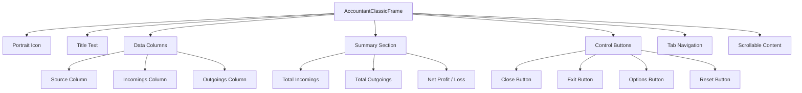

# User Guide

<cite>
**Referenced Files in This Document**   
- [Core.lua](file://Core\Core.lua) - *Updated in recent commit*
- [CurrencyFrame.xml](file://CurrencyTracker\CurrencyFrame.xml) - *Added in recent commit*
- [CurrencyFrame.lua](file://CurrencyTracker\CurrencyFrame.lua) - *Added in recent commit*
- [localization.en.lua](file://Locale/localization.en.lua#L1-L148)
- [Bindings.xml](file://Bindings.xml)
</cite>

## Update Summary
**Changes Made**   
- Added new section for Currency Tracker UI and functionality
- Updated Main Window Layout to reflect new currency tracking features
- Added documentation for new slash commands and UI elements
- Enhanced Tabbed Navigation System to include currency timeframe tabs
- Added section for near-cap warning system
- Updated document sources to include new currency tracking files

## Table of Contents
1. [Introduction](#introduction)
2. [Main Window Layout](#main-window-layout)
3. [Tabbed Navigation System](#tabbed-navigation-system)
4. [Transaction Summary and Data Tables](#transaction-summary-and-data-tables)
5. [Dropdown Selectors](#dropdown-selectors)
6. [Minimap Button Functionality](#minimap-button-functionality)
7. [Common User Workflows](#common-user-workflows)
8. [Window Access Methods](#window-access-methods)
9. [Zone-Based Breakdowns](#zone-based-breakdowns)
10. [Accessibility Considerations](#accessibility-considerations)
11. [Currency Tracker Interface](#currency-tracker-interface)
12. [Near-Cap Warning System](#near-cap-warning-system)

## Introduction
Accountant_Classic is a World of Warcraft addon designed to track financial transactions across multiple time periods and categories. The interface provides comprehensive money tracking for income and expenses, with support for session-based, daily, weekly, monthly, and character-wide financial analysis. This guide explains how to interact with the Accountant_Classic interface, covering all major UI elements, navigation methods, and functionality.

**Section sources**
- [localization.en.lua](file://Locale/localization.en.lua#L1-L148)

## Main Window Layout
The Accountant_Classic main window features a structured layout with distinct sections for navigation, data display, and controls. The window is anchored to the screen with default positioning at TOPLEFT with an offset of (0, -104) pixels from the UIParent frame.

The interface includes:
- **Portrait Icon**: Located at the top-left corner (60x60 pixels)
- **Title Text**: "Accountant Classic" displayed prominently at the top center
- **Data Columns**: Three primary columns labeled "Source", "Incomings", and "Outgoings" (or context-specific variations)
- **Summary Section**: Displays "Total Incomings", "Total Outgoings", and "Net Profit / Loss" with corresponding values
- **Control Buttons**: Close, Exit, Options, and Reset buttons positioned at the bottom
- **Tab Navigation**: Multiple tabs for different time periods and views
- **Scrollable Content Area**: Contains transaction data rows with up to 18 entries visible

The window is movable and clamped to the screen, allowing users to reposition it according to their preferences. It's registered with UISpecialFrames to ensure proper handling during UI interactions.

**Diagram sources**
- [Core.xml](file://Core/Core.xml#L5-L627)
- [Template.xml](file://Core/Template.xml#L)

## Tabbed Navigation System
The Accountant_Classic interface uses a tabbed navigation system to switch between different time periods and financial views. The tabs are organized in a two-row layout to accommodate all available timeframes:

**First Row (Primary Timeframes):**
- Session
- Today
- Week
- Month
- Year
- Total

**Second Row (Previous Periods):**
- Previous Day
- Previous Week
- Previous Month
- Previous Year

Each tab corresponds to a specific timeframe for financial analysis. When a tab is selected, the data displayed in the main window updates to reflect transactions within that timeframe. The tab system follows the standard WoW UI template for consistent appearance and behavior.

The currency tracking interface extends this system with identical timeframe tabs, allowing users to view currency data across the same periods. This provides a consistent user experience between gold and currency tracking functionalities.

**Section sources**
- [CurrencyFrame.xml](file://CurrencyTracker\CurrencyFrame.xml#L300-L350)
- [CurrencyFrame.lua](file://CurrencyTracker\CurrencyFrame.lua#L150-L200)

## Transaction Summary and Data Tables
The transaction summary and data tables display financial information in a structured format. The main table consists of three columns: Source, Incomings, and Outgoings. Each row represents a specific transaction category or source.

For currency tracking, the data table has been enhanced with additional columns:
- **Currency Icon**: Visual representation of the currency
- **Currency Name**: Name of the tracked currency
- **Cap**: Maximum possible amount (TotalMax) for the currency
- **Income**: Amount gained during the selected timeframe
- **Outgoing**: Amount spent during the selected timeframe
- **Net**: Net change (Income - Outgoing)

The summary section at the top of the table displays aggregated values for the selected timeframe, including total income, total outgoing, and net profit/loss. For currency tracking, this summary also includes the current amount and maximum cap when applicable.

Data is presented with right-aligned numeric values for easy reading, and large numbers are formatted with thousands separators according to the user's locale settings.

## Dropdown Selectors
The interface includes dropdown selectors for switching between different servers, factions, characters, and currencies. These selectors are positioned in the top-right area of the window.

**Available Dropdowns:**
- **Server Dropdown**: Lists all servers with tracked data, plus an "All Servers" option
- **Faction Dropdown**: Filters by Alliance, Horde, or "All Factions"
- **Character Dropdown**: Shows characters from the selected server and faction
- **Currency Dropdown**: Available in the currency tracker, lists all discovered currencies plus "All Currencies"

When a selection is made, the displayed data updates to reflect the chosen context. The dropdowns maintain their state between sessions, with selections persisted in the addon's saved variables.

The currency dropdown specifically allows users to filter between all tracked currencies or focus on a single currency for detailed analysis. This enables both broad overviews and focused examination of specific currency types.

**Section sources**
- [CurrencyFrame.xml](file://CurrencyTracker\CurrencyFrame.xml#L100-L150)
- [CurrencyFrame.lua](file://CurrencyTracker\CurrencyFrame.lua#L500-L600)

## Minimap Button Functionality
The minimap button provides quick access to the Accountant_Classic interface. The button can be toggled on or off in the addon's options menu.

**Tooltip Display Options:**
- **Current Gold**: Shows the character's current gold amount
- **Session Change**: Displays gold gained or lost during the current session
- **Daily Change**: Shows gold change for the current day
- **Weekly Change**: Displays gold change for the current week
- **Custom Format**: Allows users to configure which information to display

Clicking the minimap button opens the main window. Right-clicking the button typically opens the addon's options menu. The button's position around the minimap can be adjusted by holding down the Alt key and dragging it to the desired location.

The minimap button uses LibDBIcon-1.0 for integration with other addons that manage minimap icons, ensuring compatibility with various UI configurations.

## Common User Workflows
### Viewing Daily Repair Costs
To view daily repair costs:
1. Open the Accountant_Classic window
2. Select the "Today" tab
3. Look for entries containing "Repair" in the Source column
4. The Outgoings column shows the total repair costs for the day

### Comparing Quest Income Across Characters
To compare quest income across characters:
1. Open the Accountant_Classic window
2. Switch to the "All Character" tab
3. Use the Server and Faction dropdowns to filter characters
4. Sort by the Money column to see which characters have the highest earnings
5. Click on individual characters to view their detailed income breakdown

### Analyzing Weekly Auction House Profits
To analyze weekly auction house profits:
1. Open the Accountant_Classic window
2. Select the "Week" tab
3. Look for entries with "Auction" in the Source column
4. Calculate net profit by subtracting auction house fees (outgoings) from sales (incomings)

### Currency Tracking Workflows
For currency tracking:
1. Use the `/ct ui` command or click the currency tab to open the Currency Tracker
2. Select a timeframe using the tab system
3. Choose a specific currency from the dropdown or view "All Currencies"
4. Examine income, outgoing, and net values for the selected period
5. Click the tracking checkbox to toggle whether a currency is actively tracked

## Window Access Methods
The Accountant_Classic main window can be accessed through multiple methods:

**Click Methods:**
- Click the minimap button
- Click the LDB (LibDataBroker) feed in compatible addons
- Click the Titan Panel button (if Titan Panel is installed)

**Key Binding:**
- The addon supports key bindings configured through the WoW interface options
- Navigate to Key Bindings → Addons → Accountant_Classic
- Assign a key combination to "Toggle Main Window"
- Press the assigned keys to open or close the window

**Slash Commands:**
- `/accountant` or `/acct` - Toggles the main window
- `/ct ui` - Opens the Currency Tracker interface
- `/ct show <timeframe> [currencyid]` - Displays currency data in chat

The window remembers its position and size between sessions, maintaining user preferences for interface layout.

## Zone-Based Breakdowns
Zone-based financial breakdowns are available through the addon's zone tracking feature. This functionality records transactions based on the player's current zone and subzone.

**Accessing Zone Breakdowns:**
1. Ensure zone tracking is enabled in the addon options
2. Open the Accountant_Classic window
3. Navigate to the desired timeframe tab
4. Look for zone-specific entries in the transaction list

The data is organized hierarchically:
- **Zone Level**: Major geographical areas (e.g., "Elwynn Forest")
- **Subzone Level**: Specific locations within zones (e.g., "Goldshire")

This breakdown helps users identify which areas of the game world are most profitable for their activities, whether through questing, gathering, or other income sources.

## Accessibility Considerations
The Accountant_Classic interface incorporates several accessibility features within the WoW UI framework:

**Visual Accessibility:**
- High-contrast text and background colors
- Clear font sizes that can be adjusted through UI scaling
- Distinct visual separation between data columns
- Intuitive iconography for quick recognition

**Navigation Accessibility:**
- Keyboard navigation support for all interface elements
- Logical tab order for form controls
- Screen reader compatibility through standard WoW UI elements

**Cognitive Accessibility:**
- Consistent layout and navigation patterns
- Clear labeling of all interface elements
- Intuitive organization of financial data
- Tooltips that explain complex financial terms

**Customization Options:**
- Adjustable UI scale and transparency
- Configurable data display formats
- Option to show or hide specific transaction types
- Customizable minimap button tooltip content

These features ensure that the addon is usable by players with various accessibility needs while maintaining the core functionality of financial tracking.

## Currency Tracker Interface
The Currency Tracker provides a dedicated interface for monitoring non-gold currencies in World of Warcraft. This interface follows the same design principles as the gold tracker for consistency.

**Interface Features:**
- **Dual-Row Tab System**: Matches the gold tracker with identical timeframe options
- **Currency Selection Dropdown**: Allows filtering between all currencies or specific ones
- **Tracking Checkboxes**: Enable or disable tracking for individual currencies
- **Cap Column**: Displays the maximum possible amount for each currency
- **Persistent State**: Remembers last selected timeframe, server, character, and currency

**Data Display:**
- In "All Currencies" mode, shows a summary of all tracked currencies
- In single currency mode, displays detailed breakdown by source
- Income and outgoing amounts are right-aligned for easy reading
- Numeric values are formatted with thousands separators

**Slash Commands:**
- `/ct show <timeframe> [currencyid]` - Show detailed data for a currency
- `/ct show-all-currencies <timeframe>` - Show summary across all currencies
- `/ct meta show <timeframe> <currencyid>` - Show raw metadata for research
- `/ct debug [on|off]` - Toggle debug mode for event logging
- `/ct status` - Show internal status information
- `/ct discover [list|track|clear]` - Manage discovered currencies
- `/ct repair [init|adjust|remove]` - Repair tools for data correction

The interface is accessible via the `/ct ui` command and provides a comprehensive view of currency holdings and transactions.

**Section sources**
- [CurrencyFrame.xml](file://CurrencyTracker\CurrencyFrame.xml)
- [CurrencyFrame.lua](file://CurrencyTracker\CurrencyFrame.lua)
- [Docs/CurrencyTracker-UI-Design.md](file://Docs/CurrencyTracker-UI-Design.md)

## Near-Cap Warning System
The near-cap warning system alerts players when their currency holdings approach the maximum limit. This feature is configurable on a per-character basis.

**Configuration Options:**
- **Threshold Percentage**: Set the percentage of the cap that triggers the warning (default: 90%)
- **Warning Duration**: Configure how long the warning remains visible (default: 30 seconds)
- **Warning Type**: Choose between chat message, UI alert, or both

**Slash Command Configuration:**
- `/ct warn threshold <percentage>` - Set the threshold percentage
- `/ct warn duration <seconds>` - Set the warning duration
- `/ct warn enable` - Enable the warning system
- `/ct warn disable` - Disable the warning system

The system monitors all tracked currencies and provides timely alerts to prevent players from wasting currency that cannot be collected due to reaching the cap. Warnings include the currency name, current amount, maximum cap, and percentage of completion.

**Section sources**
- [Core.lua](file://Core\Core.lua#L1000-L1100)
- [CurrencyCore.lua](file://CurrencyTracker\CurrencyCore.lua#L500-L600)
- [CurrencyEventHandler.lua](file://CurrencyTracker\CurrencyEventHandler.lua#L200-L300)