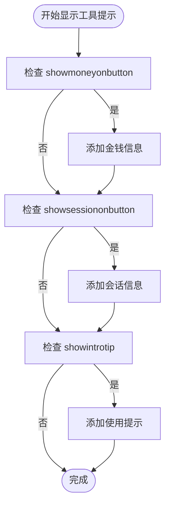

# LibDBIcon-1.0图标接口

<cite>
**本文档中引用的文件**   
- [Libs\LibDBIcon-1.0\LibDBIcon-1.0.lua](file://Libs\LibDBIcon-1.0\LibDBIcon-1.0.lua)
- [Core\Core.lua](file://Core\Core.lua)
- [Core\Config.lua](file://Core\Config.lua)
</cite>

## 目录
1. [简介](#简介)
2. [注册与核心参数](#注册与核心参数)
3. [按钮交互行为](#按钮交互行为)
4. [工具提示实现](#工具提示实现)
5. [可见性与命令控制](#可见性与命令控制)
6. [最佳实践](#最佳实践)

## 简介

LibDBIcon-1.0 是一个轻量级的库，允许插件通过LibDataBroker (LDB) 数据对象在小地图上创建图标。Accountant Classic 使用此库来注册和管理其小地图按钮，为用户提供快速访问主界面和配置选项的入口。

**Section sources**
- [Libs\LibDBIcon-1.0\LibDBIcon-1.0.lua](file://Libs\LibDBIcon-1.0\LibDBIcon-1.0.lua#L0-L572)

## 注册与核心参数

Accountant Classic 通过调用 `LibDBIcon-1.0:Register()` 方法来创建其小地图按钮。该方法接受三个核心参数：

1.  **插件名称 (name)**: 一个唯一的字符串标识符，用于区分不同的图标。在 Accountant Classic 中，此名称由 `private.addon_name` 变量提供。
2.  **LDB对象引用 (object)**: 一个指向 LibDataBroker 数据对象的引用，该对象定义了图标的图标、点击和悬停行为。Accountant Classic 在 `Core.lua` 中创建了一个名为 `LDB` 的数据对象。
3.  **配置文件数据库 (db)**: 一个指向 AceDB-3.0 配置文件数据库的引用，用于持久化存储按钮的位置、可见性和锁定状态等设置。Accountant Classic 使用 `profile.minimap` 作为此参数。

注册过程在 `Core.lua` 的 `OnInitialize` 方法中完成，代码如下：
```lua
ACbutton:Register(private.addon_name, LDB, profile.minimap);
```

如果尝试注册一个已存在的名称，`Register` 方法会抛出错误。

**Section sources**
- [Libs\LibDBIcon-1.0\LibDBIcon-1.0.lua](file://Libs\LibDBIcon-1.0\LibDBIcon-1.0.lua#L357-L365)
- [Core\Core.lua](file://Core\Core.lua#L2166-L2179)

## 按钮交互行为

注册成功后，小地图按钮支持以下交互行为：

*   **左键点击**: 触发主界面显示。此行为由 LDB 对象的 `OnClick` 回调函数定义，调用 `AccountantClassic_ButtonOnClick()` 函数来切换 `AccountantClassicFrame` 的可见性。
*   **右键点击**: 打开配置选项。`OnClick` 回调函数检查点击按钮，如果是右键，则调用 `addon:OpenOptions()` 来打开插件的设置界面。
*   **拖拽移动**: 允许用户移动按钮位置，但前提是按钮处于解锁状态。拖拽操作通过以下机制实现：
    *   当用户按住左键并拖动时，触发 `onDragStart` 事件，此时会启用一个 `OnUpdate` 脚本。
    *   `OnUpdate` 脚本在每一帧计算鼠标相对于小地图中心的位置，并将该角度转换为一个0-360度的数值，然后更新按钮的 `minimapPos` 值并重新定位按钮。
    *   当用户释放鼠标时，触发 `onDragStop` 事件，停止 `OnUpdate` 脚本，并将最终位置保存到数据库中。

**Section sources**
- [Libs\LibDBIcon-1.0\LibDBIcon-1.0.lua](file://Libs\LibDBIcon-1.0\LibDBIcon-1.0.lua#L193-L243)
- [Libs\LibDBIcon-1.0\LibDBIcon-1.0.lua](file://Libs\LibDBIcon-1.0\LibDBIcon-1.0.lua#L271-L313)
- [Core\Core.lua](file://Core\Core.lua#L2166-L2179)

## 工具提示实现

工具提示的内容由 LDB 对象的 `OnTooltipShow` 回调函数动态生成。其实现逻辑如下：

1.  **标题**: 始终显示插件名称 "Accountant Classic"。
2.  **金钱显示**: 如果配置文件中的 `showmoneyonbutton` 为 `true`，则在标题后追加当前拥有的金钱总额。
3.  **会话信息**: 如果配置文件中的 `showsessiononbutton` 为 `true`，则调用 `addon:ShowSessionToolTip()` 函数来显示本会话的收支信息。
4.  **使用提示**: 如果配置文件中的 `showintrotip` 为 `true`，则显示一段使用说明，告知用户左键点击、右键点击和拖拽操作的功能。



**Diagram sources**
- [Core\Core.lua](file://Core\Core.lua#L2179-L2195)

## 可见性与命令控制

*   **minimap.hide 配置项**: 此配置项直接控制按钮的可见性。当 `minimap.hide` 为 `true` 时，按钮被隐藏；为 `false` 时，按钮显示。该值在 `createButton` 函数中被读取，并在 `PLAYER_LOGIN` 事件后根据此值调用 `button:Show()` 或 `button:Hide()`。
*   **/accountantbutton 命令**: 此聊天命令通过调用 `AccountantClassic_ButtonToggle()` 函数来切换 `minimap.hide` 的布尔值，从而实现对按钮可见性的开关控制。该命令在 `OnInitialize` 方法中通过 `self:RegisterChatCommand("accountantbutton", AccountantClassic_ButtonToggle)` 进行注册。

**Section sources**
- [Libs\LibDBIcon-1.0\LibDBIcon-1.0.lua](file://Libs\LibDBIcon-1.0\LibDBIcon-1.0.lua#L308-L362)
- [Core\Core.lua](file://Core\Core.lua#L2179-L2180)
- [Core\Core.lua](file://Core\Core.lua#L2210-L2215)

## 最佳实践

*   **图标位置持久化**: 按钮的精确位置（`minimapPos`）会自动保存到 AceDB 配置文件中，并在下次登录时恢复，确保用户自定义的位置不会丢失。
*   **锁定状态管理**: 用户可以通过配置界面的“锁定”选项来锁定按钮。锁定后，`db.lock` 被设为 `true`，`OnDragStart` 和 `OnDragStop` 事件处理器会被移除，从而禁用拖拽功能。解锁时，这些处理器会被重新绑定。
*   **与其他地图图标插件冲突处理**: LibDBIcon-1.0 通过使用唯一的 `name` 参数来避免命名冲突。此外，它利用 `AddonCompartmentFrame`（插件收纳框）作为备用显示位置，当用户的小地图图标过多时，Accountant Classic 的按钮可以被收纳到收纳框中，避免图标重叠。

**Section sources**
- [Libs\LibDBIcon-1.0\LibDBIcon-1.0.lua](file://Libs\LibDBIcon-1.0\LibDBIcon-1.0.lua#L357-L409)
- [Libs\LibDBIcon-1.0\LibDBIcon-1.0.lua](file://Libs\LibDBIcon-1.0\LibDBIcon-1.0.lua#L457-L509)
- [Core\Config.lua](file://Core\Config.lua#L221-L264)