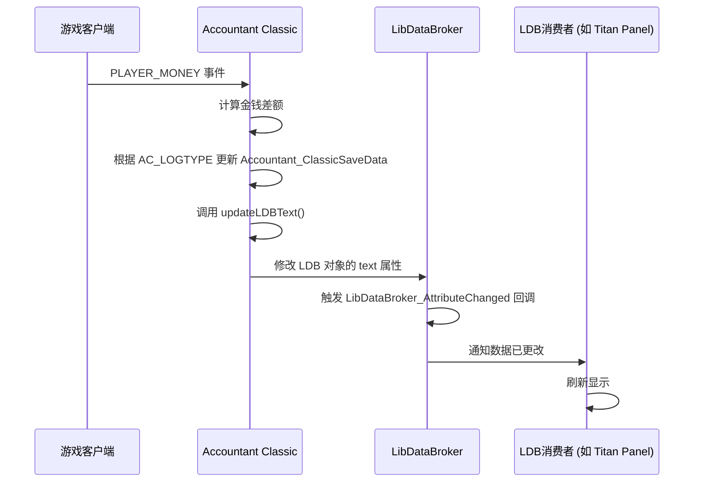

# LibDataBroker数据代理接口

<cite>
**本文档引用的文件**  
- [Core.lua](file://Core/Core.lua)
- [Config.lua](file://Core/Config.lua)
- [LibDataBroker-1.1.lua](file://Libs/LibDataBroker-1.1/LibDataBroker-1.1.lua)
- [LibDBIcon-1.0.lua](file://Libs/LibDBIcon-1.0/LibDBIcon-1.0.lua)
</cite>

## 目录
1. [简介](#简介)
2. [LDB对象字段定义](#ldb对象字段定义)
3. [数据动态更新机制](#数据动态更新机制)
4. [OnTooltipShow回调函数实现](#ontooltipshow回调函数实现)
5. [数据刷新与事件驱动机制](#数据刷新与事件驱动机制)
6. [与其他LDB消费者插件的兼容性](#与其他ldb消费者插件的兼容性)
7. [其他插件安全访问Accountant Classic LDB数据的编程示例](#其他插件安全访问accountant-classic-ldb数据的编程示例)

## 简介
Accountant Classic是一款轻量级的《魔兽世界》插件，用于跟踪角色在多个时间段（会话、今日、本周、本月、本年、总计）内的金币收支情况。该插件通过LibDataBroker-1.1（LDB）接口将其数据暴露给LDB显示面板，允许用户在迷你地图按钮或数据文本显示中查看关键财务信息。本文档详细说明了Accountant Classic如何通过LDB接口集成，并文档化了LDB对象的各个字段及其动态更新机制。

**本节来源**
- [README.md](file://README.md#L0-L119)

## LDB对象字段定义
Accountant Classic通过LibDataBroker-1.1创建一个数据对象，该对象包含`name`、`type`、`text`、`label`和`icon`等关键字段，用于在LDB消费者（如显示插件或迷你地图图标）中呈现信息。

- **name**: 数据对象的唯一标识符，设置为`Accountant_Classic`。
- **type**: 对象类型，固定为`data source`，表明这是一个数据源。
- **text**: 显示在LDB面板上的主要文本，格式化显示当前金币总额。其内容根据用户在配置中的选择，可以是“总计”、“本会话”、“今日”、“本周”或“本月”的金币数量。
- **label**: 提供上下文标签的文本，通常显示为“Accountant:”，为`text`字段提供清晰的上下文。
- **icon**: 引用一个自定义图标，使用插件自带的纹理路径，如`Interface\\AddOns\\Accountant_Classic\\Images\\AccountantClassicButton-Up.blp`。

这些字段在`Core.lua`中通过`LibDataBroker:NewDataObject`方法初始化，并在插件加载时注册。

**本节来源**
- [Core.lua](file://Core/Core.lua#L23-L35)
- [LibDataBroker-1.1.lua](file://Libs/LibDataBroker-1.1/LibDataBroker-1.1.lua#L29-L72)

## 数据动态更新机制
LDB对象的`text`、`label`和`icon`字段是动态更新的，以反映最新的财务数据和用户配置。

- **text字段更新**: `text`字段的更新由`updateLDBText()`函数驱动。该函数根据用户在配置中选择的`ldbDisplayType`（LDB显示类型），计算并格式化相应的金币总额。例如，如果用户选择显示“总计”，则`text`将显示`AccountantClassic_Profile["options"].totalcash`的值，并使用`GetCoinTextureString`等函数将其格式化为带有金币、银币、铜币图标的字符串。
- **label字段更新**: `label`字段相对静态，通常保持为“Accountant:”，但其更新机制与`text`相同，通过监听配置更改或数据更新事件来触发。
- **icon字段更新**: `icon`字段在插件配置中可以更改，但通常保持不变。当用户更改图标设置时，会通过LDB的回调机制通知所有消费者更新其显示。

所有字段的更新都是通过修改LDB数据对象的属性来触发的，这会自动调用`lib.domt.__newindex`元方法，进而触发`LibDataBroker_AttributeChanged`系列回调，通知所有LDB消费者进行刷新。

```mermaid
flowchart TD
A[用户操作或事件] --> B{触发更新}
B --> C[调用 updateLDBText()]
C --> D[获取当前金币数据]
D --> E[根据 ldbDisplayType 选择数据]
E --> F[格式化为带图标的字符串]
F --> G[更新 LDB 对象的 text 属性]
G --> H[触发 LibDataBroker 回调]
H --> I[LDB 消费者刷新显示]
```

**图表来源**
- [Core.lua](file://Core/Core.lua#L1500-L1599)
- [LibDataBroker-1.1.lua](file://Libs/LibDataBroker-1.1/LibDataBroker-1.1.lua#L50-L55)

## OnTooltipShow回调函数实现
`OnTooltipShow`回调函数负责在用户将鼠标悬停在LDB显示或迷你地图按钮上时，显示一个包含多行信息的工具提示。

该函数的实现位于`Core.lua`中，其主要逻辑如下：
1. 函数接收一个`GameTooltip`对象作为参数。
2. 首先，它会根据配置决定是否显示基础信息（如当前金币）和会话统计信息。
3. 然后，它使用`tooltip:AddLine()`方法逐行添加信息：
   - 第一行：显示“Accountant Classic”作为标题。
   - 第二行：显示当前金币总额，使用`GetCoinTextureString`进行格式化。
   - 后续行：如果启用了会话信息显示，则会添加“本会话收入”、“本会话支出”和“本会话净收益”等统计信息。
4. 最后，调用`tooltip:Show()`来呈现工具提示。

此回调确保了用户可以通过简单的悬停操作，快速访问比LDB面板上更详细的财务摘要。

**本节来源**
- [Core.lua](file://Core/Core.lua#L1500-L1599)
- [LibDBIcon-1.0.lua](file://Libs/LibDBIcon-1.0/LibDBIcon-1.0.lua#L56-L115)

## 数据刷新与事件驱动机制
Accountant Classic的数据刷新是事件驱动的，确保了数据的实时性和高效性。

- **事件监听**: 插件通过`AceEvent-3.0`注册监听一系列游戏事件，如`PLAYER_MONEY`（玩家金钱变化）、`MERCHANT_SHOW`（商人界面打开）、`QUEST_COMPLETE`（任务完成）等。这些事件帮助插件确定当前的交易类型（如修理、任务奖励等）。
- **数据更新**: 当`PLAYER_MONEY`事件触发时，插件会计算当前金钱与上一次记录的差额，并根据当前的`AC_LOGTYPE`（日志类型）将差额归类为收入或支出，然后更新`Accountant_ClassicSaveData`中的相应数据。
- **LDB刷新**: 在更新了核心数据后，插件会调用`updateLDBText()`函数，该函数会更新LDB数据对象的`text`等字段。由于LDB使用了元表（metatable）和回调处理器（CallbackHandler-1.0），对数据对象属性的任何修改都会自动触发`LibDataBroker_AttributeChanged`回调，通知所有LDB消费者（如Display, Titan Panel等）刷新其UI。

这种机制避免了轮询，仅在数据实际发生变化时才进行更新，从而保证了性能。



**图表来源**
- [Core.lua](file://Core/Core.lua#L1500-L1599)
- [LibDataBroker-1.1.lua](file://Libs/LibDataBroker-1.1/LibDataBroker-1.1.lua#L50-L55)

## 与其他LDB消费者插件的兼容性
Accountant Classic通过标准的LibDataBroker-1.1接口提供数据，确保了与绝大多数LDB消费者插件的兼容性。

- **标准接口**: 使用`LibStub`加载`LibDataBroker-1.1`，并遵循其`NewDataObject`的规范创建数据源，这使得任何遵循LDB协议的消费者都能正确识别和使用该数据源。
- **图标支持**: 通过`LibDBIcon-1.0`库，插件可以轻松地在迷你地图上创建一个可拖动的图标，该图标同样使用LDB数据对象，并支持`OnTooltipShow`等回调，保证了在不同显示环境下的行为一致性。
- **配置灵活性**: 用户可以在插件的配置界面中选择在LDB上显示哪种类型的数据（总计、会话、今日等），这使得数据源的行为可以适应不同用户的偏好，而不会影响消费者插件的正常工作。

这种设计使得Accountant Classic可以无缝集成到用户的UI中，无论是作为数据文本、迷你地图图标还是其他LDB支持的显示形式。

**本节来源**
- [Core.lua](file://Core/Core.lua#L23-L35)
- [LibDBIcon-1.0.lua](file://Libs/LibDBIcon-1.0/LibDBIcon-1.0.lua#L0-L31)

## 其他插件安全访问Accountant Classic LDB数据的编程示例
其他插件可以通过LibDataBroker API安全地访问Accountant Classic提供的数据，而无需直接读取其内部变量。

```lua
-- 示例：另一个插件如何获取Accountant Classic的LDB对象
local ldb = LibStub:GetLibrary("LibDataBroker-1.1")
local accountantDataObj = ldb:GetDataObjectByName("Accountant_Classic")

if accountantDataObj then
    -- 安全地读取当前显示的文本
    local currentText = accountantDataObj.text
    print("Accountant Classic 显示: " .. currentText)

    -- 注册回调以监听数据变化
    ldb.callbacks.RegisterCallback("LibDataBroker_AttributeChanged_Accountant_Classic_text", function(event, name, key, value)
        print("Accountant Classic 的 text 已更新为: " .. value)
        -- 在这里更新你的插件UI
    end)

    -- 可以读取label和icon等其他字段
    local label = accountantDataObj.label
    local icon = accountantDataObj.icon
else
    print("Accountant Classic 插件未安装或未加载")
end
```

此示例展示了如何使用`LibDataBroker-1.1`的`GetDataObjectByName`方法获取数据对象，并通过`callbacks.RegisterCallback`监听其属性变化。这种方法是安全且推荐的，因为它不依赖于Accountant Classic的内部实现细节，即使其内部代码发生变化，只要LDB接口不变，此访问方式依然有效。

**本节来源**
- [LibDataBroker-1.1.lua](file://Libs/LibDataBroker-1.1/LibDataBroker-1.1.lua#L70-L89)
- [Core.lua](file://Core/Core.lua#L23-L35)