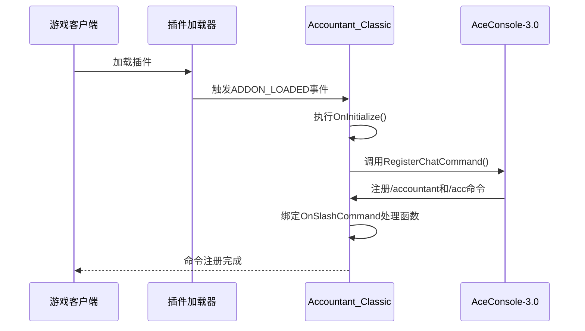
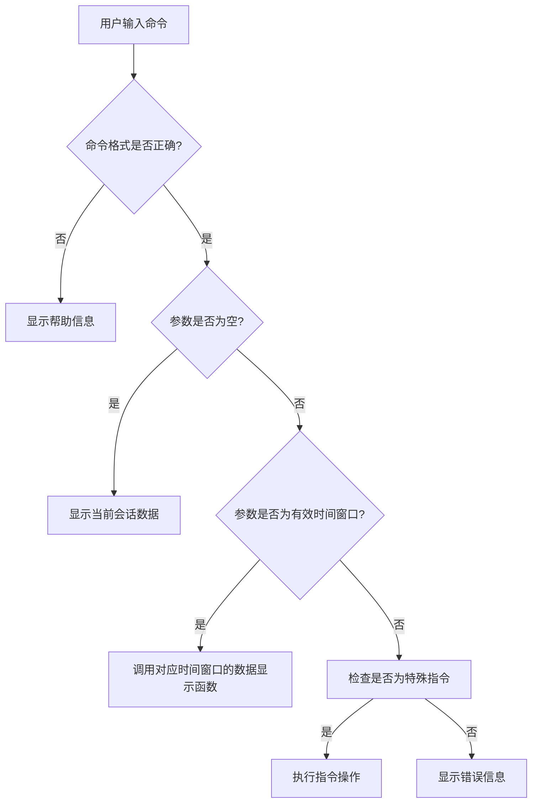
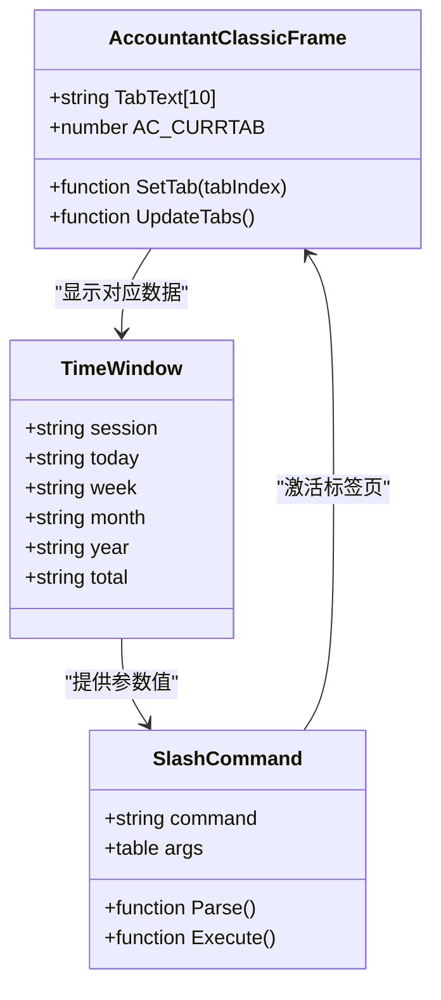
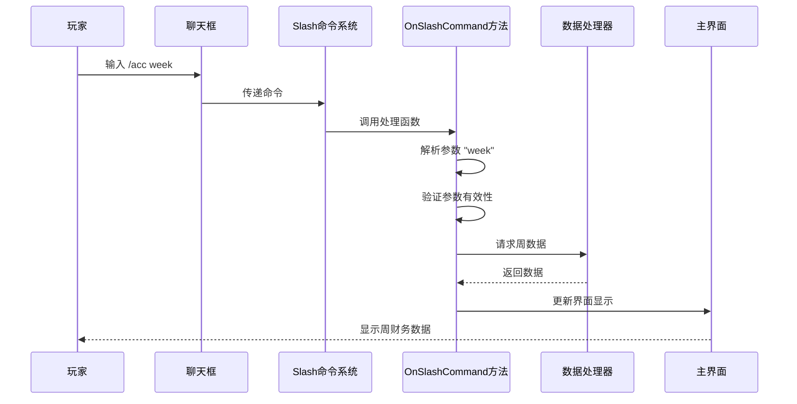

# Accountant命令

<cite>
**本文档中引用的文件**  
- [Core.lua](file://Core/Core.lua)
- [CurrencyCore.lua](file://CurrencyTracker/CurrencyCore.lua)
- [Constants.lua](file://Core/Constants.lua)
- [CurrencyConstants.lua](file://CurrencyTracker/CurrencyConstants.lua)
</cite>

## 目录
1. [介绍](#介绍)
2. [命令注册与绑定机制](#命令注册与绑定机制)
3. [命令参数解析逻辑](#命令参数解析逻辑)
4. [时间窗口切换与UI行为](#时间窗口切换与ui行为)
5. [实际使用示例](#实际使用示例)
6. [命令分派内部逻辑分析](#命令分派内部逻辑分析)
7. [与Accountant_Classic主模块的依赖关系](#与accountant_classic主模块的依赖关系)
8. [常见问题解决方案](#常见问题解决方案)
9. [结论](#结论)

## 介绍
`/accountant` 和 `/acc` 是 Accountant_Classic 插件提供的核心命令，用于快速访问角色金币数据和财务统计信息。这些命令通过 AceConsole-3.0 框架注册，并与主界面显示逻辑紧密集成。本文档详细说明这两个命令的实现机制、功能特性、参数解析方式以及与主模块的依赖关系，帮助用户深入理解其工作原理并有效使用。

## 命令注册与绑定机制
`/accountant` 和 `/acc` 命令的注册发生在插件初始化阶段，由 AceConsole-3.0 提供支持。在 `Core.lua` 文件中，插件通过继承 `AceConsole-3.0` 来获得命令注册能力。具体实现位于 `OnInitialize` 方法中，该方法在 `ADDON_LOADED` 事件触发时执行。

**图示来源**
- [Core.lua](file://Core/Core.lua#L1800-L1850)

**本节来源**
- [Core.lua](file://Core/Core.lua#L1800-L1850)

## 命令参数解析逻辑
命令参数的解析主要由 `OnSlashCommand` 方法处理，该方法定义在 `Core.lua` 中。当用户输入 `/accountant` 或 `/acc` 后跟参数时，系统会调用此方法进行解析。支持的参数包括时间窗口标识符（如 `session`、`today`、`week` 等）和特殊指令（如 `reset`、`show`）。

参数解析流程如下：
1. 接收用户输入的命令字符串
2. 按空格分割参数
3. 验证第一个参数是否为有效的时间窗口或指令
4. 根据参数类型调用相应的处理函数

**图示来源**
- [Core.lua](file://Core/Core.lua#L1922-L1980)

**本节来源**
- [Core.lua](file://Core/Core.lua#L1922-L1980)

## 时间窗口切换与UI行为
`/accountant` 和 `/acc` 命令支持多种时间窗口切换参数，这些参数直接映射到主界面的标签页。支持的时间窗口包括：
- `session`（当前会话）
- `today`（今日）
- `week`（本周）
- `month`（本月）
- `year`（本年）
- `total`（总计）

当用户输入类似 `/acc week` 的命令时，系统会自动激活主界面上的“本周”标签页，并刷新数据显示。这种切换是通过调用 `PanelTemplates_SetTab` 函数实现的，该函数是 WoW UI 框架的一部分，用于管理标签页的激活状态。

**图示来源**
- [Core.lua](file://Core/Core.lua#L1922-L1980)
- [Constants.lua](file://Core/Constants.lua#L20-L45)

**本节来源**
- [Core.lua](file://Core/Core.lua#L1922-L1980)
- [Constants.lua](file://Core/Constants.lua#L20-L45)

## 实际使用示例
以下是玩家如何通过 `/accountant` 和 `/acc` 命令快速访问不同时间范围金币数据的实际示例：

- **查看当前会话数据**：输入 `/acc` 或 `/accountant session`，将显示当前登录会话中的收入、支出和净收益。
- **查看今日数据**：输入 `/acc today`，将切换到“今日”标签页并显示当天的财务统计。
- **查看本周数据**：输入 `/acc week`，将激活“本周”标签页并刷新相关数据。
- **查看总计数据**：输入 `/acc total`，将显示角色自开始使用插件以来的累计财务数据。
- **重置数据**：输入 `/acc reset`，将弹出确认对话框，允许用户重置特定时间窗口的数据。

这些命令为玩家提供了快速访问财务信息的途径，无需手动点击界面元素。

**本节来源**
- [Core.lua](file://Core/Core.lua#L1922-L1980)
- [CurrencyCore.lua](file://CurrencyTracker/CurrencyCore.lua#L1376-L1405)

## 命令分派内部逻辑分析
命令分派的内部逻辑集中在 `OnSlashCommand` 方法中，该方法位于 `Core.lua` 文件。该方法负责接收、解析和分派所有来自 `/accountant` 和 `/acc` 命令的请求。

**图示来源**
- [Core.lua](file://Core/Core.lua#L1922-L1980)

**本节来源**
- [Core.lua](file://Core/Core.lua#L1922-L1980)

## 与Accountant_Classic主模块的依赖关系
`/accountant` 和 `/acc` 命令与 Accountant_Classic 主模块存在紧密的依赖关系。这些命令依赖于主模块提供的数据存储、事件监听和界面渲染功能。具体依赖包括：

- **数据存储**：命令需要访问 `Accountant_ClassicSaveData` 全局变量来读取和写入财务数据。
- **事件系统**：命令的执行结果依赖于主模块注册的 `PLAYER_MONEY` 和 `CHAT_MSG_MONEY` 等事件监听器。
- **界面组件**：命令通过操作主模块创建的 `AccountantClassicFrame` 来更新UI显示。
- **配置系统**：命令的行为受主模块的 AceDB 配置影响，如显示格式、小地图按钮等。

这种依赖关系确保了命令与插件其他功能的一致性和协同性。

**本节来源**
- [Core.lua](file://Core/Core.lua#L1800-L1980)
- [Constants.lua](file://Core/Constants.lua#L20-L45)

## 常见问题解决方案
在使用 `/accountant` 和 `/acc` 命令时，可能会遇到一些常见问题。以下是解决方案：

- **命令未注册**：如果输入命令后无响应，可能是插件未正确加载。请检查插件是否已启用，并尝试重新加载界面（/reload）。
- **界面无法打开**：如果命令能执行但界面不显示，可能是 `AccountantClassicFrame` 被隐藏。尝试输入 `/acc` 再次激活，或检查插件设置中的“显示按钮”选项。
- **数据不更新**：如果财务数据未正确记录，检查是否启用了相关事件监听，并确认没有与其他插件冲突。
- **参数无效**：如果收到“无效参数”错误，请确认输入的参数拼写正确，参考帮助文档中的有效参数列表。

**本节来源**
- [Core.lua](file://Core/Core.lua#L1800-L1980)
- [CurrencyCore.lua](file://CurrencyTracker/CurrencyCore.lua#L1376-L1405)

## 结论
`/accountant` 和 `/acc` 命令是 Accountant_Classic 插件的重要组成部分，通过 AceConsole-3.0 框架实现高效注册和分派。这些命令提供了便捷的途径来访问和管理角色的财务数据，支持多种时间窗口切换，并与主界面紧密集成。理解其内部实现机制有助于用户更好地利用这些功能，并在遇到问题时能够快速诊断和解决。