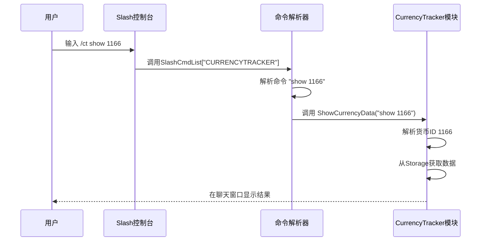

# Slash命令接口

<cite>
**本文档引用的文件**  
- [CurrencyCore.lua](file://CurrencyTracker/CurrencyCore.lua)
- [CurrencyDataManager.lua](file://CurrencyTracker/CurrencyDataManager.lua)
- [CurrencyStorage.lua](file://CurrencyTracker/CurrencyStorage.lua)
- [CurrencyFrame.lua](file://CurrencyTracker/CurrencyFrame.lua)
- [CurrencyConstants.lua](file://CurrencyTracker/CurrencyConstants.lua)
- [AceConsole-3.0.lua](file://Libs/AceConsole-3.0/AceConsole-3.0.lua)
</cite>

## 目录
1. [简介](#简介)
2. [核心命令概览](#核心命令概览)
3. [账户与界面命令](#账户与界面命令)
4. [货币追踪命令](#货币追踪命令)
5. [调试与状态命令](#调试与状态命令)
6. [发现与修复命令](#发现与修复命令)
7. [命令解析器实现](#命令解析器实现)
8. [注册与处理机制](#注册与处理机制)
9. [扩展开发指南](#扩展开发指南)
10. [错误处理](#错误处理)

## 简介
本文档详细说明了Accountant_Classic插件中Slash命令API的完整接口，重点涵盖/accountant和/acc命令族，以及核心的/ct命令族。文档深入解析了这些命令的参数、行为、交互逻辑及底层实现机制，为用户使用和开发者扩展提供全面指导。

## 核心命令概览
插件通过AceConsole-3.0库注册了多个Slash命令，主要分为三类：
- `/accountant` 和 `/acc`：主插件命令，用于打开主界面和切换时间窗口。
- `/ct`：CurrencyTracker模块的专用命令前缀，用于执行货币追踪相关操作。
- `/ct debug`：用于切换调试日志模式。

所有命令的解析和分派逻辑均在`CurrencyCore.lua`中实现，通过AceConsole-3.0的`RegisterChatCommand`方法进行注册。

**Section sources**
- [CurrencyCore.lua](file://CurrencyTracker/CurrencyCore.lua#L583-L600)

## 账户与界面命令
### /accountant 和 /acc 命令
这两个命令是主插件的入口点，主要用于打开Accountant的主用户界面。

- **功能**：调用`CurrencyTracker:OpenUI()`方法，显示主UI窗口。
- **行为**：如果UI模块已加载，则显示UI；否则，会在聊天窗口打印一个占位符消息。
- **交互逻辑**：此命令不处理任何参数，其唯一作用是触发UI的显示。

```mermaid
flowchart TD
A[/accountant 或 /acc] --> B{UI模块是否可用?}
B --> |是| C[调用UIController.Show或Toggle]
B --> |否| D[在聊天窗口打印占位符消息]
```

**Diagram sources**
- [CurrencyCore.lua](file://CurrencyTracker/CurrencyCore.lua#L15-L25)
- [CurrencyFrame.lua](file://CurrencyTracker/CurrencyFrame.lua#L200-L210)

**Section sources**
- [CurrencyCore.lua](file://CurrencyTracker/CurrencyCore.lua#L15-L25)
- [CurrencyFrame.lua](file://CurrencyTracker/CurrencyFrame.lua#L200-L210)

## 货币追踪命令
### /ct show [货币ID]
显示特定货币的详细追踪数据。

- **参数**：`[货币ID]`（可选）指定要查询的货币ID。若省略，则显示所有货币的摘要。
- **行为**：调用`CurrencyTracker:ShowCurrencyData()`方法，根据时间窗口（如Session, Day, Week等）输出收入、支出和净收益。
- **输出格式**：在聊天窗口以表格形式显示货币名称、收入、支出和净收益。
- **示例**：`/ct show 1166` 显示ID为1166的Timewarped Badge的追踪数据。

### /ct show-all-currencies
列出所有已知货币的追踪摘要。

- **参数**：可选的时间窗口（如`day`, `week`），默认为`Session`。
- **行为**：调用`CurrencyTracker:PrintMultipleCurrencies()`方法，遍历所有可用货币并输出其摘要。
- **输出格式**：在聊天窗口列出所有货币的名称、收入、支出和净收益。
- **示例**：`/ct show-all-currencies week` 显示本周所有货币的摘要。

**Section sources**
- [CurrencyCore.lua](file://CurrencyTracker/CurrencyCore.lua#L600-L610)

## 调试与状态命令
### /ct debug
切换调试日志模式。

- **参数**：`on` 或 `off`。若省略参数，则显示当前状态。
- **行为**：设置`CurrencyTracker.DEBUG_MODE`标志，并在聊天窗口输出确认信息。
- **输出格式**：`CurrencyTracker debug: ON` 或 `OFF`。
- **示例**：`/ct debug on` 启用调试模式。

### /ct status
输出模块的内部状态信息。

- **参数**：无。
- **行为**：调用`CurrencyTracker:GetStatus()`方法，收集并返回模块的初始化状态、启用状态、版本和调试模式。
- **输出格式**：在聊天窗口以键值对形式显示状态信息。
- **示例**：`/ct status` 输出类似`isInitialized=true, isEnabled=true, version=1.0.0`的信息。

**Section sources**
- [CurrencyCore.lua](file://CurrencyTracker/CurrencyCore.lua#L540-L555)

## 发现与修复命令
### /ct discover
管理货币的发现状态。

- **子命令**：
  - `track <id> [on|off]`：跟踪或取消跟踪指定ID的货币。
  - `list`：列出所有已发现的货币及其跟踪状态。
  - `clear`：清除当前角色的所有发现记录。
- **行为**：通过`CurrencyTracker.Storage`模块读写`currencyDiscovery`数据。
- **示例**：`/ct discover track 1166 off` 取消跟踪Timewarped Badge。

### /ct repair
执行数据修复操作。

- **子命令**：
  - `adjust <id> <delta> [source]`：手动调整指定货币的聚合数据。
  - `remove <id> <amount> <source> (income|outgoing)`：从指定来源移除已记录的收入或支出。
  - `baseline preview`：预览总余额与实时值的差异。
  - `baseline apply`：应用总余额的修正。
- **行为**：直接操作`SavedVariables`中的`currencyData`结构，用于纠正因插件错误或游戏机制变更导致的数据不一致。
- **示例**：`/ct repair adjust 1166 100` 将ID为1166的货币增加100。

**Section sources**
- [CurrencyCore.lua](file://CurrencyTracker/CurrencyCore.lua#L100-L150)
- [CurrencyStorage.lua](file://CurrencyTracker/CurrencyStorage.lua#L300-L400)

## 命令解析器实现
命令解析器的核心实现在`CurrencyCore.lua`文件中，其逻辑如下：

1. **命令注册**：使用`SlashCmdList["CURRENCYTRACKER"]`注册一个函数，该函数作为所有`/ct`命令的入口点。
2. **命令分派**：入口函数接收命令字符串`msg`，将其转换为小写，并使用`string.find`和`string.match`进行模式匹配，以确定要执行的子命令。
3. **参数验证**：每个子命令函数内部负责解析和验证其特定参数。例如，`RepairRemove`函数使用正则表达式从`sub`字符串中提取`id`、`amount`、`source`和`kind`。
4. **模块调用**：解析器将控制权委托给`CurrencyTracker`的相应方法，如`DataManager`、`Storage`或`UIController`。



**Diagram sources**
- [CurrencyCore.lua](file://CurrencyTracker/CurrencyCore.lua#L580-L650)

**Section sources**
- [CurrencyCore.lua](file://CurrencyTracker/CurrencyCore.lua#L580-L650)

## 注册与处理机制
Slash命令的注册和处理依赖于AceConsole-3.0库。

- **注册过程**：虽然`CurrencyCore.lua`直接操作了`SLASH_CURRENCYTRACKER1`和`SlashCmdList`全局表，但其设计是与AceConsole-3.0兼容的。理想情况下，应使用`RegisterChatCommand`方法进行注册，以获得更好的模块化和生命周期管理。
- **处理流程**：当用户输入Slash命令时，游戏客户端会查找`SLASH_`前缀的全局变量来确定命令ID，然后调用`SlashCmdList`中对应的函数。
- **依赖**：`AceConsole-3.0.lua`提供了`RegisterChatCommand`、`Print`等核心方法，确保了命令注册的健壮性和跨插件兼容性。

**Section sources**
- [CurrencyCore.lua](file://CurrencyTracker/CurrencyCore.lua#L583)
- [AceConsole-3.0.lua](file://Libs/AceConsole-3.0/AceConsole-3.0.lua#L100-L150)

## 扩展开发指南
要为CurrencyTracker模块添加新的Slash命令，开发者应遵循以下步骤：

1. **在CurrencyCore.lua中定义新方法**：在`CurrencyTracker`表中添加一个新的方法，例如`CurrencyTracker:MyNewCommand(sub)`。
2. **实现业务逻辑**：在新方法中，解析`sub`参数，调用`DataManager`或`Storage`等子模块来执行操作，并使用`print()`或`self:Print()`输出结果。
3. **更新命令分派逻辑**：在`SlashCmdList["CURRENCYTRACKER"]`的处理函数中，添加对新命令的匹配和调用。
4. **参数验证**：使用`string.match`或`tonumber()`等函数严格验证输入参数，确保其类型和范围正确。
5. **错误处理**：在方法中包含适当的错误检查和`print()`语句，向用户提供清晰的反馈。

**Section sources**
- [CurrencyCore.lua](file://CurrencyTracker/CurrencyCore.lua#L580-L650)

## 错误处理
系统通过多种机制处理命令执行中的错误：

- **参数验证**：每个命令在执行前都会检查其必需参数。如果参数缺失或格式错误，会通过`print()`输出使用说明。
- **模块可用性检查**：在调用子模块方法前，会检查该模块及其方法是否存在（例如`if self.Storage and self.Storage.RepairRemove then`）。
- **数据完整性检查**：在访问`SavedVariables`时，会使用`EnsureSavedVariablesStructure()`等辅助函数确保数据结构存在且完整。
- **异常捕获**：在与游戏API交互时（如`pcall(C_CurrencyInfo.GetCurrencyInfo, id)`），使用`pcall`来捕获可能的运行时错误。

**Section sources**
- [CurrencyCore.lua](file://CurrencyTracker/CurrencyCore.lua#L150-L200)
- [CurrencyStorage.lua](file://CurrencyTracker/CurrencyStorage.lua#L50-L100)