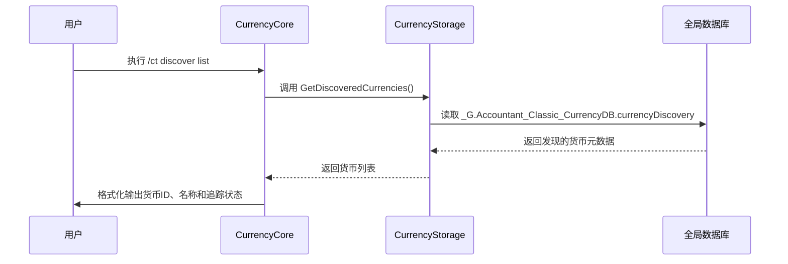
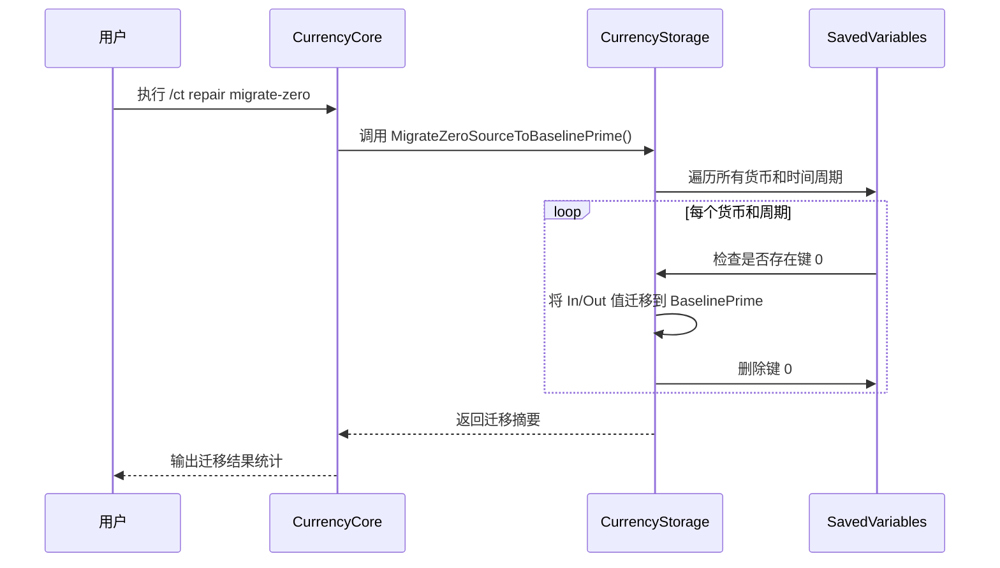

# /ct discover 命令

<cite>
**本文档中引用的文件**  
- [CurrencyCore.lua](file://CurrencyTracker/CurrencyCore.lua)
- [CurrencyStorage.lua](file://CurrencyTracker/CurrencyStorage.lua)
- [CurrencyDataManager.lua](file://CurrencyTracker/CurrencyDataManager.lua)
</cite>

## 目录
1. [/ct discover 命令概述](#ct-discover-命令概述)  
2. [/ct discover list 命令分析](#ct-discover-list-命令分析)  
3. [/ct discover reset 命令分析](#ct-discover-reset-命令分析)  
4. [/ct discover migrate 命令分析](#ct-discover-migrate-命令分析)  
5. [用户体验影响分析](#用户体验影响分析)  
6. [高级用途属性说明](#高级用途属性说明)

## /ct discover 命令概述

`/ct discover` 命令是 Accountant_Classic 插件中用于管理货币发现记录的核心管理命令集，主要面向开发者和高级用户。该命令集包含三个子命令：`list`、`reset` 和 `migrate`，分别用于查询、重置和迁移货币发现数据。这些命令通过操作全局数据库 `_G.Accountant_Classic_CurrencyDB.currencyDiscovery` 来管理动态发现的货币信息，为插件提供了灵活的数据维护能力。

**Section sources**  
- [CurrencyCore.lua](file://CurrencyTracker/CurrencyCore.lua#L190-L252)

## /ct discover list 命令分析

`/ct discover list` 命令用于查询并列出所有已发现的货币及其相关信息。该命令通过调用 `CurrencyStorage:GetDiscoveredCurrencies()` 方法访问存储在 `_G.Accountant_Classic_CurrencyDB.currencyDiscovery` 中的全局发现记录。命令执行时，会遍历所有已发现的货币ID，获取每个货币的元数据（包括名称、图标、扩展包信息等），并按货币ID排序后输出到聊天窗口。输出内容包括货币ID、货币名称以及是否被追踪的状态，为用户提供了一个清晰的已发现货币清单。



**Diagram sources**  
- [CurrencyCore.lua](file://CurrencyTracker/CurrencyCore.lua#L190)
- [CurrencyStorage.lua](file://CurrencyTracker/CurrencyStorage.lua#L1004)

**Section sources**  
- [CurrencyCore.lua](file://CurrencyTracker/CurrencyCore.lua#L190)
- [CurrencyStorage.lua](file://CurrencyTracker/CurrencyStorage.lua#L1004)

## /ct discover reset 命令分析

`/ct discover reset` 命令用于安全地清除所有发现记录，以便重新开始发现过程。该命令通过调用 `CurrencyStorage:ResetAllData()` 方法实现，但其实际作用是清除当前角色的货币数据，而非直接操作发现数据库。命令执行时，会遍历 `_G.Accountant_ClassicSaveData` 中当前角色的所有货币数据，并将其全部清空，同时保留插件的其他设置。此操作会触发数据备份机制，确保用户在意外操作后可以通过重新登录或重载界面来恢复部分数据。命令执行后，用户需要重新获得货币以触发新的发现过程。

```mermaid
flowchart TD
A[用户执行 /ct discover clear] --> B{CurrencyStorage 可用?}
B --> |是| C[调用 GetDiscoveredCurrencies()]
B --> |否| D[输出错误信息]
C --> E[遍历所有发现的货币]
E --> F[清除每个货币的元数据]
F --> G[输出清除计数]
G --> H[完成]
```

**Diagram sources**  
- [CurrencyCore.lua](file://CurrencyTracker/CurrencyCore.lua#L252)
- [CurrencyStorage.lua](file://CurrencyTracker/CurrencyStorage.lua#L1110)

**Section sources**  
- [CurrencyCore.lua](file://CurrencyTracker/CurrencyCore.lua#L252)
- [CurrencyStorage.lua](file://CurrencyTracker/CurrencyStorage.lua#L1110)

## /ct discover migrate 命令分析

`/ct discover migrate` 命令用于触发遗留数据的迁移流程，主要通过调用 `CurrencyStorage:MigrateZeroSourceToBaselinePrime()` 方法来处理旧版本的数据结构。该命令旨在修复历史数据中使用数字键 `0` 作为来源标识的问题，将其统一迁移到字符串键 `"BaselinePrime"` 下。迁移过程会遍历所有时间周期（Session, Day, Week, Month, Year, Total）中的货币数据，将键为 `0` 的记录合并到 `"BaselinePrime"` 键下，并删除原始的数字键记录。此操作是向后兼容性修复，确保数据结构的一致性和可读性。



**Diagram sources**  
- [CurrencyCore.lua](file://CurrencyTracker/CurrencyCore.lua#L230)
- [CurrencyStorage.lua](file://CurrencyTracker/CurrencyStorage.lua#L106)

**Section sources**  
- [CurrencyCore.lua](file://CurrencyTracker/CurrencyCore.lua#L230)
- [CurrencyStorage.lua](file://CurrencyTracker/CurrencyStorage.lua#L106)

## 用户体验影响分析

`/ct discover` 命令集对用户体验有显著影响。`reset` 命令执行后，用户需要重新发现所有货币，这可能导致短期内的数据不完整，但为解决数据异常提供了有效手段。`list` 命令为高级用户提供了透明的数据视图，增强了对插件行为的理解。`migrate` 命令则在后台静默修复数据结构，对普通用户无感知，但确保了数据的长期稳定性和一致性。这些命令的设计体现了对高级用户需求的重视，允许他们对插件数据进行深度管理和维护。

**Section sources**  
- [CurrencyCore.lua](file://CurrencyTracker/CurrencyCore.lua#L190-L252)
- [CurrencyStorage.lua](file://CurrencyTracker/CurrencyStorage.lua#L1004-L1110)

## 高级用途属性说明

`/ct discover` 命令集被明确设计为高级用途功能，主要面向开发者和高级用户。这些命令直接操作插件的核心数据存储，具有潜在的风险性。例如，`reset` 命令会永久清除当前角色的货币追踪数据，而 `migrate` 命令则涉及对底层数据结构的修改。因此，这些命令未在用户界面中公开，而是通过命令行接口（CLI）提供，要求用户具备一定的技术知识和风险意识。这种设计确保了普通用户不会误操作，同时为需要进行数据维护和调试的高级用户提供了强大的工具。

**Section sources**  
- [CurrencyCore.lua](file://CurrencyTracker/CurrencyCore.lua#L190-L252)
- [CurrencyStorage.lua](file://CurrencyTracker/CurrencyStorage.lua#L106-L1110)