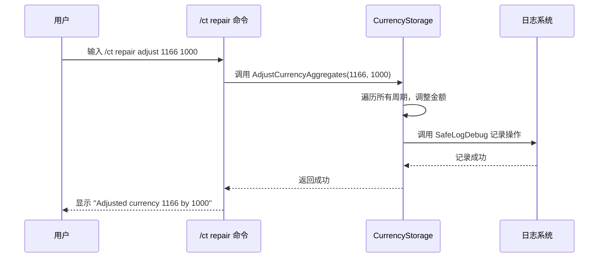

# /ct repair 命令

<cite>
**本文档引用的文件**  
- [CurrencyCore.lua](file://CurrencyTracker/CurrencyCore.lua)
- [CurrencyStorage.lua](file://CurrencyTracker/CurrencyStorage.lua)
- [CurrencyDataManager.lua](file://CurrencyTracker/CurrencyDataManager.lua)
</cite>

## 目录
1. [简介](#简介)
2. [数据修复机制](#数据修复机制)
3. [安全设计](#安全设计)
4. [典型使用场景与风险警告](#典型使用场景与风险警告)

## 简介
`/ct repair` 命令是 Accountant_Classic 插件中用于修复货币数据完整性问题的核心工具。该命令提供了一系列子命令，允许用户检测并修复 `Accountant_ClassicSaveData` 中的损坏数据，例如缺失的 `currencyData` 字段或不一致的元数据。它通过重新初始化存储结构、调整聚合值或从实时数据恢复来确保数据的准确性。本文件将深入探讨其数据修复机制、安全设计、典型使用场景以及潜在风险。

## 数据修复机制

`/ct repair` 命令通过调用 `CurrencyStorage` 模块中的底层函数来实现数据修复。其核心机制包括数据验证、结构初始化和特定的修复策略。

### 数据完整性检测
系统通过 `CurrencyStorage:ValidateData()` 函数来检测数据完整性问题。该函数会检查 `Accountant_ClassicSaveData` 结构是否存在，以及关键字段（如 `currencyData` 和 `currencyOptions`）是否已正确初始化。如果检测到缺失的结构，系统会自动触发修复流程。

### 修复策略
`/ct repair` 提供了多种修复策略，每种策略都针对特定的数据问题：

1.  **`/ct repair init`**: 此命令会调用 `Storage:InitializeCurrencyStorage()` 函数。它采用“增量式”方法，仅在 `currencyData` 或 `currencyOptions` 字段不存在时才创建它们，从而确保不会覆盖现有的有效数据。此操作会重新初始化存储结构，解决因字段缺失导致的问题。

2.  **`/ct repair adjust <id> <delta> [source]`**: 此命令用于手动校正特定货币的记录。它会调用 `Storage:AdjustCurrencyAggregates()` 函数，在指定货币ID的所有时间周期（Session, Day, Week, Month, Year, Total）中，对指定来源的收入或支出进行调整。正 `delta` 值增加收入，负 `delta` 值增加支出。

3.  **`/ct repair remove <id> <amount> <source> (income|outgoing)`**: 此命令用于移除错误记录的交易。它会调用 `Storage:RepairRemove()` 函数，在所有时间周期中，从指定来源移除指定金额的收入或支出，从而纠正数据偏差。

4.  **`/ct repair baseline`**: 此命令用于解决版本升级后数据结构不一致的问题。它会调用 `CurrencyTracker:RepairBaselineApply()` 函数，比较 `Accountant_ClassicSaveData` 中记录的 `Total` 净值与游戏客户端中该货币的实时数量。如果发现差异，它会通过调整 `Total` 周期内的 `BaselinePrime` 来源的收入或支出来修正差异，确保本地记录与游戏实际数量一致。

```mermaid
flowchart TD
A[/ct repair 命令/] --> B{子命令类型}
B --> C[/ct repair init]
B --> D[/ct repair adjust]
B --> E[/ct repair remove]
B --> F[/ct repair baseline]
C --> G[调用 InitializeCurrencyStorage]
G --> H[检查并初始化缺失的<br/>currencyData/currencyOptions]
D --> I[调用 AdjustCurrencyAggregates]
I --> J[在所有周期中调整<br/>指定来源的金额]
E --> K[调用 RepairRemove]
K --> L[在所有周期中移除<br/>指定来源的金额]
F --> M[调用 RepairBaselineApply]
M --> N[比较本地Total与实时数量]
N --> O{存在差异?}
O --> |是| P[调整BaselinePrime以修正差异]
O --> |否| Q[无需操作]
```

**图示来源**
- [CurrencyCore.lua](file://CurrencyTracker/CurrencyCore.lua#L831-L835)
- [CurrencyStorage.lua](file://CurrencyTracker/CurrencyStorage.lua#L814-L815)

**本节来源**
- [CurrencyCore.lua](file://CurrencyTracker/CurrencyCore.lua#L831-L920)
- [CurrencyStorage.lua](file://CurrencyTracker/CurrencyStorage.lua#L814-L815)

## 安全设计

`/ct repair` 命令的设计充分考虑了用户数据的安全性，通过多重机制防止误操作和数据丢失。

### 用户确认与操作日志
虽然代码中未直接显示用户确认提示，但其设计原则是“只读不写”或“最小化写入”。例如，`/ct repair baseline preview` 命令会先执行预览，仅打印出将要进行的修正，而不实际修改数据，这为用户提供了审查和确认的机会。所有修复操作，如 `AdjustCurrencyAggregates` 和 `RepairRemove`，在执行后都会调用 `SafeLogDebug` 函数，将操作详情（包括货币ID、金额、来源和最终结果）记录到调试日志中，确保所有操作都有据可查。

### 防止重复修复的锁定机制
系统通过 `isInitialized` 标志和版本号来防止重复初始化。`Storage:Initialize()` 函数在执行前会检查 `isInitialized` 是否为 `true`，如果是，则直接返回，避免了重复的初始化操作。此外，`currencyOptions` 中存储了 `version` 字段（`CURRENCY_VERSION`），当检测到旧版本时，系统会执行一次性的数据迁移（`MigrateData`），迁移完成后更新版本号，从而防止同一迁移逻辑被重复执行。

### 幂等性设计
`CurrencyStorageManager.InitializeCurrencyData()` 函数体现了幂等性设计。该函数在初始化特定货币的数据结构时，会首先检查 `currencyData[currencyID]` 是否已存在。如果存在，则直接返回，不再进行任何操作；如果不存在，则创建必要的数据结构。这种“存在即跳过，不存在则创建”的模式确保了无论该函数被调用多少次，其结果都是一致的，从而保证了修复操作的可靠性，避免了因重复调用而导致的数据结构混乱。



**图示来源**
- [CurrencyStorage.lua](file://CurrencyTracker/CurrencyStorage.lua#L814-L815)
- [CurrencyCore.lua](file://CurrencyTracker/CurrencyCore.lua#L178)

**本节来源**
- [CurrencyStorage.lua](file://CurrencyTracker/CurrencyStorage.lua#L814-L815)
- [CurrencyCore.lua](file://CurrencyTracker/CurrencyCore.lua#L178)

## 典型使用场景与风险警告

### 典型使用场景
*   **版本升级后数据恢复**：当插件从旧版本升级到新版本时，`currencyData` 的结构可能发生变化。使用 `/ct repair init` 可以确保新的数据结构被正确创建。如果旧版本的数据迁移不完整，导致 `Total` 总额与游戏内实际数量不符，可以使用 `/ct repair baseline` 命令进行校准。
*   **纠正错误记录**：如果玩家发现某笔交易被错误地记录为收入而非支出，可以使用 `/ct repair remove` 命令移除错误的记录，然后使用 `/ct repair adjust` 命令重新添加正确的记录。

### 风险警告
**不当使用 `/ct repair` 命令可能导致不可逆的数据丢失。** 例如，错误地使用 `/ct repair remove` 命令可能会移除大量有效的交易记录。`/ct repair init` 虽然不会删除现有数据，但如果在数据严重损坏时使用，其初始化逻辑可能无法完全恢复所有信息。因此，**在执行任何修复操作前，强烈建议手动备份 `WTF` 文件夹中的 `Accountant_Classic.lua` 文件**。一旦数据被覆盖或删除，将无法通过插件本身恢复。

**本节来源**
- [CurrencyCore.lua](file://CurrencyTracker/CurrencyCore.lua#L1399-L1405)
- [CurrencyStorage.lua](file://CurrencyTracker/CurrencyStorage.lua#L814-L815)