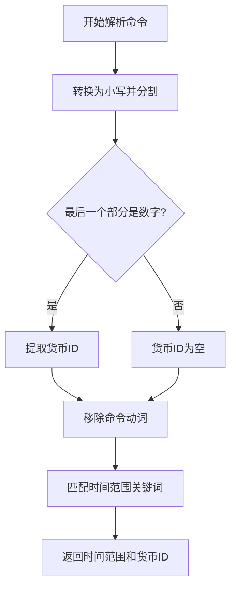
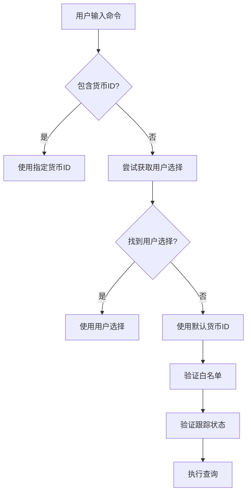
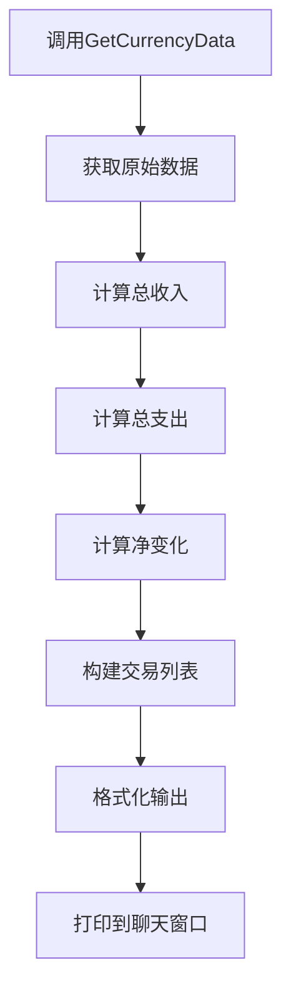
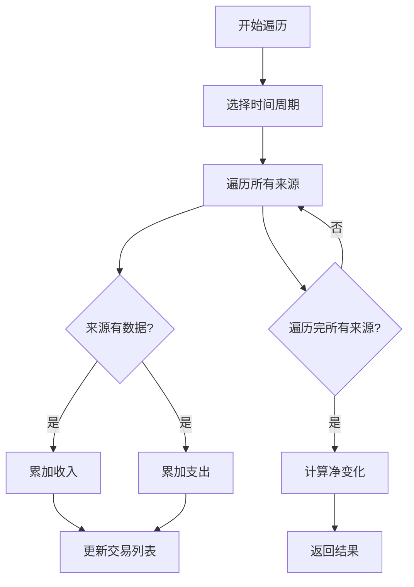
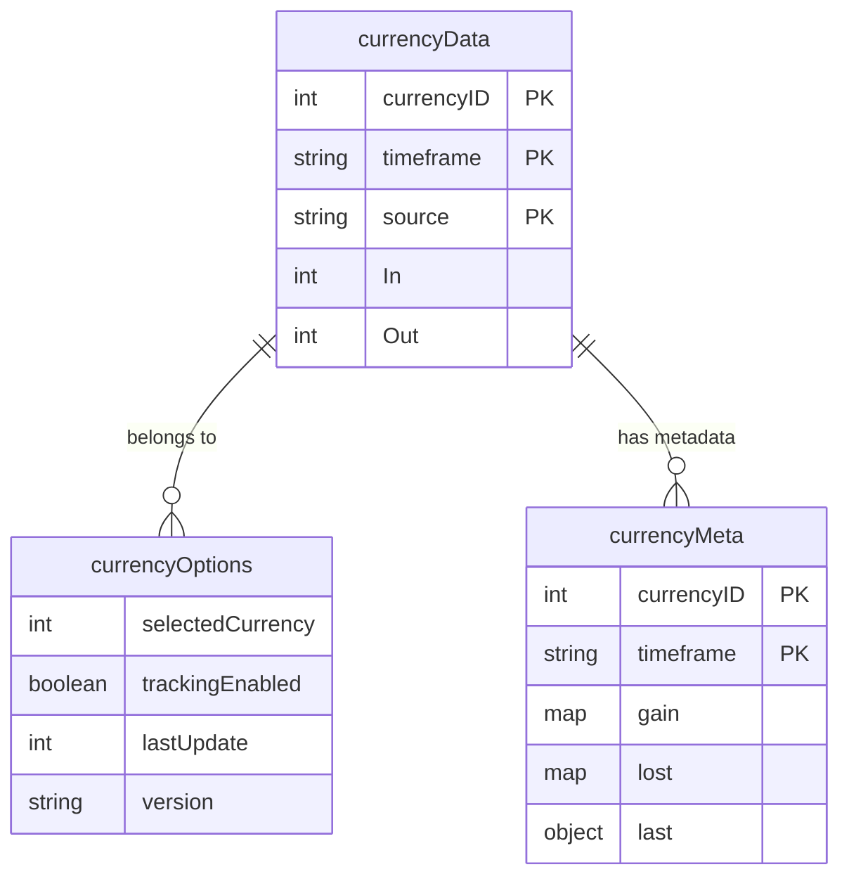
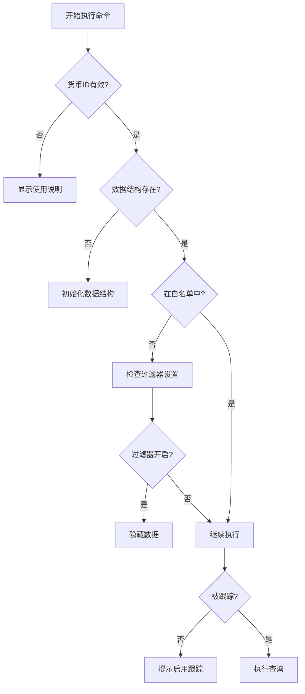

# /ct show 命令

<cite>
**本文档中引用的文件**  
- [CurrencyCore.lua](file://CurrencyTracker/CurrencyCore.lua)
- [CurrencyDataManager.lua](file://CurrencyTracker/CurrencyDataManager.lua)
- [CurrencyStorage.lua](file://CurrencyTracker/CurrencyStorage.lua)
- [CurrencyConstants.lua](file://CurrencyTracker/CurrencyConstants.lua)
- [Core.lua](file://Core/Core.lua)
</cite>

## 目录
1. [简介](#简介)
2. [命令解析与参数验证](#命令解析与参数验证)
3. [默认货币ID与行为处理](#默认货币id与行为处理)
4. [数据获取与格式化输出](#数据获取与格式化输出)
5. [数据源遍历与金额计算](#数据源遍历与金额计算)
6. [数据结构映射关系](#数据结构映射关系)
7. [使用示例](#使用示例)
8. [错误处理策略](#错误处理策略)

## 简介
`/ct show` 命令是Accountant_Classic插件中用于查看货币收支数据的核心功能。该命令允许用户通过指定货币ID来查询特定时间范围内的收入、支出和净变化。本文档将深入解析该命令的实现机制，包括参数解析、数据获取、格式化输出以及错误处理等关键环节。

## 命令解析与参数验证
`/ct show` 命令的解析由 `CurrencyTracker:ParseShowCommand()` 函数完成。该函数负责从用户输入中提取时间范围和货币ID。

命令解析流程如下：
1. 将输入命令转换为小写并分割成多个部分
2. 检查最后一个部分是否为有效的数字，如果是则将其作为货币ID
3. 移除命令动词（如"show"）以标准化时间范围检测
4. 使用映射表将时间范围关键词转换为内部表示



**Diagram sources**
- [CurrencyCore.lua](file://CurrencyTracker/CurrencyCore.lua#L952-L1031)

**Section sources**
- [CurrencyCore.lua](file://CurrencyTracker/CurrencyCore.lua#L952-L1031)

## 默认货币ID与行为处理
当用户未提供货币ID参数时，系统会使用默认货币ID。默认货币ID的设定逻辑如下：

1. 首先尝试从 `CurrencyDataManager:LoadCurrencySelection()` 获取用户上次选择的货币ID
2. 如果没有找到用户选择，则使用默认值
3. 在 `CurrencyStorage.lua` 中，`DEFAULT_CURRENCY` 常量定义了默认货币ID为1166（Timewarped Badge）

当用户未提供参数时的默认行为处理包括：
- 使用默认时间范围 "Session"（当前会话）
- 使用默认货币ID
- 检查货币白名单过滤器设置
- 验证货币是否被标记为跟踪状态



**Diagram sources**
- [CurrencyCore.lua](file://CurrencyTracker/CurrencyCore.lua#L1032-L1149)
- [CurrencyStorage.lua](file://CurrencyTracker/CurrencyStorage.lua#L122-L145)

**Section sources**
- [CurrencyCore.lua](file://CurrencyTracker/CurrencyCore.lua#L1032-L1149)
- [CurrencyStorage.lua](file://CurrencyTracker/CurrencyStorage.lua#L122-L145)

## 数据获取与格式化输出
`/ct show` 命令通过调用 `CurrencyDataManager.GetCurrencyData()` 方法获取指定时间范围内的收支数据，并将其格式化为可读的表格输出。

数据获取流程：
1. 调用 `Storage:GetCurrencyData()` 或 `DataManager:GetCurrencyData()` 获取数据
2. 计算总收入、总支出和净变化
3. 构建交易列表

格式化输出包括：
- 货币名称和ID
- 时间范围标题
- 总收入、总支出和净变化
- 最大持有量信息（如果可用）



**Diagram sources**
- [CurrencyDataManager.lua](file://CurrencyTracker/CurrencyDataManager.lua#L40-L75)
- [CurrencyStorage.lua](file://CurrencyTracker/CurrencyStorage.lua#L500-L550)
- [CurrencyCore.lua](file://CurrencyTracker/CurrencyCore.lua#L1100-L1149)

**Section sources**
- [CurrencyDataManager.lua](file://CurrencyTracker/CurrencyDataManager.lua#L40-L75)
- [CurrencyStorage.lua](file://CurrencyTracker/CurrencyStorage.lua#L500-L550)
- [CurrencyCore.lua](file://CurrencyTracker/CurrencyCore.lua#L1100-L1149)

## 数据源遍历与金额计算
系统通过遍历不同的数据源来计算货币金额。主要数据源包括Session（会话）、Day（天）、Week（周）等。

遍历逻辑如下：
1. 对于每个时间周期，遍历所有来源
2. 累加每个来源的收入和支出
3. 计算净变化

金额计算方式：
- 收入：所有来源的In字段总和
- 支出：所有来源的Out字段总和
- 净变化：收入减去支出



**Diagram sources**
- [CurrencyStorage.lua](file://CurrencyTracker/CurrencyStorage.lua#L500-L550)
- [CurrencyDataManager.lua](file://CurrencyTracker/CurrencyDataManager.lua#L40-L75)

**Section sources**
- [CurrencyStorage.lua](file://CurrencyTracker/CurrencyStorage.lua#L500-L550)
- [CurrencyDataManager.lua](file://CurrencyTracker/CurrencyDataManager.lua#L40-L75)

## 数据结构映射关系
`/ct show` 命令与 `Accountant_ClassicSaveData.currencyData` 的数据结构存在直接映射关系。

数据结构映射如下：
- `currencyData[currencyID][timeframe][source]` 存储具体交易数据
- 每个交易记录包含In（收入）和Out（支出）字段
- 支持多个时间范围：Session、Day、Week、Month、Year、Total



**Diagram sources**
- [CurrencyStorage.lua](file://CurrencyTracker/CurrencyStorage.lua#L147-L200)
- [CurrencyDataManager.lua](file://CurrencyTracker/CurrencyDataManager.lua#L40-L75)

**Section sources**
- [CurrencyStorage.lua](file://CurrencyTracker/CurrencyStorage.lua#L147-L200)
- [CurrencyDataManager.lua](file://CurrencyTracker/CurrencyDataManager.lua#L40-L75)

## 使用示例
以下是 `/ct show` 命令的常见使用示例：

### 查看征服点数记录
```
/ct show 1822
```
此命令将显示ID为1822的征服点数在当前会话中的收支情况。

### 查看指定时间范围的数据
```
/ct show today 1822
```
此命令将显示ID为1822的货币在今天的收支情况。

### 查看本周数据
```
/ct show week 3008
```
此命令将显示ID为3008的Valorstones在本周的收支情况。

**Section sources**
- [CurrencyCore.lua](file://CurrencyTracker/CurrencyCore.lua#L1032-L1149)
- [CurrencyConstants.lua](file://CurrencyTracker/CurrencyConstants.lua#L500-L555)

## 错误处理策略
`/ct show` 命令实现了完善的错误处理机制，确保在各种异常情况下都能提供有意义的用户反馈。

主要错误处理策略包括：

1. **无效ID输入处理**：
   - 检查货币ID是否有效
   - 如果无效，显示使用说明
   - 提供默认货币ID作为备选

2. **数据缺失处理**：
   - 检查保存变量结构是否存在
   - 确保服务器和角色信息可用
   - 初始化缺失的数据结构

3. **白名单过滤**：
   - 检查货币是否在白名单中
   - 如果不在白名单且过滤器开启，隐藏数据

4. **跟踪状态检查**：
   - 验证货币是否被标记为跟踪状态
   - 如果未跟踪，提示用户如何启用



**Diagram sources**
- [CurrencyCore.lua](file://CurrencyTracker/CurrencyCore.lua#L1032-L1149)
- [CurrencyStorage.lua](file://CurrencyTracker/CurrencyStorage.lua#L500-L550)

**Section sources**
- [CurrencyCore.lua](file://CurrencyTracker/CurrencyCore.lua#L1032-L1149)
- [CurrencyStorage.lua](file://CurrencyTracker/CurrencyStorage.lua#L500-L550)