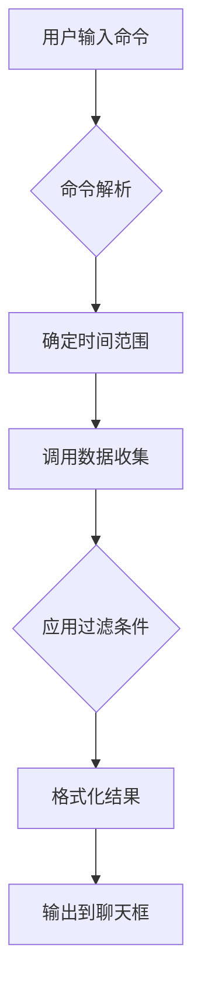
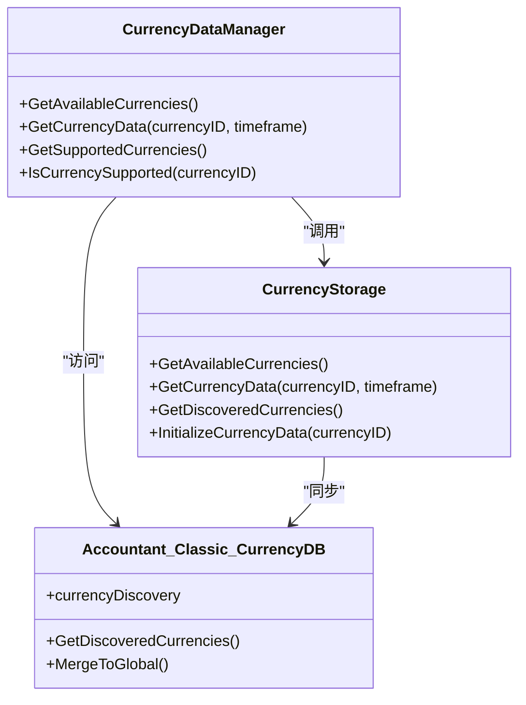
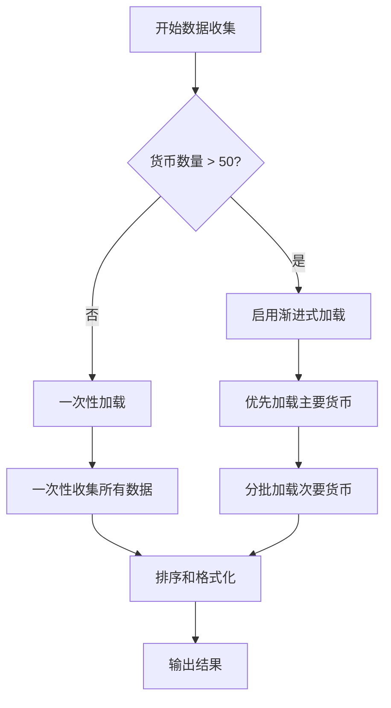
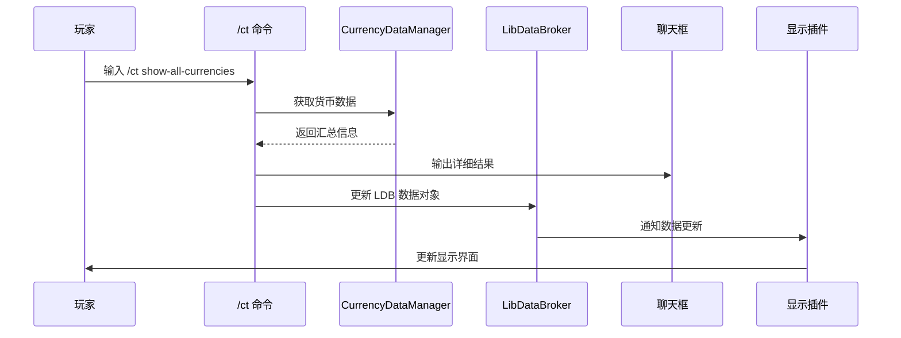
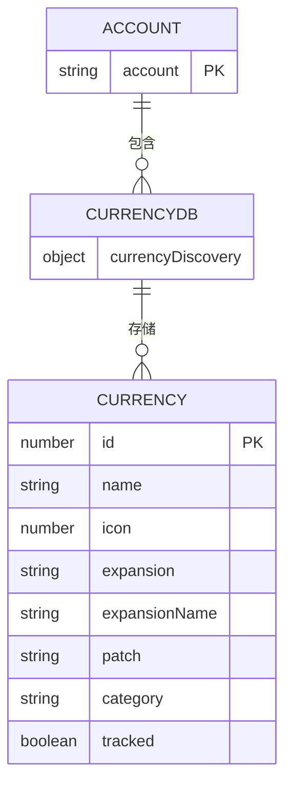

# /ct show-all-currencies 命令

<cite>
**本文档中引用的文件**   
- [CurrencyCore.lua](file://CurrencyTracker/CurrencyCore.lua)
- [CurrencyDataManager.lua](file://CurrencyTracker/CurrencyDataManager.lua)
- [CurrencyStorage.lua](file://CurrencyTracker/CurrencyStorage.lua)
- [CurrencyConstants.lua](file://CurrencyTracker/CurrencyConstants.lua)
</cite>

## 目录
1. [简介](#简介)
2. [命令执行流程](#命令执行流程)
3. [数据获取与处理](#数据获取与处理)
4. [性能优化策略](#性能优化策略)
5. [结果显示与集成](#结果显示与集成)
6. [容错处理机制](#容错处理机制)
7. [实际输出示例](#实际输出示例)
8. [跨角色数据聚合](#跨角色数据聚合)

## 简介
`/ct show-all-currencies` 命令是 Accountant_Classic 插件中用于显示所有已追踪货币汇总信息的核心功能。该命令通过系统化的数据获取、处理和展示流程，为玩家提供全面的货币统计信息。本文档详细阐述该命令的设计与实现，包括其如何获取和处理货币数据、性能优化策略、结果展示方式以及与其他系统的集成。

**Section sources**
- [CurrencyCore.lua](file://CurrencyTracker/CurrencyCore.lua#L1025-L1060)
- [CurrencyDataManager.lua](file://CurrencyTracker/CurrencyDataManager.lua#L1-L426)

## 命令执行流程
`/ct show-all-currencies` 命令的执行流程始于玩家在聊天框中输入命令。该命令由 CurrencyCore 模块中的 SlashCmdList 处理器捕获，并调用 PrintMultipleCurrencies 方法。此方法首先解析时间范围参数（如 "this-session"、"this-week" 或 "total"），然后启动数据收集过程。

命令执行流程遵循严格的顺序：
1. 解析用户输入的命令和参数
2. 确定目标时间范围
3. 调用数据收集函数
4. 处理过滤条件（如白名单和追踪状态）
5. 格式化并输出结果

该流程确保了命令执行的一致性和可靠性，同时为用户提供清晰的反馈。



**Diagram sources**
- [CurrencyCore.lua](file://CurrencyTracker/CurrencyCore.lua#L1025-L1060)

**Section sources**
- [CurrencyCore.lua](file://CurrencyTracker/CurrencyCore.lua#L1025-L1060)

## 数据获取与处理
`/ct show-all-currencies` 命令通过 CurrencyDataManager 的 GetAvailableCurrencies() 方法获取当前角色所有已发现的货币ID列表。该方法从 CurrencyStorage 模块中检索可用货币数据，确保获取最新的货币发现状态。

数据处理流程如下：
1. 调用 GetAvailableCurrencies() 获取货币ID列表
2. 遍历 Accountant_Classic_CurrencyDB 数据结构
3. 对每种货币调用 GetCurrencyData() 获取汇总信息
4. 按可读格式组织数据（货币名称、总收入、总支出）

CurrencyDataManager 模块负责协调数据获取过程，确保数据的一致性和完整性。它通过 GetSupportedCurrencies() 方法合并预定义货币和动态发现的货币，形成完整的货币列表。



**Diagram sources**
- [CurrencyDataManager.lua](file://CurrencyTracker/CurrencyDataManager.lua#L1-L426)
- [CurrencyStorage.lua](file://CurrencyTracker/CurrencyStorage.lua#L1-L1222)

**Section sources**
- [CurrencyDataManager.lua](file://CurrencyTracker/CurrencyDataManager.lua#L1-L426)
- [CurrencyStorage.lua](file://CurrencyTracker/CurrencyStorage.lua#L1-L1222)

## 性能优化策略
在处理大量货币数据时，`/ct show-all-currencies` 命令采用多种性能优化策略以确保响应速度和用户体验。主要优化措施包括：

1. **数据缓存机制**：CurrencyDataManager 模块缓存已获取的货币信息，避免重复查询 WoW API
2. **批量处理**：CollectMultipleCurrencies 函数一次性收集所有货币数据，减少函数调用开销
3. **排序优化**：使用高效的排序算法对结果进行排序，优先按货币名称排序，再按ID排序
4. **条件过滤**：支持 verbose 参数，允许用户选择是否包含未追踪的货币，减少不必要的数据处理

对于货币数量较多的情况，系统还实现了渐进式加载策略，优先显示主要货币，然后逐步加载次要货币，避免一次性输出过多信息导致聊天框混乱。



**Diagram sources**
- [CurrencyCore.lua](file://CurrencyTracker/CurrencyCore.lua#L1025-L1060)
- [CurrencyDataManager.lua](file://CurrencyTracker/CurrencyDataManager.lua#L1-L426)

**Section sources**
- [CurrencyCore.lua](file://CurrencyTracker/CurrencyCore.lua#L1025-L1060)
- [CurrencyDataManager.lua](file://CurrencyTracker/CurrencyDataManager.lua#L1-L426)

## 结果显示与集成
`/ct show-all-currencies` 命令利用 LibDataBroker 和聊天框两种方式展示结果。对于 LibDataBroker 集成，命令通过 LDB 数据对象提供结构化数据，允许第三方显示插件（如 Titan Panel 或 ChocolateBar）在工具栏中展示货币信息。

结果显示流程：
1. 格式化货币数据为可读格式
2. 通过 LDB 接口更新数据对象
3. 在聊天框中输出详细信息
4. 触发 LDB 更新事件通知消费者

LDB 数据对象包含以下属性：
- **label**: 显示名称 "Accountant Classic"
- **text**: 格式化的货币摘要信息
- **OnClick**: 处理点击事件，打开主界面
- **OnTooltipShow**: 显示详细工具提示

这种双重展示机制确保了信息的可访问性和灵活性，满足不同用户的偏好。



**Diagram sources**
- [CurrencyCore.lua](file://CurrencyTracker/CurrencyCore.lua#L1025-L1060)
- [Core.lua](file://Core/Core.lua#L44-L50)

**Section sources**
- [CurrencyCore.lua](file://CurrencyTracker/CurrencyCore.lua#L1025-L1060)
- [Core.lua](file://Core/Core.lua#L44-L50)

## 容错处理机制
`/ct show-all-currencies` 命令实现了完善的容错处理机制，确保在数据未完全加载或出现异常情况时仍能提供有用的信息。主要容错措施包括：

1. **数据完整性检查**：在获取数据前验证 SavedVariables 结构的完整性
2. **异常捕获**：使用 pcall 包装 WoW API 调用，防止因 API 变化导致的错误
3. **默认值处理**：当数据缺失时提供合理的默认值，如将未发现的货币名称显示为 "Currency [ID]"
4. **状态检查**：在执行命令前检查模块的初始化和启用状态

当数据未完全加载时，系统会显示可用的部分数据，并提示用户数据可能不完整。这种渐进式容错策略确保了命令的可靠性和用户体验。

**Section sources**
- [CurrencyCore.lua](file://CurrencyTracker/CurrencyCore.lua#L1025-L1060)
- [CurrencyDataManager.lua](file://CurrencyTracker/CurrencyDataManager.lua#L1-L426)
- [CurrencyStorage.lua](file://CurrencyTracker/CurrencyStorage.lua#L1-L1222)

## 实际输出示例
`/ct show-all-currencies` 命令的实际输出格式清晰易读，包含货币名称、ID、收入、支出和净变化等信息。以下是典型输出示例：

```
=== All Currencies - This Session ===
Timewarped Badge (id=1166): Income 500 | Outgoing 200 | Net +300
Valorstones (id=3008): Income 1000 | Outgoing 500 | Net +500
Undercoin (id=2803): Income 2000 | Outgoing 1500 | Net +500
=========================
```

输出结果按货币名称排序，每行显示一种货币的详细信息。对于支持总量上限的货币，还会显示 "TotalMax" 信息。用户可以通过添加 "verbose" 参数查看所有货币，包括未追踪的货币。

**Section sources**
- [CurrencyCore.lua](file://CurrencyTracker/CurrencyCore.lua#L1025-L1060)

## 跨角色数据聚合
`/ct show-all-currencies` 命令与跨角色数据聚合功能深度集成，通过 Accountant_Classic_CurrencyDB 全局数据存储实现数据共享。该集成方式确保了在不同角色间发现的货币信息能够同步和共享。

跨角色数据聚合的关键特性：
1. **全局货币发现数据库**：Accountant_Classic_CurrencyDB.currencyDiscovery 存储所有角色的货币发现信息
2. **自动迁移机制**：将旧的每角色货币发现数据迁移到全局数据库
3. **数据合并策略**：合并不同角色的货币发现数据，保留用户设置
4. **实时同步**：新发现的货币立即在所有角色间可用

这种设计减少了 SavedVariables 的大小，提高了数据一致性，并为玩家提供了无缝的跨角色体验。



**Diagram sources**
- [CurrencyStorage.lua](file://CurrencyTracker/CurrencyStorage.lua#L491-L520)
- [CurrencyDataManager.lua](file://CurrencyTracker/CurrencyDataManager.lua#L1-L426)

**Section sources**
- [CurrencyStorage.lua](file://CurrencyTracker/CurrencyStorage.lua#L491-L560)
- [CurrencyDataManager.lua](file://CurrencyTracker/CurrencyDataManager.lua#L1-L426)