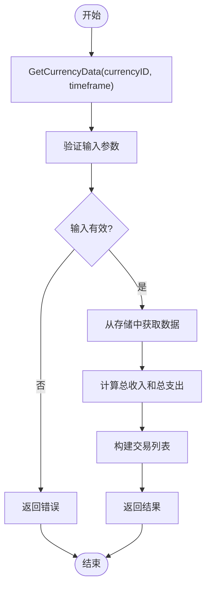

# 查询API

<cite>
**本文档中引用的文件**  
- [Core.lua](file://Core/Core.lua)
- [CurrencyStorage.lua](file://CurrencyTracker/CurrencyStorage.lua)
- [CurrencyDataManager.lua](file://CurrencyTracker/CurrencyDataManager.lua)
</cite>

## 目录
1. [简介](#简介)
2. [查询接口概览](#查询接口概览)
3. [高级查询功能](#高级查询功能)
4. [数据检索方法](#数据检索方法)
5. [查询结果结构与遍历](#查询结果结构与遍历)
6. [分页与大数据集处理](#分页与大数据集处理)
7. [线程安全性与调用限制](#线程安全性与调用限制)
8. [性能优化建议](#性能优化建议)
9. [最佳实践](#最佳实践)

## 简介
Accountant Classic 提供了一套完整的查询接口，用于检索和分析游戏内货币及金币的收支数据。本文档详细说明了 Core.lua 中的高级查询功能和 CurrencyStorage.lua 中的数据检索方法，帮助开发者和用户高效地使用这些 API 进行复杂的数据查询和分析。

## 查询接口概览
Accountant Classic 的查询接口主要分为两个部分：Core.lua 提供的金币查询功能和 CurrencyStorage.lua 提供的货币数据检索功能。这些接口支持按时间范围、交易类型或金额范围进行筛选，并提供了丰富的数据结构和遍历方法。

**Section sources**
- [Core.lua](file://Core/Core.lua#L0-L2335)
- [CurrencyStorage.lua](file://CurrencyTracker/CurrencyStorage.lua#L0-L1222)

## 高级查询功能
Core.lua 中的高级查询功能允许用户根据不同的条件进行复杂的查询。例如，可以按时间范围（如今天、本周、本月等）或交易类型（如任务奖励、拍卖行交易等）筛选数据。这些功能通过一系列函数实现，如 `AccountantClassic_OnEvent` 和 `updateLog`，它们在事件触发时记录和处理数据。

**Section sources**
- [Core.lua](file://Core/Core.lua#L0-L2335)

## 数据检索方法
CurrencyStorage.lua 提供了多种数据检索方法，用于获取特定货币在不同时间范围内的收支数据。主要方法包括 `GetCurrencyData` 和 `GetAvailableCurrencies`。`GetCurrencyData` 函数接受货币 ID 和时间范围作为参数，返回该货币在指定时间范围内的总收入、总支出和净变化。`GetAvailableCurrencies` 函数则返回所有有数据的货币列表。

**Diagram sources**
- [CurrencyStorage.lua](file://CurrencyTracker/CurrencyStorage.lua#L661-L713)

## 查询结果结构与遍历
查询结果通常包含总收入、总支出、净变化和交易列表。交易列表中的每个条目包含来源、收入、支出和净变化。用户可以通过遍历交易列表来获取详细的交易信息。例如，可以使用 `for` 循环遍历 `transactions` 数组，提取每个交易的详细信息。

**Section sources**
- [CurrencyStorage.lua](file://CurrencyTracker/CurrencyStorage.lua#L661-L713)

## 分页与大数据集处理
对于大数据集，建议使用分页查询以提高性能。虽然当前接口没有直接提供分页功能，但可以通过多次调用 `GetCurrencyData` 并调整时间范围来实现分页效果。例如，可以将时间范围划分为多个小段，逐段查询数据。

**Section sources**
- [CurrencyStorage.lua](file://CurrencyTracker/CurrencyStorage.lua#L661-L713)

## 线程安全性与调用限制
查询 API 是线程安全的，可以在事件处理函数中安全调用。然而，为了避免性能问题，建议在非战斗状态下进行大量数据查询。此外，频繁调用查询接口可能会导致性能下降，因此应尽量减少不必要的查询。

**Section sources**
- [Core.lua](file://Core/Core.lua#L0-L2335)
- [CurrencyStorage.lua](file://CurrencyTracker/CurrencyStorage.lua#L0-L1222)

## 性能优化建议
为了优化查询性能，建议采取以下措施：
- **缓存查询结果**：对于不经常变化的数据，可以缓存查询结果，避免重复查询。
- **避免重复查询**：在短时间内多次查询相同的数据时，可以合并查询请求，减少 I/O 操作。
- **合理使用时间范围**：选择合适的时间范围进行查询，避免查询过大的数据集。

**Section sources**
- [Core.lua](file://Core/Core.lua#L0-L2335)
- [CurrencyStorage.lua](file://CurrencyTracker/CurrencyStorage.lua#L0-L1222)

## 最佳实践
- **初始化时加载数据**：在插件初始化时加载必要的数据，减少运行时的查询负担。
- **使用合适的查询条件**：根据实际需求选择合适的时间范围和交易类型，避免不必要的数据处理。
- **定期清理过期数据**：定期清理不再需要的旧数据，保持存储的整洁和高效。

**Section sources**
- [Core.lua](file://Core/Core.lua#L0-L2335)
- [CurrencyStorage.lua](file://CurrencyTracker/CurrencyStorage.lua#L0-L1222)