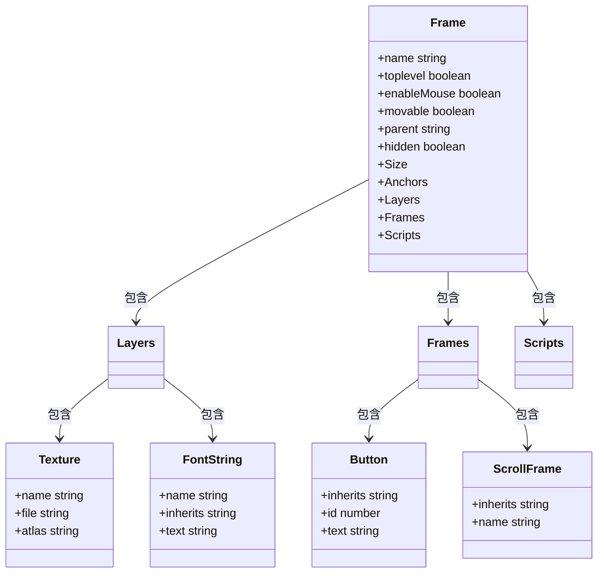
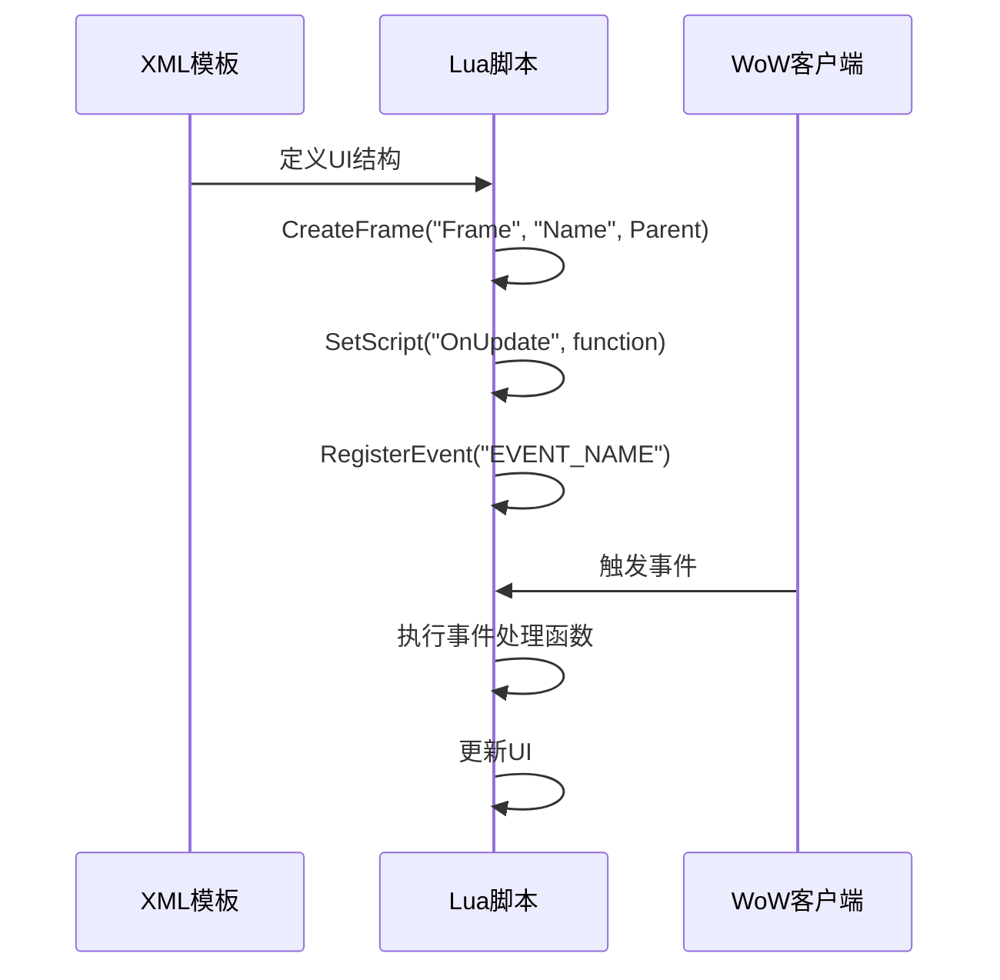
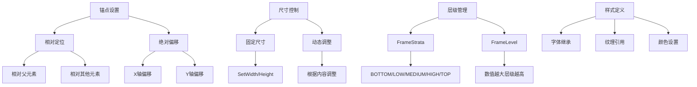
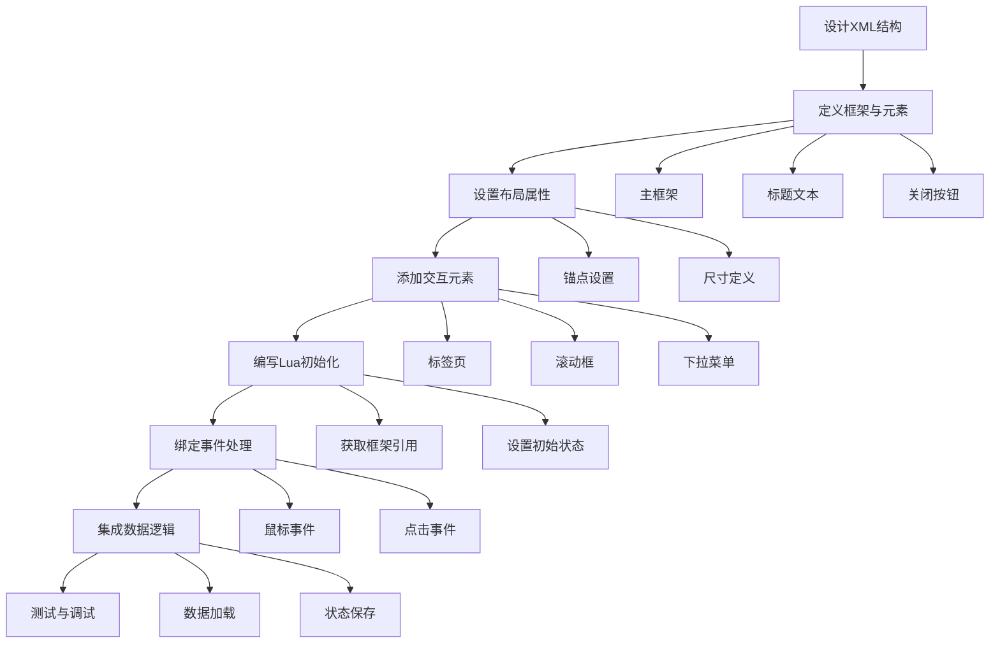
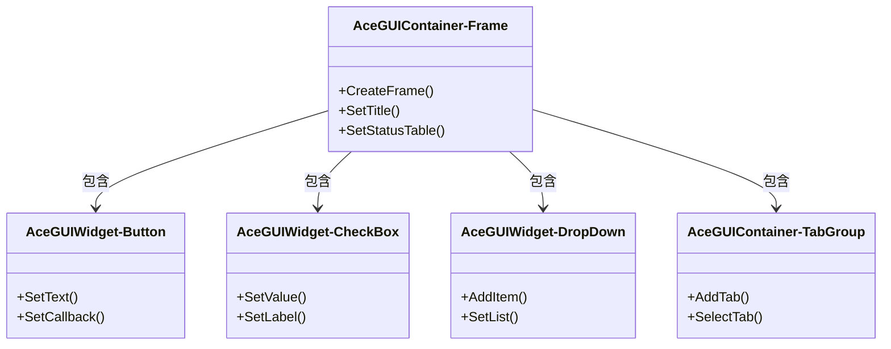

# UI修改与窗口开发

<cite>
**本文档引用的文件**   
- [Core.xml](file://Core/Core.xml)
- [Template.xml](file://Core/Template.xml)
- [MoneyFrame.lua](file://Core/MoneyFrame.lua)
- [CurrencyFrame.xml](file://CurrencyTracker/CurrencyFrame.xml)
- [CurrencyFrame.lua](file://CurrencyTracker/CurrencyFrame.lua)
- [CurrencyTemplate.xml](file://CurrencyTracker/CurrencyTemplate.xml)
</cite>

## 目录
1. [简介](#简介)
2. [XML模板结构](#xml模板结构)
3. [Lua脚本与UI实例化](#lua脚本与ui实例化)
4. [布局与样式控制](#布局与样式控制)
5. [创建新窗口完整示例](#创建新窗口完整示例)
6. [AceGUI-3.0组件集成](#acegui-30组件集成)

## 简介
本指南详细说明Accountant_Classic插件中用户界面的修改与开发方法。文档涵盖XML模板文件的结构、Lua脚本如何实例化UI组件、布局与样式的调整方法，并提供创建新配置窗口的完整示例。重点介绍如何通过AceGUI-3.0组件确保界面风格的一致性，为开发者提供全面的UI开发指导。

## XML模板结构

XML模板文件定义了UI组件的结构和基本属性。Core.xml和Template.xml文件中包含了框架、按钮、滚动框等元素的定义方式。

**图示来源**
- [Core.xml](file://Core/Core.xml#L1-L627)
- [Template.xml](file://Core/Template.xml#L1-L180)

**本节来源**
- [Core.xml](file://Core/Core.xml#L1-L627)
- [Template.xml](file://Core/Template.xml#L1-L180)

### Frame元素
Frame元素是UI的基础容器，定义了窗口的基本属性。在Core.xml中，AccountantClassicFrame定义了主窗口的尺寸、锚点和层级结构。关键属性包括：
- **name**: 元素名称，可使用$parent引用父元素
- **toplevel**: 是否为顶级窗口
- **movable**: 是否可移动
- **parent**: 父级容器，通常为UIParent
- **hidden**: 初始是否隐藏

### 按钮与交互元素
Template.xml中的AccountantClassicTabTemplate定义了标签按钮的通用样式。该模板使用虚拟模板（virtual="true"）创建可复用的按钮样式，包含：
- **纹理层**: 使用atlas属性引用游戏内建的UI图集
- **文本层**: 继承GameFontNormalSmall等标准字体样式
- **脚本事件**: 定义OnLoad、OnClick等事件处理函数

### 滚动框架
CurrencyFrame.xml中的AccountantClassicCurrencyScrollBar使用FauxScrollFrameTemplate继承了标准滚动框功能。通过OnVerticalScroll脚本调用FauxScrollFrame_OnVerticalScroll函数实现滚动逻辑，OnShow脚本在显示时更新滚动内容。

## Lua脚本与UI实例化

Lua脚本负责通过CreateFrame或XML继承机制实例化UI组件，并绑定事件处理函数。

**图示来源**
- [MoneyFrame.lua](file://Core/MoneyFrame.lua#L1-L169)
- [CurrencyFrame.lua](file://CurrencyTracker/CurrencyFrame.lua#L1-L799)

**本节来源**
- [MoneyFrame.lua](file://Core/MoneyFrame.lua#L1-L169)
- [CurrencyFrame.lua](file://CurrencyTracker/CurrencyFrame.lua#L1-L799)

### CreateFrame方法
MoneyFrame.lua中的createMoneyFrame函数展示了如何通过Lua代码创建UI元素：
- 使用CreateFrame创建基础框架
- 设置尺寸、锚点和鼠标交互属性
- 创建子元素（如FontString）
- 绑定脚本事件（OnUpdate、OnMouseDown等）

### XML继承机制
CurrencyFrame.xml中的按钮通过inherits属性继承CurrencyTabTemplate样式，实现了UI风格的统一。这种机制允许在XML中定义通用模板，在多个位置复用，确保视觉一致性。

### 事件绑定
MoneyFrame模块通过AceEvent-3.0注册PLAYER_REGEN_ENABLED和PLAYER_REGEN_DISABLED事件，实现战斗状态检测。OnUpdate脚本持续监控玩家金钱变化，OnMouseDown处理鼠标交互，实现了完整的事件驱动UI。

## 布局与样式控制

布局属性和样式控制是UI开发的关键部分，直接影响用户体验。

**图示来源**
- [Core.xml](file://Core/Core.xml#L1-L627)
- [MoneyFrame.lua](file://Core/MoneyFrame.lua#L1-L169)

**本节来源**
- [Core.xml](file://Core/Core.xml#L1-L627)
- [MoneyFrame.lua](file://Core/MoneyFrame.lua#L1-L169)

### 锚点与定位
锚点系统通过<Anchor>标签定义元素的定位方式。支持相对定位（relativeTo）和绝对偏移（Offset），可实现复杂的布局。例如，CurrencyFrame.xml中的按钮使用相对定位构建了两行标签布局。

### 尺寸与动态调整
框架尺寸可通过<Size>标签静态定义，也可通过Lua脚本动态调整。MoneyFrame.lua中的OnUpdate函数根据文本内容动态调整框架宽度，避免文本溢出。

### 层级与渲染顺序
通过FrameStrata和FrameLevel控制元素的渲染层级。高层级的元素会覆盖低层级元素，确保重要UI元素（如对话框）始终可见。

## 创建新窗口完整示例

创建新配置窗口需要从XML结构设计到Lua逻辑绑定的完整流程。

**图示来源**
- [CurrencyFrame.xml](file://CurrencyTracker/CurrencyFrame.xml#L1-L673)
- [CurrencyFrame.lua](file://CurrencyTracker/CurrencyFrame.lua#L1-L799)

**本节来源**
- [CurrencyFrame.xml](file://CurrencyTracker/CurrencyFrame.xml#L1-L673)
- [CurrencyFrame.lua](file://CurrencyTracker/CurrencyFrame.lua#L1-L799)

### XML结构设计
以CurrencyFrame.xml为例，新窗口的XML结构包括：
- 主框架定义窗口的基本属性
- 层级结构（Layers）定义背景和前景元素
- 子框架集合（Frames）包含所有UI组件
- 脚本集合（Scripts）定义生命周期事件

### Lua逻辑绑定
CurrencyFrame.lua实现了窗口的完整逻辑：
- 初始化函数获取框架引用
- 事件处理函数响应用户交互
- 数据更新函数同步UI与数据状态
- 状态保存函数持久化用户设置

## AceGUI-3.0组件集成

AceGUI-3.0提供了标准化的UI组件，确保界面风格的一致性。

**图示来源**
- [Libs/AceGUI-3.0](file://Libs/AceGUI-3.0)
- [CurrencyFrame.lua](file://CurrencyTracker/CurrencyFrame.lua#L1-L799)

**本节来源**
- [Libs/AceGUI-3.0](file://Libs/AceGUI-3.0)
- [CurrencyFrame.lua](file://CurrencyTracker/CurrencyFrame.lua#L1-L799)

### 标准化组件使用
通过AceGUI-3.0可以创建标准化的UI组件：
- 容器框架提供统一的窗口样式
- 按钮、复选框等控件保持一致的交互体验
- 下拉菜单和标签组实现复杂的用户界面

### 风格一致性
集成AceGUI-3.0确保新窗口与插件其他部分保持视觉和交互的一致性，提升用户体验。通过继承和复用标准组件，减少自定义样式代码，提高开发效率。