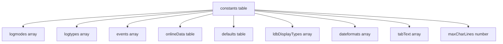
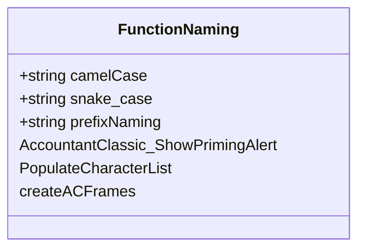
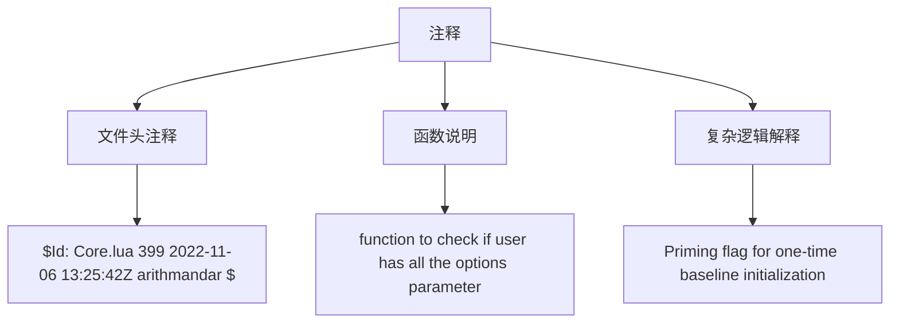
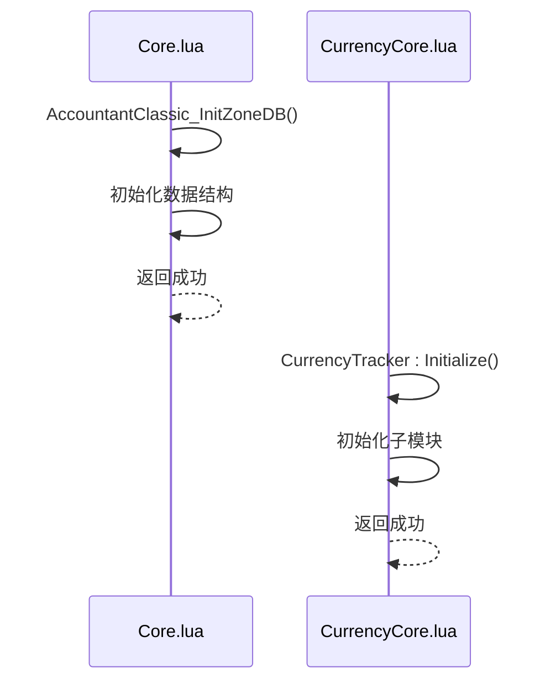
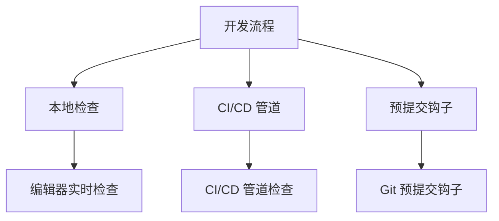

# 代码风格与规范

<cite>
**本文档引用的文件**   
- [Core.lua](file://Core/Core.lua)
- [Constants.lua](file://Core/Constants.lua)
- [CurrencyCore.lua](file://CurrencyTracker/CurrencyCore.lua)
</cite>

## 目录
1. [介绍](#介绍)
2. [表声明规范](#表声明规范)
3. [函数命名规则](#函数命名规则)
4. [局部变量使用原则](#局部变量使用原则)
5. [注释标准](#注释标准)
6. [提交信息格式](#提交信息格式)
7. [代码示例分析](#代码示例分析)
8. [自动化检查工具](#自动化检查工具)

## 介绍
本文档旨在为Accountant_Classic项目建立统一的Lua代码风格规范。通过定义清晰的编码约定，确保代码库的一致性、可读性和可维护性。规范涵盖表声明、函数命名、变量使用、注释标准和提交信息格式等关键方面，并通过实际代码示例展示良好实践。

**Section sources**
- [Core.lua](file://Core/Core.lua#L1-L50)
- [Constants.lua](file://Core/Constants.lua#L1-L20)

## 表声明规范
在Lua中，表（table）是核心数据结构，其声明方式直接影响代码的可读性和维护性。根据项目代码实践，表声明应遵循以下规范：

### 常量表声明
常量表应在`Constants.lua`文件中定义，使用清晰的命名空间组织。表的键应使用大写字母和下划线分隔的命名约定，确保可读性。

```lua
constants.logmodes = {"Session", "Day", "PrvDay", "Week", "PrvWeek", "Month", "PrvMonth", "Year", "PrvYear", "Total" }
constants.logtypes = {
    "TRAIN", "TAXI", "TRADE", "AH", "MERCH", "REPAIRS", "MAIL", "QUEST", "LOOT", "OTHER" 
}
```

### 嵌套表声明
对于嵌套表结构，应使用缩进和换行来提高可读性。每个嵌套层级应有适当的缩进，键值对之间应有清晰的分隔。

```lua
constants.onlineData = {
    ["TRAIN"] = 	{ Title = L["Training Costs"]};
    ["TAXI"] = 	{ Title = L["Taxi Fares"]};
    ["TRADE"] = 	{ Title = L["Trade Window"]};
    ["AH"] = 	{ Title = AUCTIONS};
    ["MERCH"] = 	{ Title = L["Merchants"]};
    ["REPAIRS"] = 	{ Title = L["Repair Costs"]};
    ["MAIL"] = 	{ Title = L["Mail"]};
    ["QUEST"] = 	{ Title = QUESTS_LABEL};
    ["LOOT"] = 	{ Title = LOOT};
    ["OTHER"] = 	{ Title = L["Unknown"]};
}
```

### 动态表声明
在运行时创建的表应使用简洁的语法，并在必要时进行初始化。避免在声明时进行复杂的逻辑处理，以提高代码的可读性。

```lua
local function AccountantClassic_InitZoneDB()
    if (Accountant_ClassicZoneDB == nil) then
        Accountant_ClassicZoneDB = { }
    end
    if (Accountant_ClassicZoneDB[AC_SERVER] == nil) then
        Accountant_ClassicZoneDB[AC_SERVER] = { }
    end
    if (Accountant_ClassicZoneDB[AC_SERVER][AC_PLAYER] == nil) then
        AC_FIRSTLOADED = true
        Accountant_ClassicZoneDB[AC_SERVER][AC_PLAYER] = { 
            data = { }
        }
    end
end
```



**Diagram sources**
- [Constants.lua](file://Core/Constants.lua#L1-L260)

**Section sources**
- [Constants.lua](file://Core/Constants.lua#L1-L260)

## 函数命名规则
函数命名应遵循清晰、一致的约定，以提高代码的可读性和可维护性。根据项目代码实践，函数命名应遵循以下规则：

### 驼峰式命名
对于模块内的函数，推荐使用驼峰式命名（camelCase）。这种命名方式在Lua社区中广泛使用，能够清晰地表达函数的用途。

```lua
local function AccountantClassic_ShowPrimingAlert()
    if AC_PRIMING_ALERTED then return end
    AC_PRIMING_ALERTED = true
    local msg = "|cffffd200Accountant Classic (Gold): Baseline primed. Subsequent money changes will be tracked.|r"
    ACC_Print(msg)
end
```

### 下划线分隔命名
对于公共API函数或需要在多个模块间调用的函数，推荐使用下划线分隔命名（snake_case）。这种命名方式能够清晰地表达函数的用途，并且在调试时更容易识别。

```lua
function addon:PopulateCharacterList(server, faction)
    local i = 1
    local serverkey, servervalue, charkey, charvalue

    if (#AC_CHARSCROLL_LIST > 0) then
        AC_CHARSCROLL_LIST = {}
    end
    -- 函数逻辑
end
```

### 前缀命名
对于特定模块的函数，可以使用模块名作为前缀，以避免命名冲突。这种命名方式在大型项目中尤为重要，能够清晰地表达函数的所属模块。

```lua
local function createACFrames()
    local parentName = "AccountantClassicFrame"
    local f = _G[parentName]
    
    f.ServerDropDown = _G[parentName.."ServerDropDown"] 
    if not f.ServerDropDown then 
        f.ServerDropDown = LibDD:Create_UIDropDownMenu(parentName.."ServerDropDown", f)
        f.ServerDropDown:Hide()
        f.ServerDropDown:SetPoint("TOPRIGHT", f, "TOPRIGHT", 0, -38)
    end
end
```



**Diagram sources**
- [Core.lua](file://Core/Core.lua#L166-L175)
- [Core.lua](file://Core/Core.lua#L500-L520)
- [Core.lua](file://Core/Core.lua#L357-L370)

**Section sources**
- [Core.lua](file://Core/Core.lua#L166-L175)
- [Core.lua](file://Core/Core.lua#L500-L520)
- [Core.lua](file://Core/Core.lua#L357-L370)

## 局部变量使用原则
局部变量的使用应遵循最小作用域原则，确保变量的生命周期尽可能短，以减少潜在的错误和提高代码的可读性。根据项目代码实践，局部变量使用应遵循以下原则：

### 明确声明
所有局部变量应在使用前明确声明，避免隐式创建全局变量。这有助于防止意外的全局变量污染。

```lua
local _G = getfenv(0)
local pairs, select, unpack, type = _G.pairs, _G.select, _G.unpack, _G.type
local tonumber = _G.tonumber
local table = _G.table
local tinsert, tsort = table.insert, table.sort
```

### 作用域最小化
局部变量的作用域应尽可能小，只在需要的地方声明。这有助于提高代码的可读性和可维护性。

```lua
local function setLabels()
    local f = _G["AccountantClassicFrame"]
    if (AC_CURRTAB == AC_TABS) then
        AccountantClassicFrameResetButton:Hide()
        f.Source:SetText(L["Character"])
        f.In:SetText(L["Money"])
        f.Out:SetText(L["Updated"])
    else
        AccountantClassicFrameResetButton:Show()
        f.Source:SetText(L["Source"])
        f.In:SetText(L["Incomings"])
        f.Out:SetText(L["Outgoings"])
    end
end
```

### 避免重复声明
在同一作用域内，应避免重复声明同一变量。这有助于减少代码的复杂性和潜在的错误。

```lua
local function initOptions()
    local cdate = date("%d/%m/%y");
    local cmonth = date("%m");
    local cyear = date("%Y");

    if (Accountant_ClassicSaveData == nil) then
        Accountant_ClassicSaveData = {};
    end
    if (Accountant_ClassicSaveData[AC_SERVER] == nil) then
        Accountant_ClassicSaveData[AC_SERVER] = {};
    end
    if (Accountant_ClassicSaveData[AC_SERVER][AC_PLAYER] == nil ) then
        Accountant_ClassicSaveData[AC_SERVER][AC_PLAYER] = {
            options = AccountantClassicDefaultOptions,
            data = { },
        };
    end
end
```

```mermaid
flowchart TD
Variables["局部变量"] --> Declaration["明确声明"]
Variables --> Scope["作用域最小化"]
Variables --> Avoidance["避免重复声明"]
Declaration --> Example1["local _G = getfenv(0)"]
Scope --> Example2["local f = _G[\"AccountantClassicFrame\"]"]
Avoidance --> Example3["避免重复声明同一变量"]
```

**Diagram sources**
- [Core.lua](file://Core/Core.lua#L2-L10)
- [Core.lua](file://Core/Core.lua#L454-L480)
- [Core.lua](file://Core/Core.lua#L265-L280)

**Section sources**
- [Core.lua](file://Core/Core.lua#L2-L10)
- [Core.lua](file://Core/Core.lua#L454-L480)
- [Core.lua](file://Core/Core.lua#L265-L280)

## 注释标准
注释是代码的重要组成部分，能够帮助开发者理解代码的意图和实现细节。根据项目代码实践，注释应遵循以下标准：

### 文件头注释
每个文件应包含文件头注释，说明文件的用途、作者、版本信息和变更历史。这有助于其他开发者快速了解文件的背景信息。

```lua
--[[
$Id: Core.lua 399 2022-11-06 13:25:42Z arithmandar $
]]
--[[
 Accountant
    v2.1 - 2.3:
    By Sabaki (sabaki@gmail.com)
        Updated by: Shadow
        new codes by Shadow and Rophy

	Tracks you incoming / outgoing cash

        Thanks To:
	2006/6/18 Rophy: v2.2 Added gold shared by party

	Thanks To:
	Losimagic, Shrill, Fillet for testing
	Atlas by Razark for the minimap icon code I lifted
	Everyone who commented and voted for the mod on curse-gaming.com
  Thiou for the French loc, Snj & JokerGermany for the German loc
  ---------------------------------------------------------------------
  v2.4 - v2.12:
     Updated by: Arith
     Tntdruid for adding Garrison, Barber shop, Void, and Transform logging in v2.5.22
  v2.13 - v2.14:
	 Updated by: kamusis
	 Bug fixes and improvements: Add sort function in All Chars tab
  v2.20:
	 Updated by: kamusis
	 Priming Approach: one-time baseline initialization to avoid first-session skew;
	 guarded CHAT_MSG_MONEY priming; one-time colored chat alert; minor lints
	 hardening (LDB.text fallback, capture gsub return); removed duplicate
	 hide_on_escape in reset dialog; added comprehensive inline comments.
]]
```

### 函数说明
每个函数应包含函数说明注释，说明函数的用途、参数和返回值。这有助于其他开发者快速理解函数的功能。

```lua
-- function to check if user has all the options parameter, 
-- if not (due to some might be newly added), then add it with default value
local function AccountantClassic_UpdateOptions(player_options)
    for k, v in pairs(AccountantClassicDefaultOptions) do
        if (player_options[k] == nil) then
            player_options[k] = v;
        end
    end
end
```

### 复杂逻辑解释
对于复杂的逻辑或算法，应包含详细的注释，解释其实现原理和关键步骤。这有助于其他开发者理解代码的实现细节。

```lua
--
-- Priming flag for one-time baseline initialization
--
-- Rationale:
-- Historically, the addon used AC_FIRSTLOADED to block logging for the entire first
-- session of a character to avoid counting the current balance as a fake "income".
-- That prevented skew but also dropped all money changes during the first session.
--
-- The Priming Approach replaces that blanket suppression with a one-time baseline
-- initialization. We set AC_LASTMONEY to the current balance exactly once ("prime")
-- and then allow normal logging for the rest of the session. This avoids the initial
-- fake income without losing subsequent changes.
--
-- AC_LOG_PRIMED = false means baseline not initialized yet; the first safe path
-- (PLAYER_MONEY or CHAT_MSG_MONEY) will initialize it. After priming, logging runs
-- normally. We will also clear AC_FIRSTLOADED at that time to preserve intent.
-- Note: We use a persistent flag in options to ensure priming only happens once per character
-- Initialize to false first, then update after AccountantClassic_Profile is loaded
local AC_LOG_PRIMED = false
```



**Diagram sources**
- [Core.lua](file://Core/Core.lua#L1-L50)
- [Core.lua](file://Core/Core.lua#L232-L234)
- [Core.lua](file://Core/Core.lua#L150-L180)

**Section sources**
- [Core.lua](file://Core/Core.lua#L1-L50)
- [Core.lua](file://Core/Core.lua#L232-L234)
- [Core.lua](file://Core/Core.lua#L150-L180)

## 提交信息格式
提交信息是代码变更的重要记录，应遵循清晰、一致的格式。根据项目实践，提交信息应包含类型前缀和简明描述，以提高代码库的可追溯性。

### 类型前缀
提交信息应包含类型前缀，说明变更的性质。常见的类型前缀包括：
- **feat**: 新增功能
- **fix**: 修复缺陷
- **refactor**: 重构代码
- **docs**: 更新文档
- **style**: 代码格式调整
- **test**: 添加或修改测试

### 简明描述
提交信息的描述应简明扼要，说明变更的具体内容。描述应使用现在时态，并以动词开头。

```text
feat: 添加角色列表排序功能
fix: 修复货币跟踪初始化问题
refactor: 重构事件注册逻辑
docs: 更新代码风格规范文档
style: 调整代码缩进格式
test: 添加货币跟踪单元测试
```

### 示例
以下是一些符合规范的提交信息示例：
```text
feat: 添加All Chars标签页的排序功能，支持按名称、金钱和更新时间排序
fix: 修复首次登录时基线初始化问题，避免重复提醒
refactor: 重构货币跟踪模块的初始化逻辑，提高代码可读性
docs: 更新代码风格规范文档，增加表声明和函数命名规则
style: 调整Core.lua文件的代码缩进，统一使用4个空格
test: 添加CurrencyCore.lua的单元测试，覆盖初始化和启用功能
```

```mermaid
flowchart TD
CommitMessage["提交信息"] --> TypePrefix["类型前缀"]
CommitMessage --> Description["简明描述"]
TypePrefix --> feat["feat: 新增功能"]
TypePrefix --> fix["fix: 修复缺陷"]
TypePrefix --> refactor["refactor: 重构代码"]
TypePrefix --> docs["docs: 更新文档"]
TypePrefix --> style["style: 代码格式调整"]
TypePrefix --> test["test: 添加或修改测试"]
Description --> Example1["添加All Chars标签页的排序功能"]
Description --> Example2["修复首次登录时基线初始化问题"]
Description --> Example3["重构货币跟踪模块的初始化逻辑"]
```

**Diagram sources**
- [Core.lua](file://Core/Core.lua#L26-L30)
- [CurrencyCore.lua](file://CurrencyTracker/CurrencyCore.lua#L1-L10)

**Section sources**
- [Core.lua](file://Core/Core.lua#L26-L30)
- [CurrencyCore.lua](file://CurrencyTracker/CurrencyCore.lua#L1-L10)

## 代码示例分析
通过分析`Core.lua`和`CurrencyCore.lua`中的实际代码示例，可以更好地理解良好实践的应用。以下是对两个文件中关键代码段的分析。

### Core.lua 示例分析
`Core.lua`文件中的`AccountantClassic_InitZoneDB`函数展示了良好的表声明和局部变量使用原则。

```lua
local function AccountantClassic_InitZoneDB()
    if (Accountant_ClassicZoneDB == nil) then
        Accountant_ClassicZoneDB = { }
    end
    if (Accountant_ClassicZoneDB[AC_SERVER] == nil) then
        Accountant_ClassicZoneDB[AC_SERVER] = { }
    end
    if (Accountant_ClassicZoneDB[AC_SERVER][AC_PLAYER] == nil) then
        AC_FIRSTLOADED = true
        Accountant_ClassicZoneDB[AC_SERVER][AC_PLAYER] = { 
            data = { }
        }
    end
    for k_logmode, v_logmode in pairs(private.constants.logmodes) do
        if (Accountant_ClassicZoneDB[AC_SERVER][AC_PLAYER]["data"][v_logmode] == nil) then
            Accountant_ClassicZoneDB[AC_SERVER][AC_PLAYER]["data"][v_logmode] = { }
            for k_logtype, v_logtype in pairs(private.constants.logtypes) do
                Accountant_ClassicZoneDB[AC_SERVER][AC_PLAYER]["data"][v_logmode][v_logtype] = { }
            end
        end
    end
end
```

该函数展示了以下良好实践：
1. **局部变量使用**：函数内部没有声明不必要的局部变量，直接使用全局变量和参数。
2. **表声明**：使用嵌套表结构来组织数据，确保数据的层次清晰。
3. **条件判断**：使用清晰的条件判断来初始化数据结构，避免重复初始化。

### CurrencyCore.lua 示例分析
`CurrencyCore.lua`文件中的`CurrencyTracker:Initialize`函数展示了良好的函数命名和注释标准。

```lua
function CurrencyTracker:Initialize()
    if isInitialized then
        return true
    end
    
    -- Initialize sub-modules in proper order
    local success = true
    
    -- Constants module first (no initialization needed, just data)
    -- Storage must be initialized first
    if self.Storage and self.Storage.Initialize then
        success = success and self.Storage:Initialize()
    end
    
    -- Then data manager
    if self.DataManager and self.DataManager.Initialize then
        success = success and self.DataManager:Initialize()
    end
    
    -- Then event handler
    if self.EventHandler and self.EventHandler.Initialize then
        success = success and self.EventHandler:Initialize()
    end
    
    if success then
        isInitialized = true
        print("[AC CT] CurrencyTracker: Module initialized successfully")
    else
        print("[AC CT] CurrencyTracker: Module initialization failed")
    end
    
    return success
end
```

该函数展示了以下良好实践：
1. **函数命名**：使用驼峰式命名，清晰地表达了函数的用途。
2. **注释标准**：使用详细的注释说明函数的实现逻辑和关键步骤。
3. **错误处理**：通过返回值和日志输出来处理初始化失败的情况，提高代码的健壮性。



**Diagram sources**
- [Core.lua](file://Core/Core.lua#L242-L265)
- [CurrencyCore.lua](file://CurrencyTracker/CurrencyCore.lua#L50-L80)

**Section sources**
- [Core.lua](file://Core/Core.lua#L242-L265)
- [CurrencyCore.lua](file://CurrencyTracker/CurrencyCore.lua#L50-L80)

## 自动化检查工具
为了帮助贡献者在提交前验证代码质量，建议使用自动化检查工具。这些工具可以自动检测代码风格问题，确保代码库的一致性。

### luacheck 配置
`luacheck`是一个流行的Lua代码静态分析工具，可以检测代码中的潜在问题。以下是一个推荐的`luacheck`配置示例：

```lua
-- .luacheckrc
std = "lua51"
globals = {
    "_G", "getfenv", "setfenv", "unpack", "select", "tonumber", "tostring",
    "type", "assert", "pcall", "xpcall", "ipairs", "pairs", "next",
    "error", "loadstring", "print", "math", "string", "table", "os",
    "date", "time", "difftime", "clock", "execute", "exit", "getenv",
    "remove", "rename", "setlocale", "tmpname", "type", "C_AddOns"
}
read_globals = {
    "ACCOUNTANT_CLASSIC_VERSION", "ADDON_LOADED", "AUCTION_HOUSE_SHOW",
    "BAG_UPDATE", "CHAT_MSG_MONEY", "CONFIRM_TALENT_WIPE", "CURRENCY_DISPLAY_UPDATE",
    "GARRISON_MISSION_FINISHED", "GARRISON_ARCHITECT_OPENED", "GARRISON_ARCHITECT_CLOSED",
    "GARRISON_MISSION_NPC_OPENED", "GARRISON_MISSION_NPC_CLOSED", "GARRISON_SHIPYARD_NPC_OPENED",
    "GARRISON_SHIPYARD_NPC_CLOSED", "GARRISON_UPDATE", "BARBER_SHOP_APPEARANCE_APPLIED",
    "BARBER_SHOP_OPEN", "BARBER_SHOP_CLOSE", "BARBER_SHOP_RESULT", "BARBER_SHOP_FORCE_CUSTOMIZATIONS_UPDATE",
    "BARBER_SHOP_COST_UPDATE", "LFG_COMPLETION_REWARD", "VOID_STORAGE_OPEN", "VOID_STORAGE_CLOSE",
    "TRANSMOGRIFY_OPEN", "TRANSMOGRIFY_CLOSE", "GUILDBANKFRAME_OPENED", "GUILDBANKFRAME_CLOSED",
    "GUILDBANK_UPDATE_MONEY", "GUILDBANK_UPDATE_WITHDRAWMONEY", "MERCHANT_SHOW", "MERCHANT_CLOSED",
    "MERCHANT_UPDATE", "QUEST_COMPLETE", "QUEST_FINISHED", "QUEST_TURNED_IN", "LOOT_OPENED",
    "LOOT_CLOSED", "TAXIMAP_OPENED", "TAXIMAP_CLOSED", "TRADE_SHOW", "TRADE_CLOSED",
    "MAIL_INBOX_UPDATE", "MAIL_SHOW", "MAIL_CLOSED", "TRAINER_SHOW", "TRAINER_CLOSED",
    "AUCTION_HOUSE_SHOW", "AUCTION_HOUSE_CLOSED", "PLAYER_MONEY", "UNIT_INVENTORY_CHANGED"
}
```

### 集成到开发流程
将`luacheck`集成到开发流程中，可以在提交代码前自动运行检查。以下是一些集成建议：
1. **本地开发环境**：在本地开发环境中安装`luacheck`，并在编辑器中配置实时检查。
2. **CI/CD 管道**：在持续集成/持续部署（CI/CD）管道中添加`luacheck`检查步骤，确保所有提交的代码都符合规范。
3. **预提交钩子**：使用Git的预提交钩子（pre-commit hook）在提交代码前自动运行`luacheck`，防止不符合规范的代码被提交。



**Diagram sources**
- [.luacheckrc](file://.luacheckrc#L1-L50)

**Section sources**
- [.luacheckrc](file://.luacheckrc#L1-L50)