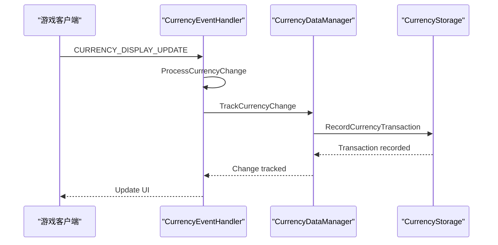

# 开发环境搭建

<cite>
**本文档引用的文件**   
- [CLAUDE.md](file://CLAUDE.md)
- [Workspace-Memory-Dump.md](file://Docs/Workspace-Memory-Dump.md)
- [Core.lua](file://Core/Core.lua)
- [Constants.lua](file://Core/Constants.lua)
- [CurrencyCore.lua](file://CurrencyTracker/CurrencyCore.lua)
- [CurrencyStorage.lua](file://CurrencyTracker/CurrencyStorage.lua)
- [CurrencyEventHandler.lua](file://CurrencyTracker/CurrencyEventHandler.lua)
- [CurrencyDataManager.lua](file://CurrencyTracker/CurrencyDataManager.lua)
- [CurrencyFrame.lua](file://CurrencyTracker/CurrencyFrame.lua)
- [CurrencyFrame.xml](file://CurrencyTracker/CurrencyFrame.xml)
- [pkgmeta.yaml](file://pkgmeta.yaml)
- [README.md](file://README.md)
</cite>

## 目录
1. [简介](#简介)
2. [代码编辑器配置](#代码编辑器配置)
3. [调试环境设置](#调试环境设置)
4. [版本控制流程](#版本控制流程)
5. [高级调试技巧](#高级调试技巧)
6. [总结](#总结)

## 简介
本指南旨在为《魔兽世界》插件开发提供一个完整的开发环境搭建方案，特别针对Accountant_Classic插件项目。文档涵盖了从代码编辑器配置、调试环境设置到版本控制流程的各个方面，确保开发人员能够高效地进行插件开发和维护。通过遵循本指南，开发者可以快速搭建一个功能齐全的开发环境，提高开发效率和代码质量。

**本文档引用的文件**
- [README.md](file://README.md#L1-L120)

## 代码编辑器配置

### 推荐编辑器
对于《魔兽世界》插件开发，推荐使用Visual Studio Code（VS Code）或Sublime Text作为代码编辑器。这些编辑器具有强大的插件生态系统，可以提供Lua语法高亮、Ace3框架智能提示和XML格式化等功能，极大地提高开发效率。

### VS Code配置
1. **安装Lua扩展**：在VS Code的扩展市场中搜索并安装“Lua”扩展，以获得Lua语法高亮和基本的代码提示功能。
2. **配置Ace3智能提示**：通过安装“Lua Language Server”扩展，并在`settings.json`中添加Ace3框架的路径，可以实现Ace3框架的智能提示。
3. **XML格式化**：安装“XML Tools”扩展，可以方便地格式化XML文件，确保代码的可读性和一致性。

### Sublime Text配置
1. **安装Lua包**：通过Package Control安装“Lua”包，以获得Lua语法高亮。
2. **配置Ace3智能提示**：手动添加Ace3框架的路径到Sublime Text的包路径中，以实现智能提示。
3. **XML格式化**：安装“XML Formatter”包，可以快速格式化XML文件。

**本文档引用的文件**
- [pkgmeta.yaml](file://pkgmeta.yaml#L1-L6)
- [README.md](file://README.md#L1-L120)

## 调试环境设置

### 游戏客户端控制台输出
利用游戏客户端的控制台输出是调试《魔兽世界》插件的重要手段。通过在代码中添加`print`语句，可以将变量值和函数调用信息输出到游戏客户端的聊天窗口，帮助开发者快速定位问题。

### SavedVariables文件验证
SavedVariables文件是《魔兽世界》插件存储数据的主要方式。通过检查和修改SavedVariables文件，可以验证数据的正确性和完整性。例如，可以手动编辑SavedVariables文件来测试数据加载和保存功能。

### 实际调试场景
根据CLAUDE.md中的开发笔记，Accountant_Classic插件在处理货币变化时，会监听`CURRENCY_DISPLAY_UPDATE`和`BAG_UPDATE`事件。通过在`CurrencyEventHandler.lua`中添加调试信息，可以跟踪这些事件的触发情况，确保货币变化被正确记录。

**图表来源**
- [CurrencyEventHandler.lua](file://CurrencyTracker/CurrencyEventHandler.lua#L1-L932)
- [CurrencyDataManager.lua](file://CurrencyTracker/CurrencyDataManager.lua#L1-L426)
- [CurrencyStorage.lua](file://CurrencyTracker/CurrencyStorage.lua#L1-L1222)

**本节来源**
- [CLAUDE.md](file://CLAUDE.md#L1-L91)
- [Workspace-Memory-Dump.md](file://Docs/Workspace-Memory-Dump.md#L1-L80)

## 版本控制流程

### 分支策略
采用Git进行版本控制，推荐使用以下分支策略：
- `main`分支：稳定版本，用于发布。
- `develop`分支：开发版本，用于日常开发。
- `feature/*`分支：功能分支，用于开发新功能。
- `hotfix/*`分支：热修复分支，用于紧急修复。

### 提交信息规范
提交信息应遵循以下前缀规范：
- `feat:`：新增功能
- `fix:`：修复bug
- `docs:`：文档更新
- `style:`：代码格式调整
- `refactor:`：代码重构
- `test:`：测试相关
- `chore:`：构建过程或辅助工具的变动

### Pull Request审查流程
1. **创建Pull Request**：在GitHub上创建Pull Request，将功能分支合并到`develop`分支。
2. **代码审查**：团队成员对Pull Request进行代码审查，确保代码质量和一致性。
3. **自动化测试**：运行自动化测试，确保新代码不会引入新的bug。
4. **合并**：通过审查和测试后，将Pull Request合并到`develop`分支。

**本节来源**
- [CLAUDE.md](file://CLAUDE.md#L1-L91)
- [Workspace-Memory-Dump.md](file://Docs/Workspace-Memory-Dump.md#L1-L80)

## 高级调试技巧

### 内存转储分析
根据Workspace-Memory-Dump.md中的内存转储分析方法，可以通过分析内存中的数据结构来排查复杂的bug。例如，可以使用`CurrencyStorage.lua`中的`GetAvailableCurrencies`函数来获取所有可用的货币ID，然后检查这些ID是否正确地被记录和处理。

### 实际调试场景复现
1. **复现问题**：在游戏客户端中复现问题，记录相关的事件和数据变化。
2. **分析日志**：检查SavedVariables文件和控制台输出，分析问题的根源。
3. **修改代码**：根据分析结果修改代码，修复问题。
4. **验证修复**：重新测试，确保问题已被解决。

### 调试工具
- **Context7 MCP服务器**：当遇到API语法问题时，可以使用Context7 MCP服务器获取最新的文档。
- **内置编辑器**：使用内置编辑器（apply_patch/inline edits）来更新文件，包括代码。

**本节来源**
- [Workspace-Memory-Dump.md](file://Docs/Workspace-Memory-Dump.md#L1-L80)
- [CurrencyStorage.lua](file://CurrencyTracker/CurrencyStorage.lua#L1-L1222)

## 总结
通过本指南，开发者可以快速搭建一个功能齐全的《魔兽世界》插件开发环境。从代码编辑器配置到调试环境设置，再到版本控制流程，每一步都经过精心设计，确保开发过程的高效和代码的高质量。希望本指南能帮助开发者更好地进行插件开发，提升开发体验。

**本节来源**
- [README.md](file://README.md#L1-L120)
- [CLAUDE.md](file://CLAUDE.md#L1-L91)
- [Workspace-Memory-Dump.md](file://Docs/Workspace-Memory-Dump.md#L1-L80)