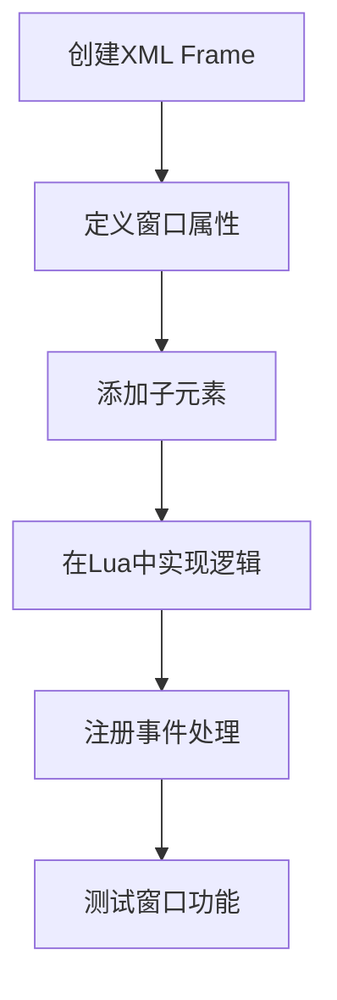
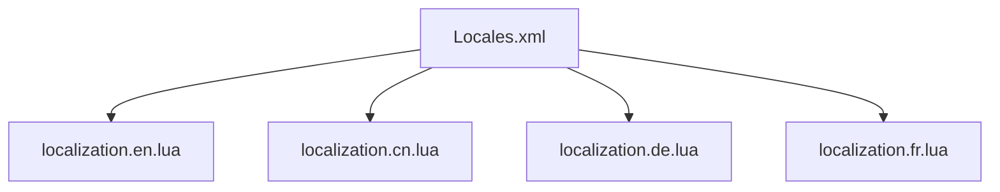

# 开发者指南

<cite>
**本文档中引用的文件**   
- [CLAUDE.md](file://CLAUDE.md)
- [Workspace-Memory-Dump.md](file://Docs/Workspace-Memory-Dump.md)
- [Constants.lua](file://Core/Constants.lua)
- [Core.lua](file://Core/Core.lua)
- [Core.xml](file://Core/Core.xml)
- [localization.cn.lua](file://Locale/localization.cn.lua)
- [CurrencyCore.lua](file://CurrencyTracker/CurrencyCore.lua)
- [CurrencyFrame.xml](file://CurrencyTracker/CurrencyFrame.xml)
- [CurrencyEventHandler.lua](file://CurrencyTracker/CurrencyEventHandler.lua)
- [CurrencyStorage.lua](file://CurrencyTracker/CurrencyStorage.lua)
- [CurrencyDataManager.lua](file://CurrencyTracker/CurrencyDataManager.lua)
- [CurrencyConstants.lua](file://CurrencyTracker/CurrencyConstants.lua)
- [CurrencyFrame.lua](file://CurrencyTracker/CurrencyFrame.lua)
</cite>

## 目录
1. [本地开发环境搭建](#本地开发环境搭建)
2. [代码风格与提交规范](#代码风格与提交规范)
3. [添加新的金币来源类型](#添加新的金币来源类型)
4. [UI布局修改与新窗口创建](#ui布局修改与新窗口创建)
5. [本地化流程](#本地化流程)
6. [高级调试技巧](#高级调试技巧)

## 本地开发环境搭建

### 代码编辑器配置
建议使用支持Lua语言的代码编辑器，如Visual Studio Code或Sublime Text。配置编辑器以支持以下功能：
- Lua语法高亮
- ACE3框架代码补全
- AceLocale-3.0本地化字符串补全
- XML模板语法高亮

### 调试技巧
使用游戏内调试功能进行开发测试：
- 在游戏内通过`/reload`命令重新加载插件
- 使用`print()`函数输出调试信息到聊天窗口
- 利用`Workspace-Memory-Dump.md`中记录的调试信息进行问题排查

### 版本控制流程
项目使用Git进行版本控制，遵循以下流程：
- 在`main`分支上进行日常开发
- 为每个新功能创建独立的特性分支
- 完成功能后提交Pull Request进行代码审查
- 合并前确保所有测试通过

**Section sources**
- [CLAUDE.md](file://CLAUDE.md#L1-L91)
- [Workspace-Memory-Dump.md](file://Docs/Workspace-Memory-Dump.md#L1-L79)

## 代码风格与提交规范

### Lua编码约定
遵循以下Lua编码规范：
- 使用4个空格进行缩进，禁止使用制表符
- 函数名和变量名使用驼峰命名法
- 常量使用全大写字母和下划线分隔
- 代码注释使用英文，遵循ACE3框架的注释风格

### 注释要求
所有函数和复杂逻辑必须包含注释：
- 函数开头添加文档字符串，说明功能、参数和返回值
- 复杂算法添加行内注释解释实现逻辑
- 重要代码段添加注释说明设计意图

### 提交信息格式
Git提交信息遵循以下格式：
```
[模块名] 简要描述（不超过50字符）

详细描述（可选，每行不超过72字符）
- 说明更改的原因
- 描述实现方式
- 提及相关的issue或任务
```

**Section sources**
- [CLAUDE.md](file://CLAUDE.md#L1-L91)

## 添加新的金币来源类型

### 在Constants.lua中定义常量
在`Core/Constants.lua`文件中添加新的金币来源常量：
1. 确定新来源所属的类别（如`TRAIN`, `TAXI`, `TRADE`等）
2. 在`constants.logtypes`表中添加新的来源类型
3. 在`constants.onlineData`表中添加对应的显示标题

```lua
constants.logtypes = {
    "TRAIN", "TAXI", "TRADE", "AH", "MERCH", "REPAIRS", "MAIL", "QUEST", "LOOT", "OTHER" 
}
```

### 在事件处理器中添加监听逻辑
在`Core/Core.lua`文件中更新日志处理逻辑：
1. 在`updateLog()`函数中添加对新事件的处理
2. 确保事件处理逻辑正确分类交易
3. 更新相关的事件监听列表

### 在UI中更新分类显示
在`Core/Core.xml`模板文件中更新UI显示：
1. 确保新的来源类型在UI中正确显示
2. 更新相关的文本标签和布局
3. 测试UI在不同分辨率下的显示效果

**Section sources**
- [Constants.lua](file://Core/Constants.lua#L1-L260)
- [Core.lua](file://Core/Core.lua#L1-L2335)
- [Core.xml](file://Core/Core.xml#L1-L626)

## UI布局修改与新窗口创建

### XML模板与Lua脚本协同工作
UI布局由XML模板和Lua脚本共同控制：
- XML文件定义UI元素的结构和外观
- Lua脚本处理UI的逻辑和交互

### 修改现有UI布局
要修改现有UI布局：
1. 打开对应的XML文件（如`Core.xml`）
2. 找到要修改的UI元素
3. 调整其位置、大小或样式属性
4. 在Lua脚本中更新相关的逻辑处理

### 创建新窗口
创建新窗口的步骤：
1. 在XML文件中定义新的Frame元素
2. 设置窗口的基本属性（大小、位置、是否可移动等）
3. 添加所需的子元素（按钮、文本框、下拉菜单等）
4. 在Lua脚本中实现窗口的显示和交互逻辑



**Diagram sources**
- [Core.xml](file://Core/Core.xml#L1-L626)
- [Core.lua](file://Core/Core.lua#L1-L2335)

## 本地化流程

### 添加新的中文翻译条目
在`localization.cn.lua`文件中添加新的翻译条目：
1. 打开`Locale/localization.cn.lua`文件
2. 在文件末尾添加新的翻译键值对
3. 使用英文原文作为键，中文翻译作为值

```lua
L["New Translation Key"] = "新的翻译文本"
```

### 通过AceLocale-3.0进行调用
使用AceLocale-3.0系统调用翻译文本：
1. 在Lua文件中获取本地化表
2. 使用`L["key"]`语法引用翻译文本
3. 确保所有UI字符串都通过本地化系统获取

```lua
local L = LibStub("AceLocale-3.0"):GetLocale("Accountant_Classic")
print(L["New Translation Key"])
```

### 翻译文件结构
本地化文件采用以下结构：
- 每个语言一个独立的文件
- 文件名格式为`localization.xx.lua`，其中`xx`为语言代码
- 所有文件在`Locales.xml`中注册



**Diagram sources**
- [localization.cn.lua](file://Locale/localization.cn.lua#L1-L250)
- [Locales.xml](file://Locale/Locales.xml#L1-L15)

## 高级调试技巧

### 利用CLAUDE.md中的开发笔记
参考`CLAUDE.md`文件中的开发指导：
- 了解项目架构和关键组件
- 遵循已建立的开发工作流程
- 参考常见的开发任务模式

### 使用Workspace-Memory-Dump.md中的调试信息
利用`Workspace-Memory-Dump.md`中的调试信息：
- 参考全局开发规则和约定
- 了解当前的工作空间状态
- 遵循已记录的任务指令和决策

### 性能优化建议
遵循以下性能优化原则：
- 避免在战斗或频繁金钱更新时执行重操作
- 合理管理SavedVariables数据大小
- 维护向后兼容性，避免破坏现有数据结构

### 调试工具使用
使用以下调试工具和技术：
- 在代码中添加详细的日志输出
- 使用`print()`函数输出关键变量值
- 利用游戏内命令进行功能测试

**Section sources**
- [CLAUDE.md](file://CLAUDE.md#L1-L91)
- [Workspace-Memory-Dump.md](file://Docs/Workspace-Memory-Dump.md#L1-L79)