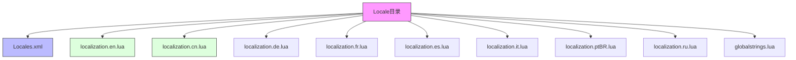
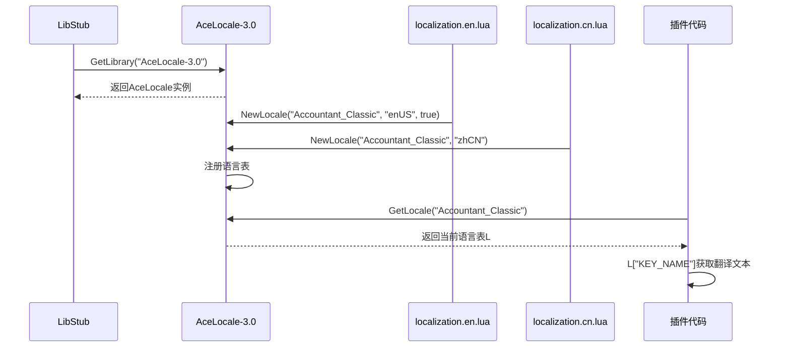
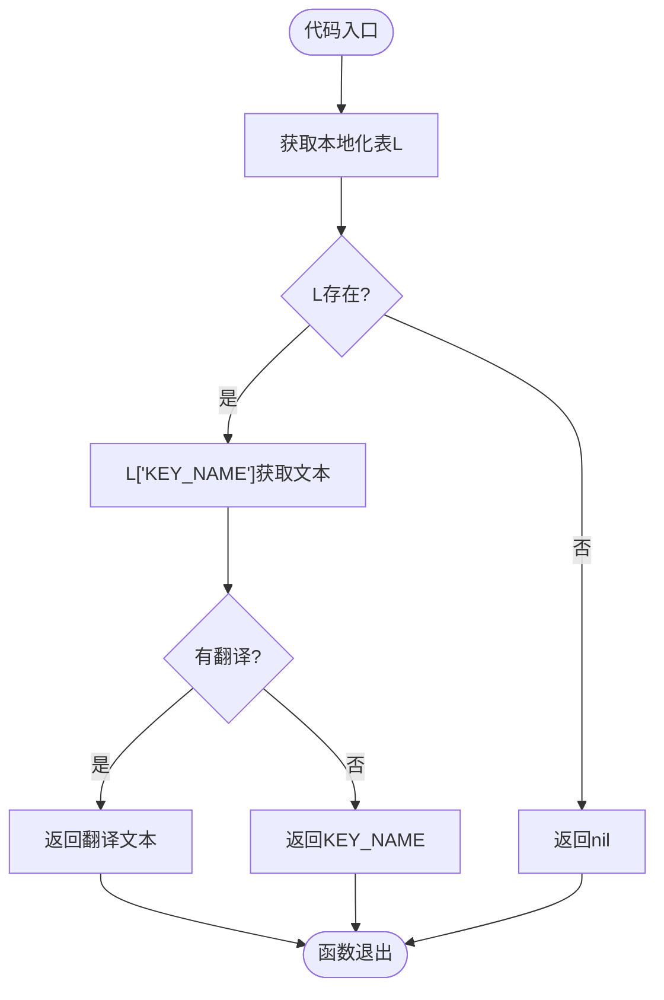
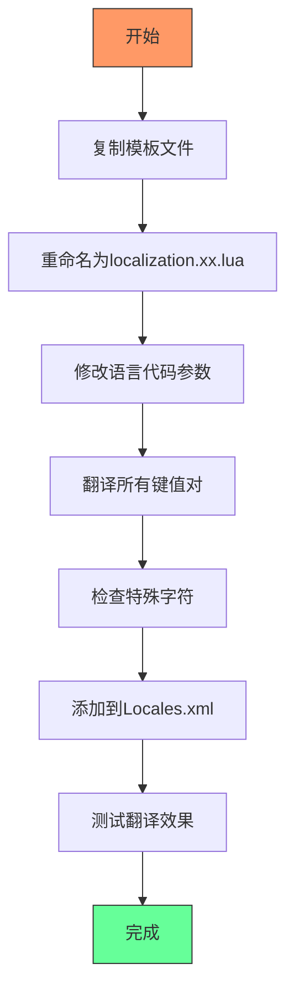
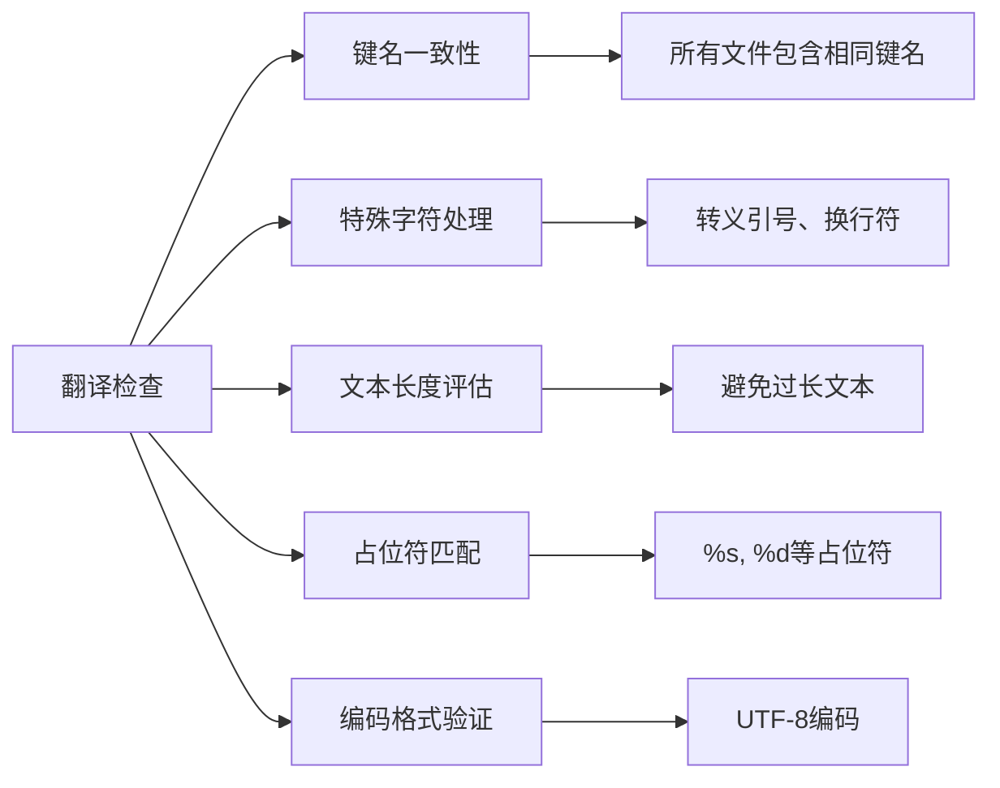

# 本地化流程

<cite>
**本文档中引用的文件**  
- [localization.en.lua](file://Locale/localization.en.lua)
- [localization.cn.lua](file://Locale/localization.cn.lua)
- [Locales.xml](file://Locale/Locales.xml)
- [Config.lua](file://Core/Config.lua)
- [Core.lua](file://Core/Core.lua)
- [AceLocale-3.0.lua](file://Libs/AceLocale-3.0/AceLocale-3.0.lua)
</cite>

## 目录
1. [简介](#简介)
2. [Locale目录结构](#locale目录结构)
3. [AceLocale-3.0机制](#acelocale-30机制)
4. [语言文件定义](#语言文件定义)
5. [代码中调用翻译](#代码中调用翻译)
6. [配置文件本地化](#配置文件本地化)
7. [新增语言文件流程](#新增语言文件流程)
8. [翻译一致性检查](#翻译一致性检查)

## 简介
本指南详细说明如何为Accountant_Classic插件添加多语言支持。通过使用AceLocale-3.0库，开发者可以轻松实现插件的国际化，确保不同语言区域的玩家都能获得良好的用户体验。本指南将涵盖从目录结构到代码实现的完整本地化流程。

## Locale目录结构
Locale目录包含所有语言文件和注册配置，是多语言支持的核心。该目录通过Locales.xml文件集中管理所有语言资源的加载。



**Diagram sources**
- [Locales.xml](file://Locale/Locales.xml#L1-L15)
- [localization.en.lua](file://Locale/localization.en.lua#L1-L259)
- [localization.cn.lua](file://Locale/localization.cn.lua#L1-L251)

**Section sources**
- [Locales.xml](file://Locale/Locales.xml#L1-L15)

## AceLocale-3.0机制
AceLocale-3.0是插件本地化的核心库，提供了一套完整的多语言管理机制。它通过LibStub进行版本控制和依赖管理，确保不同插件间的兼容性。



**Diagram sources**
- [AceLocale-3.0.lua](file://Libs/AceLocale-3.0/AceLocale-3.0.lua#L1-L134)

**Section sources**
- [AceLocale-3.0.lua](file://Libs/AceLocale-3.0/AceLocale-3.0.lua#L1-L134)

## 语言文件定义
语言文件采用键值对形式定义翻译文本，每个文件对应一种语言。英文文件通常作为默认语言和模板。

```lua
-- 示例：localization.en.lua
local AceLocale = LibStub:GetLibrary("AceLocale-3.0");
local L = AceLocale:NewLocale("Accountant_Classic", "enUS", true, true);

if not L then return end

L["Accountant Classic"] = "Accountant Classic"
L["Total Incomings"] = "Total Incomings"
L["Total Outgoings"] = "Total Outgoings"
```

```lua
-- 示例：localization.cn.lua
local L = LibStub("AceLocale-3.0"):NewLocale("Accountant_Classic", "zhCN", false)

if not L then return end

L["Accountant Classic"] = "Accountant Classic"
L["Total Incomings"] = "总收入"
L["Total Outgoings"] = "总支出"
```

**Section sources**
- [localization.en.lua](file://Locale/localization.en.lua#L1-L259)
- [localization.cn.lua](file://Locale/localization.cn.lua#L1-L251)

## 代码中调用翻译
在Lua代码中通过L['KEY_NAME']语法调用翻译文本，确保所有用户可见字符串都经过本地化处理。



**Diagram sources**
- [Core.lua](file://Core/Core.lua#L1-L2335)
- [Config.lua](file://Core/Config.lua#L1-L431)

**Section sources**
- [Core.lua](file://Core/Core.lua#L1-L2335)
- [Config.lua](file://Core/Config.lua#L1-L431)

## 配置文件本地化
在Config.lua中配置选项时，使用本地化键名确保界面元素的文本可被翻译。

```lua
-- 示例：Config.lua中的本地化使用
args = {
    general = {
        name = L["Options"],
        args = {
            showmoneyinfo = {
                name = L["Show money on screen"],
                desc = L["Display Instruction Tips"],
            },
            weekstart = {
                name = L["Start of Week"],
                values = function()
                    return { 
                        L["WEEKDAY_SUNDAY"], 
                        L["WEEKDAY_MONDAY"],
                    }
                end,
            },
        },
    },
}
```

**Section sources**
- [Config.lua](file://Core/Config.lua#L1-L431)

## 新增语言文件流程
添加新语言支持需要完成三个步骤：创建语言文件、翻译内容、注册到配置。



**Diagram sources**
- [Locales.xml](file://Locale/Locales.xml#L1-L15)
- [localization.en.lua](file://Locale/localization.en.lua#L1-L259)

**Section sources**
- [Locales.xml](file://Locale/Locales.xml#L1-L15)
- [localization.en.lua](file://Locale/localization.en.lua#L1-L259)

## 翻译一致性检查
确保翻译质量和界面显示的稳定性，需要进行严格的一致性检查。



**Diagram sources**
- [localization.en.lua](file://Locale/localization.en.lua#L1-L259)
- [localization.cn.lua](file://Locale/localization.cn.lua#L1-L251)

**Section sources**
- [localization.en.lua](file://Locale/localization.en.lua#L1-L259)
- [localization.cn.lua](file://Locale/localization.cn.lua#L1-L251)